# 在 Photoshop 中更改颜色

> 原文：<https://www.educba.com/change-color-in-photoshop/>

## Photoshop 中改变颜色的介绍

Photoshop 软件不过是处理光栅图像的图像编辑软件。它是图形编辑专业人员广泛使用的软件，因为它具有多用途的特点。我们可以使用这个软件进行图像编辑，标志和横幅设计，动画图形，等等。在这个软件中改变任何对象的颜色都是非常有趣和简单的工作，它会在很多专业编辑工作中帮助你。在本文中，我们将学习“如何在 Photoshop 软件中改变对象的颜色？”通过两种方法。你可以根据自己的适合程度使用其中任何一种。

### 如何在 Photoshop 软件中改变颜色？

在开始这篇关于在 Photoshop 软件中改变颜色的文章之前，让我们快速浏览一下 Photoshop 软件的工作环境，并了解一些功能，这些功能出现在工作屏幕上，使我们在这个软件中的工作变得容易。

<small>3D 动画、建模、仿真、游戏开发&其他</small>

在这个软件中，我们有一个非常用户友好的工作环境，有一些有用的区域，菜单栏作为工作区的顶部，属性栏作为工作区的第二个顶部，工具栏作为工作区的左侧，最后一个是颜色和图层面板作为工作区的右侧。

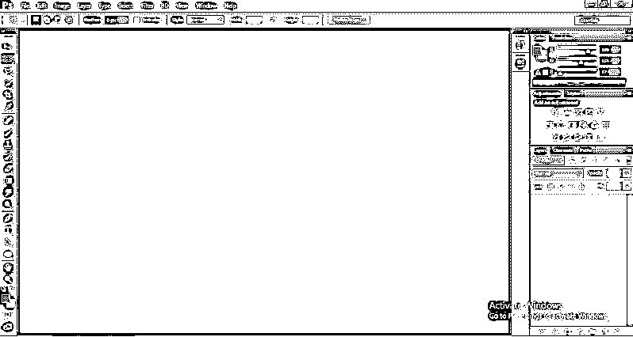

我们将在“如何在 Photoshop 软件中改变布料的颜色？”的上下文中看到“颜色改变”这个术语为此，只需按照下面的步骤一步一步，你会得到你的结果在短短几个步骤。

**第一步:**首先，你需要通过从互联网上下载任何图像来了解“在 Photoshop 软件中改变颜色”，或者你可以自己拍摄任何自己的图像。

**步骤 2:** 转到您个人电脑中保存您的图像的文件夹并打开它，单击您想要编辑的图像，按住鼠标左键将其拖动到 Photoshop 软件中，然后松开鼠标按钮将其放入软件中。

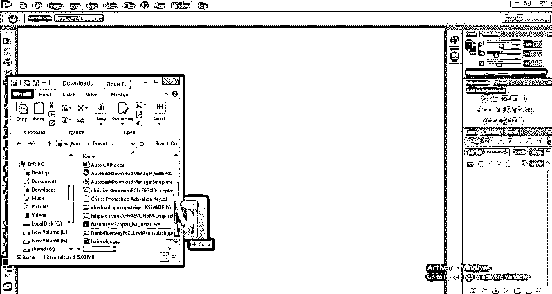

**第三步:**图像将作为背景层放置在该软件工作区的图层面板中。您可以根据自己的要求改变图像的大小。

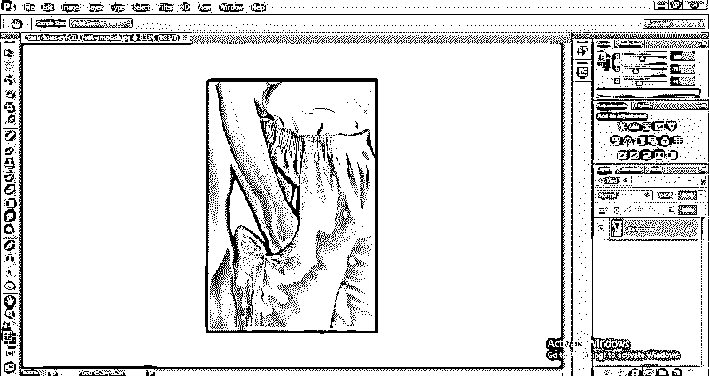

现在，我们将看到在 Photoshop 软件中改变图像布料颜色的第一种方法。点击这个小图标，这是在层面板的末端，为调整层。调整层将作为我们的编辑层，我们的原始层将被保存以供将来使用。

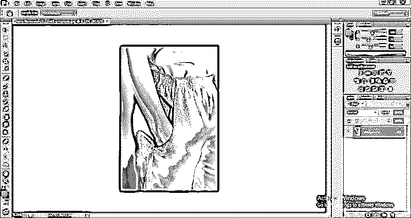

**第五步:**打开调整层下拉列表。从该列表中选择色调/饱和度选项，制作色调/饱和度调整图层。

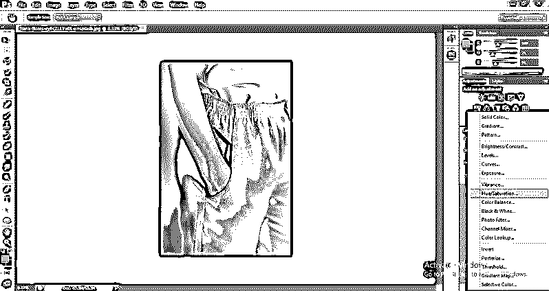

**第六步:**图层面板的部分会生成一个色相/饱和度的调整图层。你可以在上面的背景层看到。

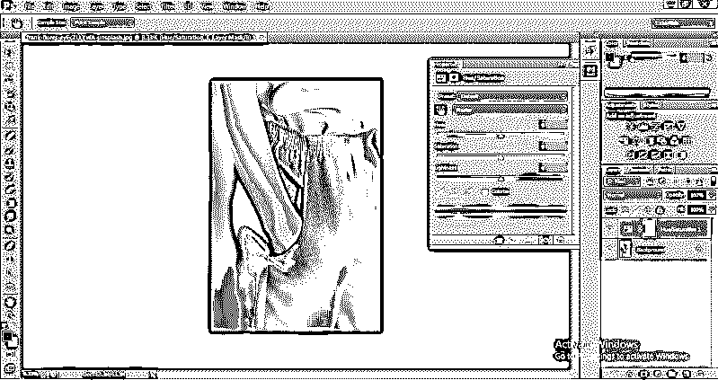

**步骤 7:** 一个色调/饱和度属性框将被打开。

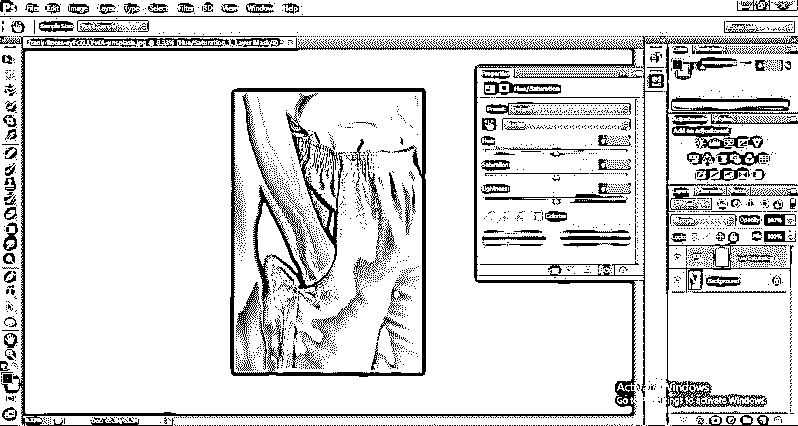

**第 8 步:**点击色相/饱和度属性框中的这个手形图标，激活吸管工具，用吸管工具点击你想要改变的颜色区域。

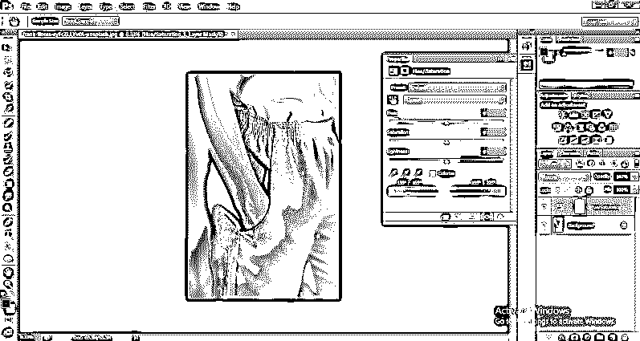

**第九步:**现在通过移动色相滑块来增加色相，你会看到色相滑块移动时颜色的变化。从这里选择你想要的颜色。

**步骤 10:** 现在，通过移动滑块来改变饱和度和亮度的值，使图像看起来更自然。

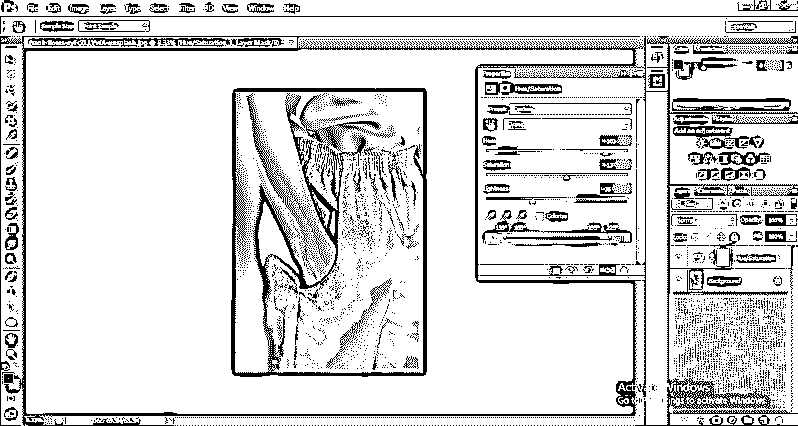

**第十一步:**这样，用第一种方法，你可以把任何物体的颜色改变成你想要的颜色，这就是你改变后的彩色图像的最终结果。

**第十二步:**让我们转到第二种方法‘在 Photoshop 软件中改变颜色’。从文件夹中取出一张新图片。

**第十三步:**进入工作区顶部菜单栏的图像菜单，点击。将打开图像菜单栏列表的下拉菜单。转到调整选项，并从该列表中选择替换颜色选项。

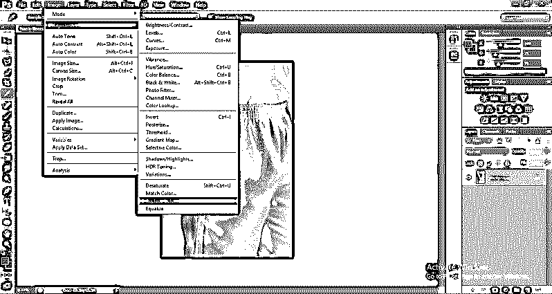

第 14 步:一个名为“替换颜色”的盒子将被打开。用吸管工具单击要更改颜色的区域。一旦你点击你想要的区域，它将在“替换颜色”框中以白色突出显示。确保选择的单选按钮(在“替换颜色”框中所选区域的下方)处于打开状态。

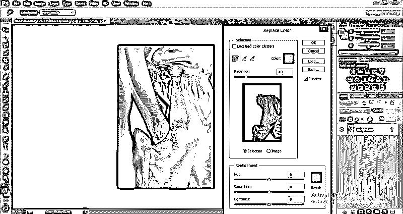

**步骤 15:** 降低模糊度值，对所选区域进行精细选择。

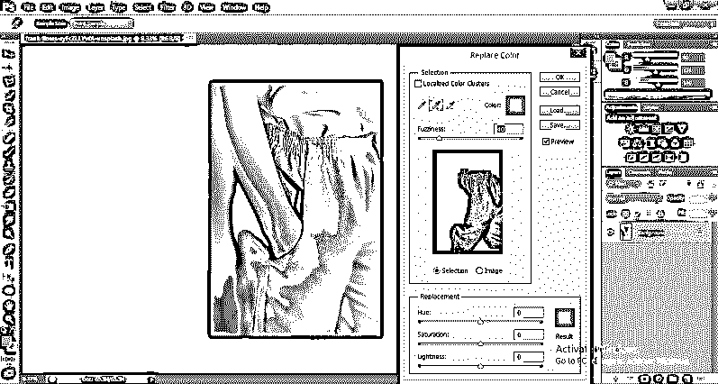

**第 16 步:**现在用鼠标左键点击滴管工具，用鼠标左键多次点击所选区域，以便更好地选择我们想要的区域。在图像的选定区域上每次单击鼠标按钮，选择将变得越来越精细。

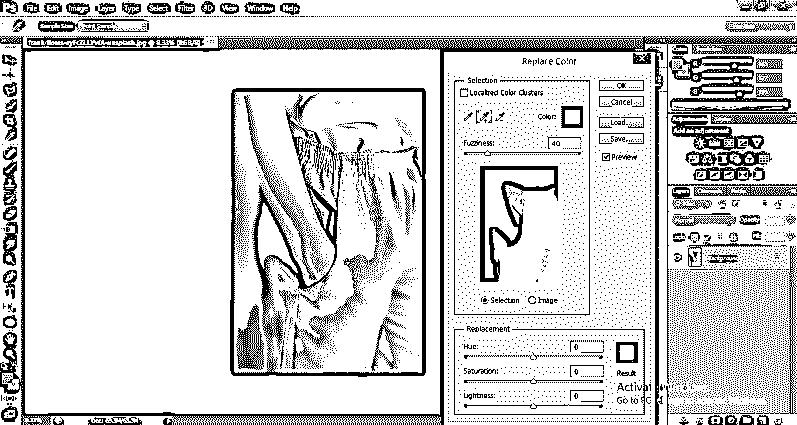

**步骤 17:** 现在点击正方形的颜色框，它位于替换颜色框的按钮上，命名为“结果”。

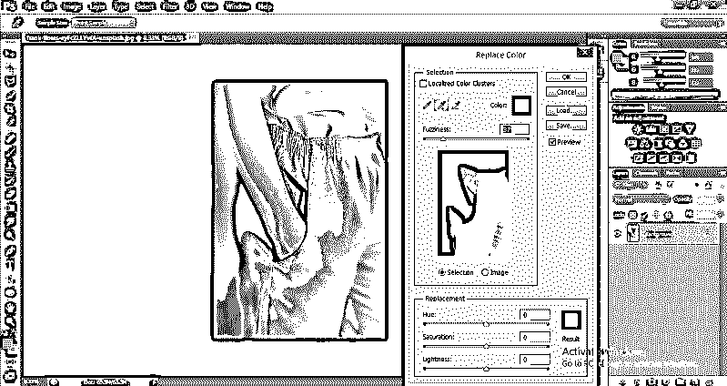

**第 18 步:**点击结果框后，会打开一个颜色面板。从这个颜色面板中为您选择的图像区域选择您想要的颜色，然后用鼠标左键点击确定按钮。

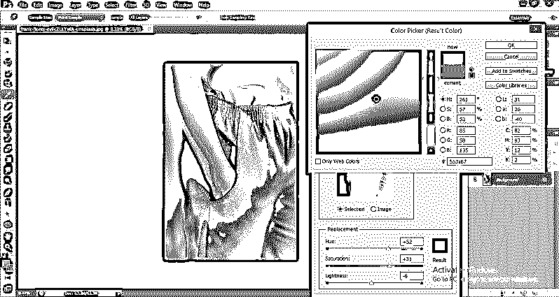

**步骤 19:** 现在，对饱和度和亮度值进行一些修改，以获得图像选定区域颜色变化的更好效果。

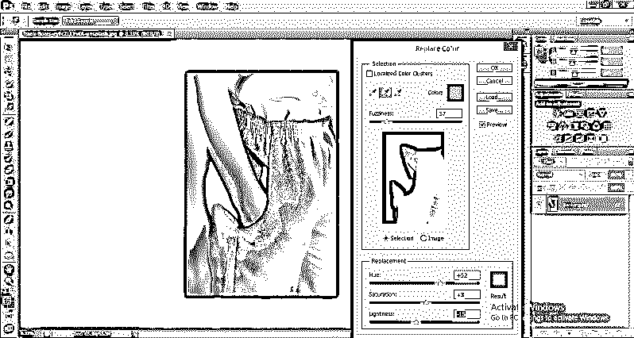

**步骤 20:** 这是最终的图像，图像的选定区域的颜色发生了变化。完成一个对象的颜色更改工作后，您可以按照更改图像颜色的所有步骤来更改单个图像中多个对象的颜色。

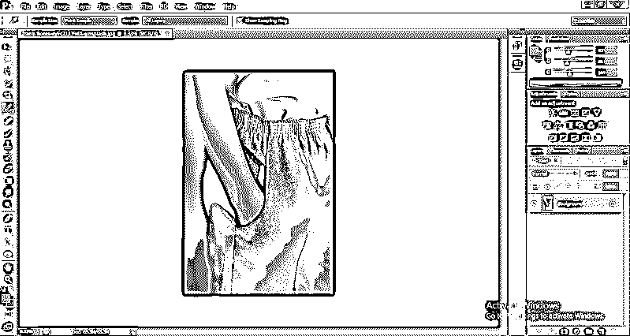

### 结论

现在你可以理解在 Photoshop 软件中改变颜色对你来说并不是一个非常大的任务。通过学习本文中任何对象的颜色改变技术，您可以提高图像编辑的技能，并为您的工作方法增加加分。这个任务一定会提高你对这个软件的驾驭能力，你可以很容易地在工作中探索自己的想法。

### 推荐文章

这是一个在 Photoshop 中改变颜色的指南。这里我们讨论一下在 photoshop 中用各种变色技巧改变颜色的介绍和步骤。您也可以阅读以下文章，了解更多信息——

1.  [如何安装 Adobe Creative Cloud？](https://www.educba.com/install-adobe-creative-cloud/)
2.  [前 7 名最佳图片编辑](https://www.educba.com/best-photo-editors/)
3.  [Photoshop 中的图层类型](https://www.educba.com/layers-in-photoshop/)
4.  [Photoshop 中的加深工具示例](https://www.educba.com/burn-tool-in-photoshop/)

