# Photoshop 中的滤镜

> 原文：<https://www.educba.com/filters-in-photoshop/>

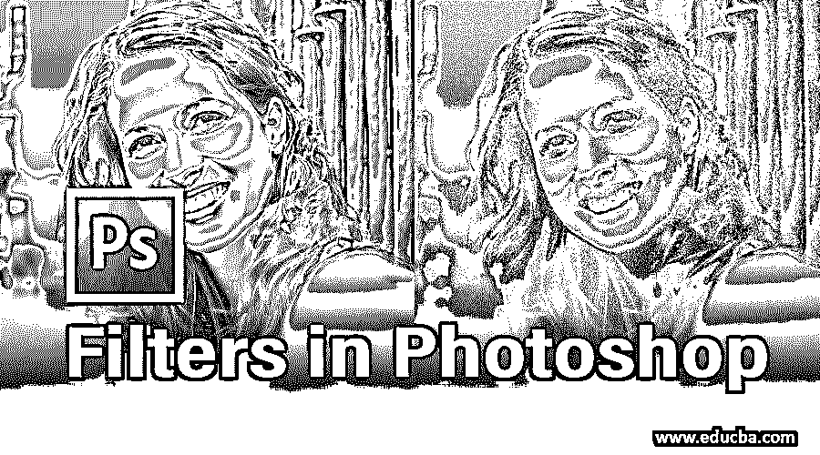

## Photoshop 中滤镜的介绍

Adobe Photoshop 是一种特殊类型的编辑软件，它处理光栅图像。它是 Adobe 公司开发的媒体软件之一。目前，Adobe Systems 对其进行维护，并将它包含在 Creative Cloud 应用程序的[包中。我们在 Photoshop 软件中有许多不同类型的编辑工具。过滤器是其中之一，它有助于在不使用任何其他编辑工具的情况下制作特殊类型的纹理、图案和许多其他东西。过滤器在这个软件中有它自己的身份。所以在这篇文章中，我们将讨论 Adobe Photoshop 软件中滤镜](https://www.educba.com/what-is-adobe-creative-cloud/)[的功能和作用。](https://www.educba.com/what-is-photoshop/)

在开始我们的文章之前，我们应该与该软件的界面进行良好的交互，以便更好地处理该软件。在这个软件中，我们有一个菜单栏，活动工具的属性栏，工具面板，颜色和用户界面中的图层部分。

<small>3D 动画、建模、仿真、游戏开发&其他</small>

### Photoshop 中如何使用滤镜？

**第一步:**首先以‘新建文档’作为背景层。对于新文档，请转到菜单栏的“文件”菜单。将打开一个下拉列表；单击“新建文档”的“新建”选项。

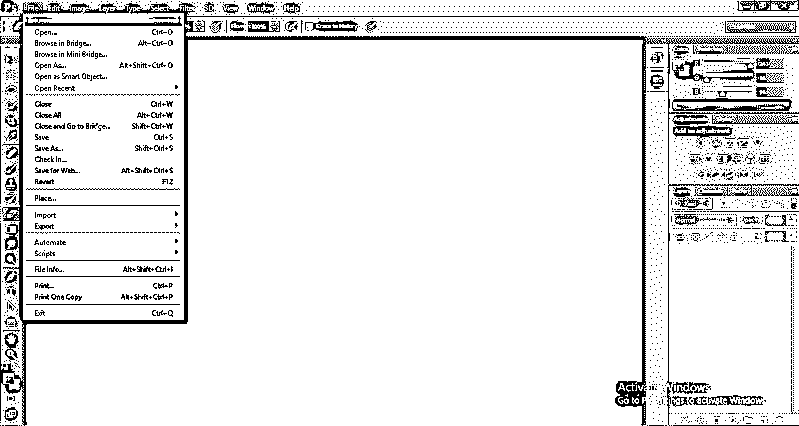

**第二步:**会打开一个对话框。根据您的需要更改文档的设置，然后用鼠标键单击此对话框中的“确定”按钮。

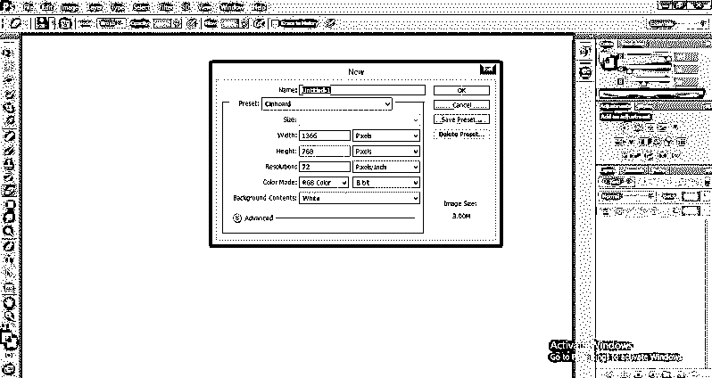

**步骤 3:** 现在，我们将转到菜单栏上的“过滤器”选项。单击过滤器选项打开下拉列表。这个列表中有许多类型的过滤器。为了更好地理解过滤器菜单，我们将看到其中的一些。

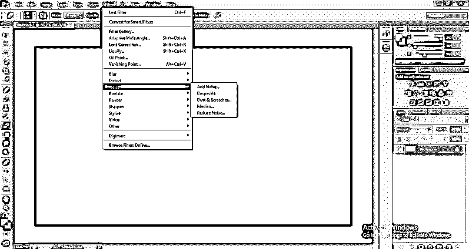

**第四步:**首先我们会看到云滤镜。

**第五步:**在云滤镜中，我们使用两种颜色，所以点击颜色框，它在工具栏的底端。

**第六步:**或者点击颜色部分的颜色框。

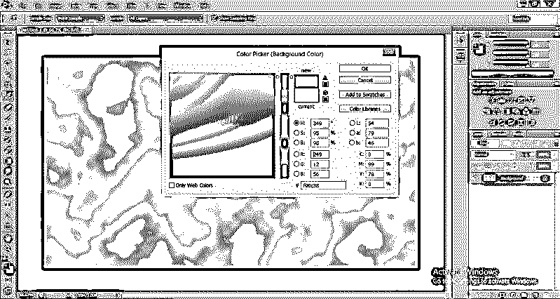

**第七步:**打开一个颜色面板盒；从这里选择第一种颜色。再次选择下一个颜色框。对话框将会打开。从这里选择第二种颜色。

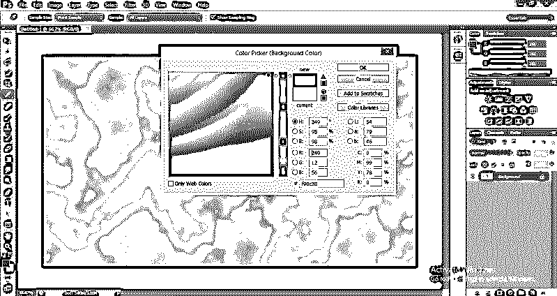

步骤 8: 现在点击过滤器菜单，进入下拉列表中的渲染选项，然后选择下一个下拉列表中的云选项。

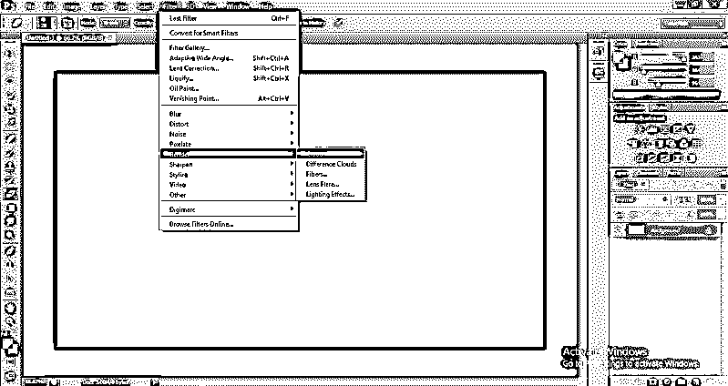

**第九步:**一旦你点击了云选项，它会创建一个这样的纹理。

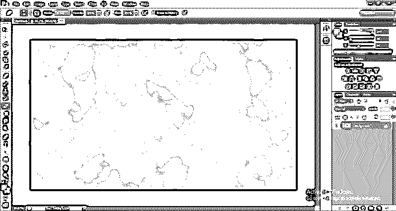

**步骤 10:** 再次进入过滤器菜单，点击下拉列表顶部的云选项。在这个下拉列表中，您可以在列表顶部看到上次使用的过滤器，或者您可以按键盘上的 **Ctrl+F** 键来重新应用上次使用的命令。

**步骤 11:** 可以按 Ctrl+F 键多次作为最后使用的命令。每次按 Ctrl+F 时，纹理方向都会改变。

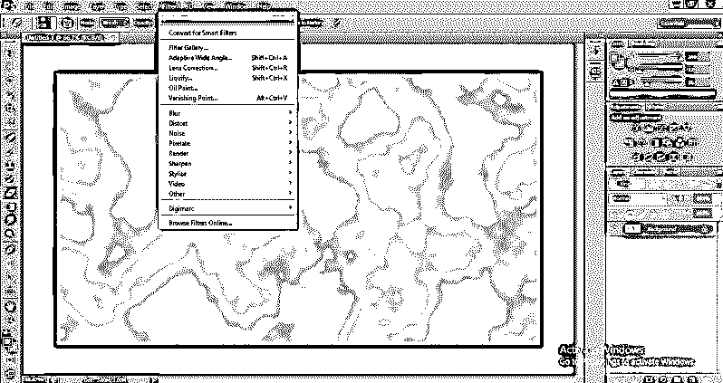

**步骤 12:** 你可以给这个云选项添加更多的颜色。添加下一种颜色，就像我们之前做的那样，点击颜色框，然后再次按下键盘上的 Ctrl+F，再次应用云。

**步骤 13:** 再次按下键盘上的 Ctrl+F，可以看到方位再次改变。你可以一次又一次地改变它，选择你想要的质地。

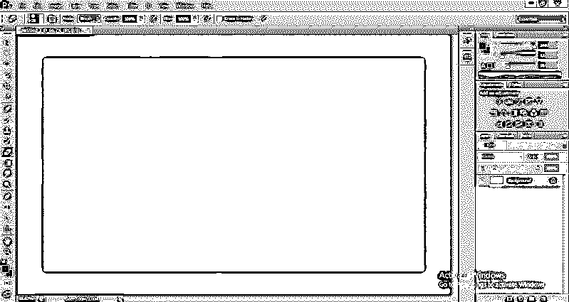

第 14 步:再次，进入“过滤器”菜单，进入渲染选项，并从这里选择差异云选项。

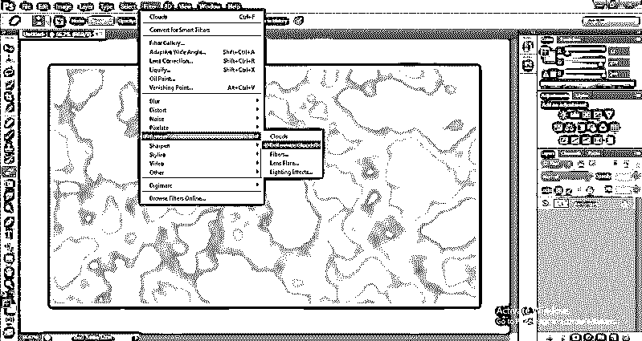

**第 15 步:**差云是一个选项，显示所选两种颜色之间的差异。

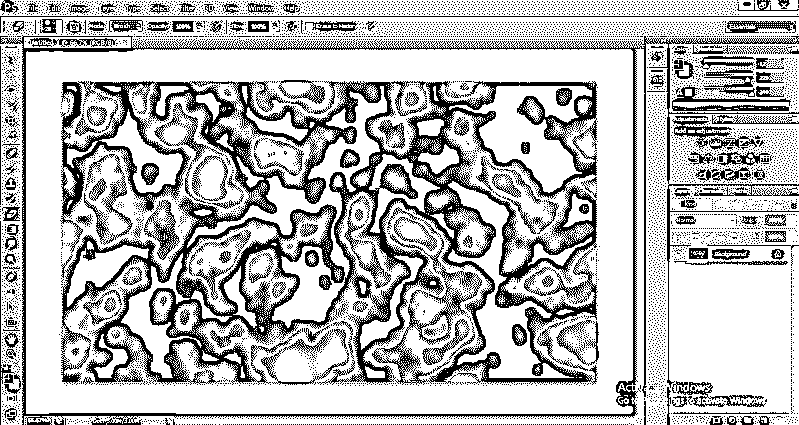

**步骤 16:** 现在，当你按 Ctrl+F 重复前面的命令时，你会看到云的方向发生了变化，当你再次按这个快捷键时，你会看到不同方向的不同云效果。简而言之，你会看到两个过滤器的方向交替变化。

**第十七步:**比如第一次按 Ctrl+F，会出现云方位。

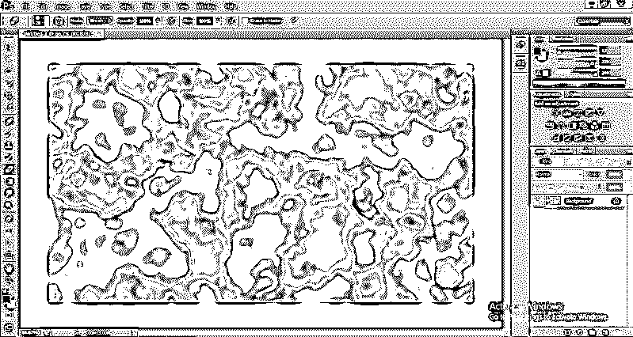

**第 18 步:**现在，第二次，也是当你按下这个快捷键时，会出现不同的云方位。

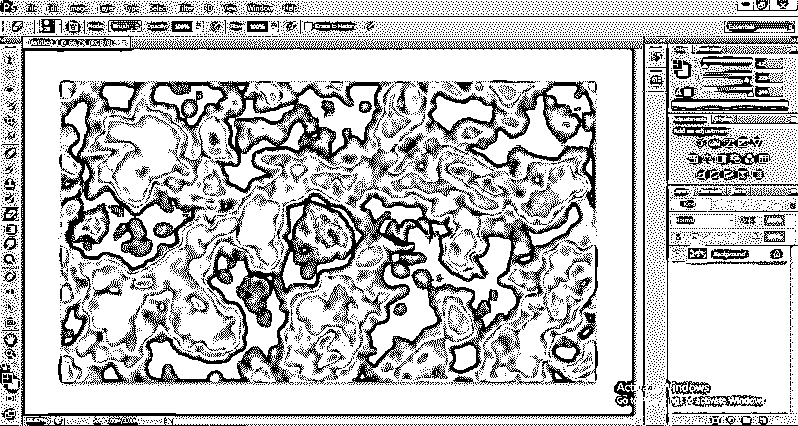

**步骤 19:** 现在给云差滤镜再添加一种颜色。

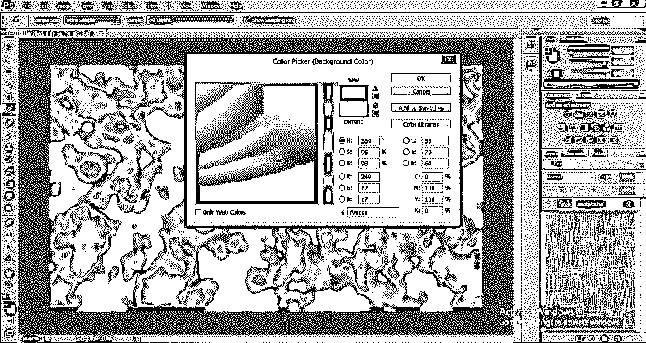

**步骤 20:** 云的纹理差异会变成这样。

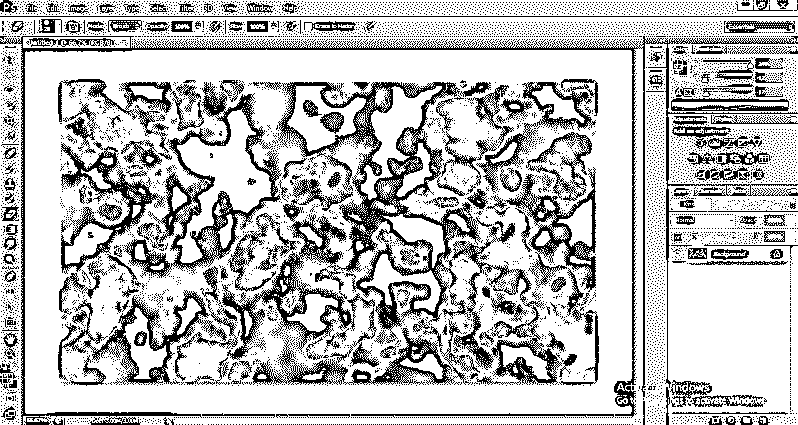

**步骤 21:** 现在，从工具面板中选择矩形选择工具，在这个纹理上选择一个区域，使用下一个滤镜。

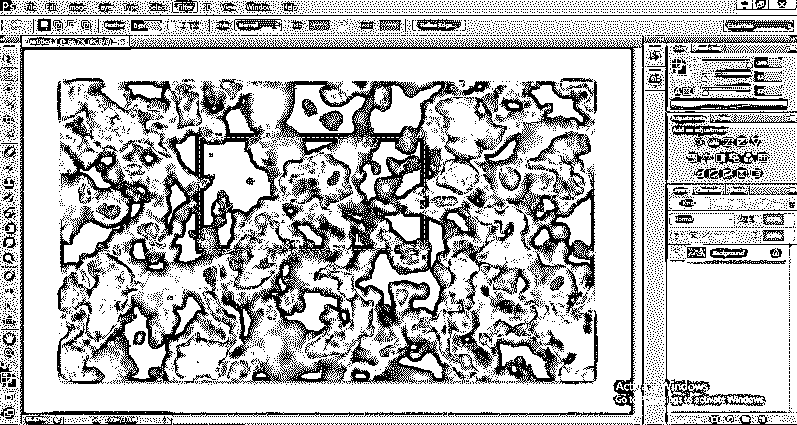

步骤 22: 在这里，我们将看到下一个过滤器是扭曲。转到过滤器菜单，转到下拉列表的扭曲选项，并从下一个下拉列表中选择剪切选项。

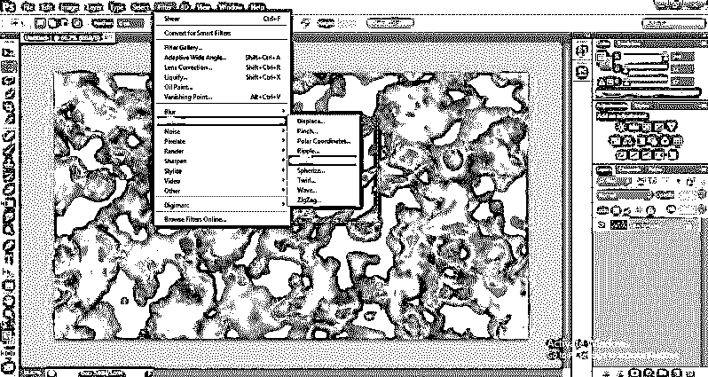

**步骤 23:** 从剪切打开的对话框中设置剪切角度。

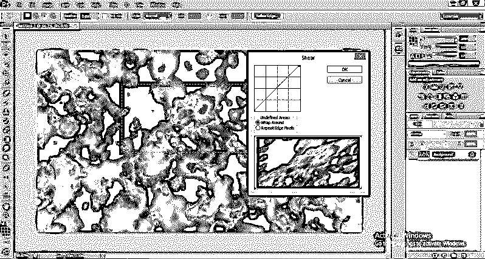

**步骤 24:** 像剪切一样，你可以从扭曲下拉列表中选择另一个扭曲形状。

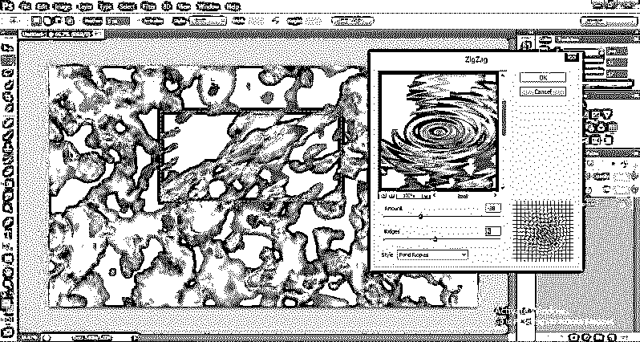

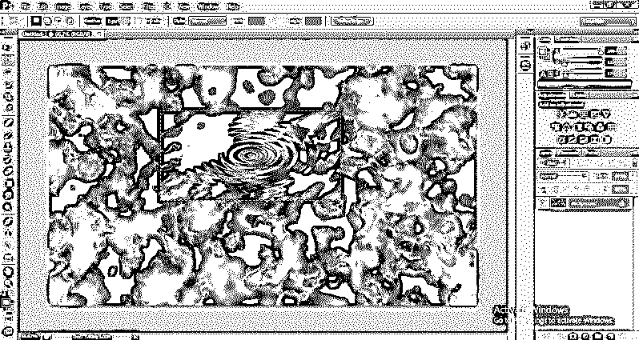

**步骤 25:** 你可以在单独的图层中分离扭曲纹理。为使单独的层，只需按 Ctrl+J。

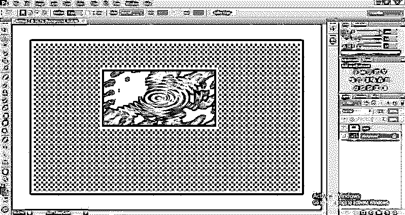

第 26 步:接下来，我们可以给我们的纹理添加灯光效果。对于灯光效果，转到过滤器菜单的渲染选项，并从这里选择镜头眩光选项。

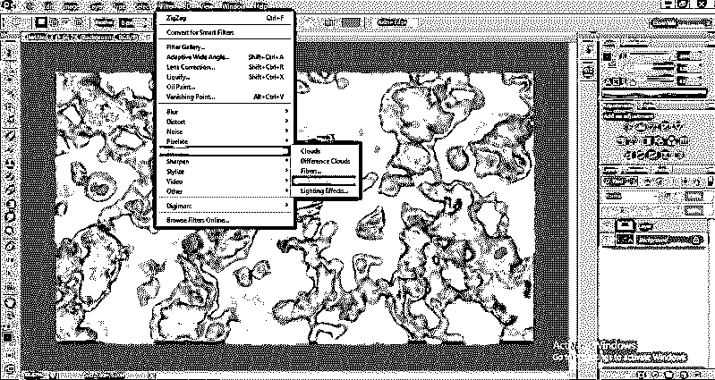

步骤 27: 从你想要在你的纹理中放置灯光效果的地方调整灯光的方向。

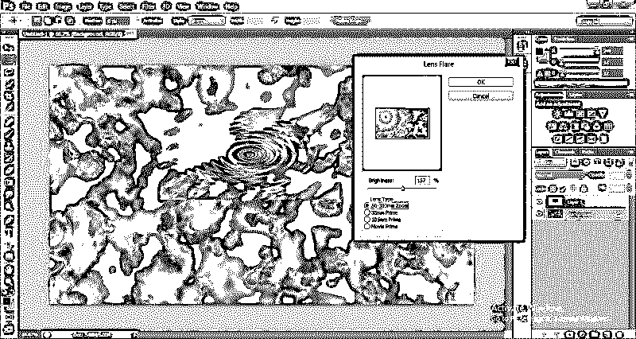

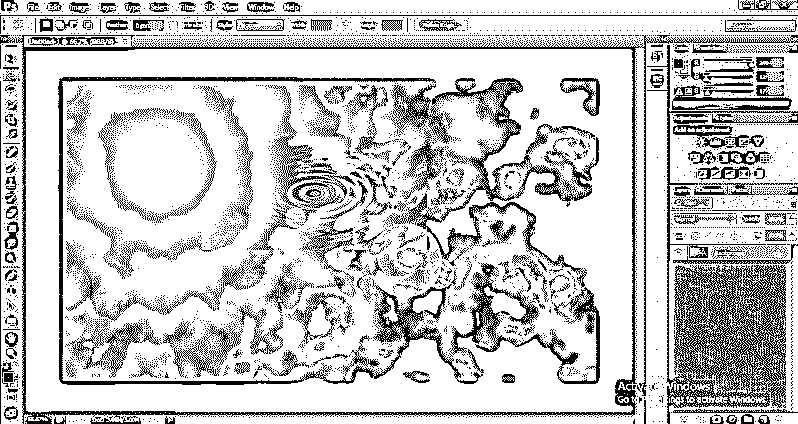

**步骤 28:** 下一个过滤器是纤维。再次从颜色框中选择两种颜色。

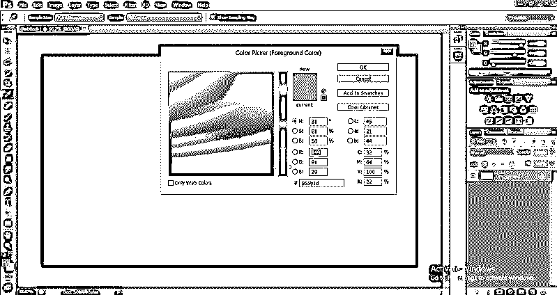

步骤 29: 进入滤镜菜单的渲染选项，从下一个下拉列表中选择纤维选项。

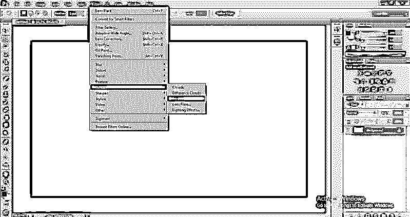

**步骤 30:** 一个纤维对话框将打开。您可以在这里更改纹理的变化和强度，完成后，单击此对话框的“确定”按钮。

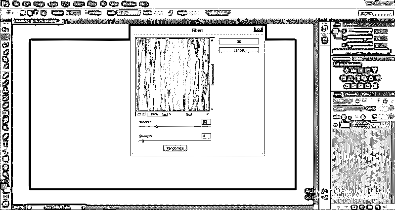

步骤 31: 为了使你的纹理平滑，我们将使用模糊滤镜。进入“滤镜”菜单，进入下拉列表中的模糊选项，再次点击下一个下拉列表中的运动模糊选项。

**步骤 32:** 会打开一个运动模糊的对话框。将选项的角度设置为 90 度。

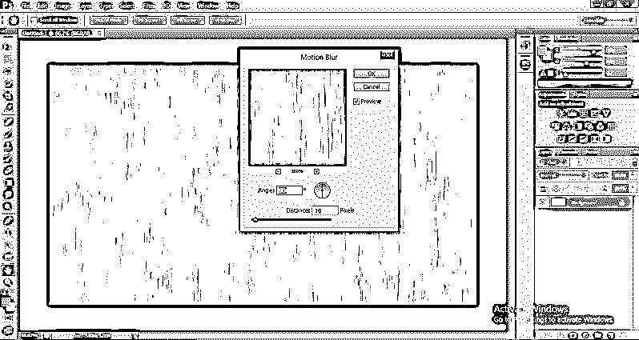

**步骤 33:** 对于平滑度，增加距离选项的数据，点击此对话框的确定按钮应用设置。

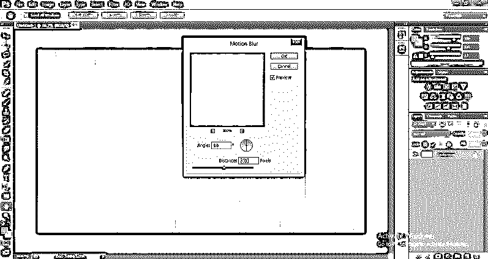

第 34 步:你可以像这样再次改变角度的方向。

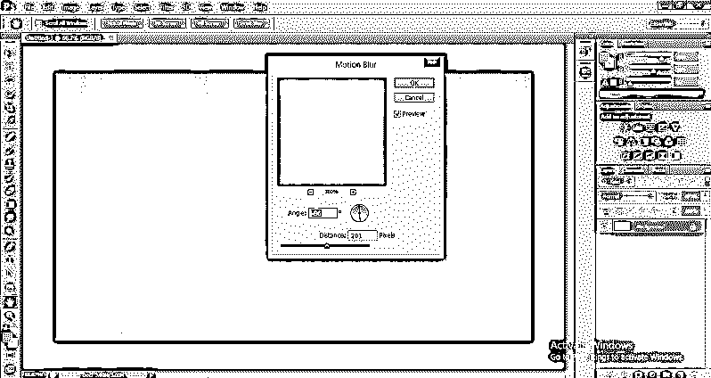

下面是最终的图像。

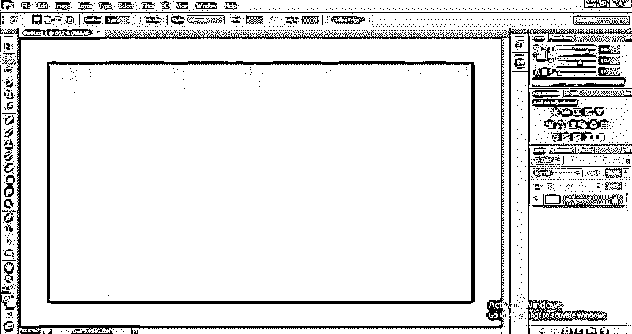

这样，您可以在项目中使用过滤器。

### 结论

在这篇文章之后，你可以很容易地在你的项目中使用过滤器，没有任何问题。与过滤器，你可以节省你的时间，使你的工作在一个更容易的方式比任何其他工具的这个软件。一旦你很好地掌握了滤镜，完美地准备一个项目对你来说就变得很容易了。

### 推荐文章

这是 Photoshop 中的滤镜指南。在这里，我们讨论的介绍和如何使用 photoshop 中的滤镜及其步骤。您也可以阅读以下文章，了解更多信息——

1.  [在 Windows 8 中安装 Adobe Illustrator](https://www.educba.com/adobe-illustrator-for-windows-8/)
2.  [插画师 vs InDesign](https://www.educba.com/illustrator-vs-indesign/)
3.  如何在 After Effects 中使用木偶工具？
4.  [Illustrator 中的滤镜指南](https://www.educba.com/filters-in-illustrator/)

