# Photoshop 中的水彩画笔

> 原文：<https://www.educba.com/watercolor-brushes-in-photoshop/>

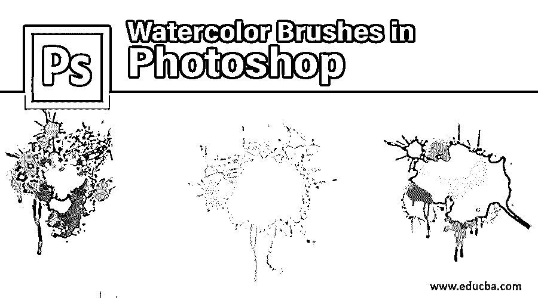

## Photoshop 中的水彩画笔介绍

下面的文章提供了一个在 Photoshop 中水彩画笔的轮廓。Photoshop 中的水彩画笔是一种有趣的效果，当与 Photoshop 等数字图像编辑软件一起使用时，它会产生奇妙的效果，因为它利用滤镜，画笔工具，图层样式和遮罩来产生真正的手绘水彩效果；此外，Photoshop 还允许用户创建自己独特的画笔工具来创作令人惊叹的艺术作品，因为没有任何限制的定制量；然而，你所要确保的是在完美的平衡中设置滤镜、图层样式和蒙版的效果。

### Photoshop 中的水彩效果

应用这种效果非常容易。让我们以泰姬陵为例，创建一个水彩效果。

<small>3D 动画、建模、仿真、游戏开发&其他</small>

第一步:在网上抓取你想要应用效果的泰姬陵图片。选择文件>打开。并从该位置选择将被编辑成这样的图像。

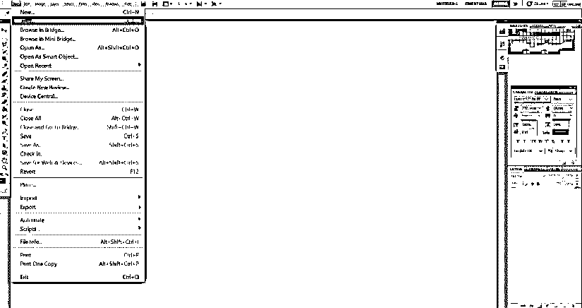

**第二步:**右键点击背景图层，选择转换为智能对象选项。这将解锁层，现在图像是准备好任何类型的 Photoshop 效果。

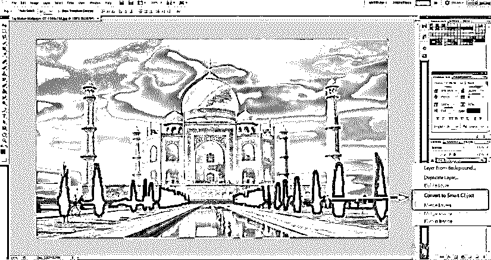

第三步:现在，对于初始效果，进入滤镜菜单，选择滤镜>滤镜库>艺术。

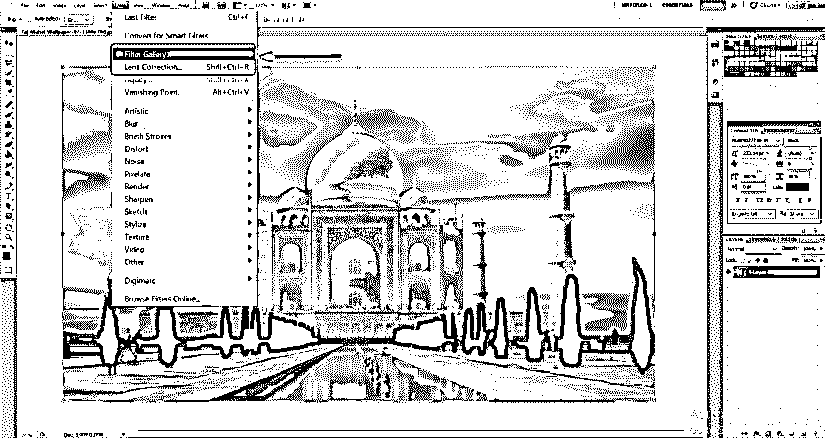

**第四步:**这将打开一个大窗口，其中已经有现成的效果，可以立即设置整个图像的色调。选择干笔刷效果。如上所述更改以下值，笔刷大小:10，笔刷细节:10，纹理:1。

**第五步:**现在，你会看到最初的布局已经变成了一种粗糙的类似水彩的效果。但是 Photoshop 为我们提供了包括笔刷、蒙版和光照在内的工具，让我们可以更细致地描绘这种效果。之后，去滤镜>模糊>智能模糊。设置下列值。半径:5，阈值:100，质量:高。你会看到细纹和尖角有点模糊，而中心看起来仍然完好无损。

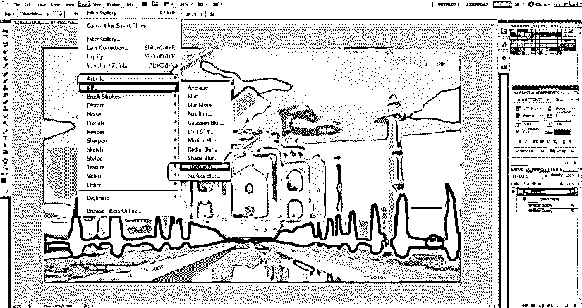

**第六步:**这是我们理解的至关重要的一步。你会在图层面板的智能模糊滤镜旁边看到一个小小的箭头框。双击它。一个名为混合选项(智能模糊)的对话框将会打开。更改以下值。模式:屏幕，不透明度:50 %。这将软化模糊效果。

**第七步:**去滤镜>风格化>找边缘。一旦滤镜添加到图层面板中，双击查找边缘旁边的小框，在混合选项对话框中，将模式改为正片。你会看到一个粗略的图像出现了。这是理解的关键一步。你会在图层面板的智能模糊滤镜旁边看到一个小小的箭头框。双击它。一个名为混合选项(智能模糊)的对话框将会打开。更改以下值。模式:屏幕，不透明度:50 %。这将软化模糊效果。

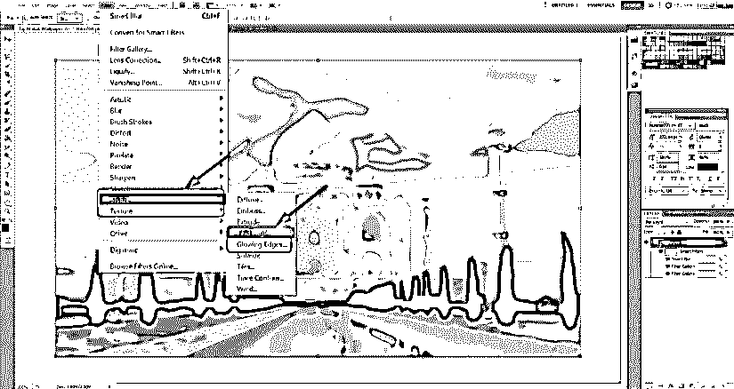

**第八步:**在线抓取一张免费的象牙或帆布纸纹理背景。将其放置在图像中，并根据泰姬陵画布的大小调整其大小。调整好尺寸后，按回车键。

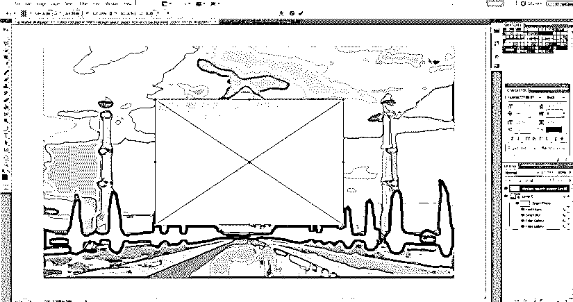

单击纸张纹理层，将混合模式更改为正片。

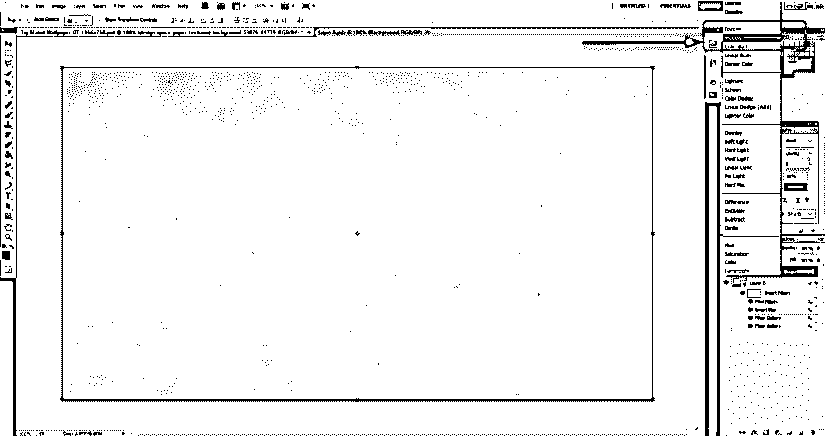

**第九步:**现在，给背景层添加图层蒙版。使用油漆桶工具将图层蒙版涂成黑色。会显得好像整个画面都消失了一样。

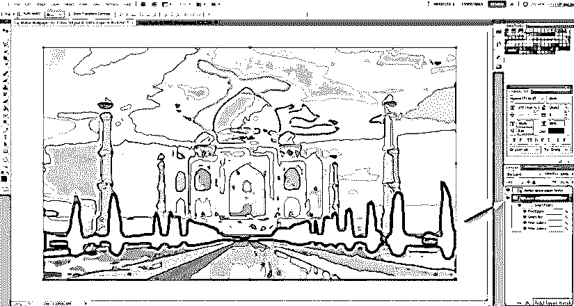

**第十步:**选择笔刷工具。在工具栏中，有一个选择笔刷类型的选项。你会看到它旁边有一个小箭头。单击箭头并选择自然笔刷。

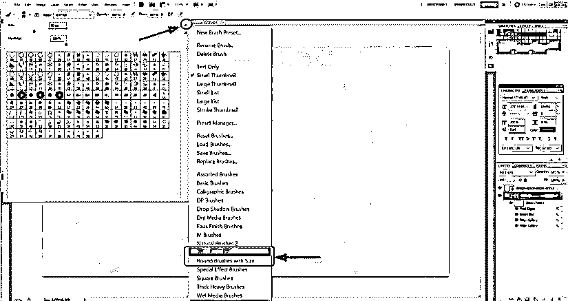

在下一个对话框中单击追加。这将添加一系列看起来像自然笔触的画笔图案。

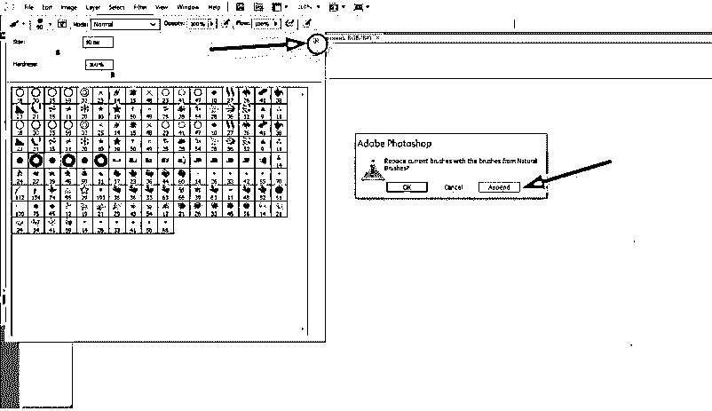

你可以选择你喜欢的设计。将笔刷大小调整到大约 101。不透明度约为 17%，流动性约为 55%。这些是我一直觉得舒服的价值观。可以根据自己的喜好逐渐变细。

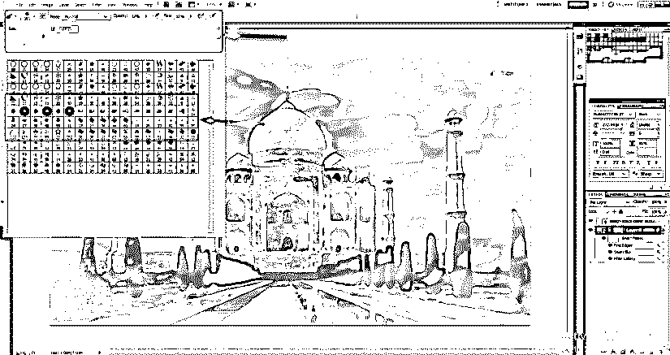

**步骤 11:** 慢慢开始拖动鼠标，创建笔刷印象和笔画。你会看到一个已经看起来像水彩的图像开始出现。只要你对外观满意，就使用笔刷效果。

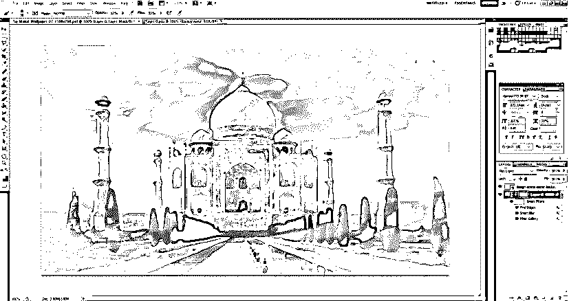

### Photoshop 中的水彩画笔效果

我们将对下图采取类似的步骤。只是更少的步骤来显示水彩效果可能太快。

**第一步:**同上图，好心尝试找一张免费的网上孔雀矢量图，可以有水彩效果。在 Photoshop 中打开它，并将其转换为智能对象。

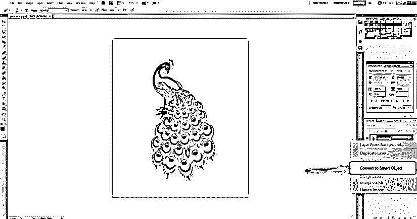

**第二步:**进入滤镜>滤镜库>艺术。

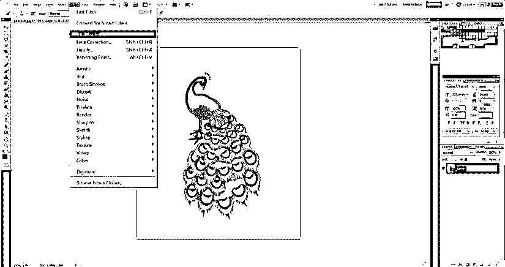

选择“干笔刷”选项，并保持值笔刷大小:10，笔刷细节:10 和纹理:1。

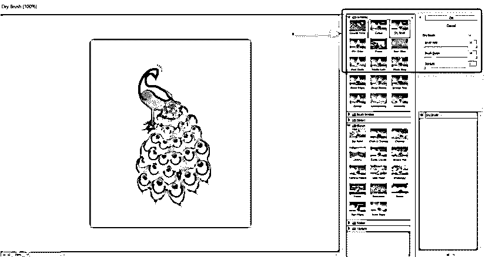

第三步:选择下面这样的小方框，创建背景层的蒙版。

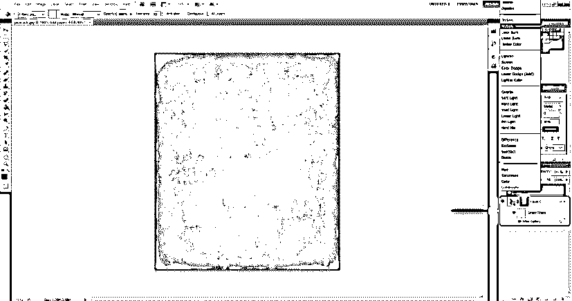

**第四步:**保持图层蒙版选中。现在使用油漆桶工具，将蒙版涂成黑色。

**第五步:**选择文件>放置在图像中放置画布或象牙纸纹理背景。调整孔雀图像的大小，然后按回车键。

第六步:现在，选择[纸纹理层](https://www.educba.com/paper-texture-in-illustrator/)，在上面的混合选项中选择叠加。这将立即恢复图像。

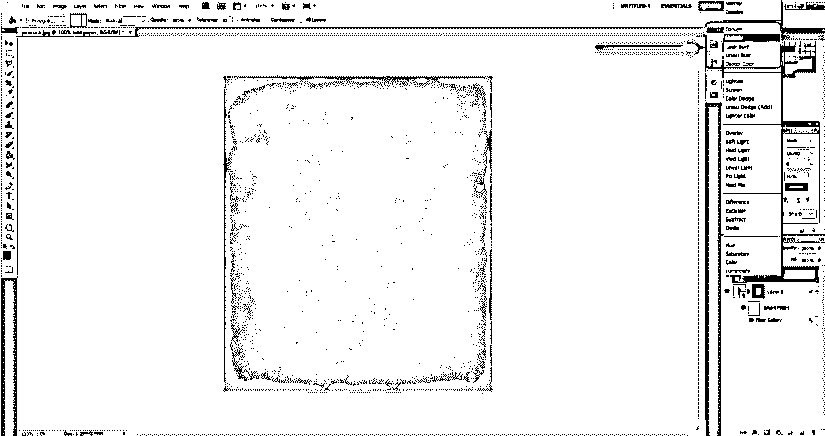

**第七步:**选择笔刷工具，选择图层蒙版。选择画笔工具的白色。在笔刷设计工具的选项栏中选择一种你所选择的自然笔刷风格。根据您的选择调整笔刷大小、不透明度和流量，然后开始绘画。你会看到一只带有水彩效果的孔雀。

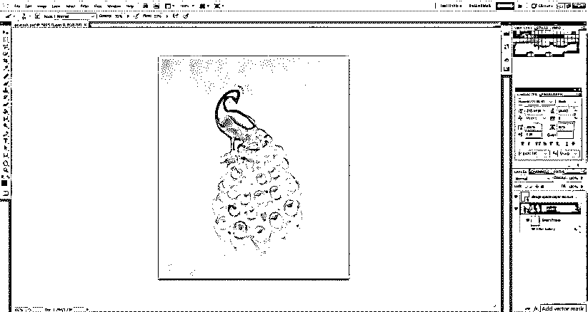

### 结论

多年来，水彩的这种效果和魅力一直没有消失。事实上，随着越来越多的在线笔刷预设的引入，它正在得到增强，帮助用户给自己的图像一个真实的效果。你所要做的就是以正确的方式设置滤镜、图层样式和蒙版效果。

### 推荐文章

这是 Photoshop 中水彩画笔的使用指南。在这里，我们讨论了 photoshop 中的水彩效果和水彩画笔效果的介绍。您也可以阅读以下文章，了解更多信息——

1.  [Photoshop 中的雪景效果](https://www.educba.com/snow-effect-in-photoshop/)
2.  [After Effect Vs 4D 电影院](https://www.educba.com/adobe-after-effect-vs-cinema-4d/)
3.  [Photoshop 中的套索工具](https://www.educba.com/lasso-tool-in-photoshop/)
4.  [后效中的傀儡工具](https://www.educba.com/puppet-tool-in-after-effects/)

