# 如何在 Photoshop 中融合图像？

> 原文：<https://www.educba.com/how-to-blend-images-in-photoshop/>

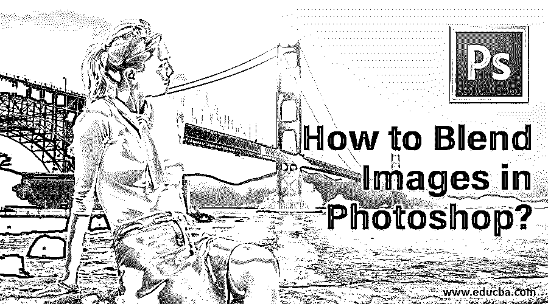

## Adobe Photoshop 中的 Blend 简介

Adobe Photoshop 中的“混合”改变了层与其下一层的反应方式。混合模式，如图层蒙版，自动混合，图层不透明度选项提供了用户的手段和灵活性，以创造艺术作品，最好地利用数码软件摄影；它还包括使用 Photoshop 中提供的各种混合模式逐步使用和创建设计的详细描述，以帮助您更好地从专业和美学角度投影您的作品。

### Photoshop 中混合图像的方法

本教程将学习如何在 photoshop 中混合图像，并使用各种方法创建逼真的图像。

#### 方法 1–图层蒙版法

第一步:第一步是选择两张你要应用混合效果的图片。根据您使用的是 web 格式还是打印格式，选择合适的图像分辨率。

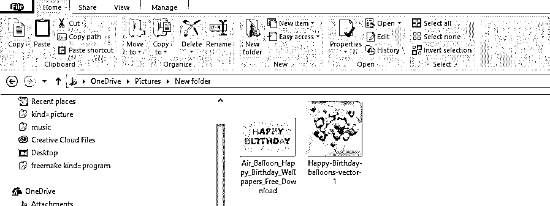

**第二步:**将图像合并在一起。现在，我们将把这两个图像放在一个文档中。为此，请从左侧的工具面板中选择移动工具，或者按键盘上的 **V** 以获得快捷方式。接下来，使用鼠标光标选择第二个图像窗口，并将其拖到第一个图像窗口上。现在，您可以在文档中间释放鼠标，将图像混合在一起。

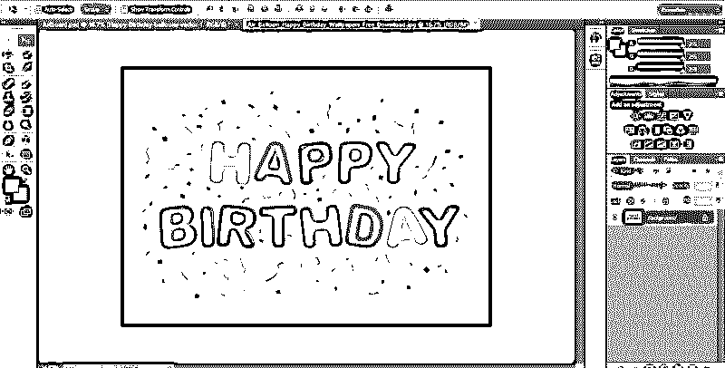

**第三步:**现在，文档中会有两层。下一步是添加图层蒙版。我们需要点击添加图层蒙版按钮，如下图所示。它位于右下角的图层面板选项中。现在你将得到一个新的图层蒙版。图层蒙版的属性是它是一个透明的图层，这使得下面的图像在使用黑色颜料时是可见的。另一方面，当使用白色涂料时，图像变得不可见。

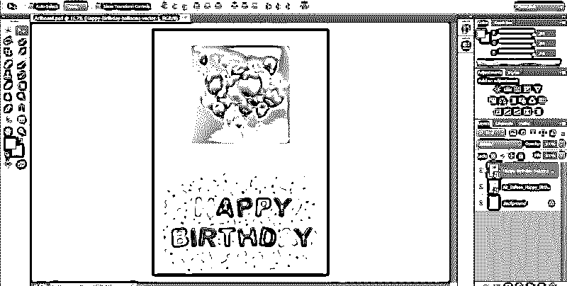

**第四步:**第四步，按键选择渐变工具。前景色和背景色应该设置为黑白。现在，我们将选择渐变为线性，并在图像上拖动渐变。

第五步:最终的效果是两幅图像融合得非常好。您还可以注意到，图层缩略图中包含渐变的遮罩，如下所示。白色区域将显示顶部图像，而黑色区域显示背景图像。您可以尝试各种渐变效果，直到获得想要的效果，因为遮罩可能会无休止地溢出。

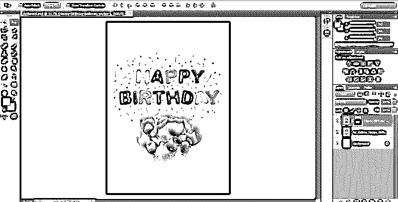

**NOTE: **You can also try changing the blending modes. There are various blending modes such as screen, multiply, darken, lighten overlay and so on, which you can try out and see which one best suits the image. In addition, you can experiment with brush tools on the mask. It is best recommended to use soft brushes.

#### 方法 2–自动混合图层命令

在 Adobe Photoshop 中，可以使用“自动混合图层”命令来合并或缝合图像，并在最终输出中实现平滑过渡。它的工作原理是根据需要在每个图层上应用图层蒙版，以有效地提取曝光不足的部分。但是，您需要记住，自动混合图层选项仅适用于 RGB 和灰度图像。这意味着它对智能对象、背景图层、3D 图层和视频图层没有任何影响。

##### 景深混合

第一步是将您想要混合到同一个文档中的两个图像放在一起。

第一步:一旦图像在单独的图层中，选择你需要混合的图层。

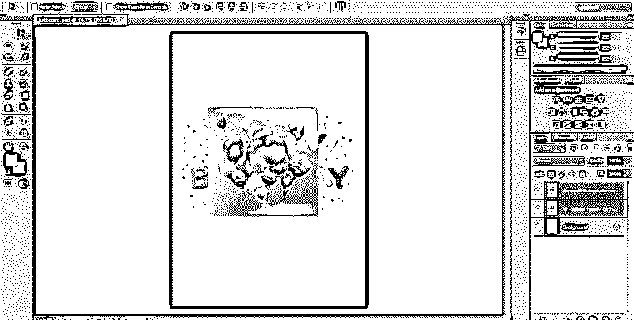

第二步:下一步是应用自动混合图层。为此，选择层并选择编辑。

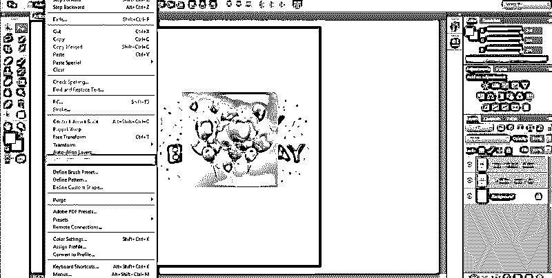

第三步:下一步，选择自动混合层，点击自动混合目标，全景或堆栈。

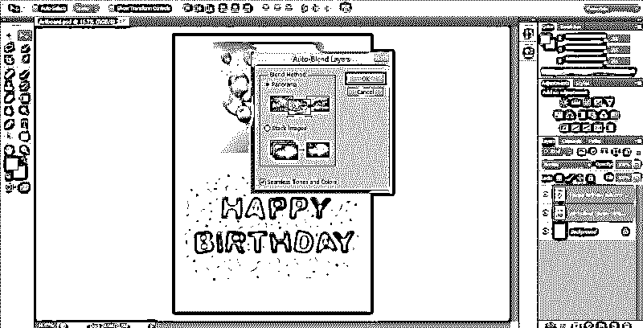

##### 全景画

如果选择“全景”,生成的混合将是全景视图中的重叠层。

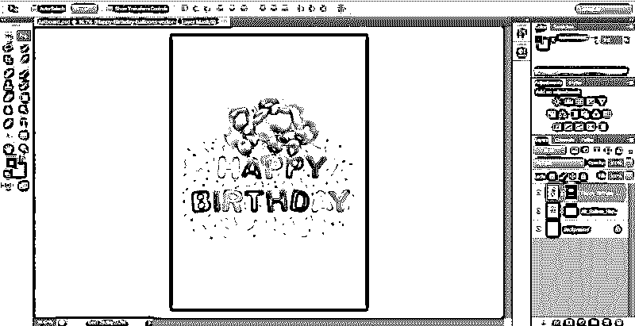

##### 堆叠图像

“堆栈”选项可以有效地混合合并区域的细节。

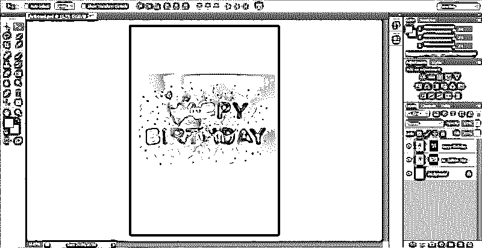

**注意:** Stack 的工作原理是根据光照高亮显示区域。您可以在应用堆叠选项之前自动对齐图像，以获得最佳效果。此外，您可以检查无缝色调和颜色选项。它会增强整体的颜色和色调的融合效果。

#### 方法 3–图层不透明度选项

在第三种方法中，我们将使用 Photoshop 中的图层不透明度选项混合两个图像。您可以按照上面讨论的类似方法，使用图层面板选项将它们一起放置在单独的图层中。

第一步:下面，我用了一个城市景观和一颗发光的星星的图像来融合。

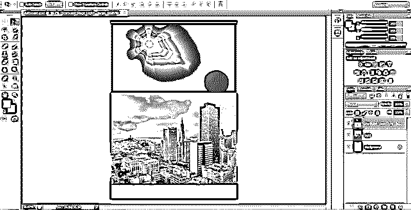

**第二步:**在图层面板的右上角，可以找到不透明度选项。默认情况下，图片的不透明度值将设置为 100 %。因此，顶部的图像会挡住背景图像。不透明度值决定了图像的透明度。因此，我们将降低顶部图像的不透明度值。它会慢慢使背景图像可见。在这个例子中，我将不透明度从 100 %降低到 60%。

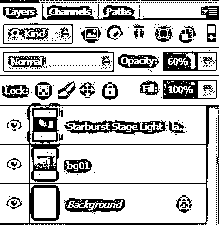

**第三步:**现在，你会注意到下图慢慢开始与城市景观融为一体。

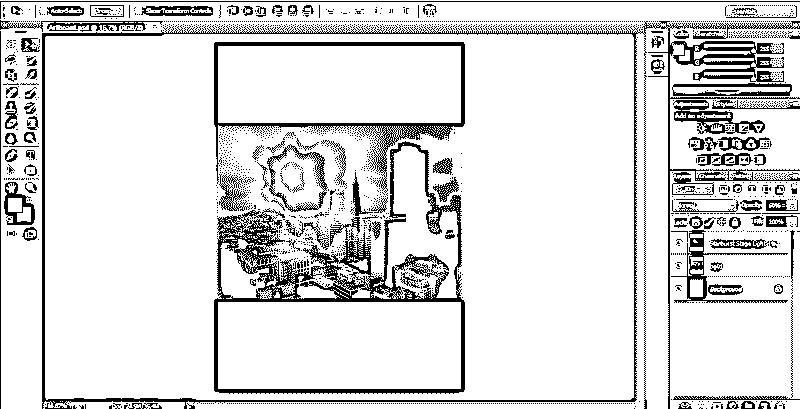

### 结论

这是关于我们如何在 Adobe Photoshop 中使用各种混合方法混合图像的快速信息，例如图层蒙版方法、自动混合图层命令和图层不透明度选项。掌握混合选项的用法后，使用它们创建惊人的视觉效果。同样，你可以借更多关于各种 Photoshop 效果、应用和模式的教程。尝试一下，为你的职业生涯提升你的平面设计技能。

### 推荐文章

这是一个如何在 Photoshop 中混合图像的指南？.在这里，我们讨论三种不同的方法来混合图像使用不同的效果。您也可以浏览我们的其他相关文章，了解更多信息——

1.  [后期效果中的混合模式](https://www.educba.com/blending-modes-in-after-effects/)
2.  [Illustrator 中的混合模式](https://www.educba.com/blending-modes-in-illustrator/)
3.  [Photoshop 混合笔刷工具](https://www.educba.com/photoshop-mixer-brush-tool/)
4.  [Photoshop 中的选择工具](https://www.educba.com/selection-tool-in-photoshop/)

