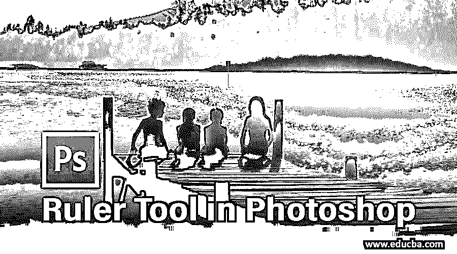
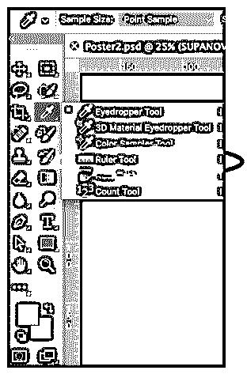
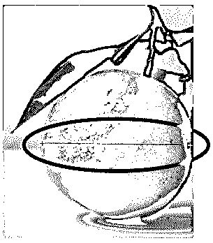
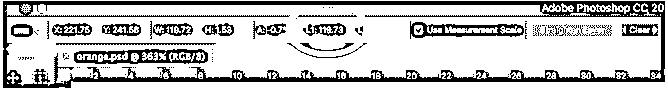
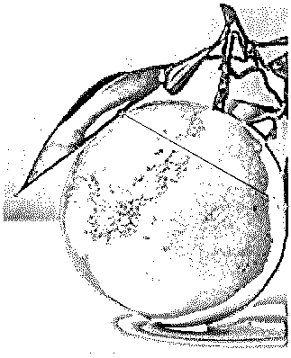
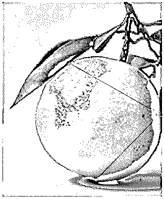
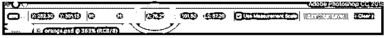
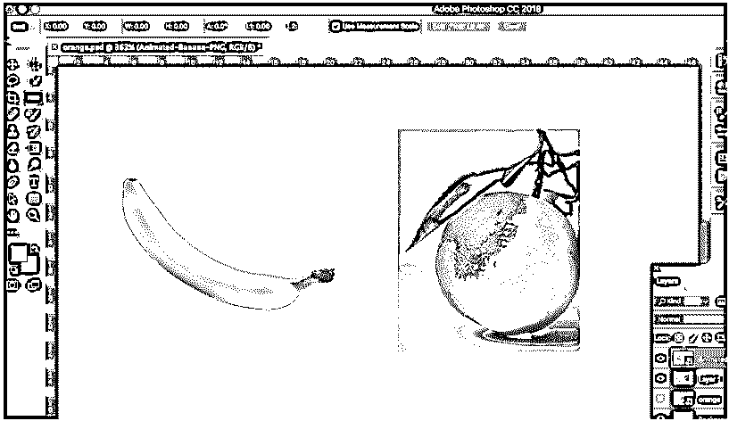
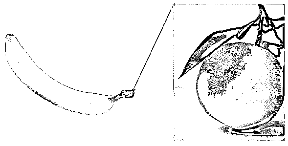
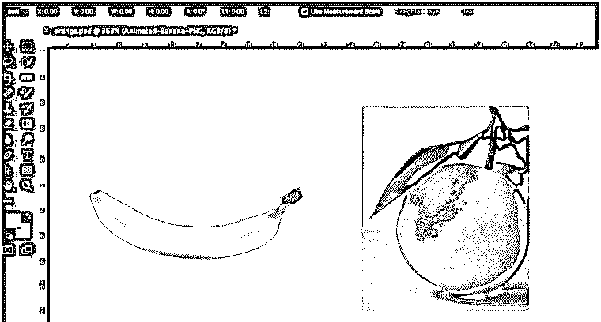

# Photoshop 中的标尺工具

> 原文：<https://www.educba.com/ruler-tool-in-photoshop/>

## Photoshop 标尺工具简介

Photoshop 中的标尺工具就像一个虚拟磁带，您可以使用它在两个形状或线条之间进行精确计算，调整文档中对象的大小或移动对象；它包含了在 Photoshop 中使用标尺的所有步骤，包括激活标尺、使用 x、y、z 轴标尺、测量角度、拉直图像等细微差别，以及更多创建清晰、精确、一致且平衡的设计元素的步骤，有助于从专业角度观察结果。

<small>3D 动画、建模、仿真、游戏开发&其他</small>

### 如何在 Photoshop 中使用标尺工具？

在本教程中，您将学习如何在 Photoshop 中使用标尺工具来测量和定位对象。

#### 使用标尺工具测量对象

**第一步:**要操作这个工具，你只需要从如上图的工具栏中选择它或者重复按 **Shift+I** 直到它出现。

**步骤 2:** 现在，要计算两端之间的距离，您需要做的就是在起始端单击并按住鼠标左键，然后将鼠标拖动到末端，然后放开鼠标按钮。例如，我们将拍摄一个橙子的图像，并按如下所示进行测量:

*   结果如下图所示。两端之间的距离大约为 120 像素。

**当您使用标尺工具时，选项栏会为您提供一些包含以下值的数据。**

*   **X，Y:** 直线起点的 X 和 Y 坐标:例如，如果从水平标尺上的 1 英寸位置和垂直标尺上的 3 英寸位置开始，选项栏上的 X 和 Y 值分别为 1.0 和 3.0。(您可以在 Photoshop 的首选项中选择标尺上 X 和 Y 值的增量。)
*   **W:** 这是你起点的 X 坐标和终点的 X 坐标的区别。例如，如果终点位于最左侧 900 个像素处，起点位于最左侧 800 个像素处，则在这种情况下，W 将为 100 (900-800)。
*   这是起点的 Y 坐标和终点的 Y 坐标之间的区别。例如，如果终点位于最左侧 1000 个像素处，起点位于最左侧 800 个像素处，则在这种情况下，W 将为-200 (800-1000)。
*   **A:** 起始线的角度或两条线之间的角度。
*   **L1:** 线路的完整跨度。这种选择展示了两端之间的真实距离。在上面的例子中，L1 的值是 120，这告诉我们两端之间的距离是 120 像素。你也可以利用毕达哥拉斯定理，测量 L1 的宽度(W)和高度(H)。
*   **L2:** 第二行的完整长度。只有当我们想在测量第一条线的同时测量第二条新线时，这种方法才有效。
*   **拉直图层:**您也可以使用标尺工具拉直您的图片。只需在两个要与标尺对齐的图像层之间创建一条线，然后点击选项栏中的“拉直图层”按钮。
*   **清除:**点击清除按钮，清除您当前的测量值。

#### 使用标尺工具测量角度

我们将使用与上面相同的例子:

**第一步:**要操作这个工具，你只需要从如上图的工具栏中选择它或者重复按 **Shift+I** 直到它出现。

**第二步:**点击第一行的开始位置，拖动到最后一个位置。放开鼠标按钮产生第一行。

**步骤 3:** 按住 Alt 键(Mac 的 option 键)并点击你需要用来计算角度的第一条线的端点。

*   产生的角度为 75.2 度。

#### 拉直图像

我们将使用一个橙子和香蕉图像的例子来展示这一点。

**第一步:**将两张图片放在仪表盘上。

**第二步:**从工具栏中选择标尺工具。

**第三步:**点击第一行的开始位置，拖动到最后一个位置。放开鼠标按钮以生成线条。

**步骤 4:** 创建线条后，点击顶部选项栏中的拉直图层，拉直图像。你会得到下面的结果。

*   统治者本身具有明显的适应性。您可以改变它们的大小，生成多个起点和终点，并密封它们，以便所有新的点都必须与计算标记一起定位，以确保准确无误。甚至还有水平和垂直光标伴随着屏幕的移动，这样你就可以随时知道你的鼠标在 X 和 Y 轴上的精确位置。

### 结论

这样，标尺工具可以用来对比各种动作。标尺工具主要在您必须尝试找到两端之间的精确距离来修复图片时有用。当你试图裁剪一张图片或者将它旋转一定的角度时，这种情况是很常见的。因此，不仅仅是估计，你可以利用工具产生一个直切，将剪辑你的图片，或者你可以利用它来迅速找到一个角度，将允许你把图片按照你的要求。

### 推荐文章

这是 Photoshop 中的标尺工具指南。在这里，我们以三种不同的形式讨论 photoshop 中标尺工具的使用。您也可以浏览我们的其他相关文章以了解更多信息-` 1

1.  [Adobe Photoshop 工具有哪些？](https://www.educba.com/adobe-photoshop-tools/)
2.  [Photoshop 中套索工具指南](https://www.educba.com/lasso-tool-in-photoshop/)
3.  [Photoshop 中选区工具的教程](https://www.educba.com/selection-tool-in-photoshop/)
4.  [Photoshop 中的油彩滤镜](https://www.educba.com/oil-paint-filter-in-photoshop/)

