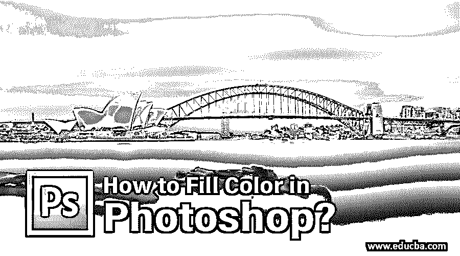
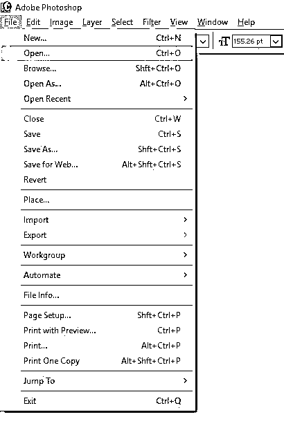
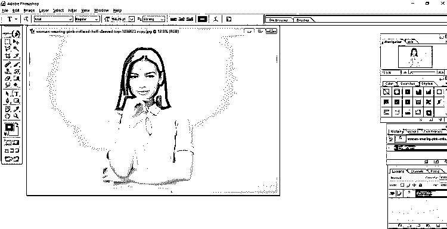
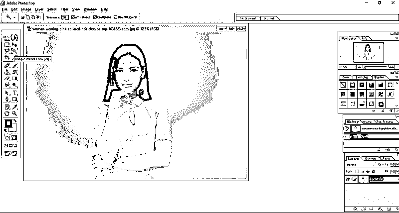
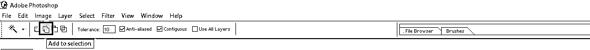
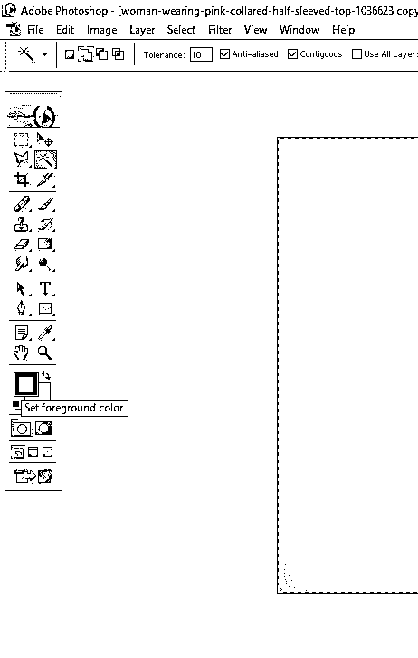
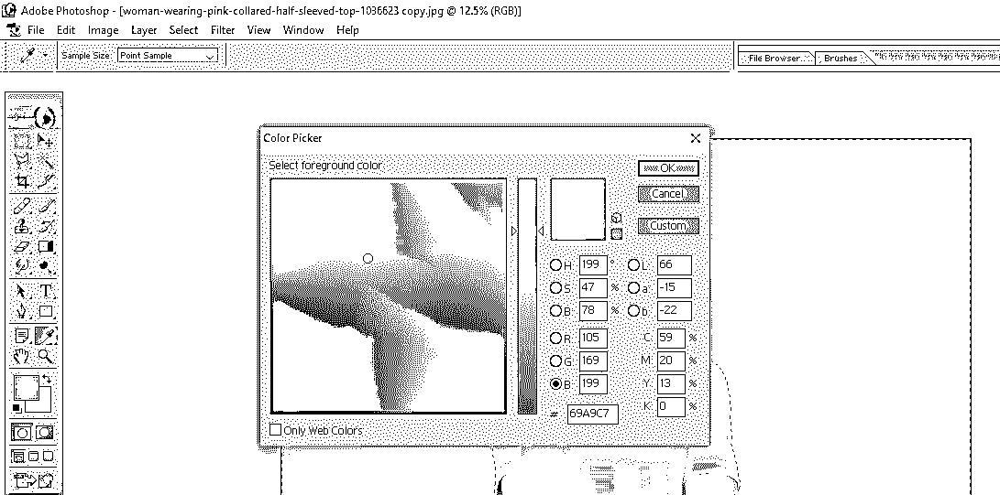
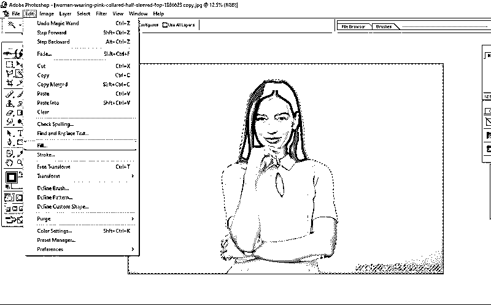
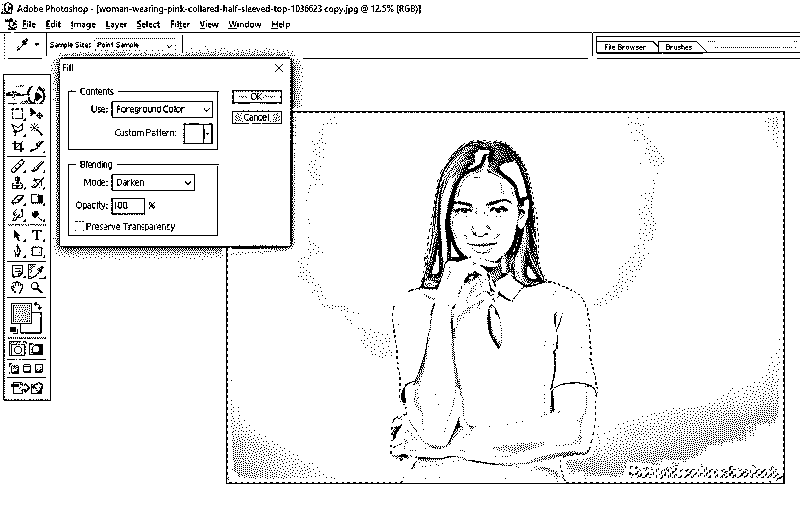
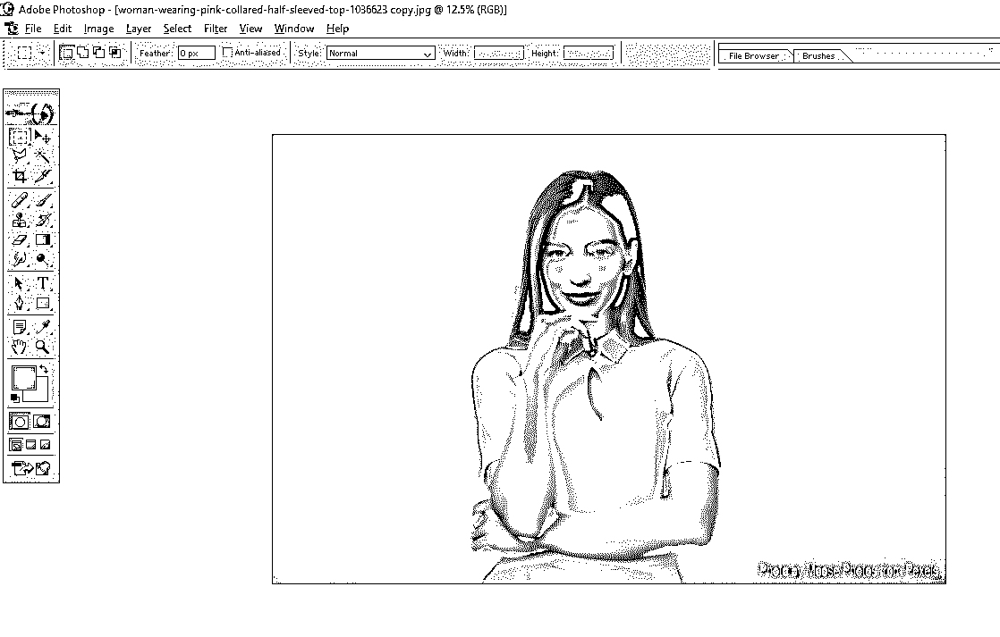

# 如何在 Photoshop 中填充颜色？

> 原文：<https://www.educba.com/how-to-fill-color-in-photoshop/>

## Photoshop 中填充颜色的介绍

在这篇文章中，我们将学习如何在 Photoshop 中填充颜色？.在 Photoshop 中给图片填充颜色非常容易。不管 Photoshop 的版本和类型如何，填充颜色就像发短信一样简单。为此只需要几个操作。该操作主要用于改变图像的背景颜色，尤其是护照尺寸的照片。同样，我们可以改变前景对象来匹配背景颜色，这需要更多的操作来使颜色 100%匹配背景。用于为 YouTube 视频、横幅、通知等制作有吸引力的缩略图。，这个颜色填充选项是可投资的。这也只需几个简单的步骤。下面的步骤用每个操作的截图来说明。所以，让我们来看看填充颜色的步骤。

### 如何在 Photoshop 中填充颜色？

下面是在 photoshop 中填充颜色的步骤:

<small>3D 动画、建模、仿真、游戏开发&其他</small>

**第一步:**打开电脑上的 Adobe Photoshop，然后点击**文件**标签。然后屏幕上会出现一个下拉列表。在 windows 中选择**打开**或直接按 Ctrl+O 快捷键，从下拉列表中打开您想要编辑的图像。请参见下图，了解打开图像的过程。

然后从目录中选择您的照片。在这里，我为此选择了一个免版税的图像。

**第二步:**在这里，你可以看到一个粉红色背景的女孩的形象。我正在通过填充颜色选项将这张图片的背景色从**粉色**改为**蓝色**。还有，我们要保持女孩的形象不变。为此，你应该使用**魔棒工具选择女孩的部分。**

从 Photoshop 工作页面左侧显示的工具列表中选择魔棒工具，或者只需按下 Windows 中的 **W** 键，如下图所示。

**第三步:**使用魔棒工具，选择这个女人的背景，只需点击你想要用填充新颜色替换颜色的背景区域。但是，在此之前，您需要定义一些参数。首先，点击[魔棒工具](https://www.educba.com/magic-wand-tool-in-photoshop/)顶部框中的**添加到选区**，并确保公差设置为一个低值，如下图所示。这里，我将公差值设为 10。降低公差值意味着选择尽可能小的区域，并增加截面。为了便于选择，最好使用较小的公差值。然后**检查**的**反**–**别名框**和**邻接框**，如下图所示。这将提高工具的效率。

最后，你可以看到整个背景被选中，如下图所示。也可以通过减小公差值来选择较小的部分。

现在我们已经选择了图片的整个背景。

**第四步:**下一步是改变背景色。我们可以从现在开始改变背景颜色。在此之前，请确保您已经将前景色或背景色更改为想要用填充颜色选项替换的颜色。

这里我选择了**前景色**，改成了浅蓝色。然后点击 OK，如下图所示。

**第五步:**从主选项卡进入**编辑**选区，选择**填充…** 选项，填充所选颜色，如下图所示。

选择填充选项后，将打开另一个对话框。使用“填充”对话框中的前景色(因为我们按照步骤 4 更改了前景色，但是如果您更改了背景色，请选择“背景色”选项)。然后，点击 **OK，**如下图所示。

如果需要降低颜色强度，您还可以更改[混合模式](https://www.educba.com/blending-modes-in-after-effects/)和不透明度。在这里，我将保留默认设置。

**第六步:**在这里，你可以看到输出。背景颜色已更改为蓝色。

仅此而已。用高质量设置保存图片。

### 结论

使用填充颜色选项更改图像的背景颜色是一种非常简单快捷的技术，任何了解 Photoshop 基础知识的人都可以使用。这个技巧是 Adobe Photoshop 的一个常见[功能，对每个人都非常有用。学习这些技巧可以帮助你在没有专业设计人员帮助的情况下进行一些基本的图像编辑。](https://www.educba.com/top-10-features-in-adobe-photoshop/)

### 推荐文章

这是一个如何在 Photoshop 中填充颜色的指南？.这里我们讨论在 Photoshop 中填充颜色的简单易行的步骤。您也可以浏览我们的其他相关文章，了解更多信息——

1.  [Photoshop 中油画滤镜快速指南](https://www.educba.com/oil-paint-filter-in-photoshop/)
2.  [Photoshop 中的背景橡皮擦工具](https://www.educba.com/background-eraser-tool-in-photoshop/)
3.  [Photoshop 中的雨效果是什么？](https://www.educba.com/rain-effect-in-photoshop/)
4.  [如何在 Photoshop 中使用加深工具？](https://www.educba.com/burn-tool-in-photoshop/)
5.  [如何在 Photoshop 中改变头发颜色的指南](https://www.educba.com/change-hair-color-in-photoshop/)

