# Photoshop 中的颜色替换工具

> 原文：<https://www.educba.com/color-replacement-tool-in-photoshop/>

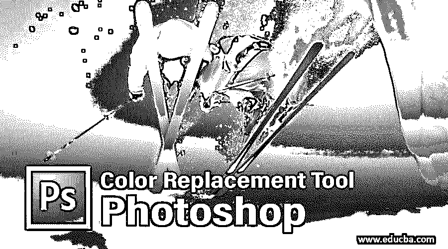

## Photoshop 中的颜色替换工具介绍

在本文中，我们将学习 Photoshop 中的颜色替换工具。每个图形专业人员都非常熟悉 Photoshop，因为这个软件使他们的工作变得非常容易，并将他们工作的准确性提高到了一个完美的水平。Photoshop 是 Adobe 家族的一部分，由他们维护。他们不时地向用户提供该软件的更新版本，以避免其绘图包。借助这个软件非常有效的工具，我们可以在这个软件中做很多编辑工作。颜色替换是它最好的工具之一。使用颜色替换工具，我们可以改变图像中任何选定对象的颜色。

### Photoshop 中的颜色替换工具怎么用？

在本文中，我们将非常有趣地看到这个工具的所有方面。让我们开始了解这个工具:

<small>3D 动画、建模、仿真、游戏开发&其他</small>

**第一步:**去互联网浏览器下载一张高分辨率的图片效果更好，也可以自己拍摄高分辨率的图片。或者转到保存的图像文件夹，将此图像拖到 Photoshop 中，然后放入软件中。

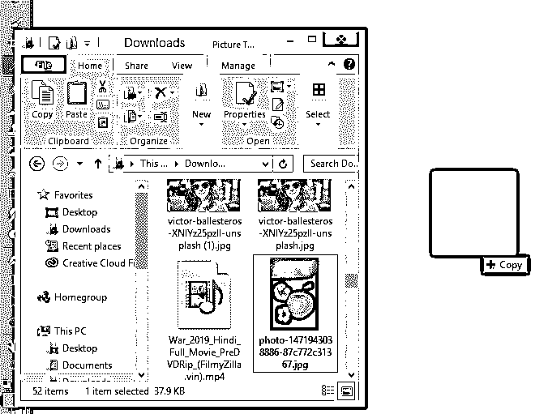

第二步:进入工具面板部分，点击笔刷工具图标。从这里选择颜色替换工具，或者你可以按键盘上的 **Shift+B** 键三次来激活这个工具。

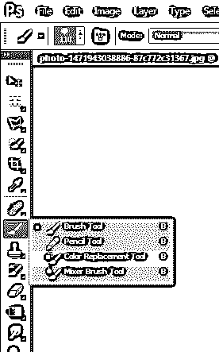

**第三步:**拿到这个工具后，只要点击这个工具带加号的区域就可以了。一旦你点击任何特定的区域，它将捕捉该区域的颜色，并用你的颜色面板的前景色改变该区域的颜色。例如，我在颜色面板的前景色中有棕色，然后当我单击如图所示带有此工具加号的苹果时，它会将苹果的绿色更改为棕色。

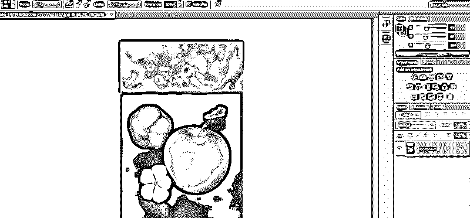

第四步:我们在工作区的顶部有一个这个工具的属性栏。我们将逐一查看该工具的所有属性，并使用它们。

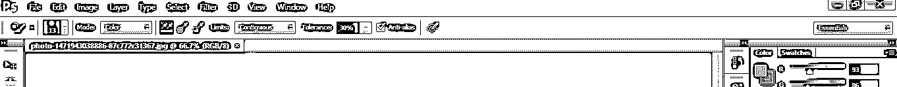

**第五步:**对于第一个属性，点击笔刷大小图标。将会打开一个下拉框。在这个框中，我们有画笔大小的值、画笔硬度的值、画笔间距的值、画笔笔尖的角度和圆度的值以及其他一些属性。

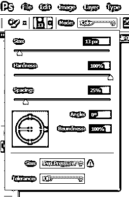

**第六步:**你也可以在工作区的任意位置点击右键打开这个属性框。

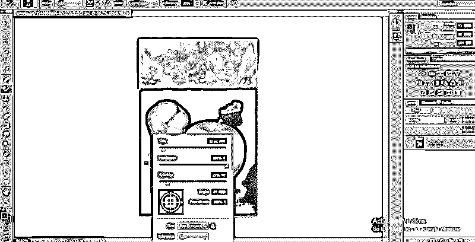

**第七步:**要改变笔尖的大小，只需移动大小值的滑块或在该属性的值框中用键盘手动输入任意数字即可。我们可以根据图像的选择区域来改变画笔笔尖的大小；也就是说，对于精细的工作，我们减小画笔的大小，而对于粗糙的工作，我们增大画笔的大小。

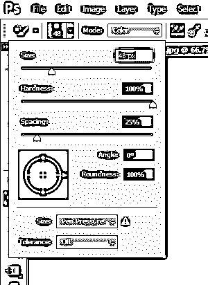

**第八步:**对于下一个属性，我将通过在这个软件中放置图像的相同方法来拍摄另一个图像。

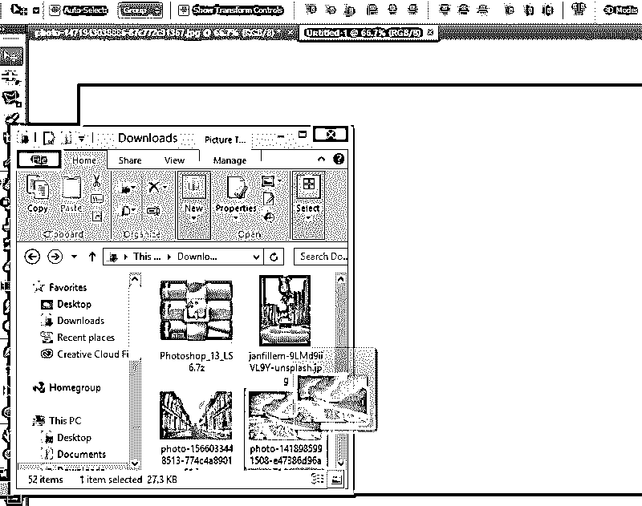

**第九步:**接下来是硬度。将硬度值增加到 100%以查看其效果。

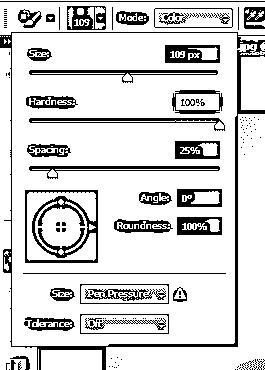

**第十步:**现在，我将在图像上画一条简单的线。

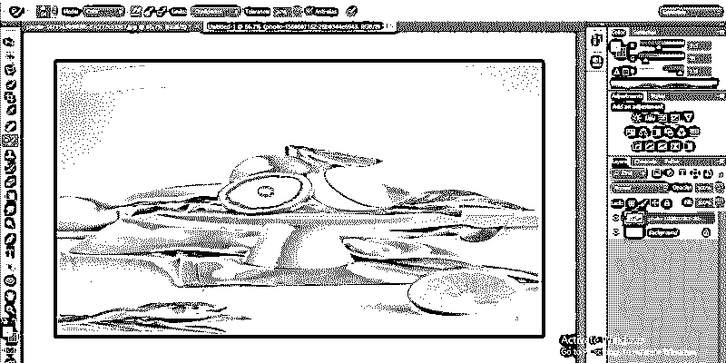

**步骤 11:** 再次将硬度值降低至 50%。

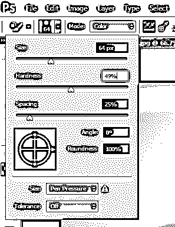

**步骤 12:** 再次，在前一条线附近画一条简单的线。你可以看到硬度值变化的不同。当您增加该值时，颜色会产生锐利的边缘，当您减少硬度值时，颜色会变得平滑。

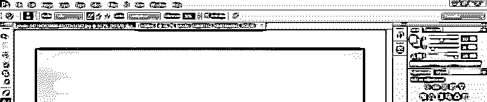

**第十三步:**接下来是间距。

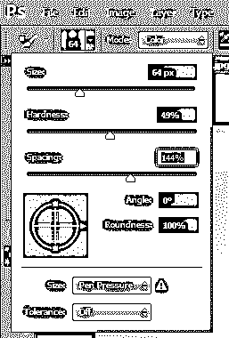

**步骤 14:** 当你增加间距的值时，结果会是这样的

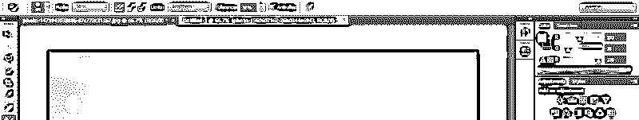

**第 15 步:**间距必须达到 10%，这样着色的速度就不会因为你的个人电脑内存少而受到影响。

**第十六步:**接下来是笔尖的角度和圆度。你可以根据你的使用目的来改变它。

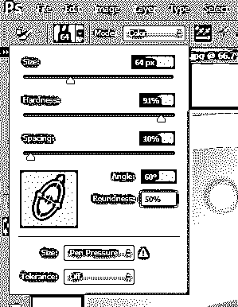

**第十七步:**接下来是模式。在模式中，我们通常会在颜色选项上工作，因为当我们选择任何颜色来用该颜色选项替换颜色时，该工具会用所选颜色替换该颜色。

**第 18 步:**色相、饱和度、光度模式会对选择的颜色给出一些不同的结果。当你熟悉这项工作时，你就会理解这种变化。

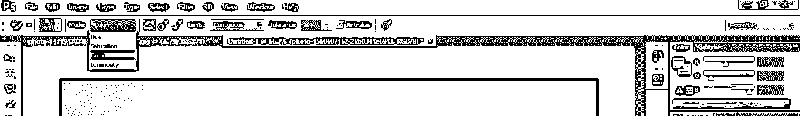

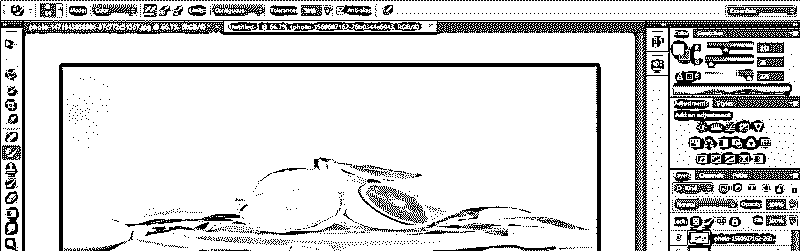

**第十九步:**接下来是采样。我们将在该属性中选择“该工具如何从图像中提取样本”。第一种方法是连续取样。

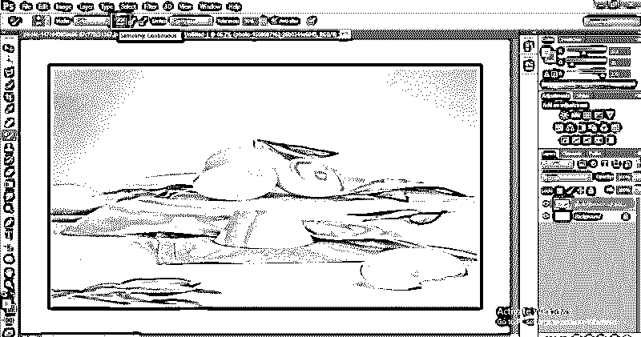

**步骤 20:** 在该方法中，工具将随着该工具加号位置的改变而改变样本颜色。例如，当我们单击半个橙色区域时，工具将改变这个橙色的颜色，当我们向前移动工具，到达叶子区域时，它将选取叶子颜色作为样本，并用相同的橙色改变叶子的颜色，如下图所示。

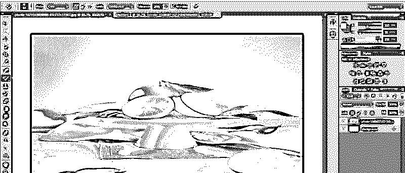

**步骤 21:** 接下来是“一次采样法”

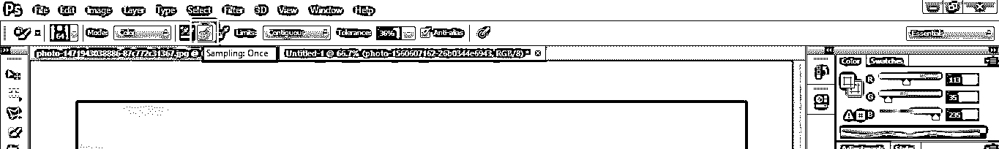

**步骤 22:** 在其中，工具将只改变第一次点击所选取的颜色作为样本颜色。

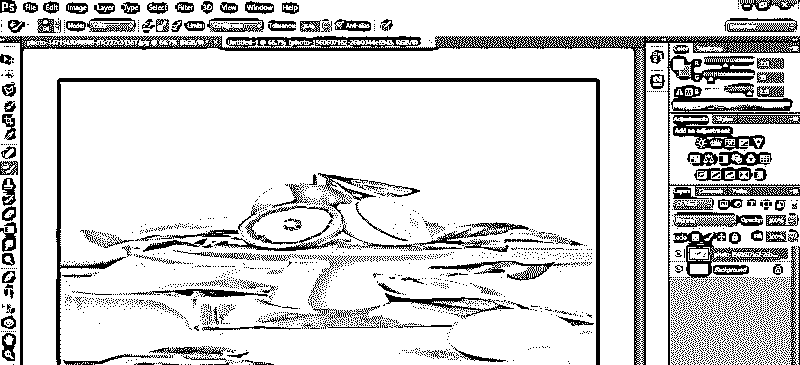

**步骤 23:** 另一个是背景样本采样。

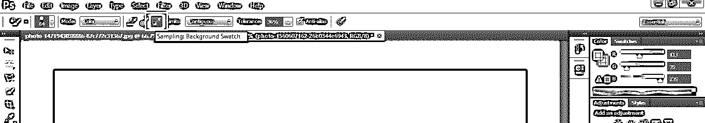

**步骤 24:** 这个工具会把那个颜色作为样本，它在颜色面板部分的背景色里。

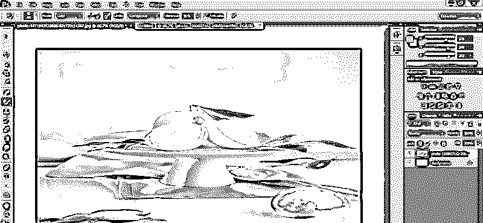

**第 25 步:**在极限选项中，为了得到更好的结果，我们一般使用 Contiguous。连续使选择变得容易。

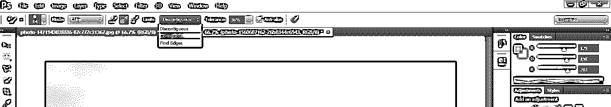

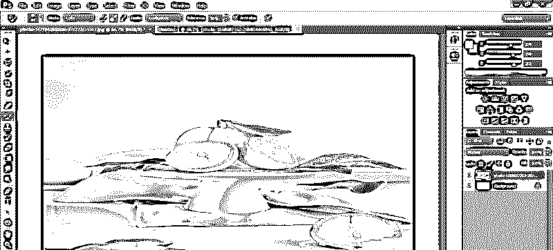

**第 26 步:**接下来是公差。当您增加容差值时，该工具会将所有颜色视为与您选择的颜色相匹配的样本颜色。

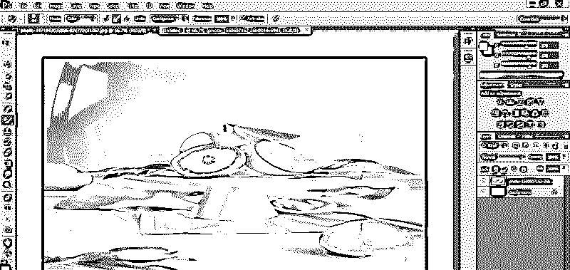

第 27 步:为了获得更好的结果，公差必须在 30%到 40%之间。

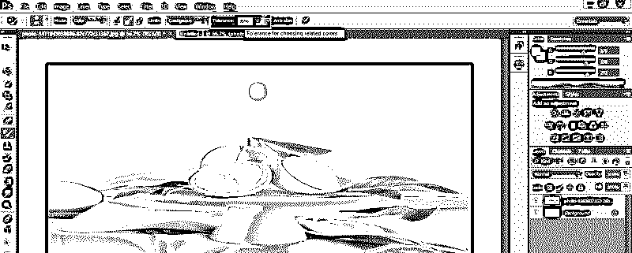

**步骤 28:** 接下来是反走样。

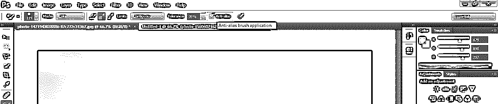

步骤 29: 这里有两种形状的笔刷在这张图片中给出。你很容易发现这两者的区别。当您启用“消除锯齿”选项时，颜色会随着平滑的边缘而改变，而当您禁用“消除锯齿”选项时，颜色会随着边缘的扭曲而改变，如图所示。左边的没有抗锯齿，右边的有抗锯齿。

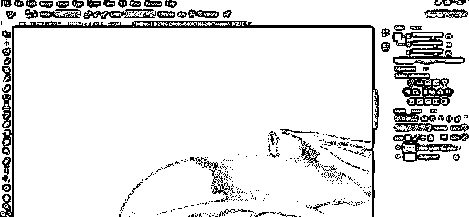

### 结论–颜色替换工具 Photoshop

看完这篇文章，你就可以轻松了解 Photoshop 的颜色替换工具的所有特性了。现在，您可以使用这个工具来提高项目的质量，并在这个颜色替换工具的帮助下，在工作中获得越来越多的好处。

### 推荐文章

这是一个 Photoshop 中颜色替换工具的指南。在这里，我们讨论了颜色替换工具 Photoshop 在 easy and simple basic 中的使用。您也可以浏览我们的其他相关文章，了解更多信息——

1.  [After Effects 中木偶工具介绍](https://www.educba.com/puppet-tool-in-after-effects/)
2.  [在 Photoshop 中创建运动效果的步骤](https://www.educba.com/motion-effect-in-photoshop/)
3.  [Illustrator 中的探路者工具入门](https://www.educba.com/pathfinder-tool-in-illustrator/)
4.  [使用 Illustrator 中的选择工具](https://www.educba.com/selection-tool-in-illustrator/)
5.  [Photoshop 混合笔刷工具](https://www.educba.com/photoshop-mixer-brush-tool/)

