# Photoshop 中的橡皮擦工具

> 原文：<https://www.educba.com/eraser-tool-in-photoshop/>

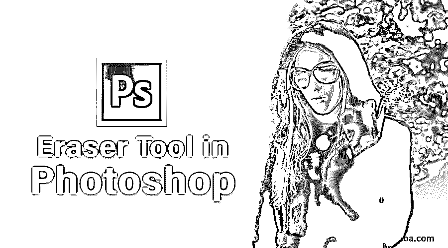

## Photoshop 中橡皮擦工具介绍

在本文中，我们将学习 Photoshop 中的橡皮擦工具。众所周知，Photoshop 是一款专业的图像编辑工具，可用于宣传册、杂志制作、个人照片编辑、工作室级编辑等多个项目。它有一系列很棒的工具来做到这一点。今天，我们将学习 Photoshop 中的擦除工具。撤销时，最后的编辑被完全删除，但是我们需要部分编辑保留在图像中；然后，我们可以根据输出的要求，使用这种擦除来从帧中删除次要或小的事物或降低对象的不透明度。

### 在 Photoshop 中使用橡皮擦工具

“E”是启用擦除工具的热键。它也可以在工具箱中找到。选择“擦除工具”后，应用程序工具栏上会显示多个其他属性，它们是:

<small>3D 动画、建模、仿真、游戏开发&其他</small>

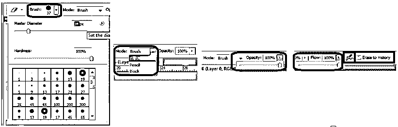

*   **刷子:**这包括不同形状的刷子、尺寸可调性、边缘硬度和各种其他风格。画笔中的所有内容都可以根据需要随时更改。
*   **模式:**有 3 种模式，分别是(1)笔刷(软边)、(2)铅笔(硬边)和(3)方块(方形笔刷大小)。根据要求，我们可以采用这种模式。
*   **不透明度:**默认情况下，擦除工具的不透明度范围是 100%,这将删除整个图像，并使图像透明或显示图层面板中的下层图像。根据需要，不透明度可以在任何时间点改变。最常用的不透明度范围是 50%，20%，30%，并且基于我们想要部分去除的颜色。
*   **Flow:** 它有助于了解擦除从一个角移动到另一个角的像素数的适用性。基于百分比范围设置的级别，效果会相应地应用。该选项仅适用于笔刷模式。
*   **喷枪:**此选项帮助擦除工具清除移动的像素，使画笔移动区域的像素没有残留痕迹，从而获得平滑的效果。该选项仅适用于笔刷模式。
*   **擦除至历史:**当擦除工具激活时，我们可以通过启用该选项来查看图像。启用后，擦除属性将不会应用于我们正在处理的图像。

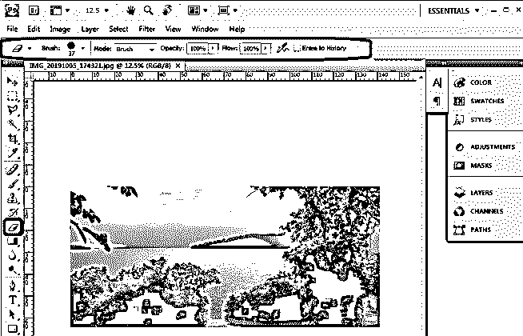

### Photoshop 中不同的橡皮擦工具

下面是 photoshop 中三种不同的橡皮擦工具:

*   橡皮擦工具
*   魔力橡皮工具
*   背景橡皮擦工具

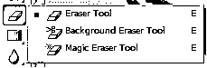

#### 1.橡皮擦工具

这是在 Photoshop 中使用橡皮擦删除图像中不需要的像素的常规或默认过程。在擦除图像部分时，它变得透明，并且画笔移动区域上的像素将被移除。通过这样做，如果我们有多个图层，可以显示背景图像，在需要的地方使图像透明，可以将不需要的小部分或大部分对象从图像中移除，并使用小丑图章工具或其他图像来覆盖它。

所有为杂志制作、社论制作、日历制作、封面、小册子、横幅等工作的专业 Photoshop 美工都使用这种方法。

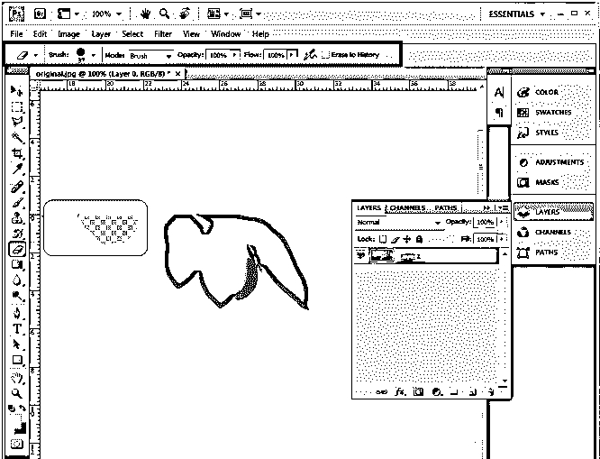

#### 2.魔术橡皮擦工具

当需要移除相同公差颜色的像素时，使用魔术工具。在下图中，启用魔术擦除工具后，如图所示,“笔刷”选项旁边的“公差选项设置”选项可用。通过选择工具移除的颜色，可以根据容差选择这些部分，并对其进行编辑或擦除。此工具提供了精确的选择，并有各种选项来选择和修改区域。

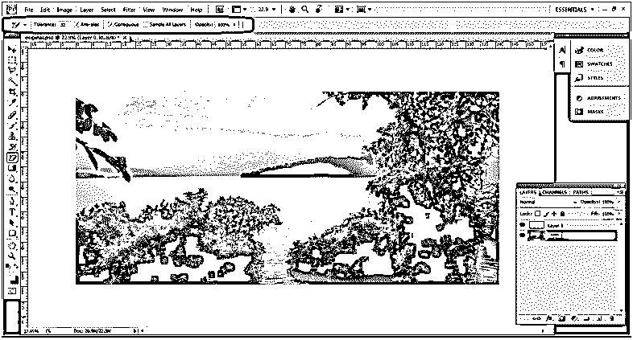

*   **容差:**每幅图像的容差范围可以从 0 到 255，这两个值非常接近。
*   **抗锯齿:**给魔术擦除工具选择的图像的完整部分一个平滑的边缘。
*   **邻接:**需要连接在一起工作的区域启用邻接。

我们可以通过使用键盘上的 Shift 和 Alt 键来添加和删除选择。

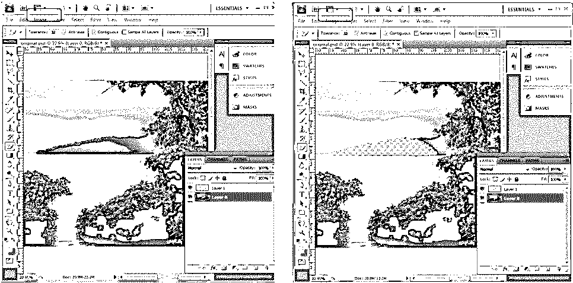

#### 3.背景橡皮擦工具

此工具专门用于根据需要将背景更改为纯色或使背景对图像和图层透明。选择图像后，需要选择这个工具；笔刷属性可以通过点击顶部的笔刷图标来改变，或者我们也可以使用左方括号来减小笔刷的大小，右方括号来增加大小。它使用户快速工作。

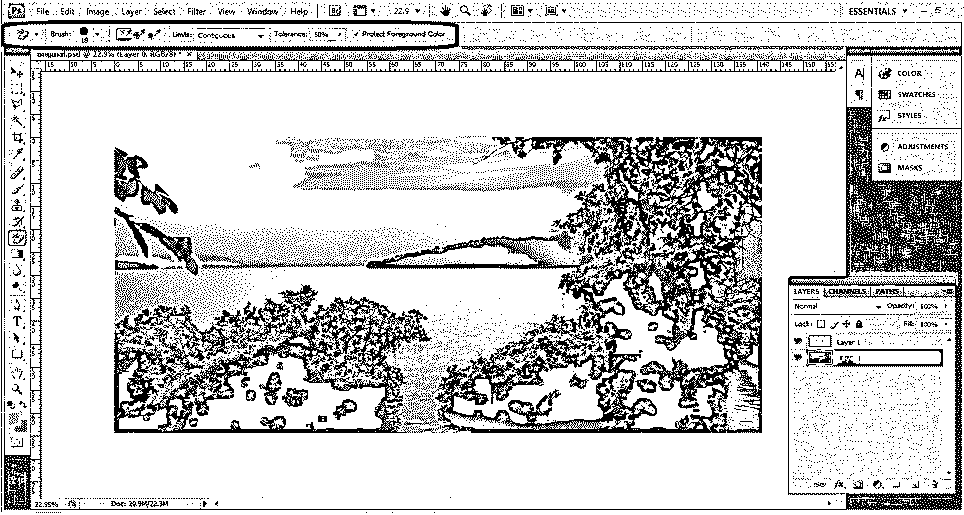

**画笔:**尺寸硬度、间距、角度等属性。，可以根据需要进行配置。

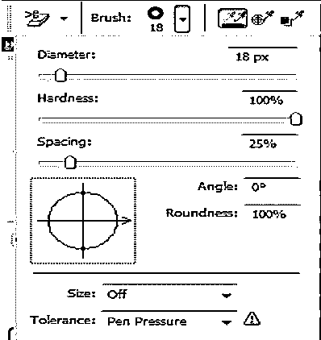

**采样:**采样有 3 种模式，常用的一种是连续，多一些是一次和后台切换。根据需要，我们可以在它们之间切换。

**极限:**极限有 3 种类型，即不连续、连续和精细边缘。

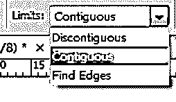

**容差:**这是一个基于“%”的编辑低容差，需要笔刷多次重复才能紧凑地去除背景色。高容差会快速移除背景颜色，但会将其调整到所需的级别，以避免图像的微小细节丢失。

**保护前景色:**可以在去除图像背景色的同时使用全不透明度，这种方法用于使用绿色垫和黑色垫的电视演播室、电影和 VFX。

**原始图像**

**编辑前**

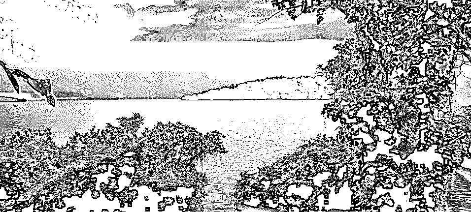

**使用擦除工具后**

### 结论

专业人士使用橡皮擦工具进行编辑，这是可能的，因为该工具在 Photoshop 中可用；不需要额外的附件或应用程序。它可用于定制项目所需的图像。图像的所有大到小的校正都可以完成。Adobe systems 了解实时项目需求的要求，并根据需要更新工具以方便用户。

### 推荐文章

这是 Photoshop 中橡皮擦工具的使用指南。这里我们讨论如何使用橡皮擦工具和 photoshop 中不同的橡皮擦工具。您也可以浏览我们的其他相关文章，了解更多信息——

1.  [Photoshop 中的套索工具](https://www.educba.com/lasso-tool-in-photoshop/)
2.  [Adobe Photoshop 中的铅笔工具？](https://www.educba.com/pencil-tool-in-photoshop/)
3.  [Photoshop 中的涂抹工具](https://www.educba.com/smudge-tool-in-photoshop/)
4.  [Photoshop 中的海绵工具](https://www.educba.com/sponge-tool-in-photoshop/)

