# Photoshop 中的金属文字效果

> 原文：<https://www.educba.com/metal-text-effect-in-photoshop/>

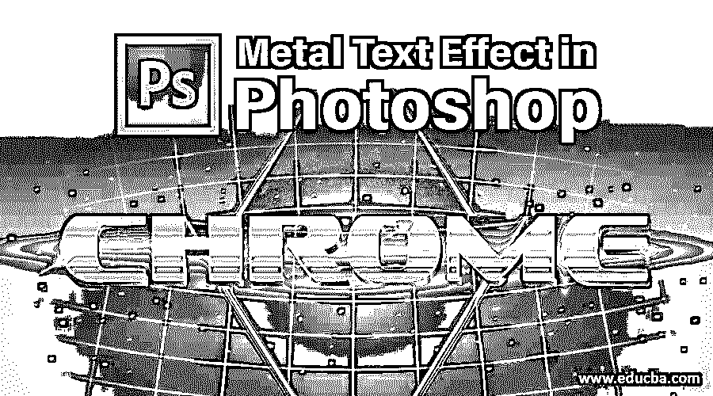

## Photoshop 软件介绍

*   这是一个图形和图像编辑软件；这个软件可以用光栅形式而不是矢量形式编辑你的图像。该软件不仅用于图像编辑，还用于创建完整的数字艺术。该软件可以编辑和创建多层图像，并支持蒙版和阿尔法合成。它还提供了几种颜色模式，如 RGB、CMYK、CIELAB、专色和双色调。PhotoShop 只能在中创建和编辑其文档。私营部门司和。PSB 文件格式。
*   在 2002 年 10 月之前，Photoshop 的命名是基于版本号的。但在引入 Creative Suite branding 之后，每个新版本名称都被指定了 CS 和一个数字；比如 Photoshop 第八版定为 CS，第九版定为 CS2。所以我们有一个从 CS 到 CS6 的版本。在 2013 年 6 月推出 Creative Cloud 品牌后，每个新版本名称都以 CC 和年份命名。我们有 Photoshop CC 到 Photoshop CC 2019 的版本。与以前的版本相比，每个新版本都有一些额外的功能。Photoshop 的当前版本是 Photoshop Mix。
*   Photoshop 有许多功能，如钢笔工具、克隆图章工具、形状工具、测量和导航工具、选择工具、裁剪、切片、移动、选框、套索、魔杖、橡皮擦、视频编辑、3D 挤压、移动集成、camera raw、3D 打印工具、[颜色替换工具](https://www.educba.com/color-replacement-tool-in-photoshop/)等。

### 如何在 Photoshop 中制作金属文字效果？

但是，这里我们的重点区域是解释 Photoshop 中的金属文字效果。下面是在 Photoshop 中创建金属文字效果的步骤:

**第一步:**点击 Photoshop 图标新建一个文档。

<small>3D 动画、建模、仿真、游戏开发&其他</small>

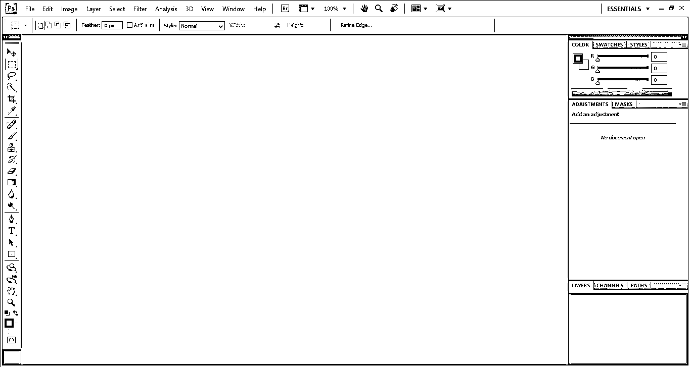

**第二步:**点击左上角的文件选项，新建一个文档。将出现一个对话框，从对话框中选择一个新的文件选项。根据您的要求，将出现一个弹出窗口来选择宽度、高度、分辨率和颜色模式。保持背景内容为白色。

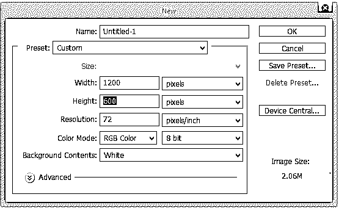

第三步:按下键盘上的 **D** 。如果需要的话，这将把前景色和背景色重置为默认值，这将把背景色设置为黑色。之后，按 Alt+ Backspace 将背景色填充为黑色。

**第四步:**点击屏幕左下角(第二个图标)的新建图层选项，添加一个空白图层。这将增加一个空白层以上的背景层名称作为层 1。

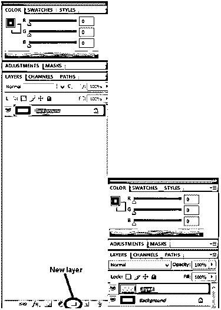

**第五步:**现在，我们需要用灰色填充图层 1。为此，单击屏幕左上角的编辑选项。然后从显示的窗口中选择填充选项。我们也可以按 Shift+F5 作为快捷方式。将出现一个弹出窗口，询问用户所需的颜色。点击颜色，会出现一种颜色。键入灰色的 RGB 代码 195、195、195，然后单击确定。图层 1 将被填充为灰色。

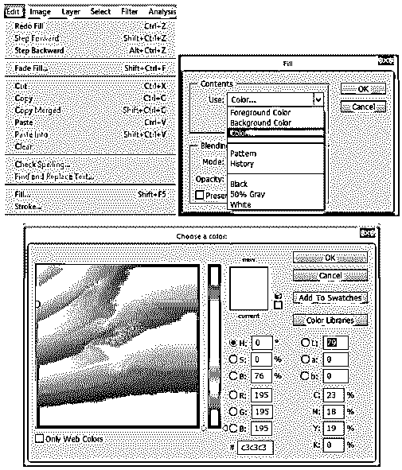

**第六步:**现在，下一步就是添加噪点。为此，点击工具栏中的过滤器菜单，然后从选项>中选择噪声添加噪声。将“数量”选择为 151 %，以便为文档提供大量噪波。检查分布应该是高斯的，单色也是勾选的，然后单击确定。

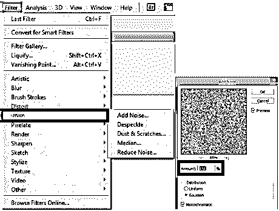

第七步:我们需要做运动模糊来给图像提供纹理。为此，点击过滤器>模糊>运动模糊。根据您的要求从-10%到-20 %选择角度，距离为 200 像素。使用运动模糊将提供如下所示的金属刷效果。

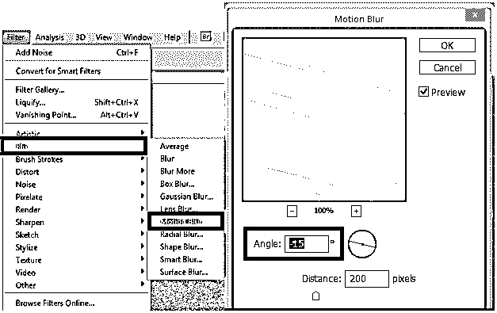

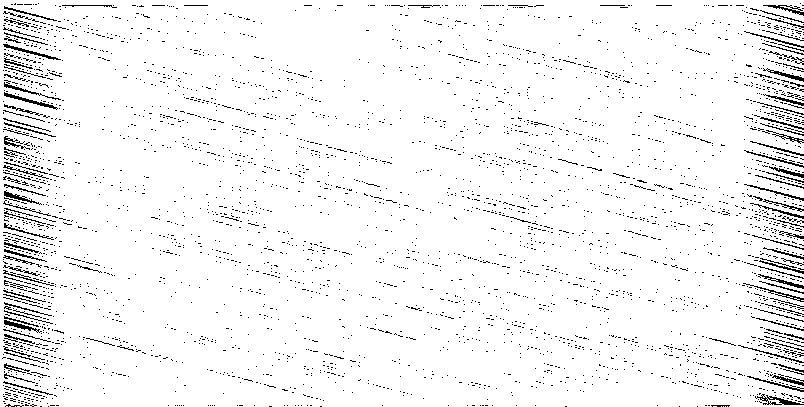

**步骤 8:** 运动模糊无法模糊边缘周围的图像，如上图。为了消除这一点，我们必须裁剪图像的边缘。为此，[选择裁剪工具](https://www.educba.com/crop-tool-in-photoshop/)，然后从图像好的部分开始点击左上角。然后将鼠标拖动到图像好的部分结束的右下角。单击确定。

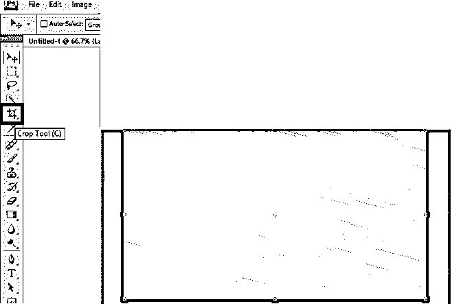

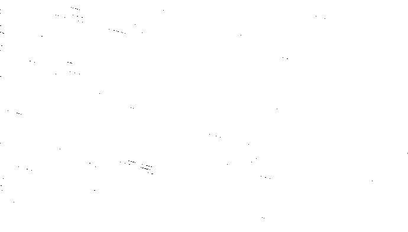

步骤 9: 现在，下一个任务是给图片添加文字。为此，选择文本 **T** 工具，然后选择所需字体。之后，在所需位置键入文本。写完文本后，单击文本框左上角的复选标记。

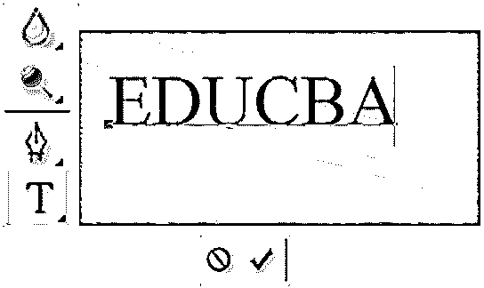

第十步:你的文字可能太小，在屏幕上看不清。要增加字体大小，请从“编辑”菜单中选择“自由变形”工具。若要调整文本大小，请按住 Shift 键并拖动任意角，保持纵横比不变。要移动文本，请单击边框内的任意位置并拖动它。编辑文本后按 enter 键。

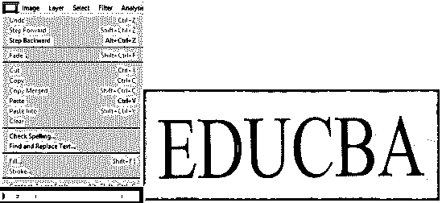

**步骤 11:** 现在将文字层移动到纹理层下面。要做到这一点，点击图层面板中的文本层，并向下拖动它。

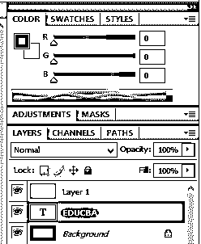

**步骤 12:** 制作图层 1 作为文字图层的剪贴蒙版。为此，右键单击图层 1，并从菜单栏中选择创建剪辑蒙版。选择它层 1 现在已经剪辑在文字层，如下所示。我们可以检查灰色将只在文本内部。

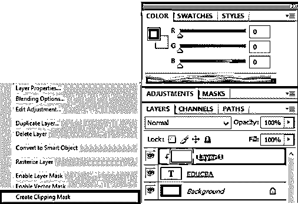

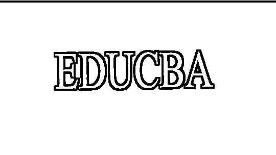

步骤 13: 我们必须添加斜面和浮雕图层样式。为此，选择文本层并点击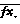

to add a layer style. A dialog box will appear; select Bevel and Emboss from the box. A pop will appear in select style as Inner Bevel, technique as Chisel Hard, depth as 500%, and size as 7 px. Now click on Glass contour and change its style as the ring. Tick mark on Anti-aliased option. Click okay to finish this command.

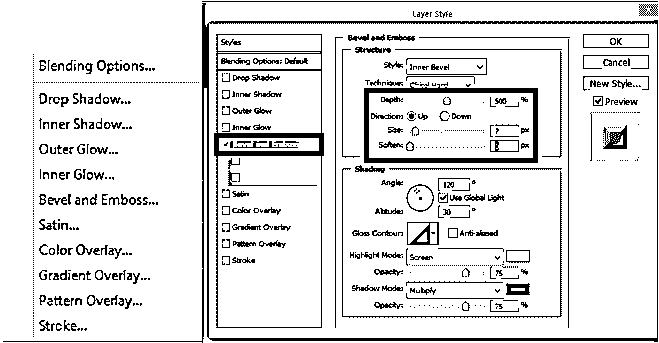

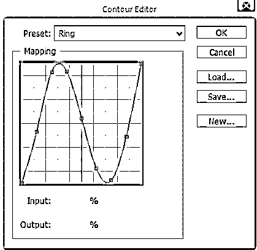

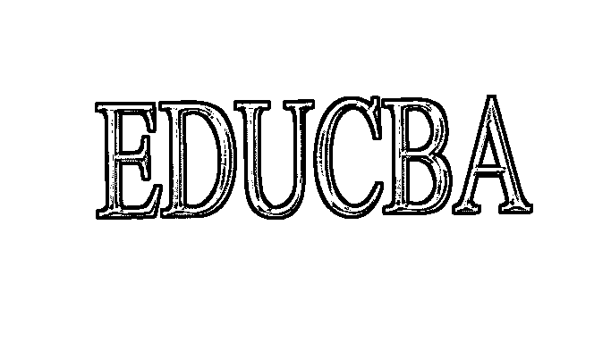

步骤 14: 下一步是给图像添加渐变叠加图层样式。现在从图层菜单工具栏中选择渐变叠加样式。将出现一个弹出窗口，询问用户混合模式、不透明度、渐变、样式、角度和比例。默认情况下，根据当前的前景和背景颜色选择正确的渐变，但如果选择了其他渐变，请选择正确的颜色。选择混合模式为叠加，不透明度为 70%。这将增加文本的初始光照效果。单击确定。效果现在已添加到图像中。

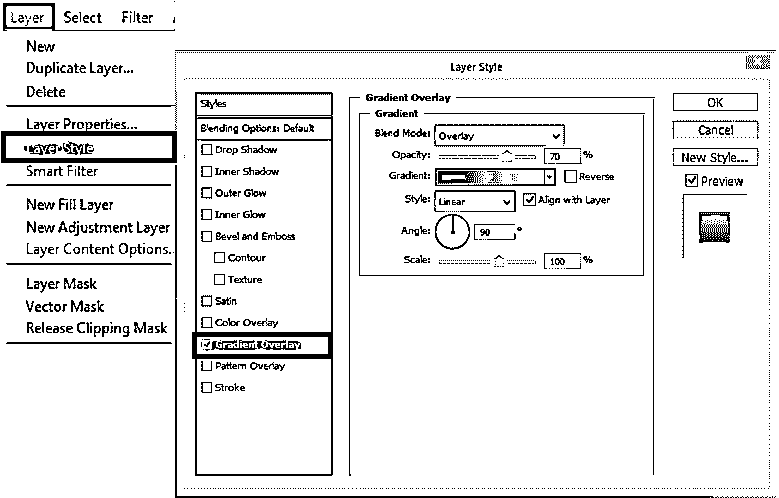

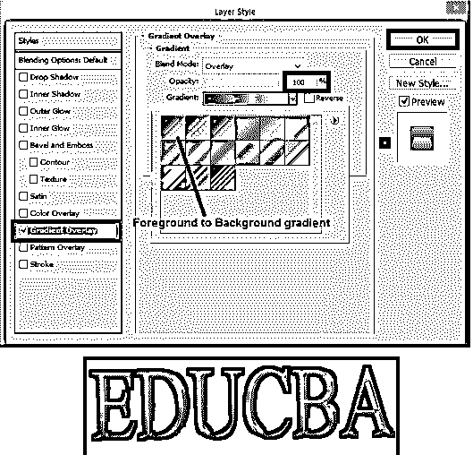

步骤 15: 接下来，我们要添加一个新的图层设置为叠加混合模式。要做到这一点，点击层 1，并按住 ALT 键。然后选择新建图层选项，会出现一个弹出窗口，询问颜色、模式和不透明度。勾选选项，使用前一层创建一个剪贴蒙版，模式为叠加，不透明度 100 %。点击确定一个新的层将出现。

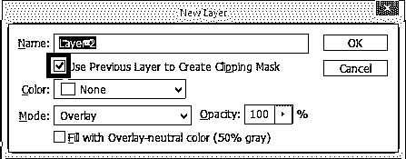

**第十六步:**我们可以给金属效果添加一些随机的高光和阴影。为此，选择过滤器>渲染>云。这将产生许多明亮和黑暗的区域。

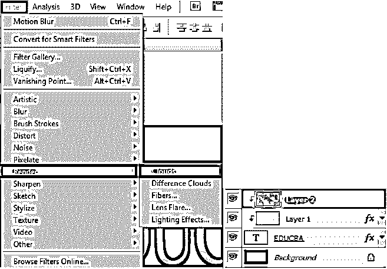

**步骤 17:** 上一步创建的云需要进行平滑处理，使其更加高亮和阴影化。这可以通过模糊它来实现。为此，点击滤镜>模糊>高斯模糊。将出现一个设置像素为 10 的弹出窗口。然后单击确定。一个新的外观将出现如下所示。

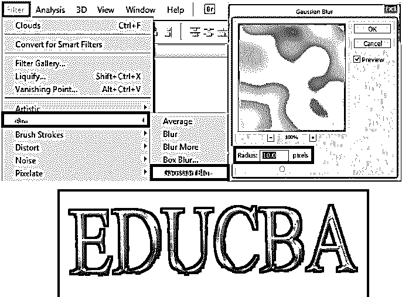

步骤 18: 现在，我们要添加一个新的图层设置为混合模式。为此，遵循与步骤 14 相同的步骤。再次，孔 ALT 键，并点击添加新层。选择使用上一层创建剪贴蒙版，模式为叠加，并勾选填充叠加中性色(白色)。单击确定。

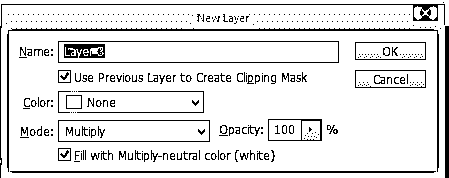

现在，为了给图像添加一些粗糙感，我们必须给它添加一些灰尘或划痕。这可以通过添加噪声来实现。按照与步骤 6 相同的步骤添加噪波。最终图像将如下所示。

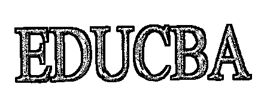

**步骤 20:** 看图像，现在是污垢和划痕的形式；我们必须应用中值滤波器。要应用这个，点击过滤器>噪声>中值。将出现一个弹出窗口，要求调整半径。尝试拖动半径底部的光标进行调整。大约 10 的值将提供良好的效果。单击确定。最终图像将如下所示。

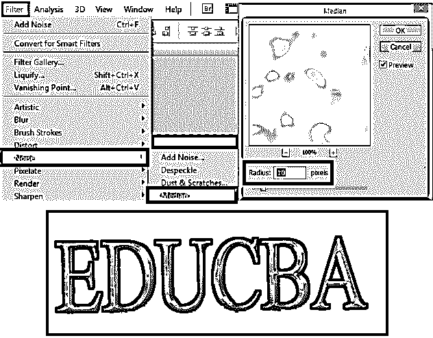

**步骤 21:** 如果污垢和划痕的效果看起来太暗，我们可以改变图层不透明度来调整。现在，不透明度调整为 70%，如下图所示。最终的图像将如下所示。

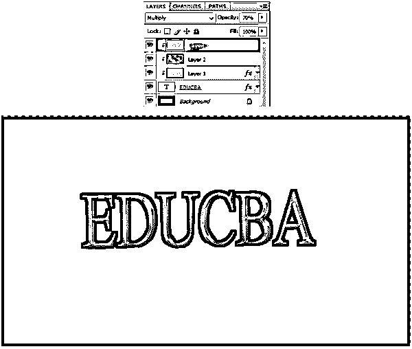

以上是我们在 Photoshop 中创建金属文字效果需要遵循的步骤。

### 推荐文章

这是 Photoshop 中金属文字效果的指南。在这里，我们讨论了在 photoshop 中创建金属文字效果的一步一步的过程。您也可以浏览我们的其他相关文章，了解更多信息——

1.  [补丁工具到底是用来做什么的？](https://www.educba.com/patch-tool-in-photoshop/)
2.  [如何在 Adobe Illustrator 中设计一个 Logo？](https://www.educba.com/logo-design-in-illustrator/)
3.  [什么是 After Effects 中的 Logo 动画？](https://www.educba.com/logo-animation-in-after-effects/)
4.  [后效背景介绍](https://www.educba.com/background-in-after-effects/)
5.  [Illustrator 中的模糊](https://www.educba.com/blur-in-illustrator/)
6.  [特效后文本](https://www.educba.com/text-in-after-effects/)
7.  [业内四大最佳视频编辑软件](https://www.educba.com/best-editing-software/)
8.  [Adobe 编辑软件指南](https://www.educba.com/adobe-editing-softwares/)

