# Photoshop 中的智能对象

> 原文：<https://www.educba.com/smart-objects-in-photoshop/>

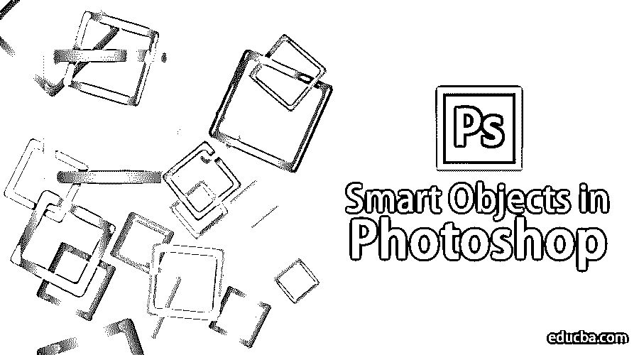

## Adobe Photoshop 中智能对象的介绍

Adobe Photoshop 是一个庞大的照片编辑程序，由数以千计的工具和功能组成，具有交互式和简单的方法。即使是现在的学生也知道如何使用 Photoshop。技术和技能已经走了很长的路，并且每天都在发展和增长。因此，Adobe Photoshop 是编辑、业余爱好者、创意设计师、时装设计师甚至是新人最需要的程序。

Adobe Photoshop 的功能之一就是使用智能对象。这个主题初看起来可能很复杂，但是当我们深入了解细节时，我们会发现智能对象在很大程度上帮助了设计师，简化了软件的工作。智能对象只是以光栅或矢量图像的形式存储数据和信息的任何层，但本质上是非破坏性的。因此，任何可以无限制地编辑和修改无数次而不会损失图像质量或像素化的东西都是智能对象层。

<small>3D 动画、建模、仿真、游戏开发&其他</small>

### 如何在 Photoshop 中使用智能对象？

在 Photoshop 中，我们有两种类型的智能对象。一个是嵌入式，一个是链接式。虽然两者都很有用，并且有一些独特的功能，但它们有时也会在创建智能对象时造成限制。

以下示例将显示如何创建和使用智能对象。

**第一步:**打开 **Photoshop** ，放置如下图所示的图像。

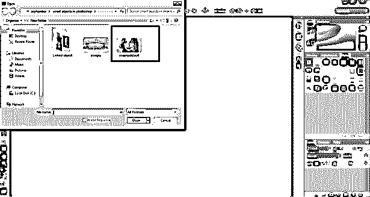

**第二步:**通过按下 **Alt 命令**创建一个相同图像的副本。

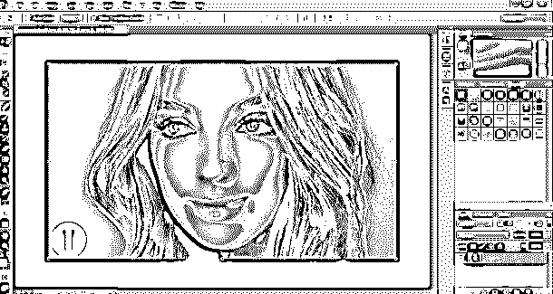

**第三步:**并点击同一图层。

**步骤 4:** 右键点击图层，点击将该图层转换为智能对象。这将创建一个图像的智能层。

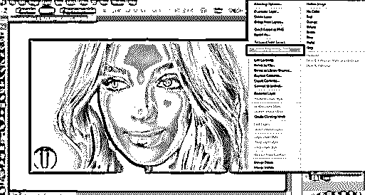

**第五步:**现在，点击字母 **C** 增加画布大小，如图所示。

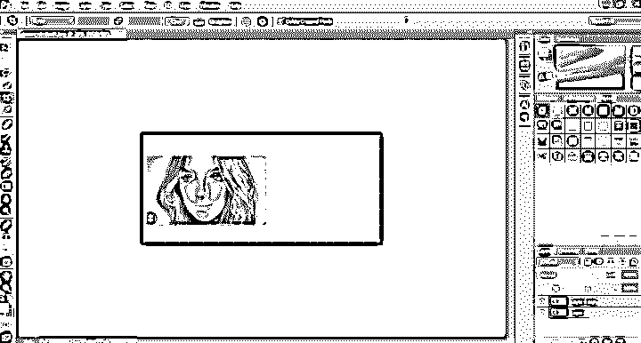

**第六步:**将智能对象放在右边，栅格图层放在左边。

**第七步:**选择两个图层，同样变换为原始大小的 20%。

**第八步:**再次将两个图层都变换为原始大小的 100%。

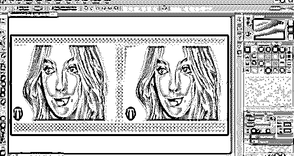

**第九步:**会显示左边的图像已经像素化，失去了原来的内容，而智能对象层保持完整，保留了原来的内容。

*   因此，当普通栅格图层被转换时，它会被像素化并失去其原始性，而如果它被用作智能对象，它会保留其原始性。这个例子帮助我们理解如何用更简单的选项和工具选择来创建和转换智能对象。

### Photoshop 中智能对象的优点和局限性

智能对象的一些优点和局限性是:

*   智能对象也可以用于矢量图形，并且信息(如 Illustrator 或 Corel 绘图文件)可以作为智能对象放入 Photoshop 中，而无需栅格化图稿。
*   智能对象帮助用户应用非破坏性的滤镜和效果。可以使用智能过滤器随时编辑这些过滤器。
*   链接的智能对象非常有用，当只编辑一个对象时，它们可以编辑所有链接的智能对象。
*   智能对象最重要的优点是它有助于使用非破坏性变换技术编辑图像。我们可以缩放、旋转、变换甚至应用任何在任何时候都是可逆的效果或滤镜。
*   在编辑一组像素或像素数据时，这些智能对象会受到限制。我们需要首先栅格化图像内容，以应用绘画，画笔或燃烧效果。因此，智能对象在使用像素进行编辑的情况下是不可用的。

### 如何在 Photoshop 中链接智能对象？

如前所述，Photoshop 中有两种类型的智能对象。嵌入和链接。当我们在画布上放置一个普通图像并将其转换为智能对象时，它会将自身转换为嵌入图像。在 Photoshop 中编辑时，这种类型的智能对象不会更改其原始数据或内容。而当我们放置一个链接的智能对象时，图像的原始内容会发生变化。

下面给出了一个展示如何链接智能对象的示例

**第一步:**打开 **Photoshop** ，默认 Photoshop 尺寸。

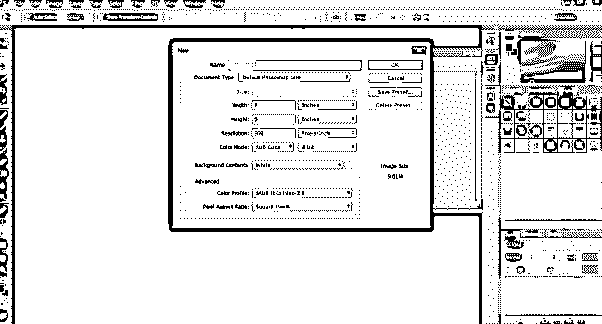

**第二步:**使用文字工具，在画布上写下学历。

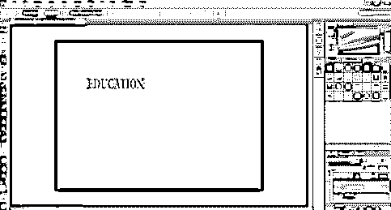

**第三步:**按下 **C** ，根据图片中的文字调整画布大小。

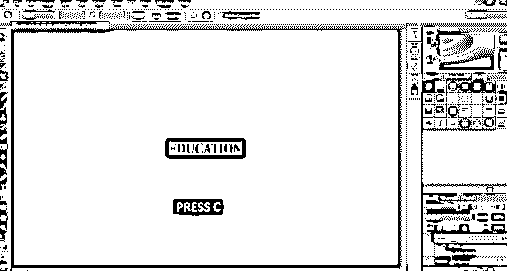

**第四步:**赋予文本颜色，选择**转换为智能对象**选项。

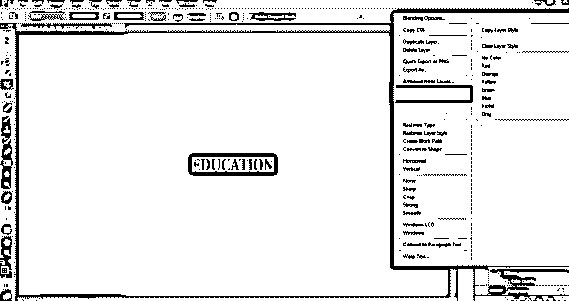

**第五步:**进入 Windows，点击**属性**。

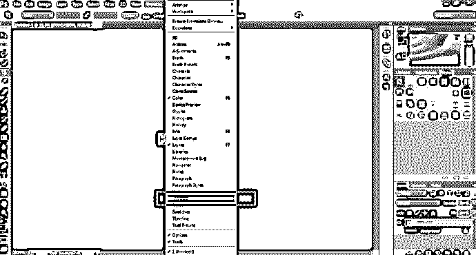

**步骤 6:** 使用此面板，点击面板上的**转换为链接**，如图所示。

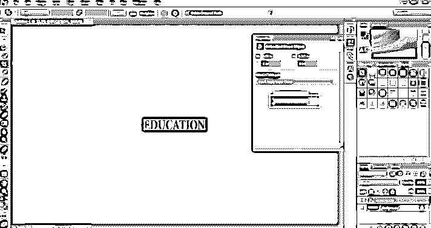

**第七步:**将文件保存在。 **PSD 格式。**

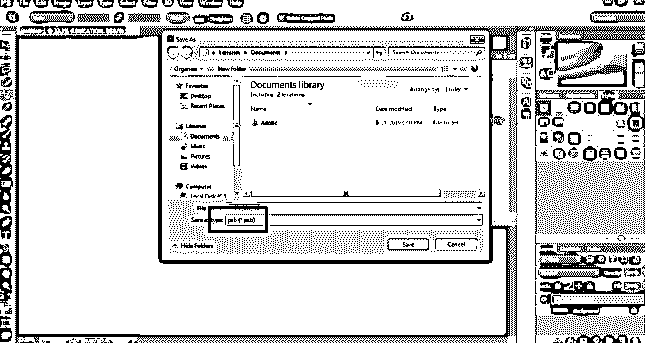

**第八步:**现在，打开另一张图片，如下图所示。

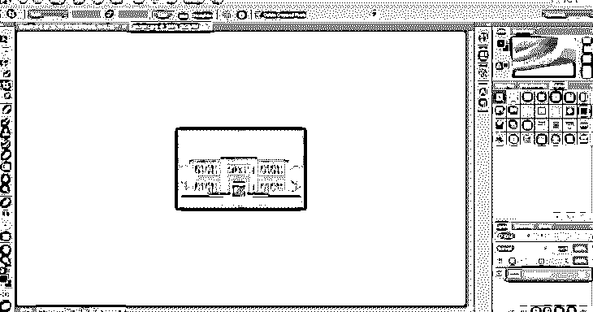

**步骤 9:** 将**教育**智能物体放在这张图片上。

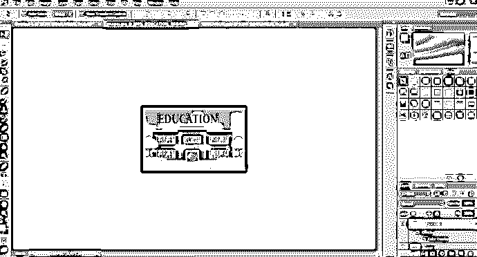

**第十步:**现在，打开教育智能对象，尝试改变文字的颜色。

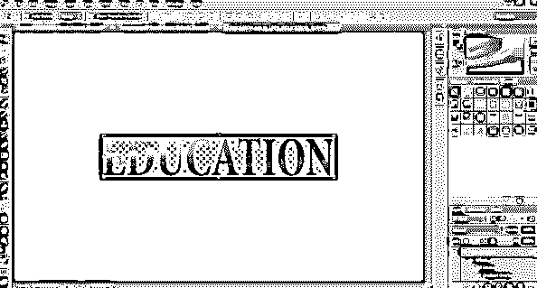

**步骤 11:** 一旦您保存了这个修改过的、链接的智能对象，您将会看到教育智能对象在另一个图像上也发生了变化。

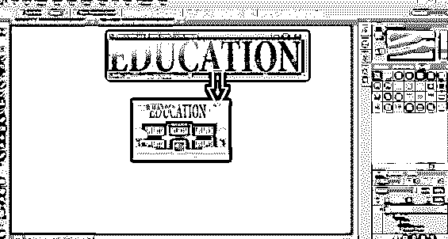

这表明，只要编辑其中一个智能对象，就可以同时编辑任何链接的智能对象。

### 结论

这是关于使用和创建智能对象的简要信息。利用这些例子和理论，我们可以很容易地学习和理解智能物体及其功能。这里还列出了一些优点和缺点，以便进行详细的概述。

### 推荐文章

这是 Photoshop 中智能对象的指南。这里我们讨论基本概念，如何在 photoshop 中创建智能对象，以及智能对象的好处和局限性。您也可以浏览我们的其他相关文章，了解更多信息——

1.  [什么是 Adobe Creative Cloud？](https://www.educba.com/what-is-adobe-creative-cloud/)
2.  [Adobe Photoshop 替代品](https://www.educba.com/adobe-photoshop-alternatives/)
3.  [Adobe Photoshop](https://www.educba.com/adobe-photoshop/)
4.  [Adobe Photoshop Elements 工具](https://www.educba.com/adobe-photoshop-element-tools/)

