# Photoshop 中的 3D 文本

> 原文：<https://www.educba.com/3d-text-in-photoshop/>

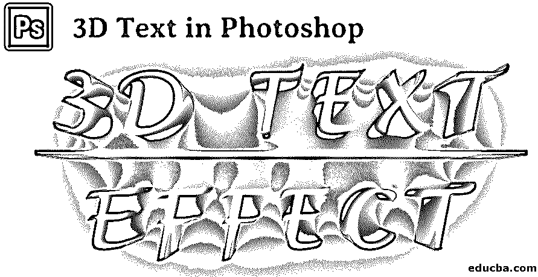

## Photoshop 中的 3D 文本简介

Photoshop 是一个令人惊叹的设计软件，在 Photoshop 中玩 3D 文本也很有趣。3D 文本为您的文本提供了三维视图和真实感。在 3D 文本教程中，您将学习不同的格式、形状、调整和对齐 3D 文本。在这里，你将和我一起以一种非常简单有趣的方式来看看“如何在 Photoshop 中创建 3D 文本”。在本练习中，您将拥有最低 CS6 版本的 Photoshop，并且使用 CC 版本将获得最佳效果。

### 在 Photoshop 中创建 3D 文本的步骤

让我们从冷静的头脑开始，在工作中感受乐趣。

<small>3D 动画、建模、仿真、游戏开发&其他</small>

**步骤 1:** 进入文件选项，点击新建。

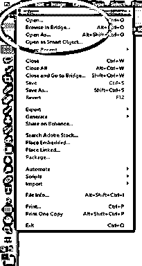

按照上面的步骤，我们将在工作区中打开一个对话框。我将页面宽度设置为 1200 像素，高度设置为 700 像素，分辨率设置为 200 像素，这样在这个对话框中可以获得最好的效果。我将为我的文档背景选择白色；你可以根据你的文字选择任何颜色。

在这里，您还可以为不同的目的设置颜色模式，即 RGB 或 CMYK。点击对话框中的创建按钮，设置这些测量值。

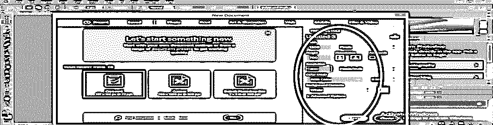

第二步:进入工具面板，在这里我们将从工具栏中选择文本工具。

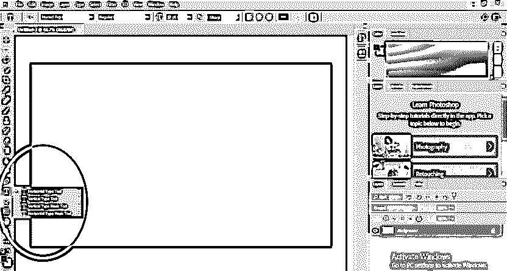

我将输入“3D TEXT”作为我的 3D 效果文本，并点击右上角的 OK，如上图所示。为了给你的文字最好的 3D 效果，最好是像我一样使用大写字母。您可以根据自己的文本属性来调整文本的大小，即工作区右上角的“切换字符&段落面板”选项。

点击这个选项后，会有一个对话框；现在，我将调整我的文本大小，并删除文本之间的间隙，以获得更好的外观；你可以根据你的设定，按住鼠标右键，在中心拖动，就可以把它拿在中心。

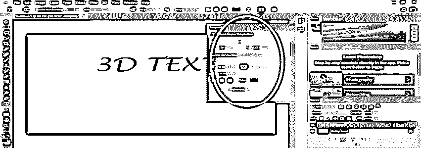

我将通过矩形工具在我的文本下方添加下划线，以使我的文本有效，并根据我之前的文本编写另一个文本，即“效果”，并按照与之前文本相同的步骤管理其大小和文本间距。

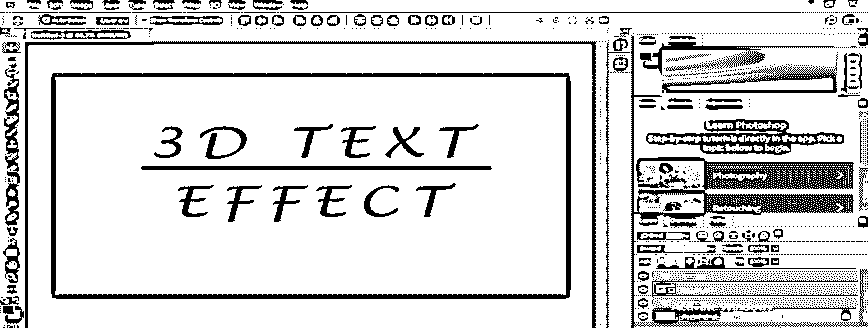

**第三步:**现在，我们要和图层一起工作。

在我们当前的工作空间中有四层，即 3D 文本层，矩形 1 层，效果层和背景层。

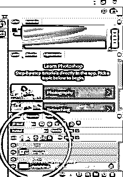

我们将使用工具面板中的移动工具将三层文本居中对齐。

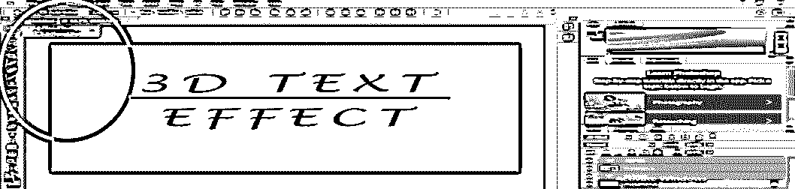

图层结果。

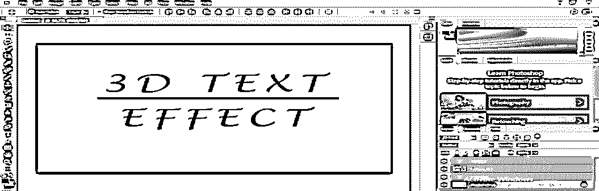

**第四步:**转换为形状，合并图层。

要将文本转换成形状，右击“3D 文本层”并点击“转换成形状”选项。我们将对效果层做同样的处理。

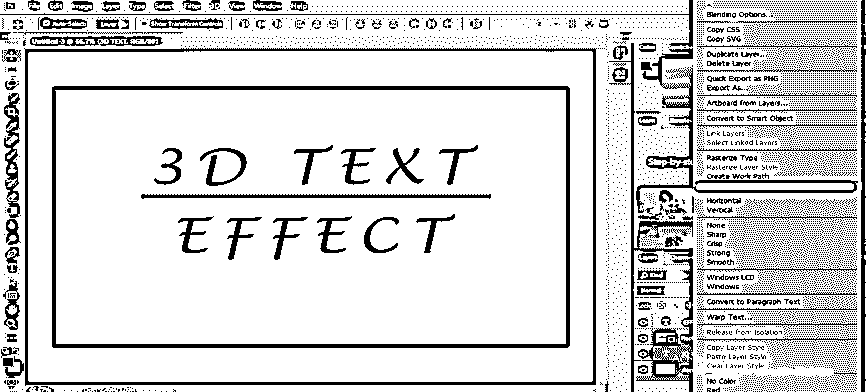

现在我将通过选择它们来合并上面的三层。对于选择，单击一个层并按住 Ctrl 键，然后逐个单击另一个两层，然后 Ctrl+E 进行合并。

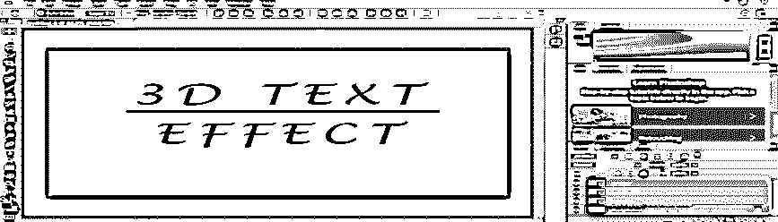

现在我们将有一个新的合并层。

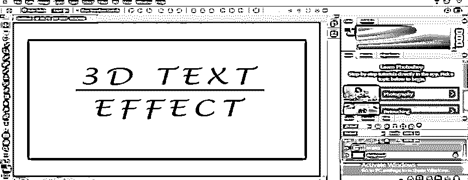

右键点击这个层，并选择“新的三维挤压从选定的层”选项。

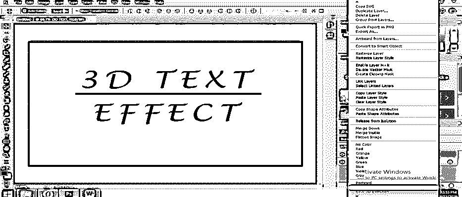

在这一步之后，我们会发现我们的文本转换成三维，并将在我们的工作区有一个三维工作形状。

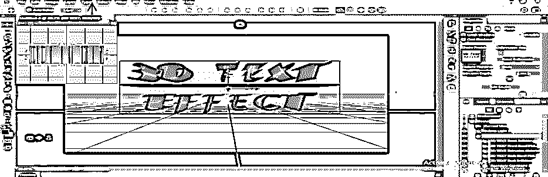

**第五步:**将背景转换成明信片。

在背景层上点击右键，选择明信片选项。

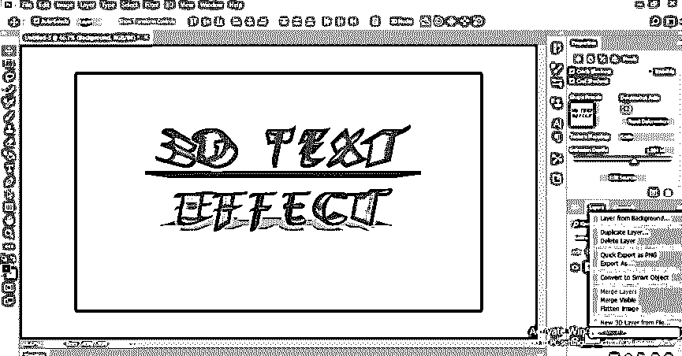

按住 Ctrl 键选择背景层和 3D 文字层，逐个点击，按 Ctrl+E 合并。

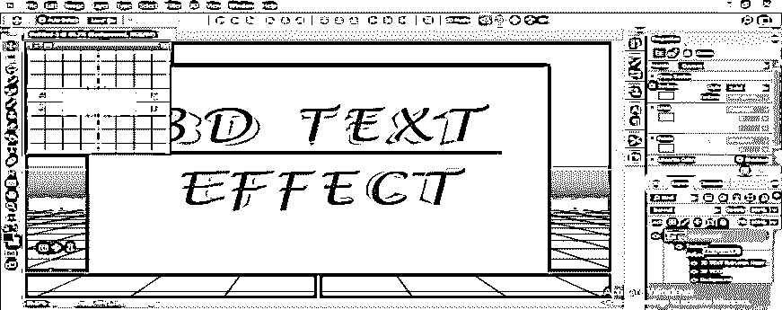

**第六步:**设置 3D 文本的参数。

在右下角的工作区中，我们有三个选项，即 3D、图层和通道。我们可以选择任何选项，只需点击它们来设置参数。

**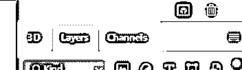

** 

现在点击这些选项中的 3D 选项来设置 3D 文本的参数，点击效果选项，再次点击“效果正面充气材料”。

**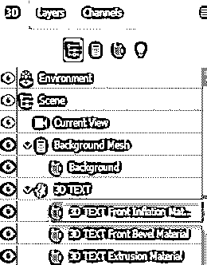

** 

您可以在这里逐个设置 3D 文本的不同参数，以获得更好的效果。在 3D 选项中，我们可以根据自己的用途调整许多效果。

我们将有一个对话框在右上角显示“属性”标题。现在，我将设置一些 3D 文本的值，以便给我们的 3D 文本带来更好的效果。

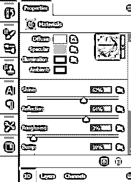

在这里，我将根据我设置光照和反射；你可以随意设定。你也可以通过点击这里的漫射选项来改变文本的颜色，无论你想在你的 3D 文本中做什么。

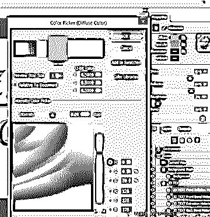

现在这是你最终的 3D 文本效果。

您可以逐步在 3D 文本中使用更多效果，使其看起来更真实。

第七步:渲染你的 3D 文本。

要渲染，只需点击 3D 选项，并选择渲染 3D 层给你的 3D 文本渲染效果。

在这里你可以看到我的 3D 文本渲染的效果看起来很酷。您也可以在自己的 3D 文本中制作这种效果。

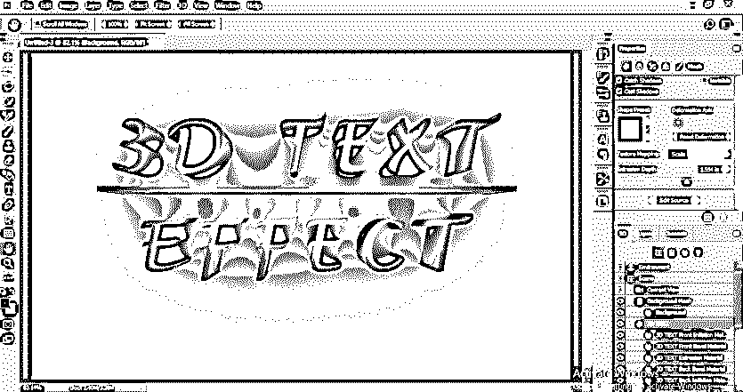

### 结论

现在看看你；按照这 5 个简单的步骤，你可以很容易地在 Photoshop 中制作一个 3D 文本效果，非常有趣。你会发现在 Photoshop 中创建 3D 文本并不难；事实上，这就像是在你的工作空间里玩文字游戏。

### 推荐文章

这是 Photoshop 中的 3D 文本指南。在这里，我们讨论一个基本的概述和步骤，以创造文字在 photoshop 中的插图。您也可以浏览我们的文章，了解更多信息——

1.  [Illustrator 中的 3D 效果](https://www.educba.com/3d-effects-in-illustrator/)
2.  [三维动画软件](https://www.educba.com/3d-animation-software/)
3.  [三维建模软件](https://www.educba.com/3d-modeling-software/)
4.  [后期效果中的 3D 效果](https://www.educba.com/3d-effects-in-after-effects/)

