# Photoshop 中的修补工具

> 原文：<https://www.educba.com/patch-tool-in-photoshop/>

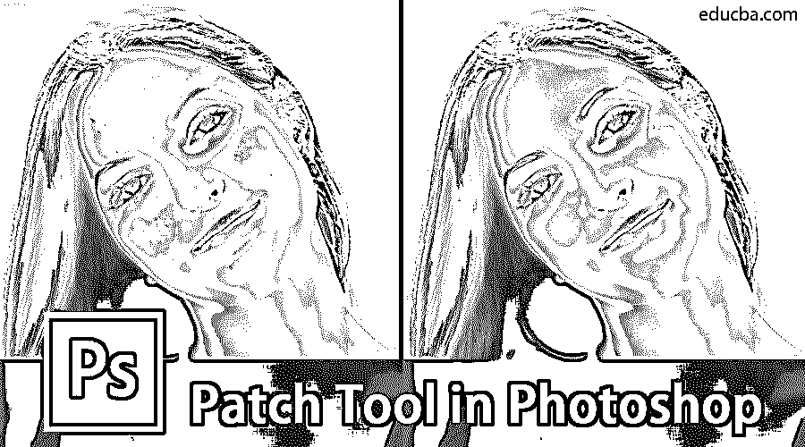

## 补丁工具到底是干什么用的？

修补工具用于修饰或修复损坏的照片。它是作为愈合画笔工具的一部分。您还可以使用它从您的图像中删除组件。它提供了一种有效的方法来修复图像的任何大或小的部分。与[修复画笔工具](https://www.educba.com/healing-brush-tool-in-photoshop/)有相似之处，因为修补工具也将所选区域的颜色、纹理和光照与源相匹配。在这个主题中，我们将学习 Photoshop 中的补丁工具。

不同的是，与画笔不同，它只基于选择工作。修补工具的一个方面是，当您多次使用它时，它会呈现稍微不同的结果。您可以毫不费力地处理图像的较大区域，并获得出色的效果。人们可以使用目标模式和修补工具来克隆或复制照片的一部分。我们将在本文中进一步讨论如何做到这一点。此外，用户还可以使用透明或图案选项。

<small>3D 动画、建模、仿真、游戏开发&其他</small>

尽管其中一些可能不会经常使用，但是知道这个选项还是有好处的。在 Photoshop CS6 发布之前，没有使用修补工具处理空图层的选项。因此，用户必须复制图层，然后处理图像。Photoshop CS6 引入的新功能是内容感知的，当与修补工具结合使用时，效果会更好。因此，修补工具变得比早期版本更加有效和有用。

### 修补工具位于何处？

可以从修复画笔工具下的工具面板中选择修补工具。它排在第三位。

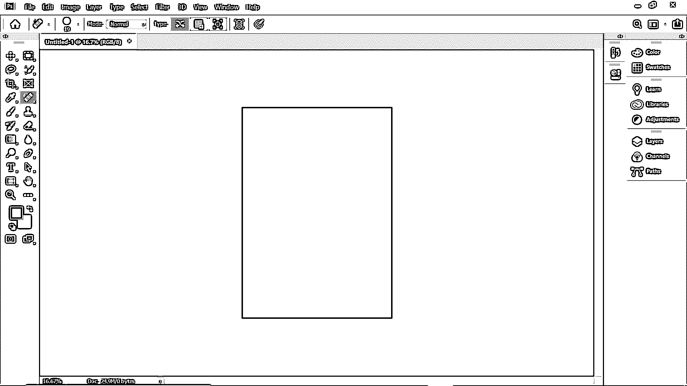

### 修补工具是如何工作的？

1.  首先，你需要在选择了补丁工具之后选择一个区域。如果您已经熟悉套索工具，它的功能与套索工具类似。
2.  接下来，你只需将光标悬停在周围，并将其拖向任何方向。
3.  在选项栏中选择源或目标节点后，您可以在拖动时找到图像的预览。
4.  一旦你松开鼠标，Photoshop 就会以一种与原始照片条件相匹配的方式均匀地混合像素。如果需要取消选择，请使用快捷键:Windows 上的 Ctrl + D 和 Mac 上的 Cmd + D。

你必须小心选择对象，因为即使是一个很小的边界也会对结果产生重大影响。

### 为了从图像中去除不想要的元素

您也可以在正常模式下使用“修补”工具，快速轻松地从图像中删除内容。然而，它并不总是保证百分之百的结果。此外，请确保您没有在原始图层上工作。使用重复的 BG 层或空层。注意:除了修补工具之外，你可以使用任何选择工具来定义一个选择。

下面是一个使用修补工具移除的对象的示例。

**步骤 1:** 导航到文件菜单，选择打开。之后，你会看到一个弹出窗口，如下图所示。

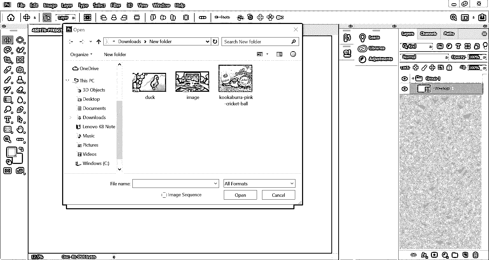

**第二步:**接下来，您必须选择您想要返工的图像

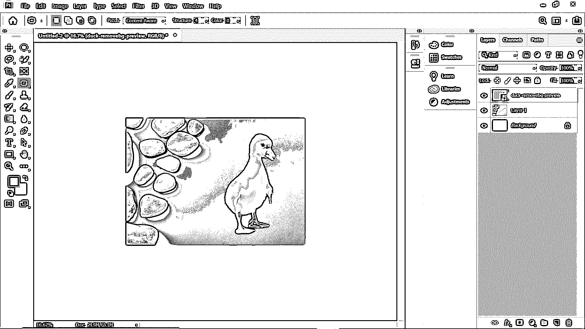

**步骤 3:** 图像打开后，使用修补工具从图像中选择不需要的区域

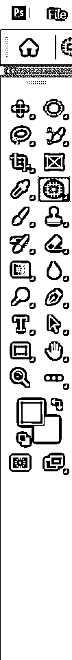

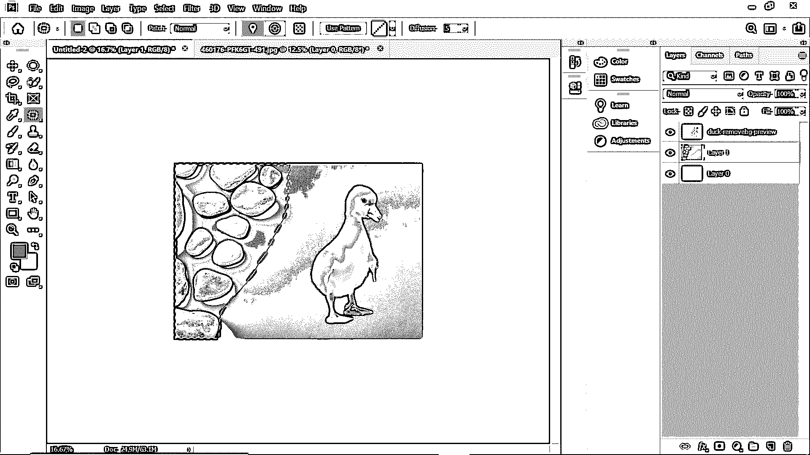

**步骤 4:** 使用补丁工具，移动所选区域，使其与你想要的背景相匹配，如下图所示。

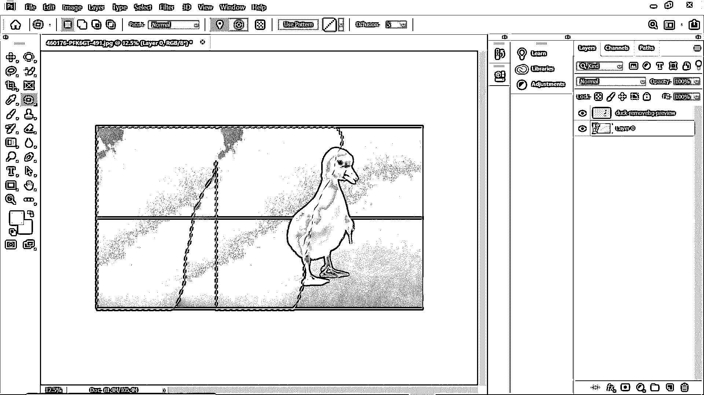

现在你会看到，带有鹅卵石的图像部分已经被完全移除。

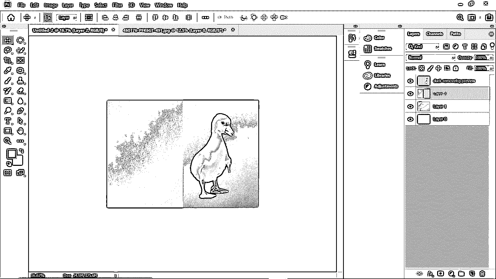

### 克隆图像的一部分

让我们看看如何使用修补工具复制图像的一部分。

在下面的例子中，我们复制了红色的板球，并添加了一个新的。

让我们看一下逐步实现的方法

第一步:在板球周围做一个选择

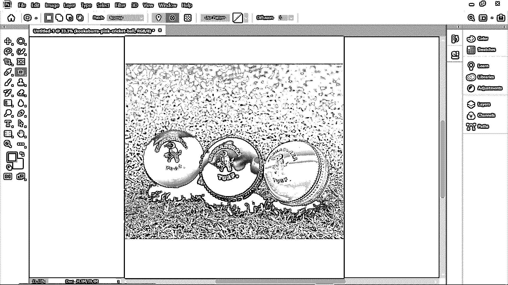

**步骤 2:** 从选项栏中选择目的地

**第三步:**使用补丁工具，将选区移动到位置上。

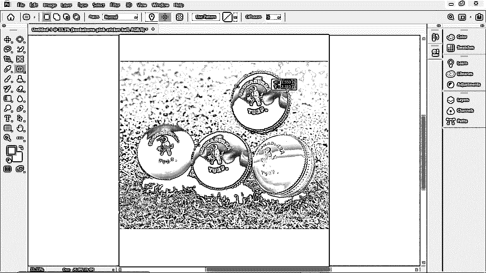

选择目标单选按钮以克隆或复制特定字段。在补丁的帮助下，工具复制了图像。但是边缘可能会像素化。有一种效果更好的方法。选择后，在 Windows 中按 Ctrl + Alt + T，在 Mac 中按 Cmd + Alt + T。这将激活自由变换工具。之后，移动选择到一个新的地方。要使它工作，点击勾选框，或者你可以按回车键。您仍然会注意到选择工具，因为虚线是可见的。现在，您必须将鼠标移动到选定的区域，然后稍微移动该区域并释放光标。这将使周围的像素更好地融合。

### 内容感知模式下的修补工具

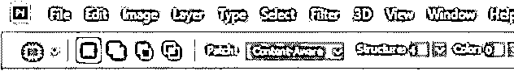

使用“自由变换”工具的另一种方法是在“修补”工具上激活目标模式。修补工具可以在普通模式和内容感知模式下使用。当您处理具有鲜明对比或边缘的图像时，前者非常适合于常规照片编辑。然而，后者在近边清理方面一枝独秀。要在内容感知模式下使用修补工具，您必须导航到选项栏。在那里，您可以选择从普通模式切换到内容感知模式。此外，请注意，在空层上工作时，请确保选中“采样所有层”。您还可以根据自己的混合要求选择不同的范围选项。

### 结论

修补工具是 Photoshop 中用于将受损图像恢复到原始状态的有效工具。你也可以根据自己的需要从图像中克隆一些东西。一旦掌握，这是一个非常简单的图像处理方法。无论照片的面积有多大，您都可以处理大的或小的部分。只要你在图像中有一些区域作为源。我希望这篇文章对你理解 Photoshop 中的一个新工具有所帮助。

### 推荐文章

这是 Photoshop 中的补丁工具指南。在这里，我们讨论了基本概念，修补工具如何在 Photoshop 中工作，以及使用截图的步骤。您也可以浏览我们推荐的其他文章，了解更多信息——

1.  Photoshop 中的[吸管工具](https://www.educba.com/eyedropper-tool-in-photoshop/)
2.  [Photoshop 中的矩形工具](https://www.educba.com/rectangle-tool-in-photoshop/)
3.  [Illustrator 中的选择工具](https://www.educba.com/selection-tool-in-illustrator/)
4.  [Photoshop 中的套索工具](https://www.educba.com/lasso-tool-in-photoshop/)

