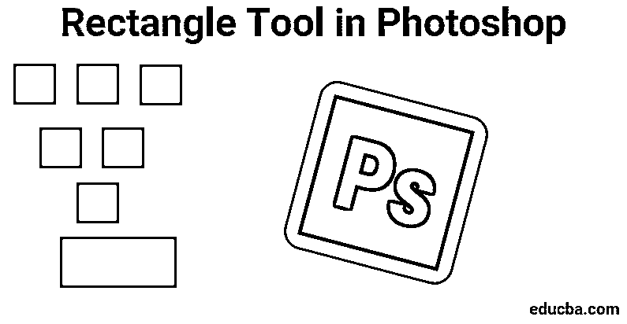
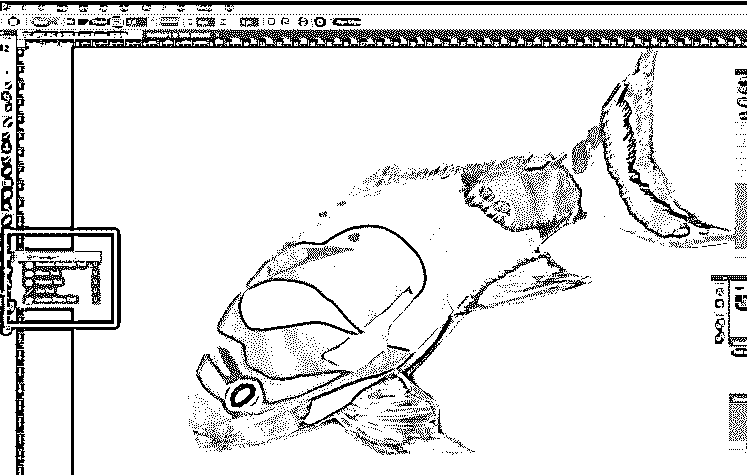
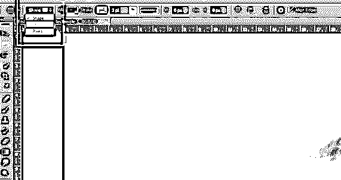
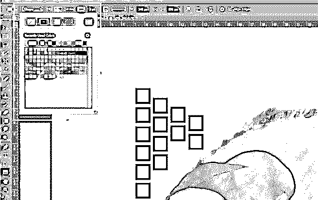
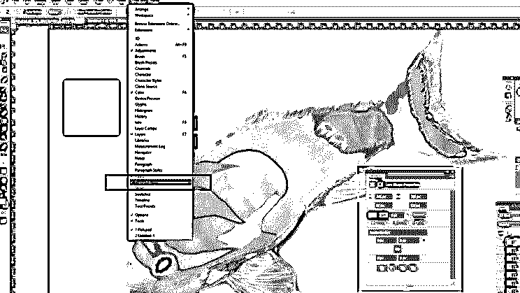
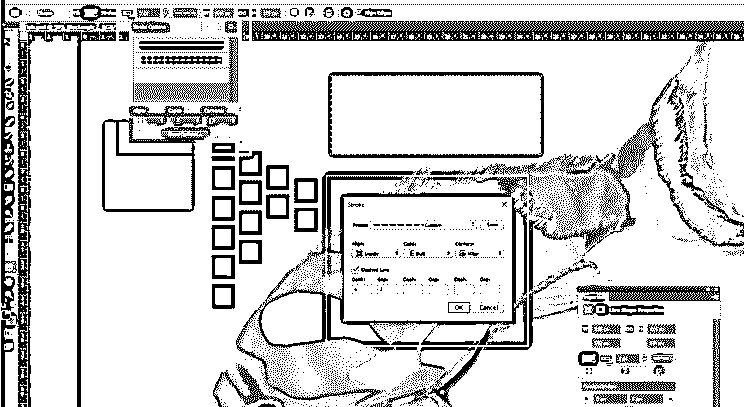

# Photoshop 中的矩形工具

> 原文：<https://www.educba.com/rectangle-tool-in-photoshop/>

## Photoshop 中的矩形工具是什么？

什么是矩形工具，为什么这个工具在 Photoshop 中如此重要？在 Photoshop 中绘制矢量形状是我们可以使用矢量形状来做的事情，通过这些内容，它将帮助我们了解它与基于像素的形状有何不同。

默认情况下，矩形工具是可见的，但是如果我们单击并按住该工具的图标，就会出现一个弹出菜单，向我们显示可以选择的其他工具。我们有一种叫做矩形工具的东西，它也被称为形状工具、绘图工具和文字工具，用来改变或改变我们在设计或图像中创建的对象或东西。

<small>3D 动画、建模、仿真、游戏开发&其他</small>

随着我们对这些东西了解的越来越多，我们需要理解这些绘图工具的用途以及它们是用来处理矢量路径的。这些矢量路径只不过是基于矢量的轮廓，也可以用来变成选区。虽然这样的工具是要使用的，我们去选项栏选择是否绘制路径或形状层。对这些来说，字体在字体层中被很好地创建，然后当我们通过路径进一步设置我们的输出时，字体层可以变换、缩放、旋转、歪斜、扭曲、透视、甚至扭曲。

这个工具对于创建各种横幅、传单、菜单卡、网站设计、在线广告等形状非常有用。使用这个工具，我们实际上是在使用矩形工具绘制一个基本的几何形状，稍后我们可以通过 Photoshop 中给定的属性使用选项和方法来开发这个形状。

### 如何使用矩形工具？

要了解更多和深入了解我们如何使用矩形工具，以便我们可以绘制任何形状，我们首先需要告诉 Photoshop 我们想要创建什么样的形状。这让我们意识到我们的 Photoshop 为我们设置了三种不同的形状。因此，根据我们的理解，我们可以用向量形状、路径或像素形状来想象我们能画出什么。

### 在 Photoshop 中使用矩形工具的步骤

首先，我们开始按照这些步骤来了解如何使用矩形工具；我们还应该从了解如何使用给我们的捷径开始我们的工作开始，这可以帮助我们在短时间内更快地完成工作。

首先，我们必须通过按键盘上的快捷键(V)来启动移动工具。当我们浏览各种选项时，这个工具可以帮助我们浏览 Photoshop 选项。[移动工具](https://www.educba.com/move-tool-in-photoshop/)也可以在侧工具栏中找到，即在侧工具栏的左上角。

接下来，我们开始详细说明如何通过以下步骤使用矩形工具:

**第一步:**为了开始使用矩形工具，首先，我们从工具箱和工具选项栏中选择“矩形工具”进入选项。

令我们惊讶的是，我们首先认为我们需要首先点击工具箱，矩形工具在哪里，或者为什么它被隐藏在某个地方。

我们也可以像下图一样使用键盘上的快捷键(U ),激活矩形工具。此快捷键(U)也可用于形状工具。

第二步:我们的下一步，在我们研究了矩形工具后，它的设置会更有趣。

在左上角，我们有三个选项，即图像中的形状、路径或像素形状。此外，为了确保我们绘制的是形状而不是路径或像素，我们首先从屏幕左上角的选项中选择形状选项。

我们应该永远记住的是，像素选项不同于形状选项。这可以帮助我们以我们喜欢的任何尺寸绘制它们，根据我们的需要编辑和缩放它们，甚至以任何尺寸打印它们而不损失它们的质量。

这可能意味着当我们在屏幕上或印刷品上观看它们时，这些形状的边缘将始终保持清晰和细节。

**第三步:**当我们需要为我们绘制的形状添加颜色时，我们希望通过单击选项栏中的选项从填充色样中选取一种颜色。

我们可以转到顶部的 Windows 选项。一旦我们点击它，我们会看到属性选项。单击后，它会打开一个带有属性列表的框，供我们使用，如“宽度 x 高度”、“填充和描边选项”、“设置形状描边宽度”、“设置形状描边类型”等。

**第四步:**进入属性，更改矩形的宽度和高度。

**第五步:**接下来，我们还可以使用一些键盘快捷键来绘制我们的形状:

*   按住键盘上的 Alt(在 Windows 中)键；当您拖动该形状时，您会看到它是从它的中心开始绘制的。
*   按住键盘上的 Shift(在 Windows 中)键；当您拖动该形状时，您会看到您是从它的角开始绘制它的。

这些快捷键对矩形工具和我们选择的任何形状工具都有效。正如我们在下图中看到的，我们也可以调整我们的形状的破折号和间距大小，就像我们可以增加笔画大小的方式一样。

### 结论

得出我们的结论后，我们有所有的要点，我们需要知道矩形工具，我们可以利用这一点，知道我们如何使用这个工具来创建我们的设计或阐述更多的细节和纹理的重要性，同时使用它。这就是为什么我们让所有的出版商、图形艺术家、摄影师、网站建设者和应用程序创作者知道它的价值，利用它来为他们的产品或艺术功能创造更多的价值，可能是他们的客户或顾客。

### 推荐文章

这是 Photoshop 中矩形工具的使用指南。这里我们讨论了如何在 Photoshop 中使用矩形工具。您也可以浏览我们推荐的其他文章，了解更多信息——

1.  [Adobe Photoshop 命令](https://www.educba.com/photoshop-commands/)
2.  [Photoshop 中的模糊工具](https://www.educba.com/blur-tool-in-photoshop/)
3.  [Photoshop 中的魔棒工具](https://www.educba.com/magic-wand-tool-in-photoshop/)
4.  [Photoshop 中的铅笔工具](https://www.educba.com/pencil-tool-in-photoshop/)

