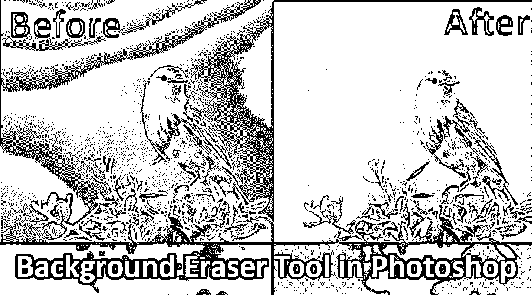
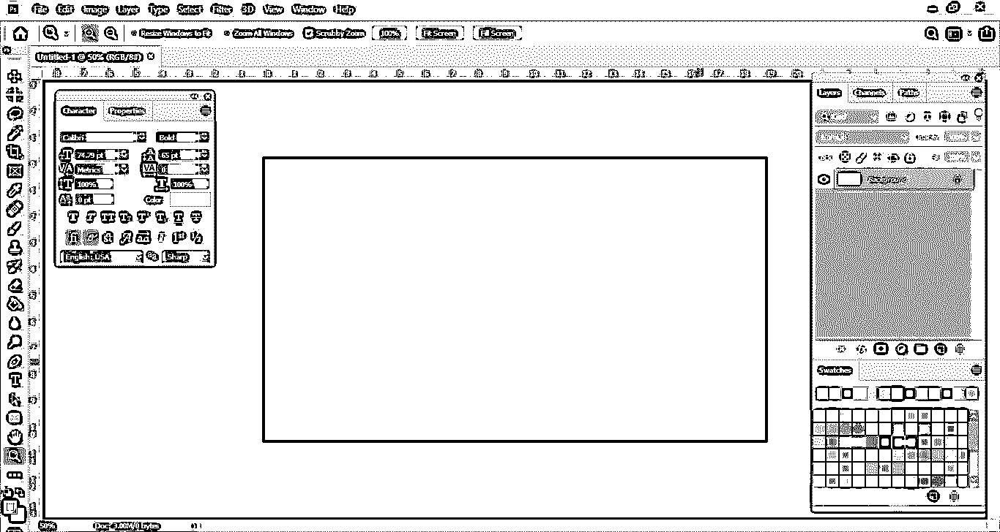
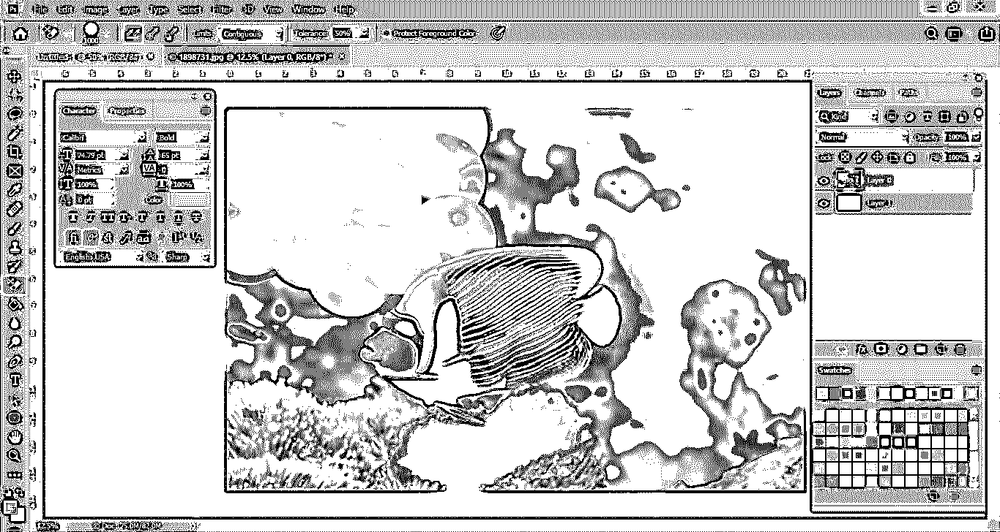
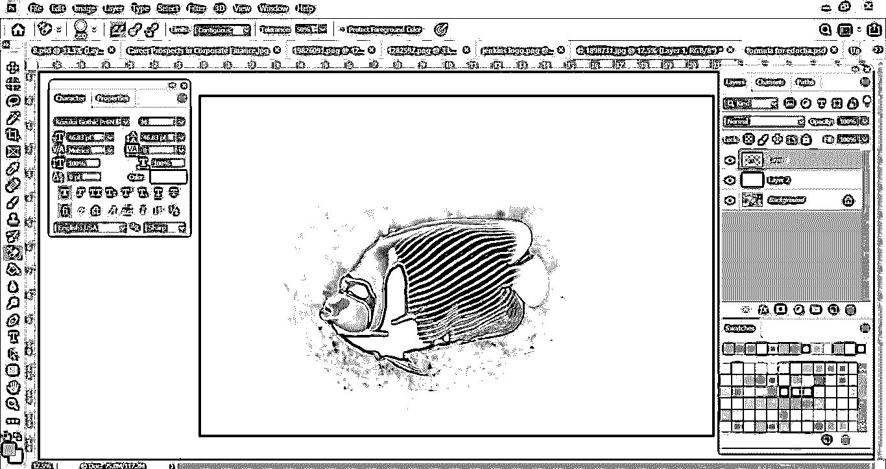
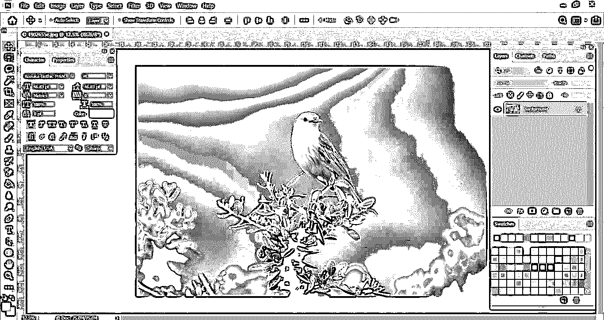
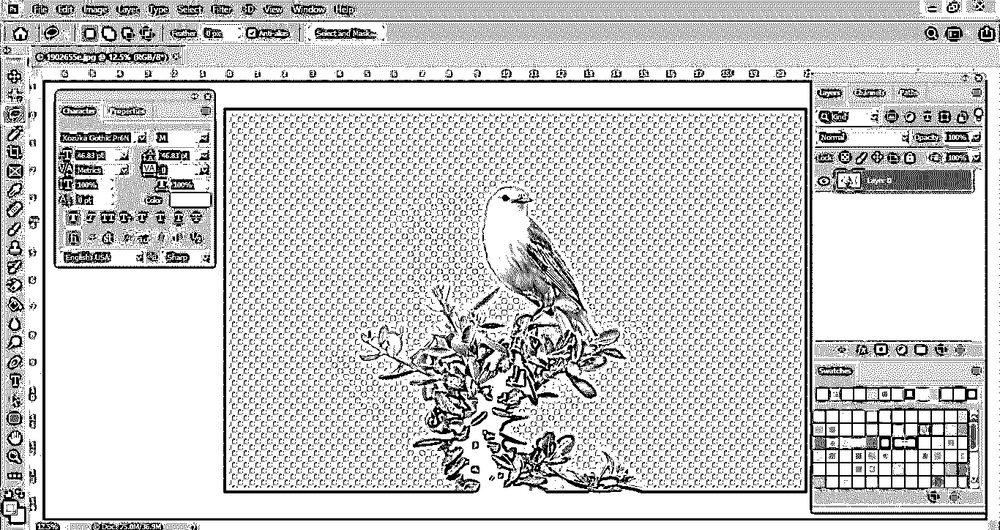
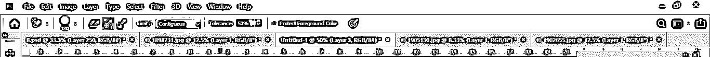

# Photoshop 中的背景橡皮擦工具

> 原文：<https://www.educba.com/background-eraser-tool-in-photoshop/>

## Photoshop 中背景橡皮擦工具概述

Photoshop 中的背景橡皮擦工具是在 Photoshop 中从背景图像中移除背景或任何部分的最简单或最快的方法。背景橡皮擦工具是快速选择工具和[橡皮擦工具](https://www.educba.com/eraser-tool-in-photoshop/)的最佳组合。

背景橡皮擦工具对于包含许多小细节以及边缘的照片非常有用，这些边缘带有您想要剪切的对象和照片的背景。例如，带有头发、毛皮、天空等的图像。

<small>3D 动画、建模、仿真、游戏开发&其他</small>

### Photoshop 中的背景橡皮擦工具怎么用？

下面详细讨论一下背景橡皮擦工具。

**在 Photoshop 界面中用背景橡皮擦工具选中**

如果你左键点击橡皮擦工具，你可以看到背景橡皮擦嵌套在同一个选项中。这是一个非常有用的工具，虽然它的工作与普通橡皮擦工具相同。然而，它有一些重要的功能，更有利于消除各种东西，如背景。

现在，让我们来看看去除背景色的实际过程。在下面这张照片中，有一个白色的背景色。

我已经在一张真实的照片上加了一层，是蓝色的。我必须创建这一层，因为当我们从原始照片中移除白色时，我们可以精确地看到它被移除的准确程度。我建议在练习或擦除图像中的任何背景时。在继续进一步修改之前，一定要再检查一层。

有点困惑，对吧？让我在下面的另一张图中展示一个实际的过程。

在这里，我可以更详细地向您解释这一点。当我们用背景橡皮擦工具去除背景中的水时，你可以看到蓝色的背景。但是你可能会注意到一件事，在珊瑚鱼身上，有一块白色的斑点出现。这是因为公差设置。

对于公差设置，我们必须根据照片的复杂程度不断改变设置。这里的设置是 50%，但现在我要减少到 25%。更改容差设置后，我们可以看到图像现在看起来完美无瑕。

让我们用这个工具完成这个完整的图像。我们可以快速、轻松地移除任何照片中不想要的背景，而不会损坏照片的其他部分。

**这是背景橡皮擦工具最酷的地方**

现在我们可以填充任何其他颜色到背景层，或者保持透明。这取决于你。

给任何特殊效果或操纵保持透明，以便照片操纵效果看起来更真实。开始拖动时，背景橡皮擦工具会从图层上的图像中移除像素，并将其转换为透明图层。您仍然可以移除背景，同时保留前景中对象的精细边缘。通过指示各种采样和容差设置，您仍然可以控制图像透明度和清晰度的特定范围。

需要考虑的几个要点是，我们将容差设置保持在 25%。对于[吸管工具](https://www.educba.com/eyedropper-tool-in-illustrator/)，有三种设置可用。其中，我选择了抽样一次，因为我们的原始照片的背景颜色是白色。所以在这里，我们可以选择那个选项。但是如果你拍摄的是有很多元素的复杂照片，那么，在这种情况下，你应该选择连续采样。

在这张照片中，有一棵树和一只麻雀。因此，我们将保持滴管工具的设置为连续的，这意味着我们必须连续地从微小部分的区域取样。

在这里，在这个图像中，在去除背景的同时，我添加了一个红色的新图层，这就是为什么我们在背景中看到了红色。如果我去掉那层，你将只能看到背景透明的树。

**画笔大小:**可以用左右括号键调整，加快进程。当我们在处理照片或擦除背景时，它对我们帮助很大。

**限制:**在控制栏的背景橡皮擦工具设置中也是一个非常重要的功能。Photoshop 知道您想要删除哪种颜色/色调，限制表明匹配该颜色的像素的可能性，因此它可以轻松删除它们。

限制有四个不同的选项:

*   接触的
*   不连续的
*   查找边缘
*   保护前景色

下图显示了控制栏中不同选项设置

*   **连续–**这是 Photoshop 选择的默认选项。它将移除该区域中基本上接触该区域下的像素的像素。
*   **不连续–**这将删除任何更接近采样颜色的像素，即使这些像素在不同颜色的区域上有所不同。
*   **查找边缘–**该选项与连续选项相同，但更加明确，尤其是对于精细的边缘。
*   **保护前景色–**它将保护您当前的前景色不被擦除/移除。

我想提到的是，当使用背景橡皮擦工具移除特定的背景层时，该层将被永久移除，并且在移除后无法恢复。复制图层以备将来使用总是一个好主意。

### 结论

Photoshop 有许多工具来完成设计、修饰、编辑照片的各种任务。背景橡皮擦工具就是其中之一。它使用起来非常简单有效，即使你是 Photoshop 的新手。希望你了解橡皮擦工具的详细信息及其优点/用途。

### 推荐文章

这是 Photoshop 中背景橡皮擦工具的使用指南。这里我们讨论一下如何在 Photoshop 中使用背景橡皮擦工具。您也可以浏览我们推荐的其他文章，了解更多信息——

1.  [Photoshop 中的模糊工具](https://www.educba.com/blur-tool-in-photoshop/)
2.  [Photoshop 中的铅笔工具](https://www.educba.com/pencil-tool-in-photoshop/)
3.  [Illustrator 中的选择工具](https://www.educba.com/selection-tool-in-illustrator/)
4.  [Photoshop 中的橡皮擦工具](https://www.educba.com/eraser-tool-in-photoshop/)

