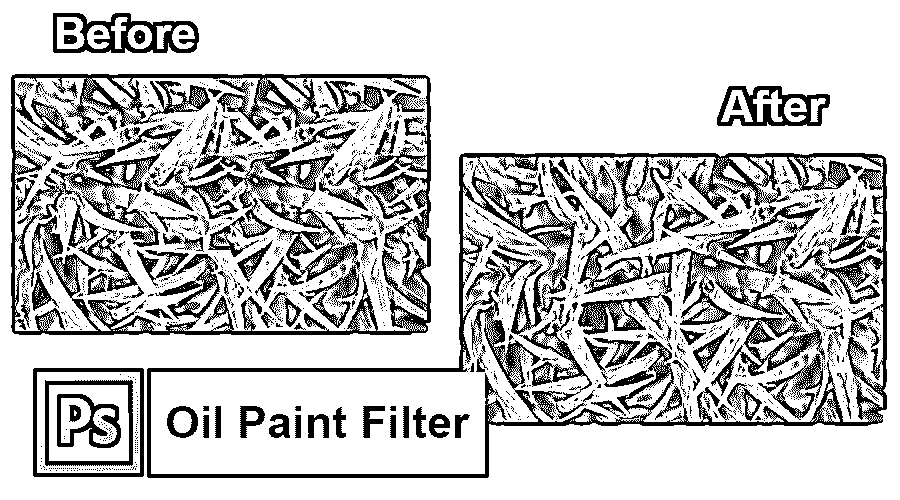
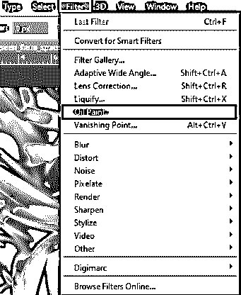
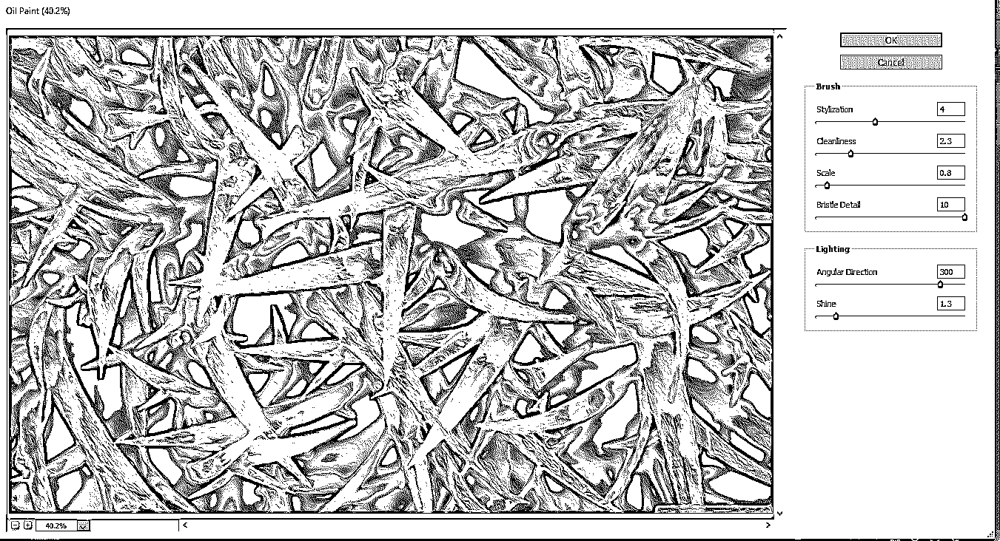
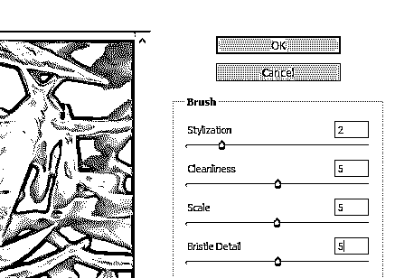
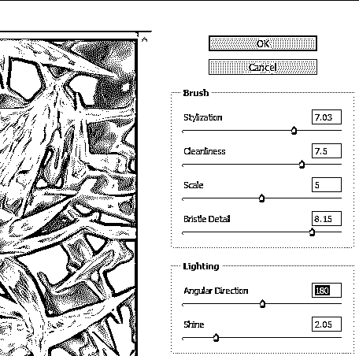
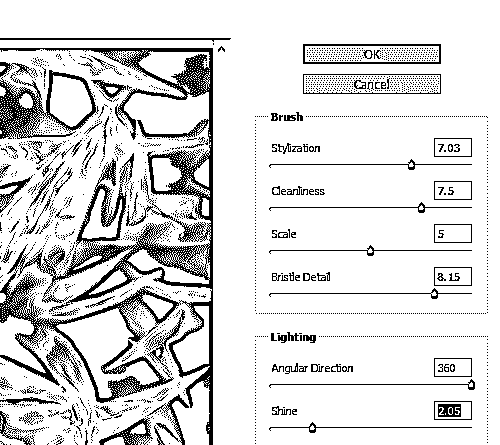
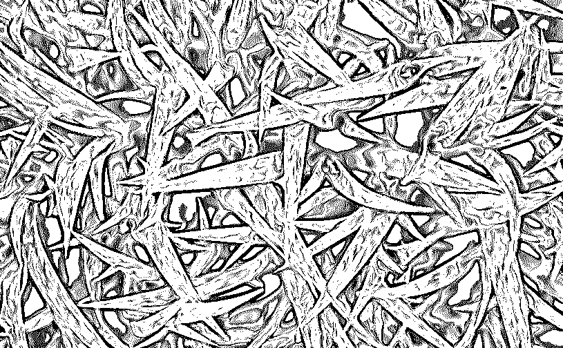

# Photoshop 中的油画滤镜

> 原文：<https://www.educba.com/oil-paint-filter-in-photoshop/>

## Photoshop 中油画滤镜介绍

滤镜油彩最初是在 Photoshop CS6 中作为实际滤镜实现的。但一开始不知什么原因在 Photoshop CC 消失了。好在 2015 年 11 月的油彩滤镜又回来了！虽然它本质上和 CS6 中的过滤器是一样的(这并不坏)，但 CC 版本现在有一个更低、更少恐惧的对话框，这使得它比以往任何时候都更容易使用。

我们大多数人尝试的一种常见技术是在一张图片的某一点上应用彩色效果。包含油画层的 Photoshop CS4 和 CS5 扩展程序 Pixel Bender 已经存在一段时间了。

<small>3D 动画、建模、仿真、游戏开发&其他</small>

在 Photoshop CS6 滤镜系列中，这种滤镜目前是一种连续驻留，比 Photoshop 的旧版本更容易操作。在这里，我们将演示如何准备我们的测试图片以用于油画解决方案，然后应用滤镜。如果你使用自己的图片，从一张小图片开始，因为当不被拉伸太大时，屏幕表现得最好。

在 Photoshop 中，做摄影有几种方法，而且这么多年来，我发现个人真的很喜欢把图片变成图纸。油画镜头在 Photoshop 中提供了独特的外观。

### 智能油漆过滤器

**第一步:**现在解锁你想转换成油画的图片文件夹。

**第二步:**要拾取图片，点击 STRL+ A，按 STRL+ C 复制

**第三步:**然后在你的论文中生成一个 fresh 元素，点击 Ctrl+ V 插入图片。去编辑>免费的方法转换和调整图片的大小，用这个工具，因为你需要它。

作为一个起点，将工作表转换为智能对象(或智能过滤器)纹理通常是一个好主意。这是一件好事。在这种情况下，

第四步:我已经为自己打开了一个原始图像，作为一个智能对象。之后，选择过滤器，并单击选项油彩。

**第五步:**接下来，在大多数图片中，你最少要插 33 或 50%，如果它们很大，更是如此。这个概念是既要看到反面，又要看到照片中的纹理和精度。

如果要检查一切，手动调造型控肩，查看演示；你能看到任何明显的修改吗？如果没有，至少应该再放大一个数量。有趣的影响是样式控制。我能创造的最好的对比是降价，它提供了一个比假石油画更自然、更块状的图像，几乎就像它被放在一座红塔上或一把洒了很多墨水的旧梳子上一样。我喜欢石油肖像听起来更平滑，所以我把这个实例设置为刚刚超过 7(加 10)。

#### 通过使用笔刷控制

清洁度滑块的工作方式与样式类似，只是比较行(即假色串)往往会被打断。降低了价格；越多的颜色行似乎被粉碎。但是，我相信它提供了一个现实主义的方面来保持 5 以下的质量；你可能相信促进这种环境。毕竟，我们可能会有一个波纹的方面，与我们用真正的笔生成的东西形成对比，所以如果我们用人手而不是机器人的手指来绘制，它应该与数字笔相同。

控制比例是非常重要的，您希望在设置时放大以评估它。这个命令非常重要。思考图片的相对大小，如果可以的话，尝试模仿这个大小。规模越大，模型越清晰。在一些情况下滑动滑块，以了解影响是什么。通常我会定一个 3-7 的估值。上限为 10，小数的使用方式与前两种环境相同。

鬃毛细节是最终的头发检查，你可以看到这是模仿梳子，在非常柔软的油漆上显示单独的鬃毛行。一般来说，基于前几个配置，我把这个重要性保持得很低。我想，如果你把它画得太小，油画的个性就会有所保留。这是一张你想看的放大的照片。即使那样也可能有点困难。

#### 照明设备

角度路径的命令“改变”了影响(例如，从 180°到 360°的转换基本上反转了对比线，以便太阳从面板的另一侧照射)，而照射的命令将石油织物从光滑变为潮湿(即，在阳光充足的区域透明)变为对比线。尝试移动冲击，使其垂直于最重要的图形行(或要显示的特征)。

光泽可以对照片进行最后的润色，并区分像不像颜料。这通常是更好的滚动一点太普通的显示放大与这两个检查。

下面是最终的结局。完成后，双击滤镜(在表面下)将滤镜移动到新的智能对象层。任何时候你想改变你的配置，双击过滤器标题。提示:不要忽视你的智能过滤涂层之前，你的油画颜料已经缩放！

### 结论

现在我要第一个承认我不是画家。如果你看到我试图画的任何东西，你将是第二个承认我不是画家的人。但是我也不用感激 Photoshop 和它的滤镜油彩！没有一丝真实世界的证据，我仍然可以假装我是文森特·梵高的下一个。尽管 PS 过的油画效果永远不会迷惑专业人士，也不会粘在画廊的屏幕上，但把你的一张照片变成一幅油画仍然是一件令人愉快的事情，而且结果非常惊人。

### 推荐文章

这是一个关于 Photoshop 中油彩滤镜的指南。在这里，我们讨论如何将一个正常的图像转换为油画过滤器，并一步一步地解释。您也可以阅读以下文章，了解更多信息——

1.  [Adobe Photoshop 工具](https://www.educba.com/adobe-photoshop-tools/)
2.  [Photoshop 中的模糊工具](https://www.educba.com/blur-tool-in-photoshop/)
3.  [Photoshop 中的铅笔工具](https://www.educba.com/pencil-tool-in-photoshop/)
4.  [安装 Adobe Photoshop](https://www.educba.com/install-adobe-photoshop/)

