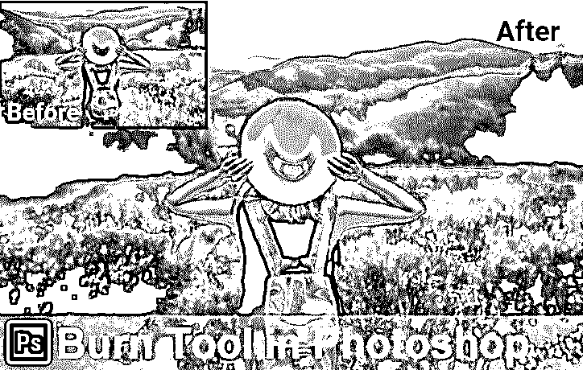
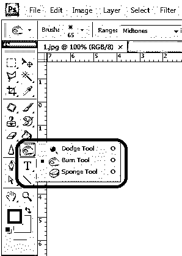
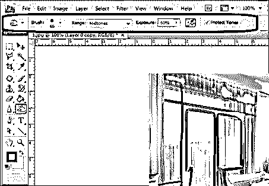
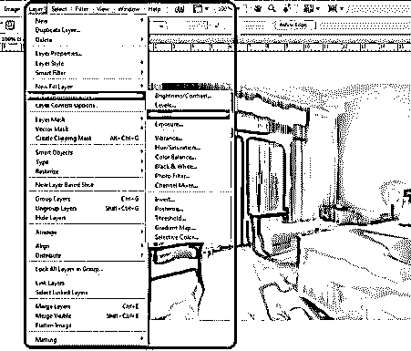
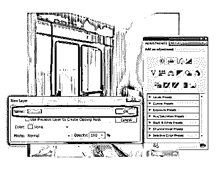
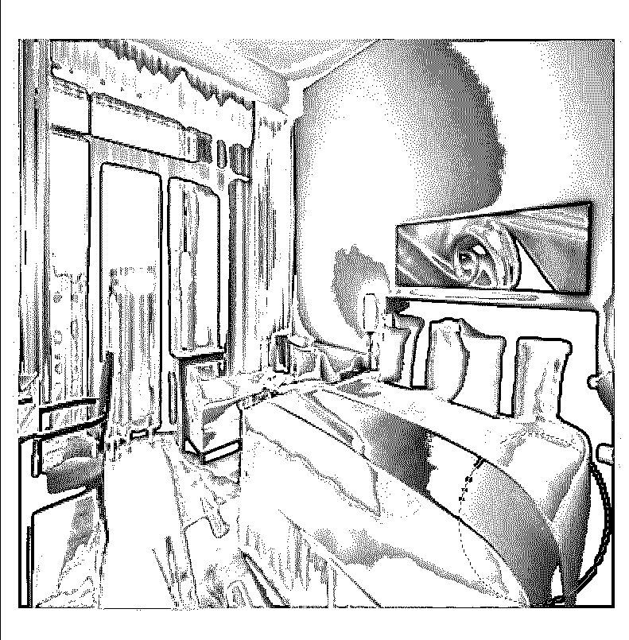
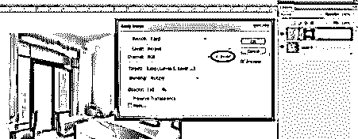
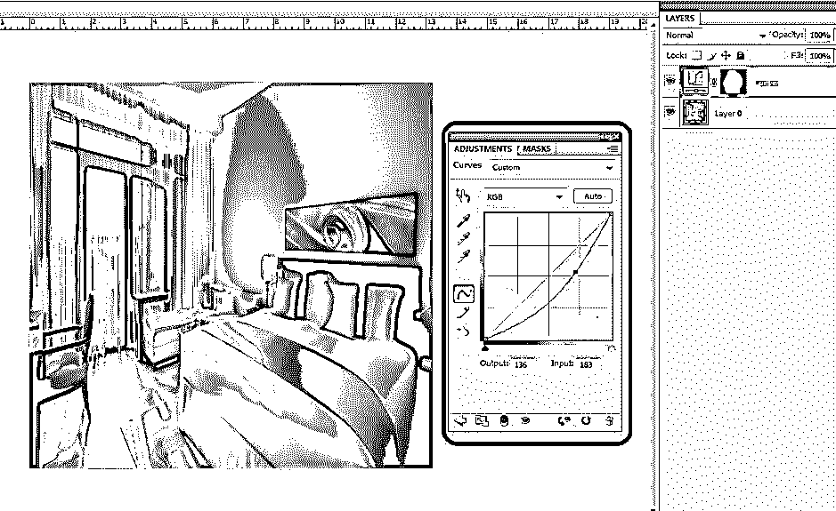
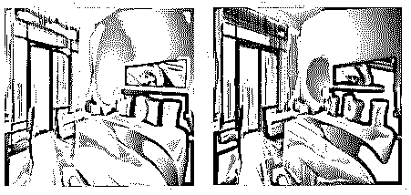
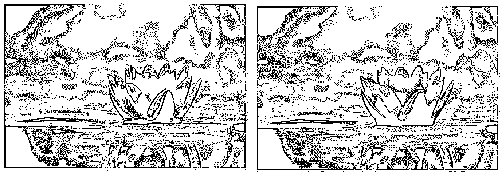

# Photoshop 中的加深工具

> 原文：<https://www.educba.com/burn-tool-in-photoshop/>

## Photoshop 中的加深工具简介

许多人都使用 Adobe Photoshop 来编辑图像，包括视觉艺术家、照相馆图形、图形艺术家、网页设计师、VFX 艺术家和游戏艺术家，因为它为他们提供了很好的工具。Burns tool 就是其中之一，它帮助用户在图像上添加深色阴影或细节，如阴影、光线聚焦、多层阴影，并确保源图像不受影响，同时还节省时间。这是 Photoshop 中最安全也是最好的工具之一。

**Photoshop 中哪里有加深工具？**

<small>3D 动画、建模、仿真、游戏开发&其他</small>

如下所示，工具箱中有加深工具；使用该工具的快捷方式是“o”。

顶部栏属性有助于更改工具行为、配置属性并开始工作。

### Photoshop 里的加深工具怎么用？

加深工具有助于给图像的选定部分增加深度。下面我们更详细地讨论了它。有几个更聪明的方法来工作的烧伤工具，使层副本和应用烧伤效果，以新创建的层；这样做，我们的原始层将是安全的，我们可以在任何需要的时候拖动它。加深工具将暗度应用于使用画笔选择的图像部分。我们刷得越多，这个区域就越暗。

可以在每次笔刷流动后设置笔刷和加深效果的属性。许多专业艺术家使用这个工具来增加他们的图像的深度和细节，这给观众带来了更真实的有趣的外观和感觉。下面我们有更多的例子和使用烧伤工具的一步一步的过程，这有助于更清楚地理解烧伤属性的用法。

**第一步:**双击打开 Photoshop 或者右键点击 Photoshop 图标，选择以管理员身份运行；打开应用程序后启动应用程序，导入或打开需要刻录的图像选择工具栏中的刻录工具。选择此项后，我们可以看到所有需要的属性都将在下面的菜单选项卡中打开。

**第二步:**选择图像，右键选择复制或使用键盘快捷键 Ctrl+J；通过这样做，我们可以看到另一个具有相同图像的图层被加载到图层窗格中。我们将只在新图层上执行刻录编辑，而原始加载的图像保持不变。选择新创建的层，然后单击“o”选择刻录或转到层，选择一个新的调整层，然后选择曲线。

**步骤 3:** 一个新的曲线层窗口打开，我们可以在其中命名我们的曲线，给出名称并点击“确定”。我们可以看到该层现在包含一个曲线，以及与它的烧伤面具。这两个都将有助于我们给出我们的细节。

第四步:图层现在包含了曲线和蒙版。双击一条曲线，曲线窗口打开，我们可以通过移动指针调整整个图像的暗度和亮度。练习并尝试这样做，直到图像达到所需的颜色收缩。

**T2】**

 ****第五步:**选中图层，在键盘上，点击 Ctrl+I；这个过程被称为反层掩模。其中掩模颜色从白色变为黑色。

第六步:选择画笔，然后设置它的属性，将画笔移动到图像中需要应用暗部和细节的区域。如果它面对最常见的，我们将滚动刷在额头，眼睛下面的脖子等。这完全取决于输出你想你的形象。

**第七步:**完成笔刷和要做的区域后，从菜单栏选择图像，点击应用图像。对图像进行编辑。

**T2】**

 ****第 8 步:**我们可以看到一个名为“应用图像”的窗口打开，选择“反转”选项，并确保选中该选项，然后单击“确定”。

**第九步:**打开曲线层，检查涂抹的加深部分的暗度和颜色对比。整体色彩调整必须完成，并最终确定您的图像。

### Photoshop 中的加深工具示例

现在我们来看几个例子:

**例:1**

**例:2**

**

** 

**例:3**

### 使用加深工具的不同方式

有不同的方法来使用烧伤工具的基础上的形象，其细节是无聊的使用属性。复制图层并直接选择加深工具，然后根据需要在图像上应用更改。一旦在一个层上穿上，该活动不能被改变用于任何颜色调整和其它观看或属性改变过程。

复制图层并添加一个附加图层，应用曲线并反转蒙版，以上讨论的过程更加灵活，可以根据视觉真实感和感觉的需要随时更改图像的颜色组合和属性，如亮度和对比度。

为了理解所有这些细节并进行实践，我们需要不断练习或处理多个图像，并使用所讨论的属性，并根据需要在 Photoshop 上探索过程结束时图像视图的差异。

### 结论

我们可以使用加深工具使图像变得更暗，并在图像上添加细节，如阴影、光线聚焦、阴影和许多其他重要的细节。任何视觉艺术家、照相馆图形、平面艺术家、网页设计师、VFX 艺术家、游戏艺术家都使用这种属性，让他们的作品看起来更真实。

每一个对 Photoshop 感兴趣、学习和使用 Photoshop 的人都必须使用这个智能和最简单的过程来满足他们的需求。一个这样的工具是非常有用的刻录工具，通过保持原始图像的安全，我们可以进行编辑。一个聪明和健康的编辑方式可以节省时间，也可以实现高质量的输出，并在需要时灵活地进行更改。

### 推荐文章

这是 Photoshop 中的刻录工具指南。在这里，我们讨论的概念和如何使用 Photoshop 中的烧伤工具和几个例子。您也可以浏览我们推荐的其他文章，了解更多信息——

1.  [玛雅工具](https://www.educba.com/maya-tools/)
2.  [搅拌机工具](https://www.educba.com/blender-tools/)
3.  [Adobe Photoshop 工具](https://www.educba.com/adobe-photoshop-tools/)
4.  [Photoshop 中的红眼工具](https://www.educba.com/red-eye-tool-in-photoshop/)

****