# Photoshop 中的油漆桶工具

> 原文：<https://www.educba.com/paint-bucket-tool-in-photoshop/>

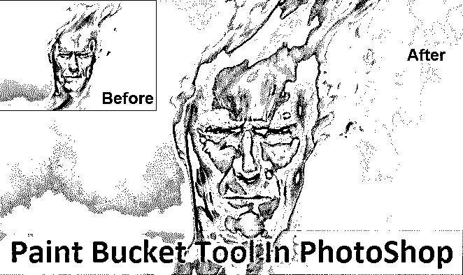

## Photoshop 中油漆桶工具简介

油漆桶工具并不是现在或者几年前才被创造出来的。相反，自从用户创建 Photoshop 以来，这个工具一直是最常用的。此工具最常用于渲染、发布和照片编辑，由每天使用此工具的艺术家或摄影师使用，尤其是与选框工具一起使用时。

记下它的用途，这个工具帮助用前景色填充图像中的选定区域，当用于创建背景或布局设计时，它会很方便。最好的部分是，这可以让我们填充所有的区域，这些区域连接到为要填充的颜色选择的区域的剩余部分。

<small>3D 动画、建模、仿真、游戏开发&其他</small>

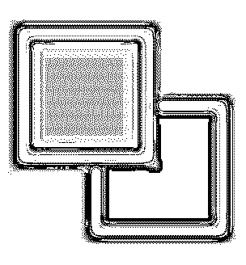

### Photoshop 中哪里有油漆桶工具？

为了了解油漆桶工具的位置，我们将在此图中看到它，下面给出了一些示例:

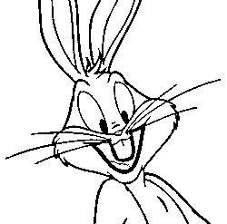

油漆桶工具可以在侧工具栏中找到，即在工具栏的中间左侧，这是渐变工具所在的位置。

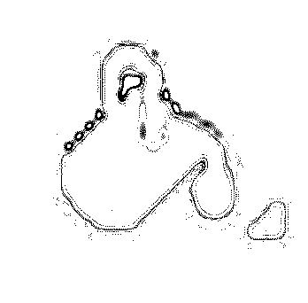

### Photoshop 中的油漆桶工具怎么用？

为了知道我们如何使用油漆桶工具，我们从以下几个步骤开始。在这样做的同时，我们也应该通过使用快捷键来加快我们的工作速度，这可以帮助我们提高速度。当我们浏览各种选项时，键盘上的快捷键(V)激活移动工具来帮助我们浏览 Photoshop 软件选项中的导航部分。

移动工具也可以在侧工具栏中找到，即在侧工具栏的左上角。

### 使用油漆桶工具的步骤

**步骤 1:** 通过左键点击并按住图标，然后选择油漆桶工具，进入选项选择“油漆桶工具”。

使用这个工具，我们将前景颜色设置为蓝色，同时使用油漆桶工具，我们将颜色应用到背景的透明空间，这是为了改变或修改图像中的一些内容。

我们也可以使用键盘上的快捷键(G)。此快捷键激活油漆桶工具和设置工具，即“渐变工具”和“3D 材质拖放工具”。

**第二步:**为前景选择颜色。

为了开始添加或选择颜色，我们需要点击“前景颜色”样本，我们在图像中看到的。使用工具选项栏，我们选择该工具要应用的选项填充类型，我们可以在图像的左上角看到。默认情况下，填充被选择用于“前景色”，在我们使用油漆桶工具应用蓝色后，我们看到下图中的输出。

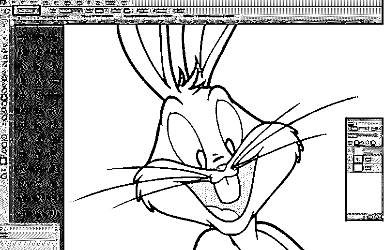

**输出比较**

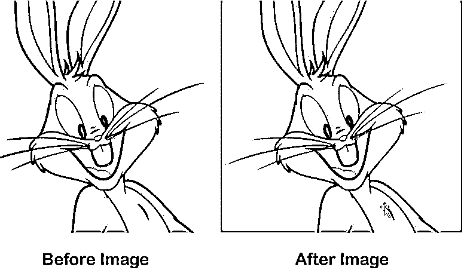

如果我们想用一些图案代替颜色，我们可以选择“图案填充”选项。该工具位于同一位置，即我们看到它位于左上角。

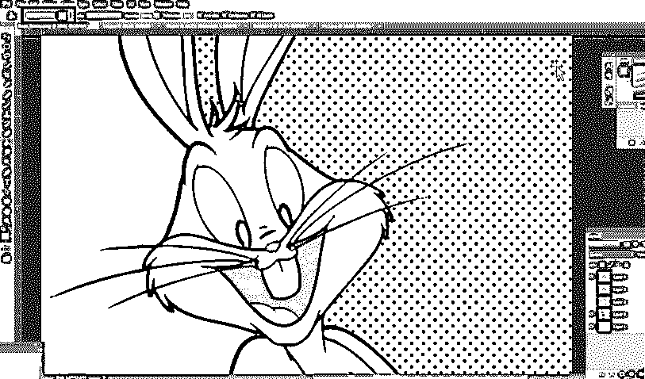

要开始使用图案，我们进入下拉菜单，我们可以选择将哪个图案应用到我们的选区或图像背景上，正如我们在这个图像中看到的，我们用它来绘制所需的区域。

**输出比较**

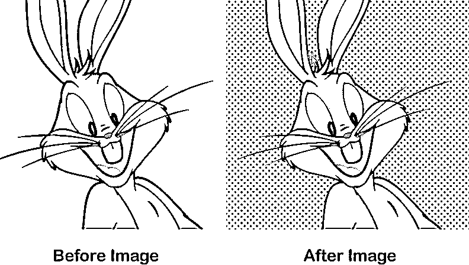

通过这种方式，我们知道如何使用油漆桶工具来应用颜色或图案，我们可以在上面的图像中看到输出。

#### Photoshop 中的油漆桶工具

**步骤 1:** 在我们了解如何使用填充颜色类型或图案类型后，我们现在可以使用下图中的其他选项。

“不透明度”选项是我们用来设置其透明度百分比的东西，即使用滑块从 **1** 到 **100%** 。这样，我们得到的是我们选择的颜色会使它变得不透明。

**第二步:**“容差”选项是指最低容差值仅在该区域具有相同颜色的图像上绘制颜色。默认情况下，我们可以选择滑块中的值，即从 **0 到 255** 开始。

下图显示了输出，我们看到公差值为 **30。**

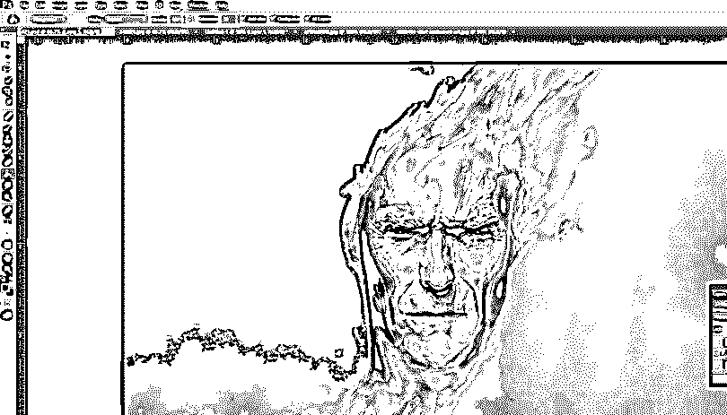

**第三步:**当我们到达 **120 处的公差值时，**我们会看到它覆盖了下图中的大范围像素。

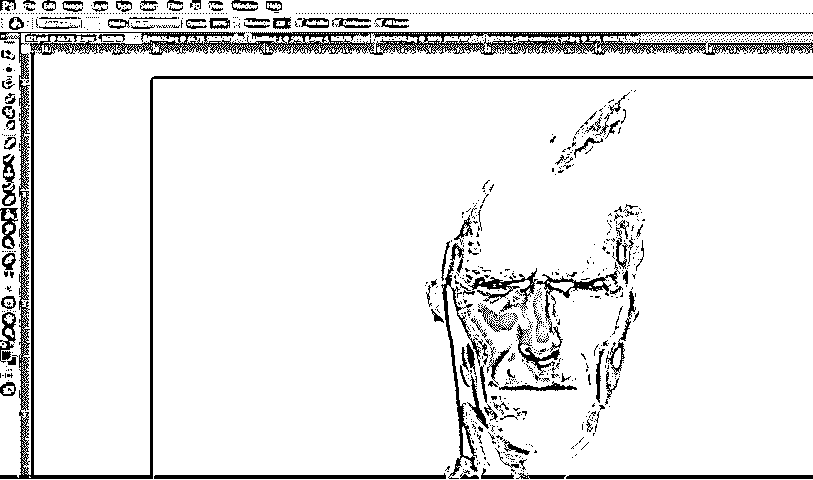

**步骤 4:** “混合模式”选项是我们在测试适合我们需求的不同混合模式时可以使用的。因此，这有助于我们了解如何使用颜料桶工具来创建完美的混合背景。

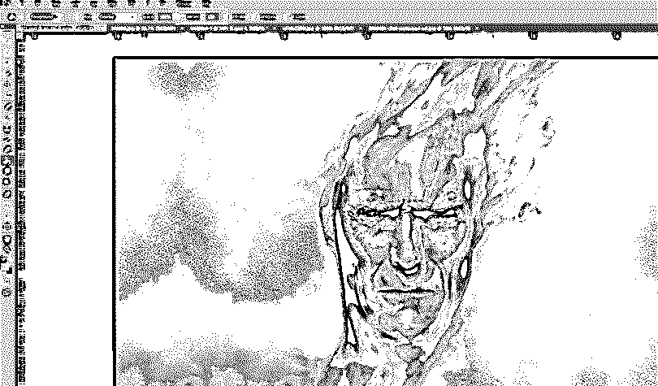

此外，当我们选择“所有层”选项时，它会影响所有层中选择的填充颜色，如果它没有被选中，则像素被填充到当前选择的层中。当我们使用“反走样”选项，我们可以有更好的平滑曲线。

### 使用油漆桶工具的不同方式

使用油漆桶工具有多种方法，例如:

*   此工具可用于绘制需要向设计或发布网站添加足够信息的图表或图像重绘。
*   这个工具对孩子们很有帮助，可以帮助他们学习如何填充颜色或图案，让他们快速理解和学习。

### 结论

得出我们的结论，我们都必须同意，这个工具结合了使用混合选项、容差和不透明度控制来创建东西的功能，可以为我们的日常工作提供大量支持，例如在我们的出版、游戏应用程序、网站设计、书籍封面等方面。因此，我们知道这个工具非常有用，有助于我们控制我们的主要目标。

### 推荐文章

这是 Photoshop 中油漆桶工具的指南。这里我们讨论一下概念以及如何在 Photoshop 中使用油漆桶工具。您也可以浏览我们推荐的其他文章，了解更多信息——

1.  [玛雅工具](https://www.educba.com/maya-tools/)
2.  [搅拌机工具](https://www.educba.com/blender-tools/)
3.  [Adobe Photoshop 工具](https://www.educba.com/adobe-photoshop-tools/)
4.  [Photoshop 中的红眼工具](https://www.educba.com/red-eye-tool-in-photoshop/)

