# Photoshop 中的雪花效果

> 原文：<https://www.educba.com/snow-effect-in-photoshop/>

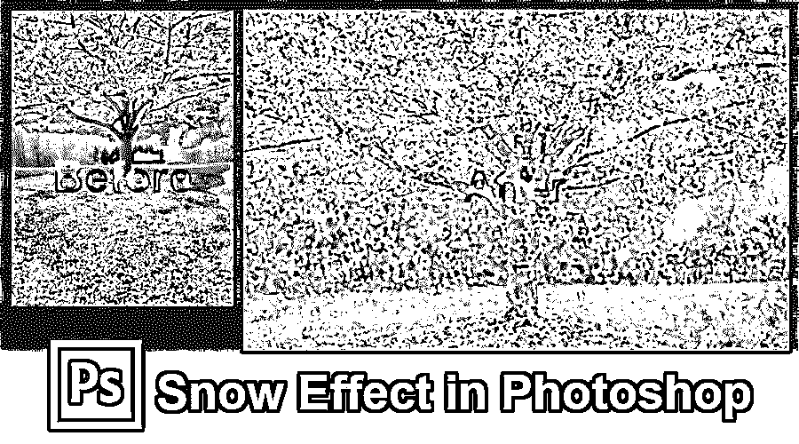

## Photoshop 中的雪花效果介绍

Photoshop 是广泛使用的工具，用于在照片中添加多种效果和属性。它首先被选为图形编辑、图像效果添加、杂志制作、新闻页面内的文章框架等项目的项目管道。我们可以给图像添加不真实的外观和场景，比如降雪、降雨、阳光调整、锐度、模糊、颜色调整、气流等等。今天我们将看到如何给照片添加雪的效果。照片的选择也起着关键的作用，所以选择最适合雪效果的照片，并按照下面的步骤使用 photoshop 图层将雪效果添加到照片上。这些类似的技巧可以应用到其他合适的照片上。

### 如何在 Photoshop 中创建雪花效果？

**步骤 1:** 添加一个新的黑色“雪”层被添加。

<small>3D 动画、建模、仿真、游戏开发&其他</small>

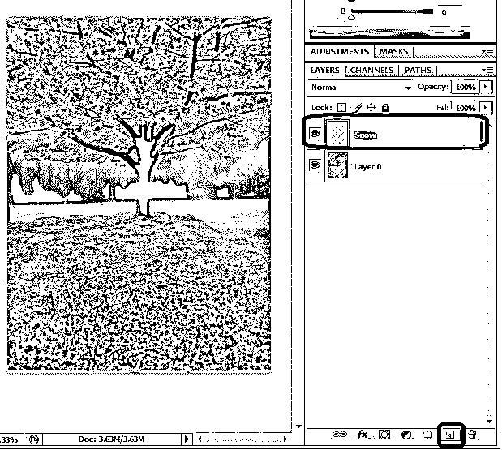

在 Photoshop 应用程序中打开必须添加雪效果的照片。从图层中，选择一个新图层图标创建一个新的空白图层到图层面板，命名为可记忆。在 windows 中按住 **Alt** 键，在 Mac OS 中按住 **Option** 键。

**步骤 2:** 点击编辑按钮，从菜单栏中选择填充选项。

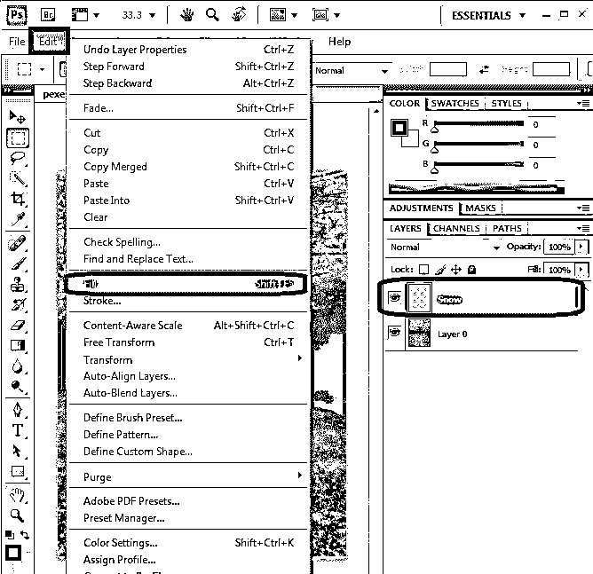

选择新创建的层，并用黑色填充。进入编辑菜单**。**

**第三步:**填充选项。

将打开一个对话框，详细说明从下拉列表中选择黑色并点击确定。新创建的层将用黑色填充。

**第四步:**进入滤镜，从菜单栏选择噪波和新增噪波选项。

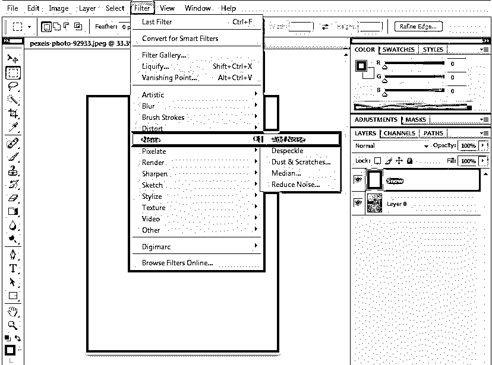

选择一个黑色层，从菜单栏中选择过滤器，悬停到噪声，并选择添加噪声选项。新的窗口将被打开与添加噪声选项，和一些配置一样，数额必须设置为 25。从分布中，启用高斯以启用单色，然后单击确定。我们可以看到一些白点添加到层。填充噪点后根据需要调整亮度。

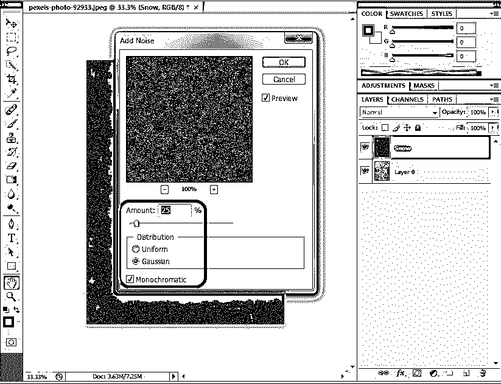

**第五步:**进入编辑，点击变换按钮，选择缩放选项。

**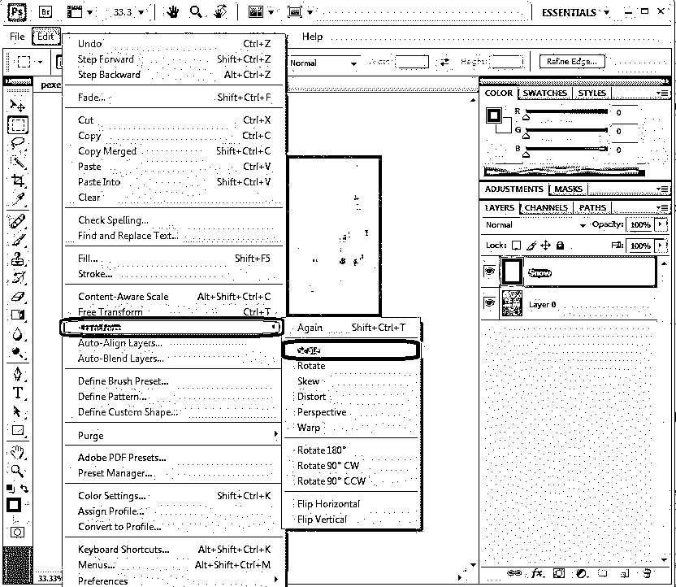

** 

我们需要使白色尺寸更大。为此，从菜单栏转到编辑，选择变换并选择缩放，单击链接(-)选项，根据需要设置宽度和高度值。当发生变化时，此链接会自动调整宽度和高度。全球建议的宽度和高度为 400%。

单击选项栏中的复选标记接受更改。通过这样做，白点增加更大，看起来像雪。这一步必须做，只有当它是必要的图像建议大图片，而不是较小的，接近或肖像图片。

第六步:图层混合模式>屏幕

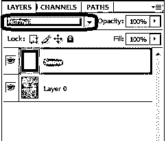

假设我们识别出噪声中的任何问题，这些问题将被完全去除，这将使我们的图像获得更持久的所需视图。选择层，改变混合模式为屏幕从默认到屏幕。

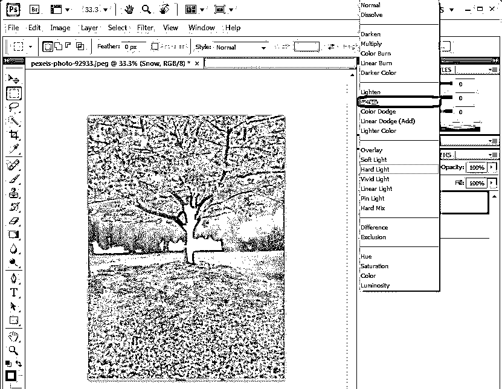

通过这样做，屏幕混合模式隐藏了图层的黑色和图像上可见的白噪音。我们的背景原始出现了雪层的白噪音。

**步骤 7:** 进入滤镜，点击模糊选项，选择运动模糊

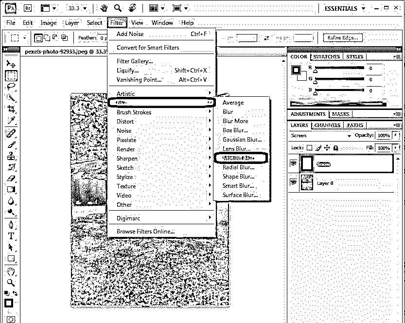

从菜单栏转到滤镜并选择模糊，然后选择运动模糊**。**这有助于将运动模糊滤镜应用于图层，以获得降雪效果，为雪添加自然的外观和感觉。

步骤 8: 进入滤镜，点击运动图层，调整角度

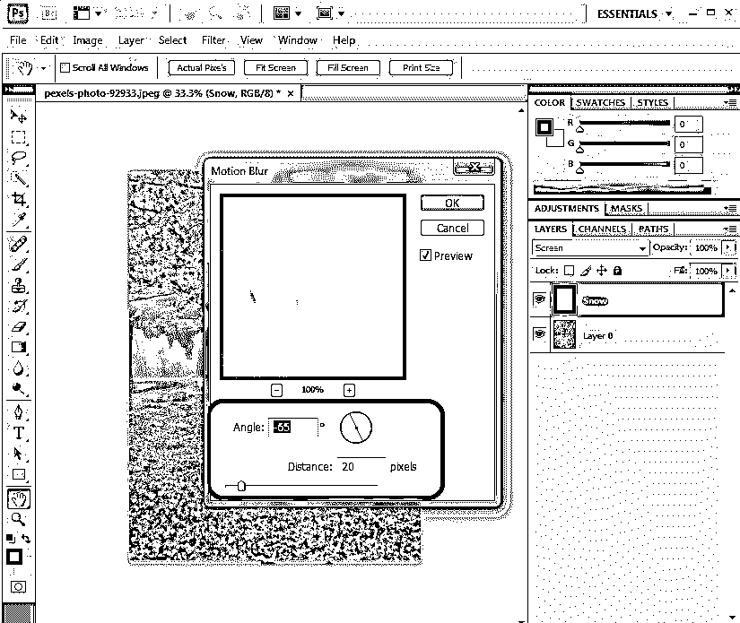

运动模糊窗口，角度-65，像素距离为 16 到 20，点击确定。这将为图层中的白色像素添加降雪角度和运动。

**第九步:**添加可调图层。

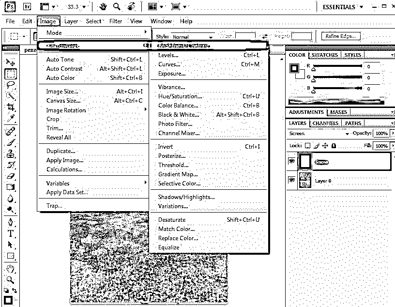

如果需要，我们可以使用调整层来降低雪的效果或亮度。单击“图层”面板按钮上的“新建填充或调整图层”图标。管理 RGB 值和其他属性也取决于我们作为背景的图像颜色。

**第十步:**转到图层，点击可调图层，选择选项级别。

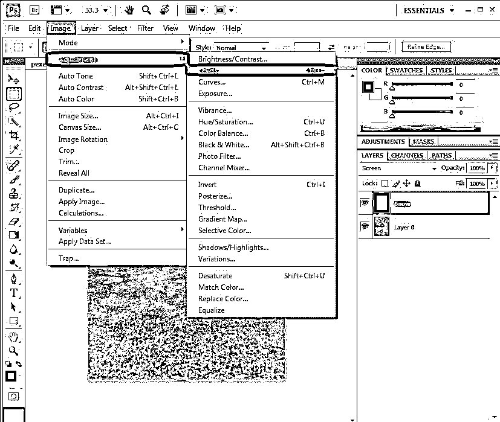

从菜单栏中选择图层转到图层，然后转到图层选择新的可调整图层，然后选择级别并将输入级别调整为 162 1.00 204 或 41 1.00 119，这是常用的级别。级别的值还会根据拍摄的图像延迟，并按所需的速率调整降雪量。然后点击 ok 来应用雪的效果。

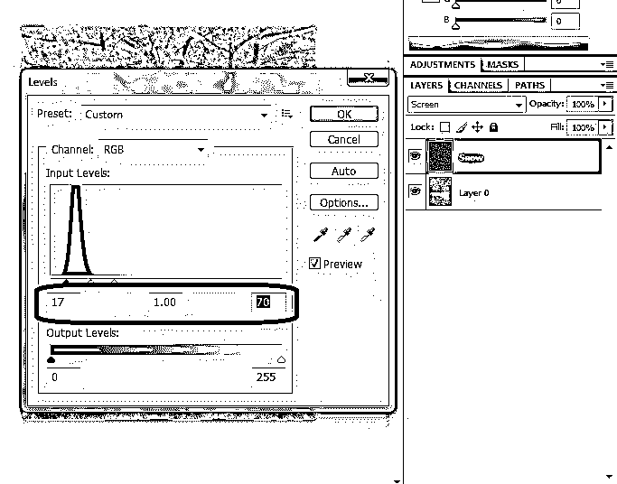

**步骤 11:** 进入编辑，点击按钮 transform，选择旋转选项。

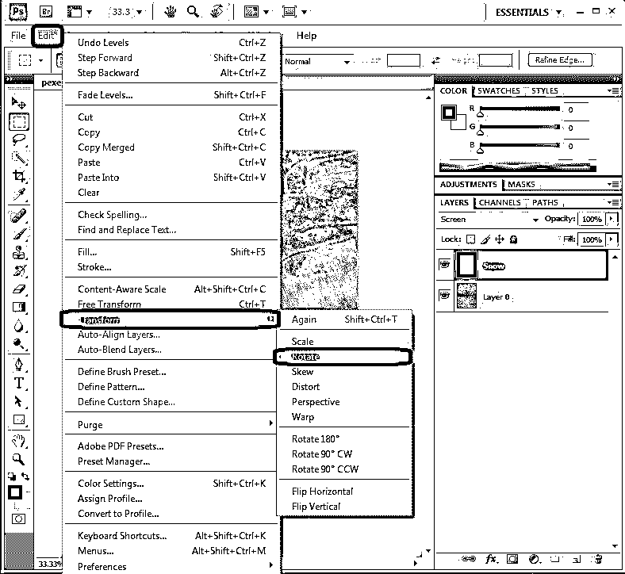

将图层旋转 180 度，让雪花以自然的角度落下。这有助于改变他们图像中雪花的角度。这在这里，它的常规过程，以增加更清晰的专业细节遵循以下步骤。

**第 12 步:**转到滤镜，点击像素化，选择结晶选项。

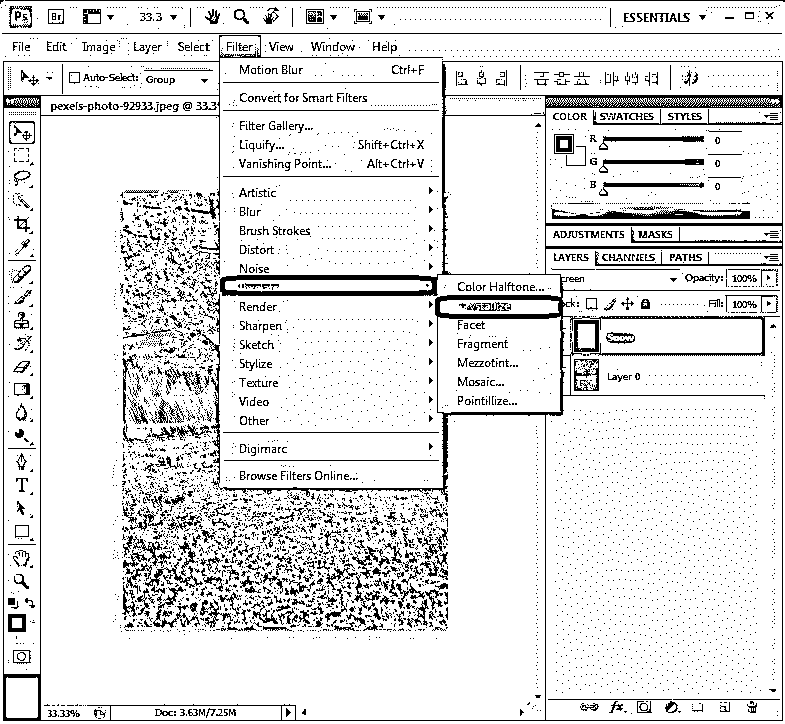

将结晶应用于图像，并使用单元格大小调整单元格的大小，通常根据图像所需的效果，将值调整为 10 到 20。单击“确定”应用结晶效果。

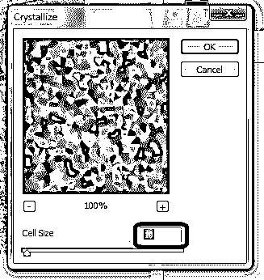

**步骤 13:** 使用滑块重新调整等级。

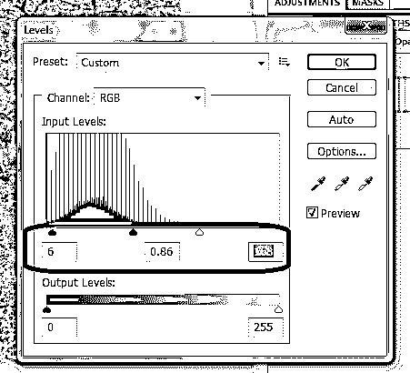

可以更改图像的色阶和 RGB 值以及其他属性，以获得雪的外观和感觉，并在质量和要求方面对其进行改进。

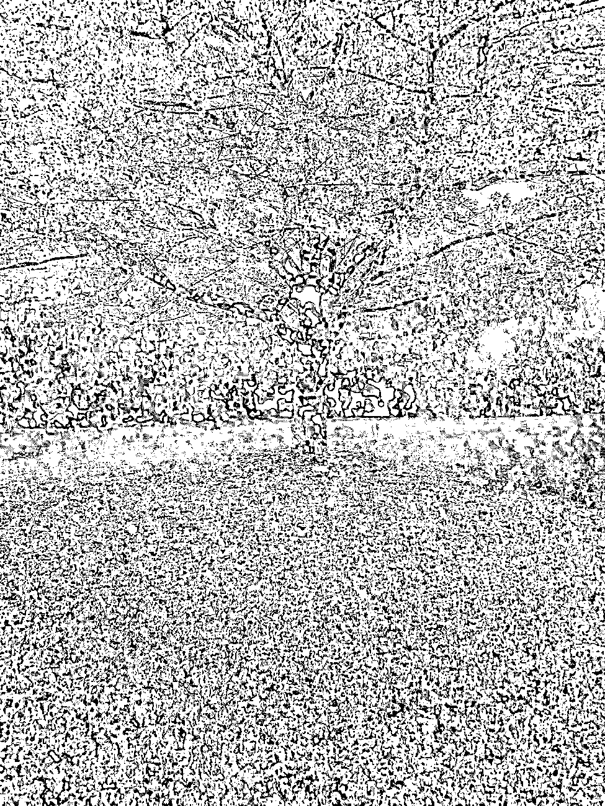

### 结论

photoshop 中的 Snow effect 有助于将雪的观感添加到所需的图像中；这种方法有助于以同样的方式和程序为照片添加非季节性效果。总是很难在照片上产生这样的效果，并通过轻微的风景调整来使雪的效果与拍摄的照片相匹配。如果我们按照上面的步骤，很容易在一天结束时给图像添加雪的效果。我们学习了如何根据图像的要求制作雪花，改变雪花的角度来获得雪花落下的真实感。完整的课程详细介绍了使用不同的视图和属性过程来个性化图片，以及使用专业技巧为选定的图像添加雪花效果。尝试这些步骤，让你的形象变得清晰。

### 推荐文章

这是一个在 Photoshop 中制作雪花效果的指南。在这里，我们讨论了 photoshop 中的雪效果的介绍和影响图像的步骤。您也可以浏览我们推荐的其他文章，了解更多信息——

1.  [后期效果中的运动模糊](https://www.educba.com/motion-blur-in-after-effects/)
2.  [后期效果中的模糊指南](https://www.educba.com/blur-in-after-effects/)
3.  [摩卡在后效](https://www.educba.com/mocha-in-after-effects/)
4.  [降雪后的影响](https://www.educba.com/snowfall-in-after-effects/)

