# Photoshop 中的透明文本

> 原文：<https://www.educba.com/transparent-text-in-photoshop/>

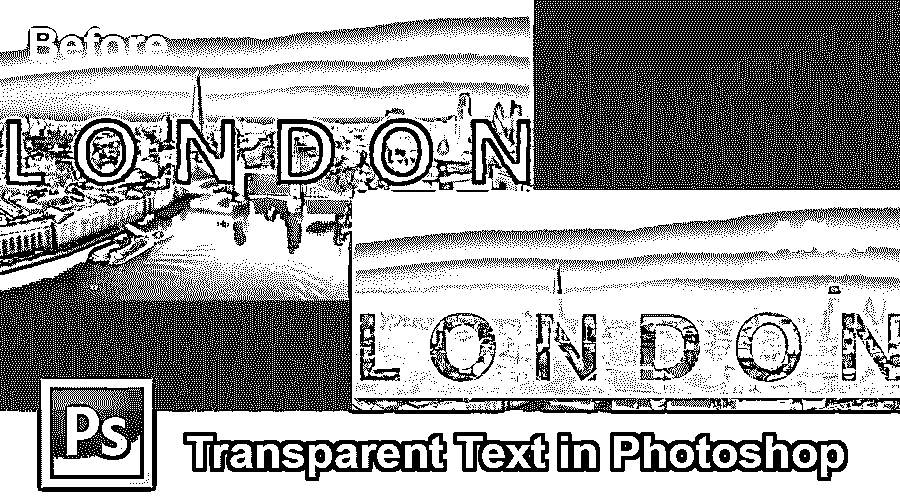

## Photoshop 中透明文本的介绍

透明文本是平面设计的流行趋势。通过透明文本，我们可以操纵文本中的图形效果，并使文本在图像中看起来令人惊叹。在本文中，我们将借助一些例子来讨论如何在 Photoshop Cs6 中创建透明文本。

### 如何在 Photoshop 中创建透明文本？

有多种方法可以在 Photoshop 中创建透明文本，使图像看起来令人惊叹。下面我们就来逐一看看 Photoshop 中两种简单快捷的文字透明方法。我们如何在 Photoshop 中制作透明文本

<small>3D 动画、建模、仿真、游戏开发&其他</small>

#### 方法 1–使用剪贴蒙版

Photoshop 中透明文本的第一种方法是以一步一步的方式展示下来的。

第一步:进入文件菜单，点击打开。点击打开后，会弹出一个窗口，如下图所示。

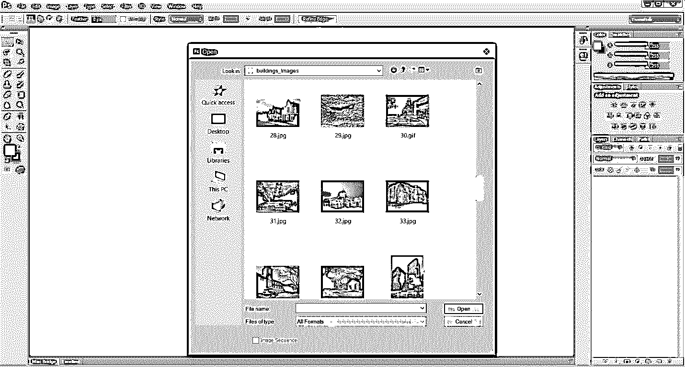

**第二步:**选择您想要的合适图像并打开。

**第三步**:右键点击文字工具，选择横排文字工具，写下你要使用的文字。我要写课文，也就是伦敦。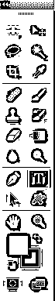

**第四步:**进入编辑菜单，选择自由变换或者按 Ctrl + t 快捷键，将文本缩放到你想要的任意大小。

**Note**: The text layer should be the upside of the background layer.

第五步:现在新建一层。

创建新层有三个选项。

*   **选项 1** :进入图层菜单，点击新建并选择图层…
*   **选项二**:按快捷键 Shift+Ctrl+N；它将为您创建一个层。
*   **选项 3** :点击图层属性附近的右下角，直接创建一个图层，如下图所示。

**第六步:**选择矩形选框工具。

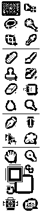

**步骤 7:** 如下图所示，在文本周围做一个选择。

**第八步:**现在，选择你想要的背景色；我会选择白色。然后按 Ctrl + Backspace 填充背景。

步骤 9: 保持文字层在我们现在创建的填充白色背景层的上面。

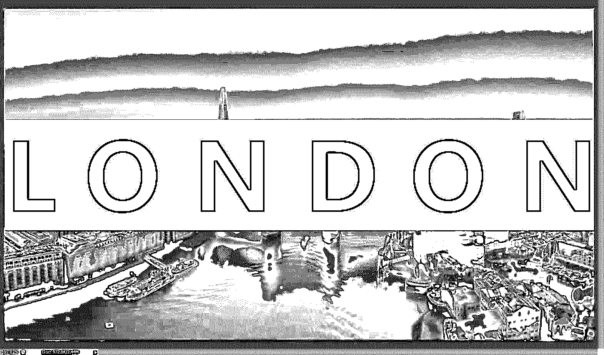

然后调整你的不透明度，并填写你的填充白色背景层。我只是减少了不透明度和填充一点点。

**步骤 10** :按 Ctrl + J 复制一份背景图层；它将创建一个背景的复制层，并将该层放置在伦敦文本的上方，如下图所示。

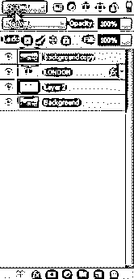

**步骤 11:** 右键点击背景复制图像，选择创建[剪贴蒙版](https://www.educba.com/clipping-mask-in-photoshop/)。

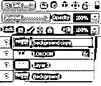

现在它几乎准备好了，正如你在图片中看到的。

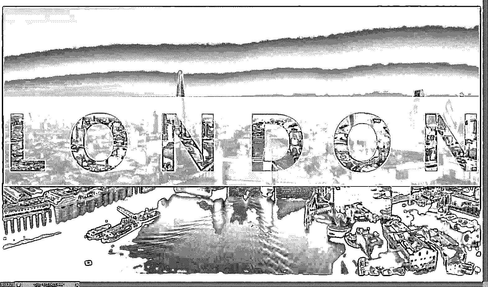

**步骤 12** :然后进入混合模式，点击混合模式后会得到混合多个选项；从那里，你必须选择一个如下图所示的乘法选项。

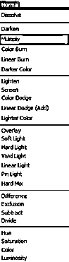

这一点点放大图像的不透明度，使阴影变暗。现在透明文本已经准备好了，正如你在下图中看到的。

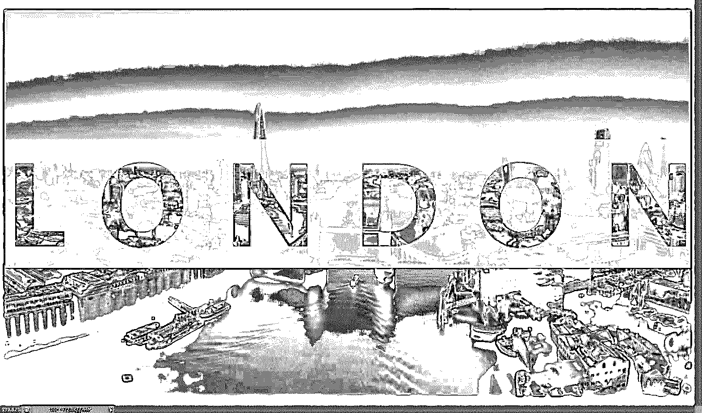

#### 方法 2:使用柔光法

Photoshop 中透明文本的第二种方法是一步步展示下来的。

**步骤 1:** 转到该文件并打开它，这将弹出如下图所示的窗口。选择你想要的合适的图像。

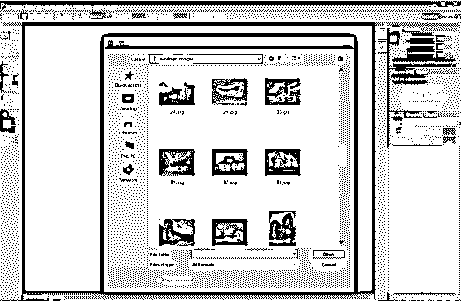

**第二步**:双击图层，解锁图层。

**第三步:**右键点击文字工具，选择横排文字工具。

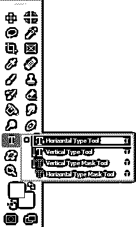

**第四步:**点击图片任意位置。

**第五步:**点击文字按钮。

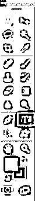

**第六步:**进入编辑菜单，选择自由变换或者按 Ctrl + t 快捷键，将文本缩放到你想要的任意大小。

**Note**: The text layer should be upside of the background layer.

**第七步:**选择横排文字工具，选择设置好的文字颜色，将文字颜色改为黑色。

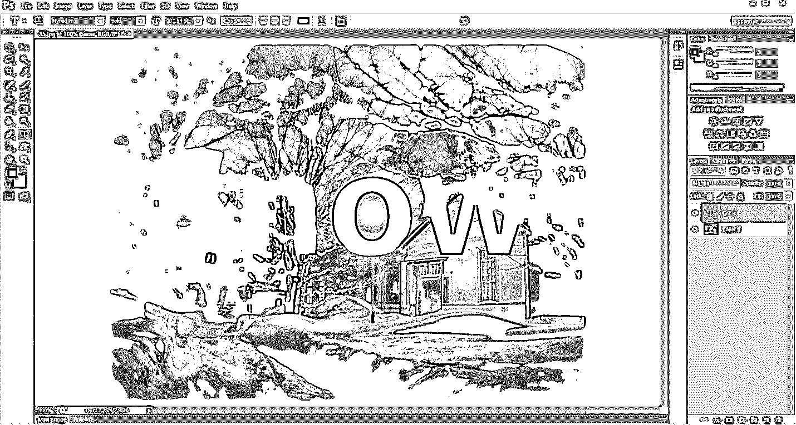

**第八步:**现在进入混合模式，点击混合模式后会得到混合多个选项；从那以后，你必须选择柔光，如下图所示。

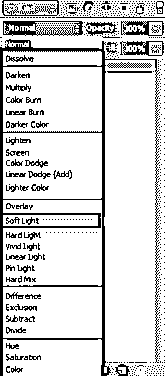

选择柔光后，你的图像看起来会有点透明，如下图所示。

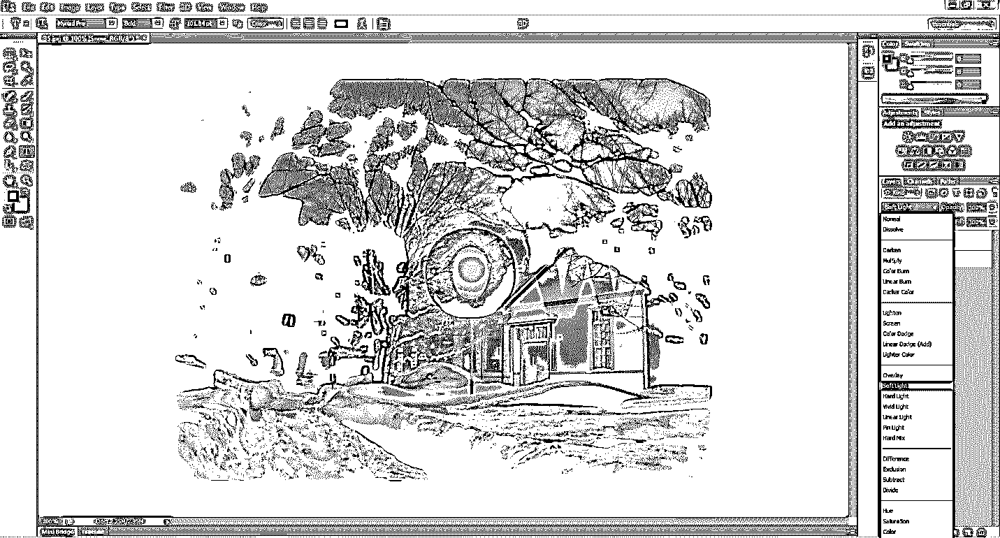

**第九步:**按住 Ctrl 键，点击文字层，进行选择。

**第十步:**转到选择菜单，然后点击反转或按(Shift + Ctrl + I)使选择反转。它将选择除文本以外的全部背景。选择后，您的图像将看起来像下面显示的图像。

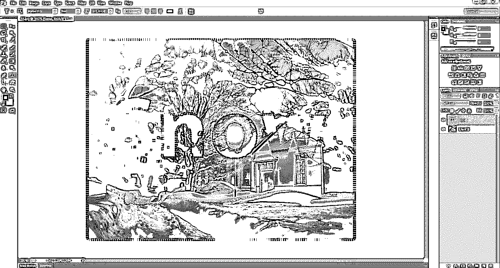

**步骤 11:** 如下图所示到右下角的调整图层，选择纯色；之后，你必须选择你想要的颜色。我打算选择白色。

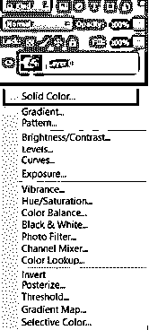

它将使一个纯白色的背景，除了文本，这是没有被选中的选择。形成新的一层。选择纯色后，你的图像看起来如下图所示。

**第十步:**调整不透明度，根据你的图像填充。我将选择不透明度为 80%，填充为 70%，如下图所示。

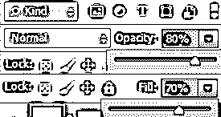

它将使变白的背景变亮，并用透明文本显示背景。

我们得到的最终图像！!!!!!

### 结论

这意味着我们已经涵盖了您在本练习中需要做的所有事情，当您需要通过内容发现的图像位于背景层上时，如果您需要通过内容显示背景层上的图片。我们做到了！这是有效地将简单内容添加到 Photoshop 图像中的方法！并在 Photoshop 中制作透明文本。我们已经看到了如何在 Photoshop 中创建透明文本的两种方法。这就是如何在 Photoshop 中快速简单地制作透明文本。

### 推荐文章

这是 Photoshop 中透明文本的指南。在这里，我们讨论的概念和两种不同的方法来应用透明文本在 photoshop 中。您也可以浏览我们推荐的其他文章，了解更多信息——

1.  [变换工具 Photoshop](https://www.educba.com/transform-tool-photoshop/)
2.  [Adobe Photoshop 工具](https://www.educba.com/adobe-photoshop-tools/)
3.  [自动化测试工具](https://www.educba.com/automation-testing-tools/)
4.  [Photoshop 中的锐化工具](https://www.educba.com/sharpen-tool-in-photoshop/)

