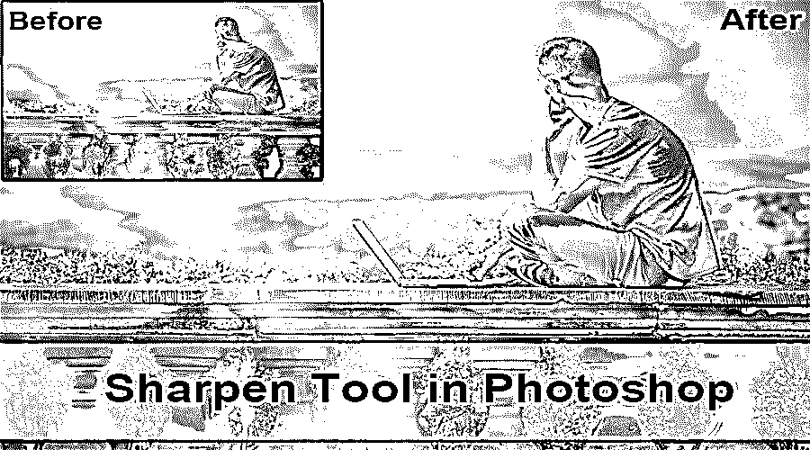
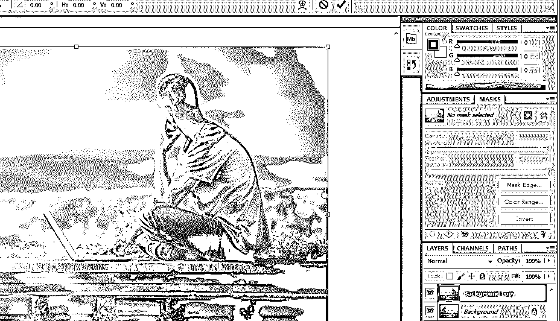
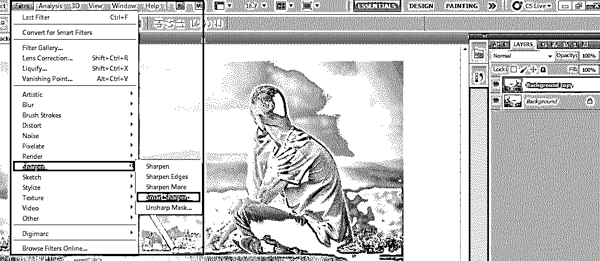
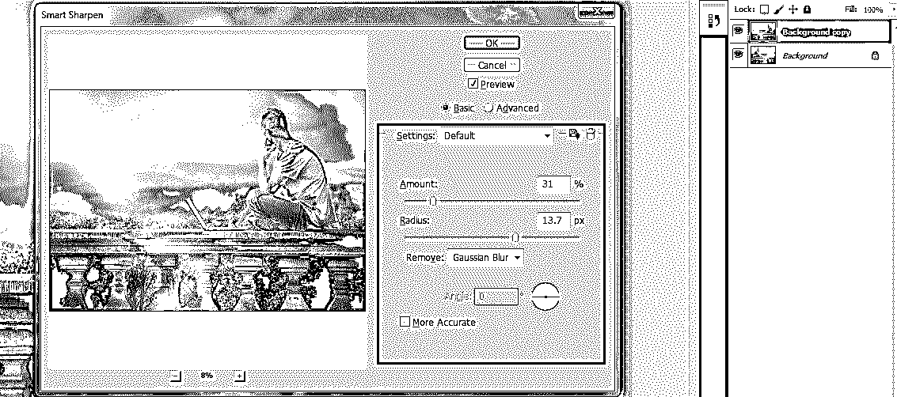
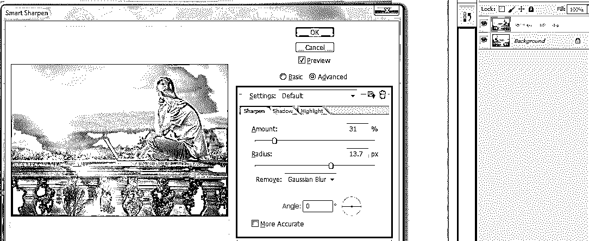
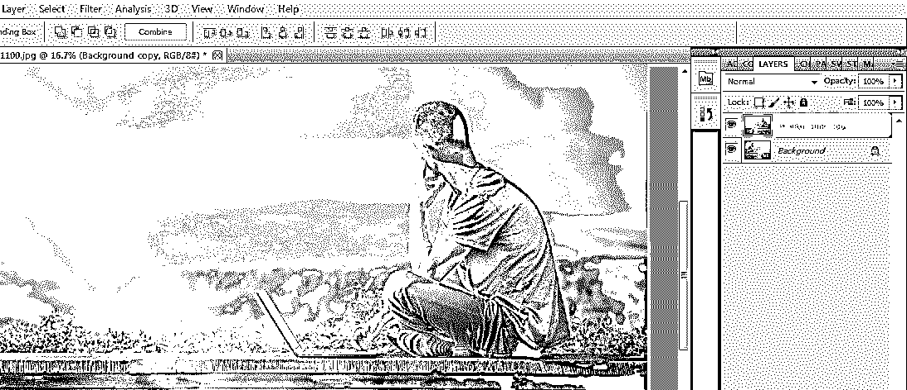
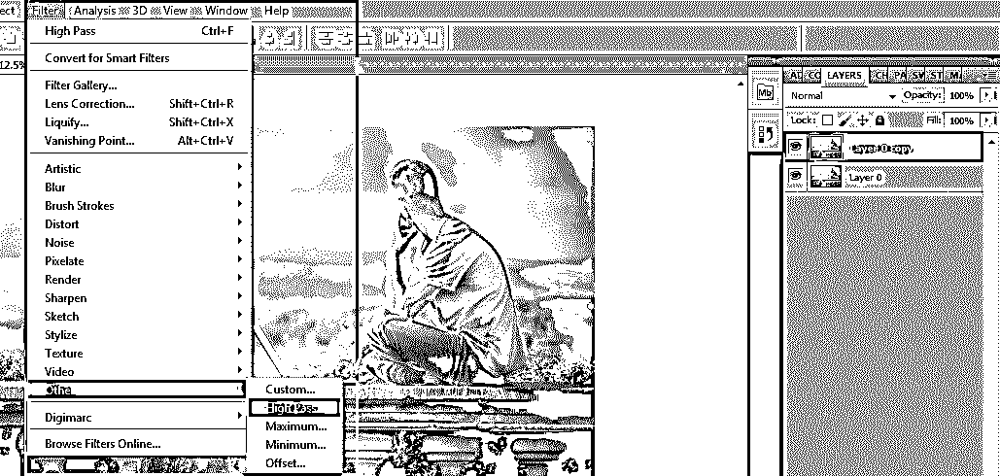
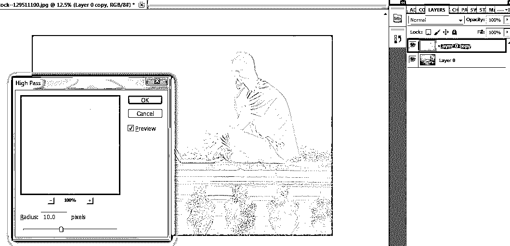
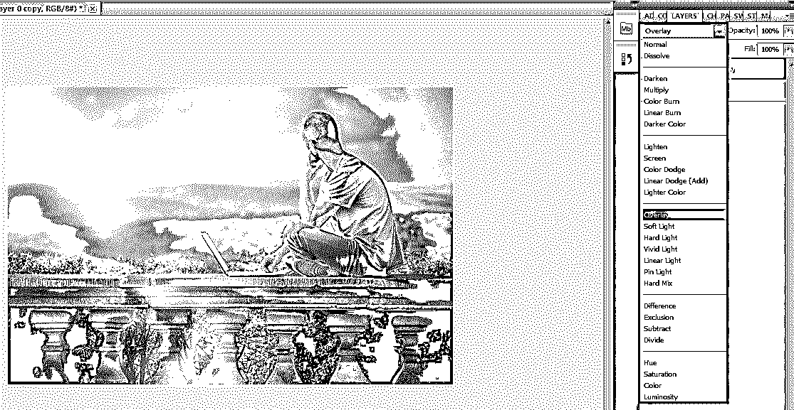

# Photoshop 中的锐化工具

> 原文：<https://www.educba.com/sharpen-tool-in-photoshop/>

## Photoshop 中的锐化工具简介

Photoshop 是用于多种图像和视频编辑目的的优秀软件，拥有所有最好的工具；今天，我们将看到在 Photoshop 中使用锐化工具来编辑图像，以提高视觉外观的锐度，这取决于图像的质量。我们越锐化，图像就越模糊，所以在对同一图像进行锐化时要非常确定。

锐化工具在图像中添加了一个智能锐化滤镜，使用一个遮罩层或一个额外的层来区分对图像所做的编辑。我们可以使用所有类型的刷子，调整大小和形状。锐化图像有多种模式，具体取决于对样本的要求。拍摄图像时，在不同图层的图像上尝试不同的模式，并根据需要选择最适合您的图像。

<small>3D 动画、建模、仿真、游戏开发&其他</small>

颜色增强的边缘将使用此工具和不同的预设配置来完成。在编辑过度移动画笔后，图片上正确的锐化移动量将变得不明显，这使得它看起来很奇怪，甚至不现实，这不是专业的。我们可以使用 Photoshop 中的直接工具进行锐化，也可以使用锐化滤镜。这两种工具都有自己的表现方式，我们坚持要求用户尝试这两种工具，并根据项目需求灵活选择。锐化工具在技术上有更多的配置，这将在下面工具的使用内容中讨论。

Photoshop 拥有图像、图形的所有需求，并通过多种工具、属性和效果增强图像的丰富性。不使用锐化工具就是这样一种工具。让我们看看如何使用它，并讨论它的可用属性设置，然后再将其应用于图像。有几个循序渐进的过程来增强图像共享，下面以适当的方式列出，包括项目所需的图像清晰度的智能管理。我们将使用蒙版，复制，并在多个层上工作，直到我们得到我们的输出。

有不同的技术方面，如正常，变暗，变亮，色调，饱和度，颜色和亮度。所有这些都有其自己的目的，专业人员对它们很熟悉，因为初学者必须在不同的图像上尝试所有这些，并测试最适合他们需要的图像。接下来是智能锐化选项，它可以控制图像的清晰度，它有基本和高级设置等，不清晰的遮罩可用于降低清晰度，有助于快速改变清晰度图像的数量、半径和阈值控制。Photoshop 上还有一些其他技术工具，如颜色、画笔等。

### 如何使用锐化工具？

Photoshop 有一个锐化选项，可以稍微增加图像的原始和锐利外观，这可以将图像从经典的感觉改变为图像上一些锐利和有趣的侵略性阴影，使图像有趣，视觉效果良好。

### 处理锐化工具的步骤

下面是在 Photoshop 中处理锐化效果的步骤。

#### 第一步

双击打开 Photoshop 或右键单击 Photoshop 图标并选择以管理员身份运行让应用程序启动一旦应用程序打开，导入或打开需要锐化的图像并右键单击图像并选择复制；我们可以在两层中看到图像，这意味着我们有一个原始加载的图像和一个新的相同图像的副本(快捷键 Ctrl+J)。右键单击新创建的层，并选择转换为智能对象，保持原始图像的安全，并有助于应用清晰度效果和最佳效果的过滤器。

#### 第二步

点击顶部菜单栏中的过滤器，并选择锐化；我们可以看到一个箭头，其中包含多个可用的锐化选项，从中选择智能锐度。

#### 第三步

智能锐度窗口打开，有多个选项，如要添加的锐化百分比，控制图像的锐度；它有基本和先进的图像锐化选项，还处理添加阴影，突出细节等。

**基本选项:-**

**高级选项:-**

#### 第四步

我们可以保存锐化滤镜设置，并通过在两者之间切换来比较原始和应用的锐度滤镜层，以了解差异，这有助于在更短的时间内实现图像的锐度。

#### 第五步

高通是一个简单的图像锐化滤波器，具有更有效的步进处理设置。选择复制的图层，切换 o 滤镜，转到其他图层，选择高通。

高通将被应用到一个层，图像变得更加清晰和有效。我们可以看到一个高通窗口打开设置半径范围的像素计数调整可以使用滚动半径值的点。然后点击确定。

此选项将增加图像的比例，并使用照片的混合模式；我们可以得到一个合适的图像；有几个推荐使用的模式，如重叠，柔光，强光和线性光。基于该模式，图像的外观不断变化。可以相应地进行高过滤器清晰度调整。

### 结论

锐化滤镜效果是 Photoshop 中有效使用的选项之一；它有助于通过使用慢速锐度获得低值%的好图像，在使用此工具时必须小心填充和定期使用。如果我们追求更高的声誉，就有可能出现噪点和粗糙的像素，所以要小心。使用所有图层减少工作量工具需要算法来修复对所有图层的影响。该工具还调整图像在效果部分的对比度。通过锐化工具，可以赋予图像适当的细节和增强效果。

### 推荐文章

这是 Photoshop 中锐化工具的指南。这里我们讨论如何使用 Photoshop 中的锐化工具及其步骤，并配以适当的截图以便更好的理解。您也可以浏览我们推荐的其他文章，了解更多信息——

1.  [变换工具 Photoshop](https://www.educba.com/transform-tool-photoshop/)
2.  [扭曲图像 Photoshop](https://www.educba.com/warp-image-photoshop/)
3.  [搅拌机工具](https://www.educba.com/blender-tools/)
4.  [CorelDRAW 工具](https://www.educba.com/coreldraw-tools/)

