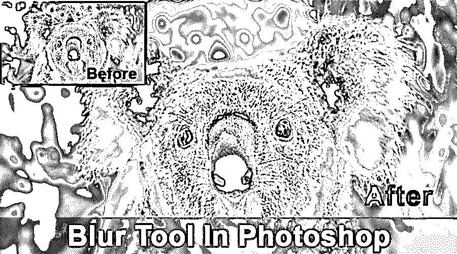
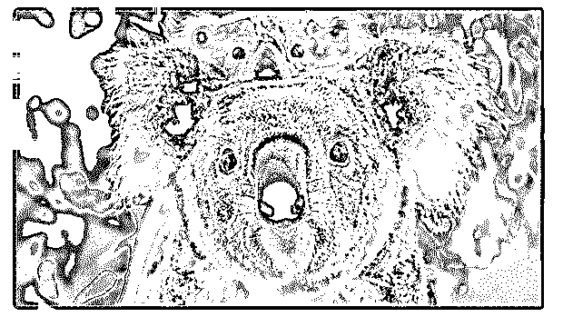
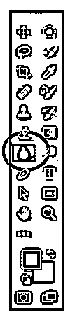
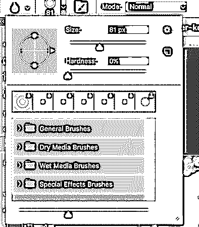
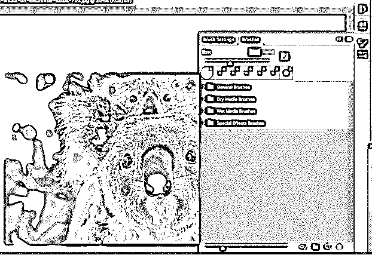
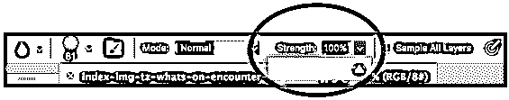
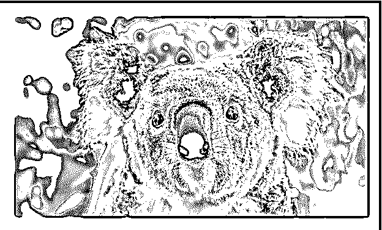

# Photoshop 中的模糊工具

> 原文：<https://www.educba.com/blur-tool-in-photoshop/>

## Photoshop 中的模糊工具简介

顾名思义，模糊工具主要用于 Photoshop 中，通过操纵像素值、对比度和锐度来创建图片的模糊效果，这有助于在最后阶段优化图像，纠正微小的缺陷，并创建与对象形成对比的外观。很明显，模糊工具用于在 Photoshop 中通过提供具有深度的清晰感觉或掩盖图像的特定部分来突出或收缩主题。

### Photoshop 里的模糊工具怎么用？

*   首先，你选择你想要处理的图像。在下图中，我们将模糊妈妈身后的小考拉:

**原始图像**

<small>3D 动画、建模、仿真、游戏开发&其他</small>

然后从工具栏中选择模糊工具，如下所示:

#### 模糊工具选择

*   接下来，您可以选择不同类型的画笔，画笔大小，笔画，设置等。当使用模糊工具时，建议避免使用大尺寸的笔刷和长的笔刷笔划，因为模糊动作是处理器穷举的，效果会滞后于笔刷笔划。

#### 顶部菜单中的模糊工具选项

模糊效果是用模糊工具绘制的。使用模糊工具绘制的每一个笔画都会降低受影响像素之间的对比度。

#### 刷子的尺寸和类型

让我们观察不同大小和类型的笔刷来应用模糊效果。

#### 笔刷设置

*   现在你可以选择你的模糊强度。你可以选择非常微妙的，这将给你更多的控制，或者你可以去一个强烈的模糊。强度低一点的话工具会更微妙。

*   所以下一步就是模糊。按住鼠标不放在要模糊的元素部分上。你可以以圆周运动的方式移动笔刷来模糊部分。

**模糊的树袋熊宝宝**

### 刷子的类型

*   普通画笔
*   干燥介质刷
*   湿媒体画笔
*   特殊效果画笔

### 模糊滤镜

模糊滤镜是一种广泛使用的图形软件效果；通常，它用于减少细节和图像噪声。让我们详细讨论这些过滤器。

**1。Average:** 这是一个一步滤镜，帮助计算图片的平均值，并用该值覆盖区域。均衡携带大量声音的区域的值是非常有益的。

**2。模糊:**这也是一个一步过滤器，提供了图片的一般模糊。

**3。更模糊:**它产生的模糊量比有条理的模糊滤镜显著增加。

**4。方框模糊:**如果你想把你的图像模糊成正方形或者方框的形式，那么可以使用方框模糊。

**5。高斯模糊:**它通过提供对图像的半径控制来帮助你更明确地调整模糊的数量。高斯模糊滤镜被认为是一个非常好的工具，因为它可以让你很好地控制模糊的类型和数量。现在，与单步模糊和模糊更多滤镜相比，这一点尤其正确，单步模糊和模糊更多滤镜记录了确定的模糊量。当你只想在一定程度上降低图像的锐度时，可以使用后两种滤镜，当你想获得特定的效果时，可以切换到高斯模糊。使用模糊工具很难在大面积上获得均匀的模糊效果。因此，模糊一个大的区域，你可以选择一个宽松的区域，羽化选择和应用高斯模糊过滤器。

**6。镜头虚化:**它模仿了你用相机拍照时可以物化的虚化。有时，你可能需要背景的某些方面保持清晰，而其他方面则模糊不清。这个滤镜可以帮助你达到你想要的景深。它有三种选择——更快、模糊焦距和反转。您可以使用“更快”来调整像素深度以实现更快的预览，选择模糊焦距，以及反转深度图源的 alpha 通道。您可以选择反转。

**7。运动模糊:**当你想模拟运动物体的模糊时，可以使用这个滤镜。此滤镜允许您平衡背景图像的方向和强度。

**8。径向模糊:**如果你想在拍摄旋转的汽车轮胎时产生模糊，那么径向模糊就是帮助你产生相同效果的滤镜。

**9。形状模糊:**它主要帮助根据你从板上选择的形状来模糊你的图像。你将会看到你发现的形状的选择将会和那些使用[自定义形状工具](https://www.educba.com/custom-shape-tool-in-photoshop/)的选择一样。你可以移动半径滑块可以移动到右边的一个更大的模糊。

10。表面模糊:如果你想模糊图像的表面或内部而不是边缘，那么这就是适合你的滤镜。如果您选择保留边缘的细节，但模糊其他一切，那么您可以使用此过滤器。

**11。智能模糊:**如果你想控制【Photoshop 如何将模糊应用到图像的边缘和其他细节，那么你可以使用这个滤镜。

### 结论

模糊工具本质上可以被视为在 Photoshop 中隐藏内容或创建字段的工具。模糊图像给它一个漂亮的外观，并通过提供一个令人赏心悦目的浅景深来增强它。模糊工具可以帮助你保持图像中的主要物体在焦点上，其他不需要在焦点上的元素被模糊。

模糊可用于隐藏细节，如车牌或审查图像的一部分或整个图像。模糊工具允许您将图像转换为智能对象，以便您可以添加效果，而不会永久更改原始图像。简而言之，模糊工具允许你对你的图像做一些有创意的事情。

### 推荐文章

这是 photoshop 中模糊工具的指南。这里我们讨论如何使用 photoshop 中的模糊工具；它的步骤与截图更好地理解。您也可以浏览我们推荐的其他文章，了解更多信息——

1.  [Photoshop 中的消失点](https://www.educba.com/vanishing-point-in-photoshop/)
2.  [安装 Adobe Photoshop](https://www.educba.com/install-adobe-photoshop/)
3.  [扭曲图像 Photoshop](https://www.educba.com/warp-image-photoshop/)
4.  [变换工具 Photoshop](https://www.educba.com/transform-tool-photoshop/)

