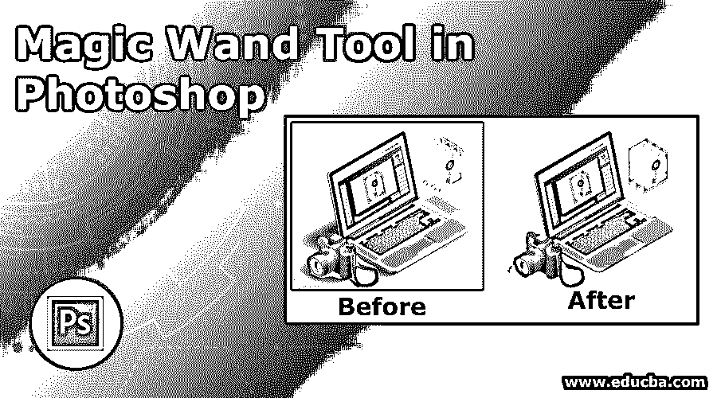
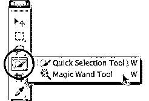
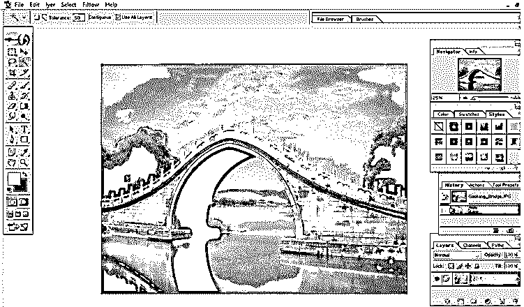
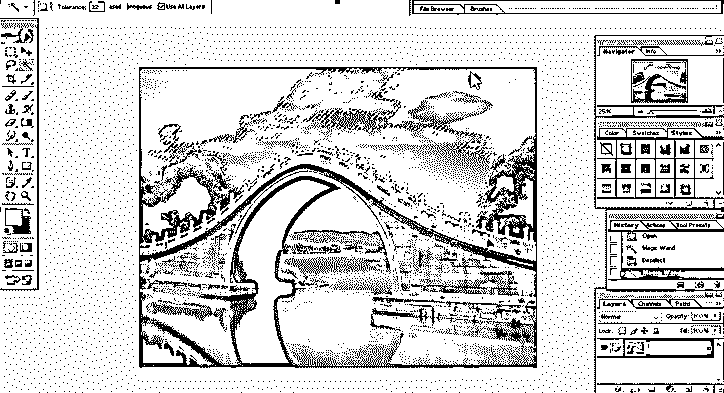
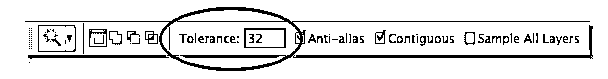
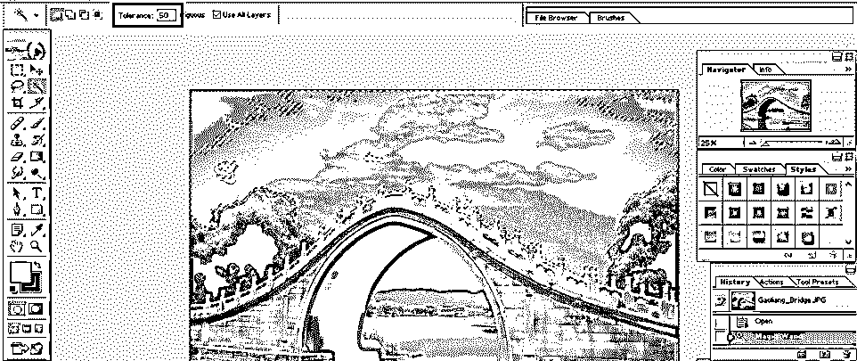
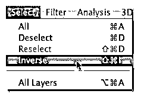
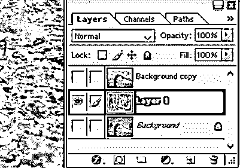
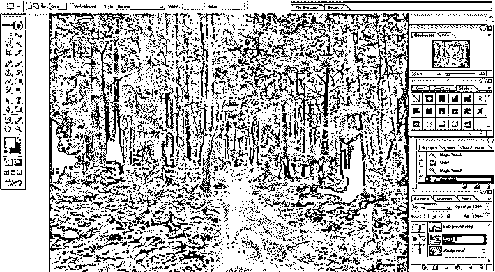
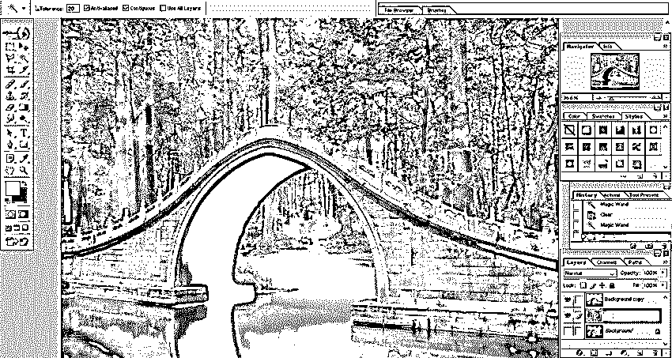

# Photoshop 中的魔棒工具

> 原文：<https://www.educba.com/magic-wand-tool-in-photoshop/>

## Photoshop 中的魔棒工具介绍

魔术棒工具是 Adobe Photoshop 中一个非常有用的功能，它像魔术一样，根据色调和颜色自动选择图像的一部分，此外，它还可以微调图像边缘，调整某些参数，如公差，一旦正确完成， 魔术棒工具可以精确地选择图像中的像素，否则使用手动操作提取这些像素将非常困难和耗时，因为魔术棒工具可以在几秒钟内根据色调和颜色识别并准确选择复杂和大的像素，以便您可以使用该部分并用任何其他图像替换它。

### 如何使用魔棒工具？

让我们从魔杖工具的选择开始。为此，我们应该确定图标的位置。对于 CS2 或更早版本，您可以从工具托盘中选择图标。但是从 CS3 版本开始，他们在工具面板中引入了一个快速选择工具，其中包括魔棒工具。

<small>3D 动画、建模、仿真、游戏开发&其他</small>

检查下面的图片，它显示了工具面板，魔术棒工具附在快速选择工具后面。将光标放在图标上几秒钟后，弹出菜单会出现，其中显示了魔杖工具。

为了解释魔棒工具的工作原理，我选择了一个背景是天空的桥的图像。为了开始试验，

在 Photoshop 软件中打开图像，如下图所示。

正如我之前告诉你的，魔棒工具根据颜色渐变和色调来选择对象。在我们打开的图像中，我们可以看到一座橙色蓝色天空的桥梁。当我们选择魔杖工具并单击图像中的某个区域时，魔杖工具将查看我们选择的区域的色调和颜色，并选择包含相同颜色和亮度值的像素。

例如，如果我想改变图像的背景，我需要选择除了桥以外的所有区域。为此，使用魔棒工具点击天空区域的任何地方。你可以看到整个背景颜色相同，色调会被选中。但是在下面给出的图片中，你可以看到只有一部分天空被选中。

这是因为软件中给出了默认的公差值。容差值定义了选定区域与未选定区域的色调和颜色的差异程度。这里我们可以看到天空中从深蓝色到浅蓝色的色差。这种差异导致工具选择天空的一部分。

要解决这个问题，我们需要改变宽容的价值观。检查下面附加的面板图像，该图像显示了公差图标的位置。

默认情况下，Photoshop 中的公差值为 32。这意味着软件将选择与我们选择的区域具有相同色调和颜色的任何像素，以及任何亮度高达 32 色度或亮度高达 32 色度的像素。通过增加公差值，我们将获得更好的结果。我将公差保持在 50，如下图所示。

即使在我的第二次尝试中，我也不能选择整个背景。为此，我可以用更高的容差值再试一次。但是还有另一个更简单的方法来选择剩余的区域。魔棒工具包含一个名为“添加到现有选项”的选项，这意味着我可以在第一次选择的基础上添加更多选择。为此，按住 shift 键并单击您想要选择的区域，然后工具光标会出现一个加号。这意味着您已准备好添加选择；在我们的例子中，当加号可见时，单击初始选择中不包括的背景区域。因此，我们可以选择图像的整个背景。

对于选择要替换的天空，还有一个选项可用。我们可以选择剩余的区域，而不是选择天空，使用反向功能，我们可以选择天空。这意味着当我们选择反向选项时，它将选择所有未选择的内容，并删除最初选择的区域。为此，进入屏幕顶部的选择菜单，选择如下所示的相反选项。

在我们的例子中，第一种方法本身就是一个耗时的过程。

选择要用原始图像替换的新图像。打开新的图像，并把它作为第二层。

要替换背景，我们必须将选定的区域复制到一个新的层。为此，按“Ctrl+J”将选定的区域复制到图层面板中的图层，并将其保存为图层 1。在这之后，打开新的图像，我们想设置为新的背景。然后按“Ctrl+A”选择整个图像，然后按“Ctrl+C”将其复制到剪贴板

在这之后，我们将返回到我们的原始图像，并在图层面板中单击背景图层，这样当我们将新的背景粘贴到文档中时，它将保存在现有的两个图层之间。最后，按 Ctrl+V 将新背景粘贴到文档中。请看下图，新的背景。

### 结论

正如我们在本教程中看到的，魔棒工具是一个非常[有用的选择工具](https://www.educba.com/selection-tool-in-photoshop/)，允许用户选择几乎不可能手动选择的像素。这也是选择大型复杂形状的最简单快捷的方法。正如我们已经讨论过的，该工具基于像素的颜色和色调进行选择，因此，最终的选择将更加准确和清晰。

通过本教程，您将学习魔棒工具的基本和常用功能，通过不断练习，您将能够使用该工具的所有功能，并且您可以毫不费力地创建非常准确和精确的选区。

### 推荐文章

这是 Photoshop 中魔棒工具的使用指南。这里我们讨论一下如何在 Photoshop 中使用魔棒工具及其步骤，并配以截图，以便更好的理解。您也可以浏览我们推荐的其他文章，了解更多信息——

1.  [3D 软件设计](https://www.educba.com/3d-software-design/)
2.  [Photoshop 职业](https://www.educba.com/career-in-photoshop/)
3.  [Photoshop 免费吗？](https://www.educba.com/adobe-photoshop-software/)
4.  [什么是 Adobe Illustrator？](https://www.educba.com/what-is-adobe-illustrator/)

