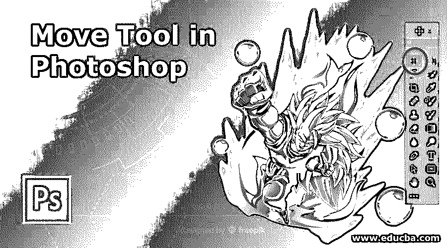
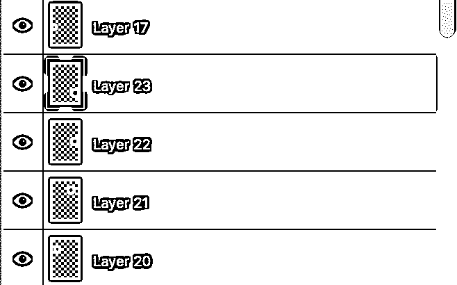
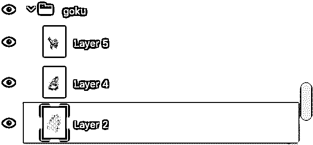
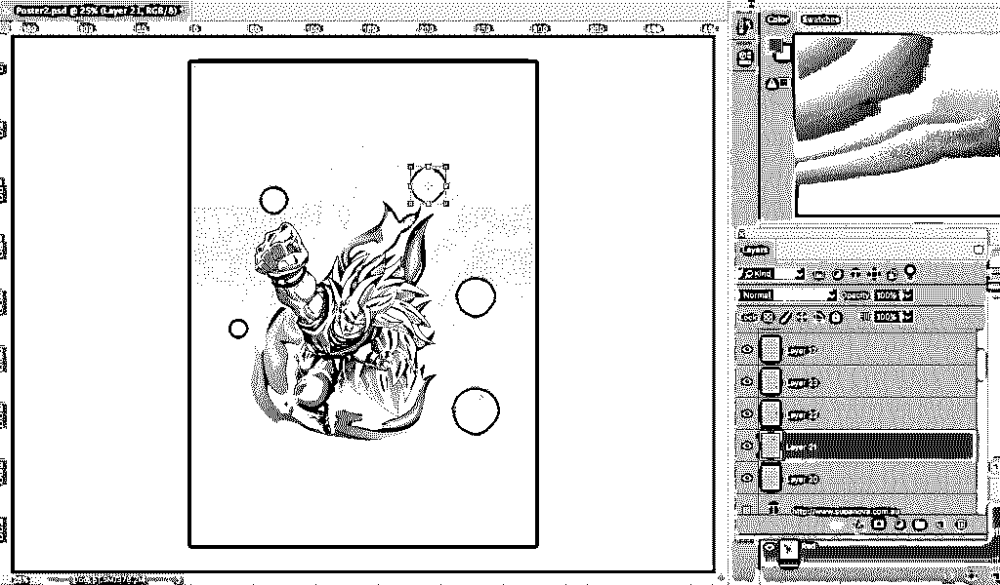
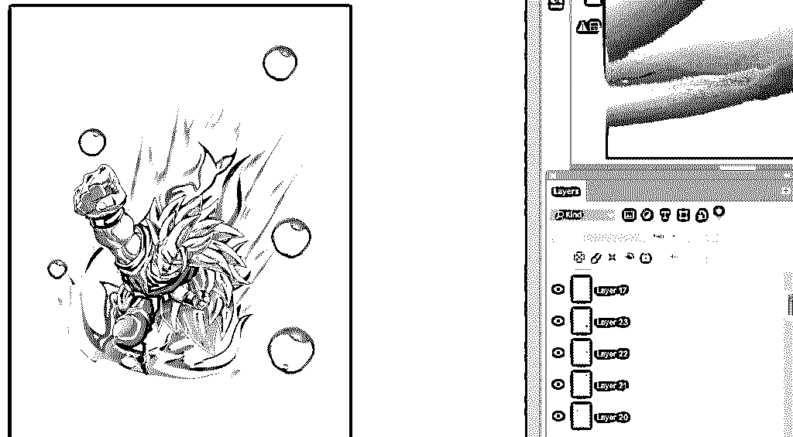

# Photoshop 中的移动工具

> 原文：<https://www.educba.com/move-tool-in-photoshop/>

## Photoshop 中移动工具简介

移动工具是 Adobe Photoshop 中的一个强大工具，它支持许多主要用于为图稿提供移动/对齐/变换选项的功能，包括移动内容层、在“层”面板中更改层的位置、使用变换属性、调整对象的形状或大小以及列表继续。此外，线条工具足够智能，可以令人信服地同步以匹配选区的线条或图案，您所要做的就是遵循正确的步骤和方法，从从工具栏中选择移动工具开始，到在设计中应用它。

### Photoshop 中的移动工具怎么用？

要激活移动工具，你只需要在工具面板上点击移动工具或者按 v 键。

<small>3D 动画、建模、仿真、游戏开发&其他</small>

**移动工具选择**

只有当图像中存在可以移动的元素时，移动工具才起作用。它应该有一个以上的层，它也必须处于解锁状态，以便图像可以移动。要解锁图层，您需要在图层面板中激活它。快捷方式可以帮助您在 photoshop 中节省大量时间，了解它们会让您的工作更轻松。按住 alt 键，然后点击图像将帮助您拖出一个当前图像的副本。使用不同的图层，你可以根据自己的需要自由移动图像。

在下图中你可以看到它有八层:五层是龙珠，一层是悟空，两层是火的图像。

**层(龙珠)**

**层(悟空，两个火影)**

**高级功能:**

*   **自动选择:**

这项功能可以节省你大量的时间。选中它时，无论您将鼠标光标放在哪里，移动工具都会自动激活顶层并移动它。当图像中有大量图层时，这可能会很有用。使用移动工具也可以选择多个图层。由于它处于自动选择模式，您可以在画布区域外使用移动工具进行选取框拖动来选择多个层。

**看看下图:**

当球被点击时，层自动被选中。选择移动工具后，您现在可以四处移动球。只需点击球并拖动它来移动它。查看下图中球的位置变化:

*   **组/层:**

组/层选项允许用户在层或组之间进行选择。如果选择了图层组，Photoshop 将自动选择整个图层组；如果选择了图层，Photoshop 将自动选择单个图层。选择一个图层作为选项对于图层很少的文件很有用。您可以在未选择“自动选择图层”的情况下选择图层，方法是在单击图层时按住 ctrl(windows)/cmd(mac)。

*   **显示变换控件:**

当此功能打开时，Photoshop 将在图像周围显示拖动块。您可以通过拖动这些块来平衡图像的大小。此外，在使用“移动”工具选择多个图层时，您可以选择“显示以变换”控件，以便 photoshop 可以在所选对象周围显示前导框。它不仅有助于显示哪些层被选中，而且您可以使用它来快速改变对象，而无需选择“自由变换”命令。

*   **对齐/分布图层:**

单击 Ctrl/Cmd，然后右键单击任何层，然后选择链接层来链接两个层。当几个层链接在一起时，您可以单击选项栏中的分布和对齐按钮来代替导航层。

*   **3D 模式:**

当您处理 3D 对象时，可以使用此功能。如果您想让 photoshop 知道您要执行哪种移动，您可以单击选项栏中的一个 3d 模式图标，然后在 3D 空间中拖动，或者单击对象本身来移动 3D 轴 HUD。3D 模式仅适用于 photoshop 的扩展版本。

### 结论

因此，移动工具可以用来移动你的图像的任何部分，根据你的要求，只要它有一个以上的层，它是解锁的。另外，当选择另一个工具时，按住 cmd(mac)/ ctrl(windows)可以临时访问移动工具，这是在 adobe photoshop 中了解快捷键的另一个优势。

使用内容感知移动工具，您可以轻松地将部分图像移动到新位置。可以同时激活多个层，当您碰巧选择了两个或更多层并选择了移动工具时，您可以利用选项栏中的对齐功能。

您可以创建图层组，复制它们并四处移动它们。如果您想要将文件中的图层置中，请选择「移动」工具，然后选择「选取」>「全部」,然后按一下选项列中的「垂直置中对齐」和「水平置中对齐」图示。显示变换控制可用于在选定移动工具的情况下，自动显示选定层内容周围的变换手柄。

这也是在图层上寻找内容中心的一个很好的选择。通过将移动工具直接放置在参考线的顶部，可以使用移动工具来重新定位参考线。当图标变为双向箭头时，您可以单击并拖动来重新定位参考线。这样看来，move 工具是 photoshop 中非常有用的常用工具。

### 推荐文章

这是 photoshop 中移动工具的指南。这里我们讨论了如何使用 photoshop 中的移动工具及其高级功能。您也可以看看以下文章，了解更多信息–

1.  [Adobe Illustrator 工具](https://www.educba.com/adobe-illustrator-tool/)
2.  [网页设计工具](https://www.educba.com/web-designing-tools/)
3.  [Photoshop 的使用](https://www.educba.com/uses-of-photoshop/)
4.  [3D 软件设计](https://www.educba.com/3d-software-design/)

