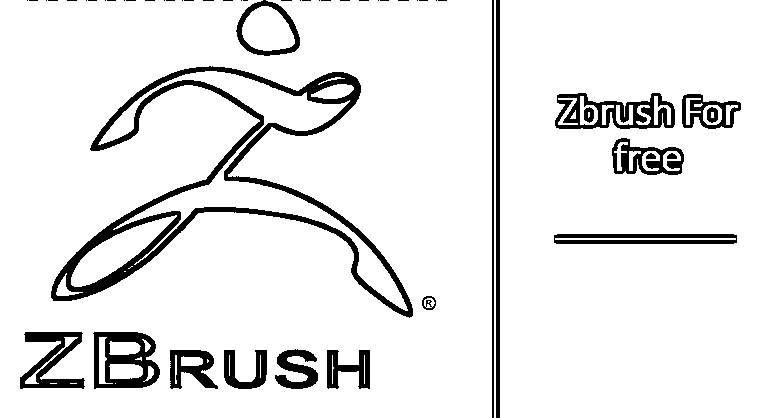

# 免费的 Zbrush

> 原文：<https://www.educba.com/is-zbrush-free/>

## Zbrush 是什么？

Zbrush 是业界领先的数字艺术家雕刻和纹理绘画工具。它有一个类似雕塑工作室的环境，网格给你一种用“数字粘土”工作的感觉。

Zbrush 有一个陡峭的学习曲线，可能需要数年才能掌握，但它是数字雕刻领域最有能力的软件，为艺术家创造逼真的角色和环境提供工具。

<small>3D 动画、建模、仿真、游戏开发&其他</small>

### 系统需求

要免费使用 Zbrush，您需要支持 OpenGL 3.3 或更高版本的显卡、英特尔酷睿 2Duo CPU 或 AMD 等效处理器、4gb RAM、8GB 硬盘空间、鼠标/Wacom 兼容平板电脑以及最低分辨率为 1280×1024、32 位彩色的显示器。

### Zbrush 用在哪里？

十多年来，它在电影、视觉效果和 AAA 视频游戏制作方面有着良好的记录。电影中，Zbrush 已用于视觉效果，包括大片，如指环王系列，漫威的复仇者联盟系列，不可思议的绿巨人，钢铁侠，美国队长，阿凡达，纳尼亚传奇系列，加勒比海盗等，以及动画电影，如 Rango，Wreck-It Ralph，卑鄙的我，纠结等等。

对高多边形数和大量工具的支持使在可管理的时间框架内创建详细的角色成为可能，这使得中土世界、潘多拉和纳尼亚的广阔而多样的世界充满了你只能在想象中找到的生物，细节清晰。

几乎每一个值得一提的 AAA 视频游戏都是在 Zbrush 的帮助下创建的，包括但不限于战神、Paragon、幽灵侦察荒野、辐射 4、质量效应仙女座菌株、龙腾世纪等等。Zbrush 使这些和更多的游戏在视觉效果上达到了与电影相当的真实感水平，并使更多基于故事的游戏得以创建。

在电视上，使用 Zbrush 的最著名和最杰出的例子是 HBO 电视台根据乔治·R·R·马丁的冰与火传奇歌曲改编的《权力的游戏》。

### 学习 Zbrush

#### 在线的

网上有很多学习 Zbrush 的资源，从 Zbrush Central 提供的大师班开始，或者从 Gnomon Workshop、Pluralsight、Lynda.com 等在线学习网站开始。，让你开始运作。Gnomon Workshop 是一个专门为这些行业的各个层次的专业人士提供动画、游戏和视觉效果教程的网站。如果你需要某个特定工具的帮助，或者想看它会做什么的演示，你也可以在 YouTube 上搜索视频。但要完全掌握使用 Zbrush 的底层思路，最好是有美术基础的。

#### 常规课程

在印度，Zbrush 并不作为任何专业课程的一部分详细教授，但如果你在美国、加拿大、英国、欧洲、东南亚或澳大利亚参加任何动画、视觉效果或视频游戏开发课程，你应该能够找到很好的指导，并成为一名专业的数字雕塑家。

### 定价

如果你熟悉这个软件，你会看到它的价格随着 Pixologic 添加越来越多的工具而上涨。如果你是新用户，单用户商业许可的价格是 895 美元，批量许可的价格是每套 895 美元。你也可以获得浮动许可证，为此你需要在 Pixologic 网站的浮动许可证页面上提出查询。

### Zbrush 是免费的吗？

然而，如果你想知道 Zbrush 是免费的，或者你有一个类似“Zbrush 试用版是免费的吗？”例如，如果您需要一个小项目，但不想在不知道该软件是否适合您的情况下承诺购买该软件的常规商业版本，您可以在 Pixologic 网站的 Zbrush 2018 页面上获得该软件的 30 天试用期。

### 教育和学术许可证

学生和教师可以联系 Pixologic 的参与零售商获得教育和学术许可，这允许他们将它用于严格的非商业目的。但是，如果你有一个商业项目，但价格超出了你的预算，你可以看看同样的一些替代品。

### Zbrush 的替代品

以下是备选方案:

#### Blender 3d

Blender 3D 是由 Blender 基金会开发和维护的免费开源软件，起源于荷兰。它有一个开发良好的雕刻界面，根据你的需要，对于中小型项目来说已经足够好了。它最近在漫威影业有限责任公司被用于电影《神奇蜘蛛侠》的制作。如果当前版本的 Blender 3d 的用户界面不太符合你的口味，你可以选择优化版的 Blender 3d，它的界面更干净，键盘绑定更友好。

#### 雕刻家

Sculptris 是基于体素的雕刻软件，由 Zbrush 的制造商 Pixologic 开发。它最初是他们的一个开发人员的爱好项目，它的能力给每个人留下了深刻的印象，最终被公司发布和维护。

#### 雕塑

一个基于 WebGL 的在线 3D 雕刻工具拥有开始雕刻所需的所有基本工具，并且具有简单易学、直观的键盘绑定，特别是如果你[已经是 Maya 用户](https://www.educba.com/maya-vs-inca/)。最好的部分是支持和出口设施，为最广泛的三维雕刻文件格式，如 OBJ。

#### 3D 外套

该软件最初是一家游戏开发公司的工具集，提供了基于体素的雕刻工作流程和构建拓扑的强大工具，而成本大约是 Zbrush 的一半。虽然不是免费的，但它仍然是一个价格非常合理的产品。

#### Autodesk Mudbox

Mudbox 是 Autodesk 提供的 3d 雕刻软件，被认为是 Zbrush 的行业对手。它可以以每月 10 美元的价格订阅，也可以以 495 美元的价格获得永久许可；对于雕塑艺术家来说，这是最物有所值的产品之一。直观易学的控件和全套定制工具使您能够在雕刻中实现高效的工作流程。

### 推荐文章

这是一个免费了解 Zbrush 的指南，或者如果你有任何问题，比如 Zbrush 是免费的试用版。这里我们讨论了 Zbrush 免费版的基本概念和 Zbrush 的特点。你也可以看看下面的文章:

1.  [ZBrush 是什么？](https://www.educba.com/what-is-zbrush/)
2.  [ZBrush 工具](https://www.educba.com/zbrush-tools/)
3.  [ZBrush 插件](https://www.educba.com/zbrush-plugins/)
4.  [ZBrush 替代品](https://www.educba.com/zbrush-alternatives/)

