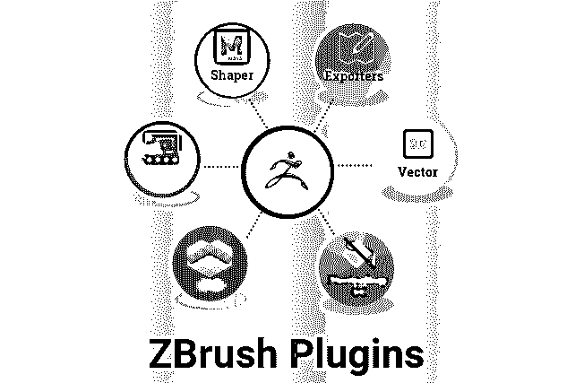
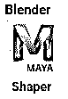
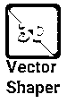
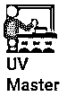
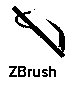
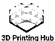

# ZBrush 插件

> 原文：<https://www.educba.com/zbrush-plugins/>

## ZBrush 插件概述

ZBrush 插件是 ZBrush 的可选附件，提供额外的功能。ZBrush 是由 Pixologic 公司开发和服务的软件。这是最常用的软件，用于电影，游戏和动画人物和属性雕刻，具有结合 3D/ 2.5D 建模，纹理和绘画的高细节。应用程序及其工具的这些功能用于创建高多边形，高分辨率的最佳细节角色和粒子模型可由多达 4000 多万个多边形组成，用于电影、动画和游戏项目。ZBrush 中的模型可以使用动态级别的分辨率进行雕刻，这可以获得凸起、弯曲、肌肉、神经、地形和其他具有所需多边形数的高细节。

该模型可以以高多边形网格数和低多边形网格数导出。在创建第一个模型并将它们放入数据中需要的地方后，可以复制一次 3d 模型。如果需要，可以借助地理参考将模型投影到实时坐标上。自 1999 年以来，它一直是最常用的详细雕刻软件，Pixologic 根据游戏和电影制作的多项研究的要求，不断更新软件功能和属性，以创建独特的角色，改善观众和用户的视觉体验。Poly-paint 用于挑选想象中的准确颜色，并根据需要绘制模型，以获得逼真的感觉。该软件建立了行业标准，以实现良好的雕刻输出，以完成和出口质量模型的软件。

<small>3D 动画、建模、仿真、游戏开发&其他</small>

### ZBrush 插件

ZBrush 有自己的快捷方式来节省时间，并以智能的方式完成工作，在工作时使用快捷方式在任务之间切换。它还具有 3D 笔刷(平滑、弯曲、尖角等)等功能。)根据需要在模型中添加曲线细节。转置选项有助于从一个巨大的模型中分离出所需的部分，并根据细节和变化的要求对其进行编辑，从而减少装配时间。

除此之外，我们还有 ZBrush 的插件，可以增加时间，提高工作流的生产率和效率。

### ZBrush 插件列表

下面详细列出了一些最常用的插件:

#### 1.玛雅搅拌机成型机

这个插件也被称为混合形状，它是角色的动画模型中的关键元素，根据场景(如愤怒、微笑、自我等)具有不同的面部形状到期时间。这很容易将模型带到下一个层次。开发出来的模型可以直接转移到 Maya 或 Blender 等 3D 工作软件中进行进一步的工作。

#### 2.3D 文本和矢量形状

在这里可以高精度地创建介绍视频的文本形状和标题。使用这个插件可以创建徽标。3D 文本可以根据需要在插件中使用不同的格式和单元正面进行修改和个性化，以改善投影时的用户体验。该工具必须导入和导出 SVG 格式的矢量文件[的选项，以将内容转换为 3d 形状。可以通过从左到右或相反地键入来添加文本移动和效果。](https://www.educba.com/what-is-svg/)

#### 3.多个地图导出器

这个插件随着 ZBrush 的安装而自动运行。它通过定位自动创建地图并导出模型。高多边形模型包含许多要纹理化的多边形，由地图导出器导出，然后[使用 Photoshop](https://www.educba.com/introduction-to-photoshop/) 开始纹理化。该工具根据可用空间容纳贴图中的纹理，并可以使纹理具有逼真的外观和真实的感觉。分辨率和细节可以根据最终质量的要求改变地图的配置。

#### 4.UV 母版

该工具用于精确协调 [2D 和 3D 相关模型](https://www.educba.com/2d-and-3d-shapes/)的纹理需求。特别是人物、动物和虚构人物的纹理可以很容易地通过应用到地图上来完成，并且通过最佳地使用纹理，在人物的两侧无偏差地进行纹理移动。人物的小细节，如耳朵、眼睛、鼻子等。，可以通过管理网格数进行高质量的纹理处理。由 UV master 创建的 UV 可以导出到 Photoshop，并添加颜色、阴影和细节。

#### 5.ZBrush 到 Photoshop CC

该模型是在 ZBrush 中设计的，可以租用 ZBrush 来渲染 Photoshop，以显示深度、遮罩、阴影等更多细节。一旦插件安装完毕，点击 ZBrush 菜单栏就会加载一个新的选项图标(发送到 Photoshop)。它会将 ZBrush 中选定的模型发送到 Photoshop 中进行进一步的图层和效果处理。

#### 6. **3D 打印中枢**

这是 ZBrush developments 制造 ZBrush 设计的玩具[的未来。在 ZBrush 中开发的设计和模型可以导出到。obj(目标文件格式)。vrml 或其他 3D 文件格式，并且可以作为具有 UV 和纹理细节的 3D 打印机的输入，3D 打印机将根据配置的尺寸和设计测量来开发这些细节。如果需要，在打印玩具或模型之前，可以手动调整模型的尺寸。3D 建筑设计、玩具、模型房屋等。，可以做到。](https://www.educba.com/what-is-zbrush/)

总的来说，ZBrush 有几个更神奇的插件，可以节省时间，提高图像到虚拟现实世界的速度。

### 结论

ZBrush 是所有动画、游戏和设计艺术家使用的高级建模工具，因为他们可以实现高精度的细节、曲线、演示的 3D 模型、介绍视频和带效果的 3D 文本等等。对于初学者来说，这感觉就像他们在玩粘土，但当我们开始使用属性和细节赋予模型时，我们就会知道应用程序的真正用途。可能有经验的艺术家在他们的游戏角色设计和一些其他纹理活动的日常项目需求中使用 ZBrush。该应用程序在该领域是独一无二的，动画师、游戏玩家和电影制作人必须尝试该应用程序，以了解该工具的视觉输出质量，并与其他类似软件进行比较。

### 推荐文章

这是一个关于 ZBrush 插件的指南。这里我们讨论 ZBrush 和顶级插件的概念及其特性。您也可以阅读以下文章，了解更多信息——

1.  [ZBrush 是什么？](https://www.educba.com/what-is-zbrush/)
2.  [ZBrush For Students](https://www.educba.com/zbrush-for-students/)
3.  [ZBrush 替代品](https://www.educba.com/zbrush-alternatives/)
4.  [ZBrush 工具](https://www.educba.com/zbrush-tools/)

