# ZBrush 画笔

> 原文：<https://www.educba.com/zbrush-brushes/>

## ZBrush 笔刷简介

在这篇文章中，我们将学习 ZBrush 笔刷。在 Zbrush 中有许多不同的笔刷可以用来雕刻。每个画笔都有一些独特的属性，允许做一些其他画笔不能做的事情。可以使用几个控件来修改笔刷，如重力、包裹模式、密度等。除了标准的 Z 强度和绘制大小，但在本文中，我们将坚持默认配置。还有许多种类的笔刷，如剪辑，曲线，平面，修剪，插入网格，曲线桥，阿尔法三维，但我们将重点放在雕刻笔刷。

**步骤 1:** 转到菜单栏中的文档，然后选择 WSize 为 on 的新文档，这将使画布大小与视口大小相同。

<small>3D 动画、建模、仿真、游戏开发&其他</small>

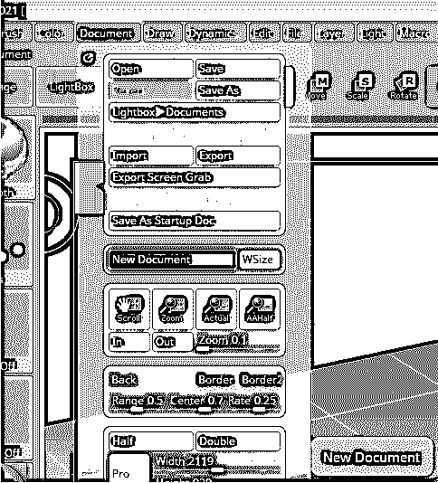

**步骤 2:** 从加载工具选项开始。

第三步:如果你有任何工具，导航到存储的工具，或者你可以选择一些原始工具，如球体，因为这个工具将更好地展示各种画笔。

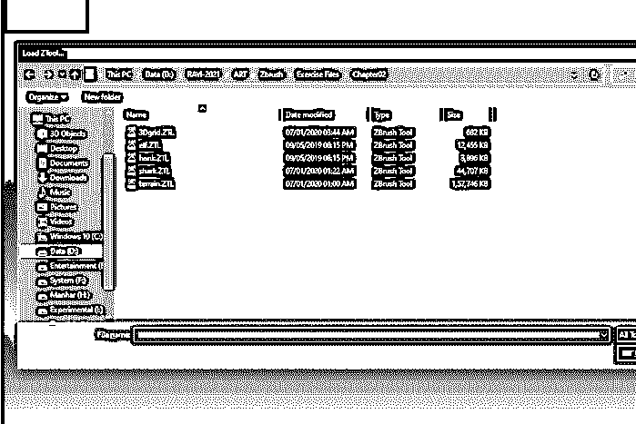

**第四步:**然后在视口内拖动工具。

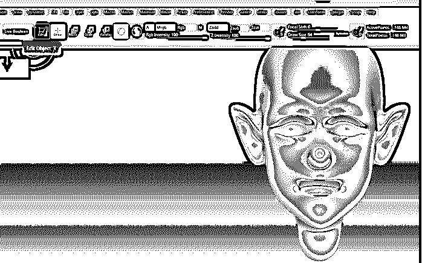

第五步:创建球体后，进入编辑模式。此模式将允许您雕刻 3D 对象。此外，当您将基本三维对象置于编辑模式时，它将自动克隆到工具选项板中。

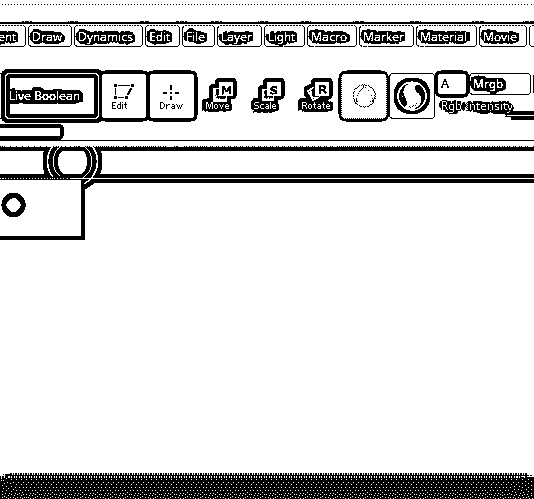

**步骤 6:** 启用透视按钮，该按钮将对 3D 对象应用透视缩短。此外，按 Floor 键激活透视地板网格，该网格可以按轴激活，默认情况下，Y 轴处于启用状态。

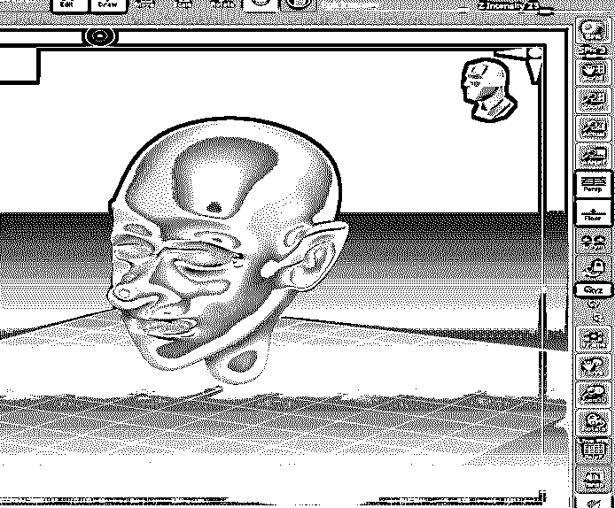

**第七步:**先从标准的第一把刷子开始。选择它的热键是 B–S–t。

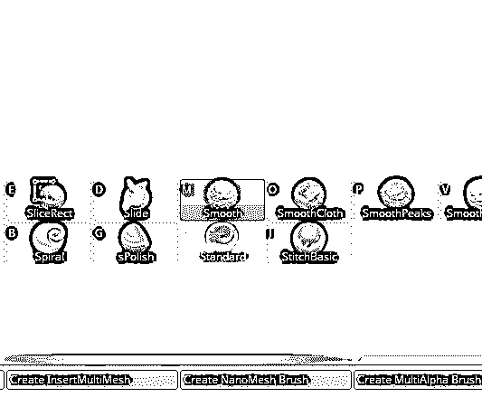

步骤 8: 因此，标准笔刷是 Zbrush 中的默认笔刷，它向外移动顶点，给人一种黏土堆砌成雕塑的错觉。各种修改器，如笔划、alphas 和编辑曲线可以与它一起使用，按 Alt 键可以反转效果，使其切入而不是堆积。您可以调整 Z 强度来调整深度信息应用到当前工具或对象的方式，绘制大小决定了笔触或编辑动作的大小。如果你想要更多的微调，那么你可以使用焦点移动，但它的用途很少，它主要是控制衰减多陡或多浅。

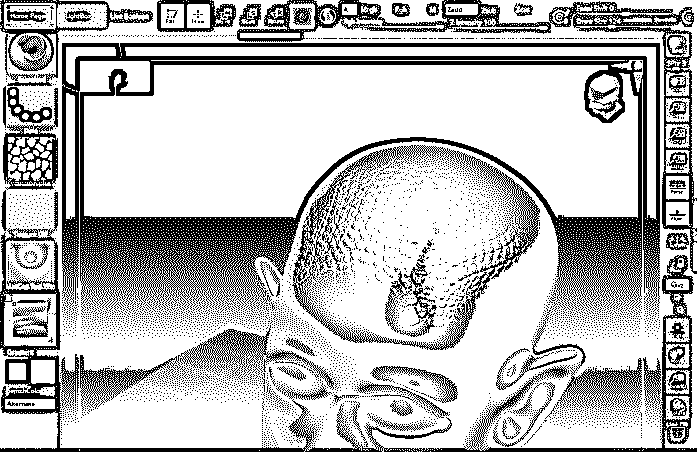

**第九步:**下一个刷哪个光滑。选择它的热键是 B–S–m。

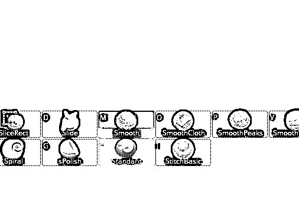

**步骤 10:** 平滑笔刷首先计算表面的平均水平，然后相应地向平均水平平滑细节。

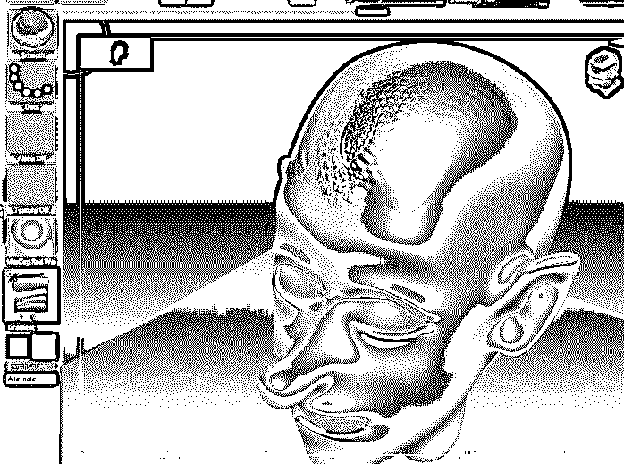

**步骤 11:** 正在移动下一个刷子。选择它的热键是 B–M–v。

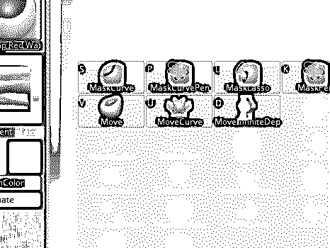

**步骤 12:** 移动工具可以用来做细微的调整，修改一些面部特征来表现情绪，也可以得到更自然的不对称脸。移动也忽略一些笔刷修改器，如笔划。

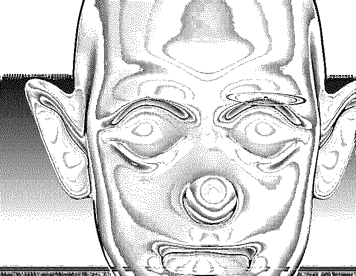

**步骤 13:** 下一个被充气的刷子。选择它的热键是 B–I–n。

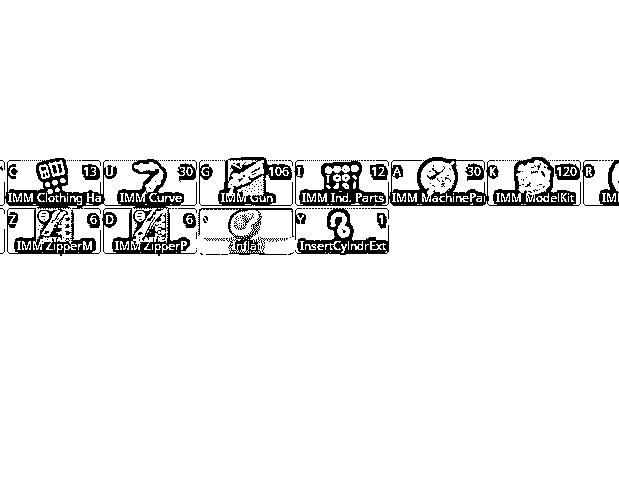

**第 14 步:**膨胀使用几何体的顶点，并在它们自己的法线上膨胀，这与标准笔刷相反，标准笔刷沿着笔刷的中心推拉几何体。这种刷子在用一个或两个笔画替换大量表面时特别有用。

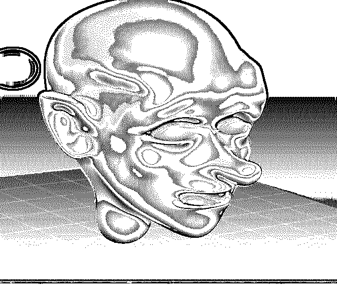

**第十五步:**下一个刷哪个有弹性。选择它的热键是 B–e。

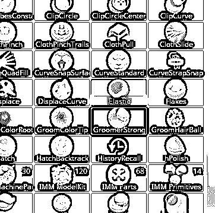

**步骤 16:** 弹性笔刷的工作方式与充气类似，但对于某些模型，当表面发生位移时，它会保持表面的原始形状。你真的需要实验，看看在你的具体情况下使用哪种类型的刷子。

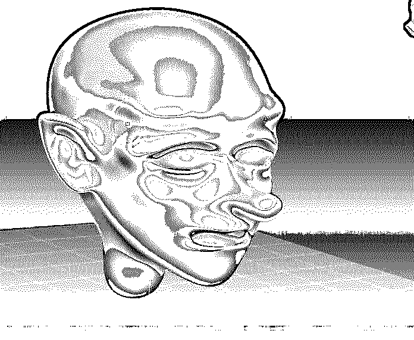

**步骤 17:** 被移动下一个刷子。选择它的热键是 B–D–I。

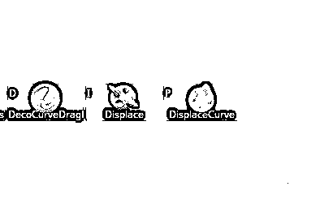

**第 18 步:**“置换”的工作方式与“膨胀”笔刷类似，但底层表面的细节保持不变，这表明在人类或任何其他模型中存在膨胀。

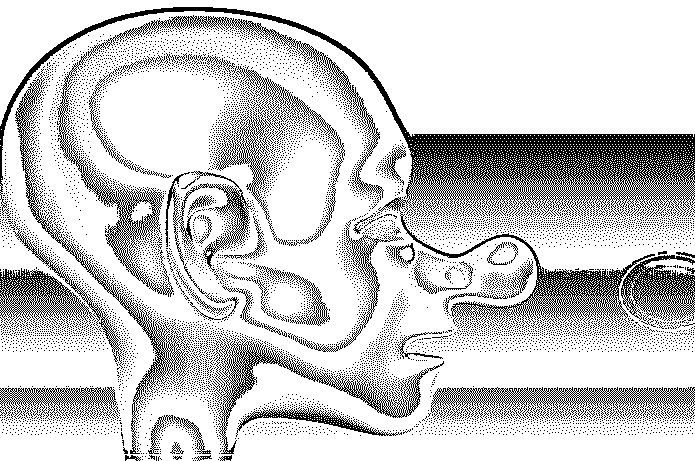

**步骤 19:** 放大下一个笔刷。要选择的热键是 B–M–a。

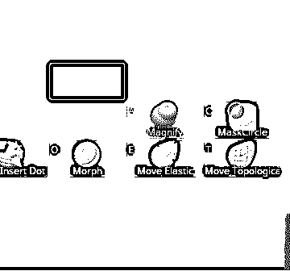

**Step 20:** Magnify brush cause displacement of the surface at the same time the vertices are pushed outside of the surface. The amount of magnification can be controlled by Z intensity.

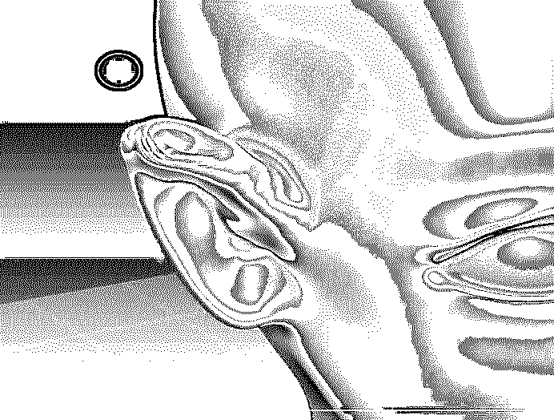

**步骤 21:** 下一个刷哪个是 Blob。选择它的热键是 B–B。

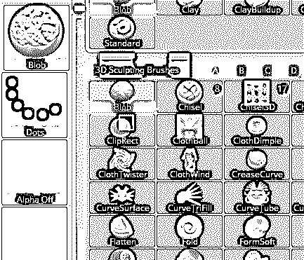

**第二十二步:** Blob Brush 擅长快速创造有机效果。它的均匀性取决于表面的不规则性，因为它通常产生短的不规则斑点。如果用在光滑的表面上，效果不明显。

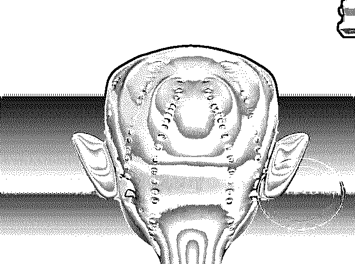

**步骤 23:** 下一个被捏的刷子。选择它的热键是 B–P–I。

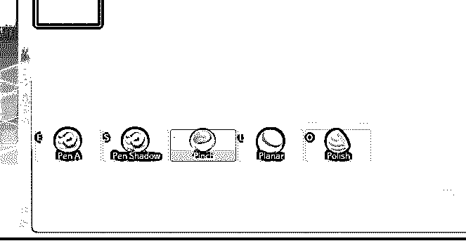

第 24 步:收缩笔刷将顶点拉在一起，就像放大笔刷的反方向。对于衣服或者制造皱纹非常有用。Pinch 通常与懒惰鼠标一起使用，以获得精确而平滑的脊。

**步骤 25:** 展平下一个刷子。要选择的热键是 B–F–a。

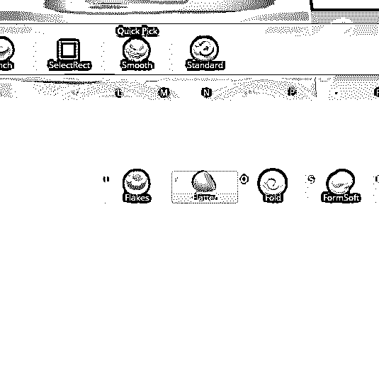

**第 26 步:**压平刷顾名思义就是把表面压平，你可以把零件压到平面上，这样就可以降低或升高表面。平面的角度取决于刷子中心下方的面积。如果曲面不够平整，可以将此选项与平滑曲面结合使用。

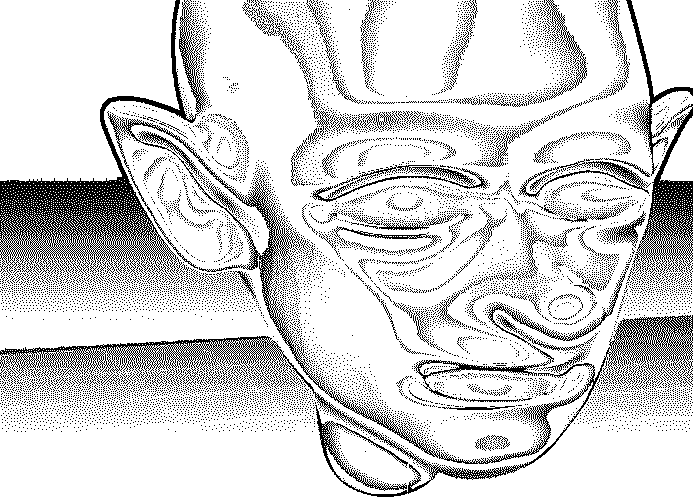

**第 27 步:**下一个刷的是粘土。选择它的热键是 B–C–l。

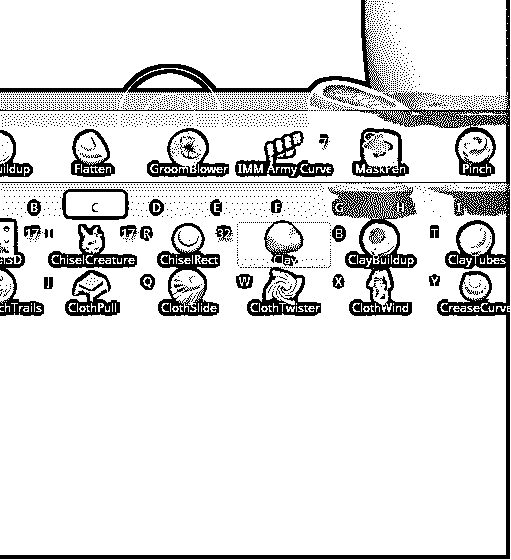

步骤 28: 泥刷的主要目的是使用阿尔法雕刻。虽然其他刷子可能会被使用，但可能会有副作用，因为他们自己的目的，而粘土刷是用来与阿尔法没有副作用。

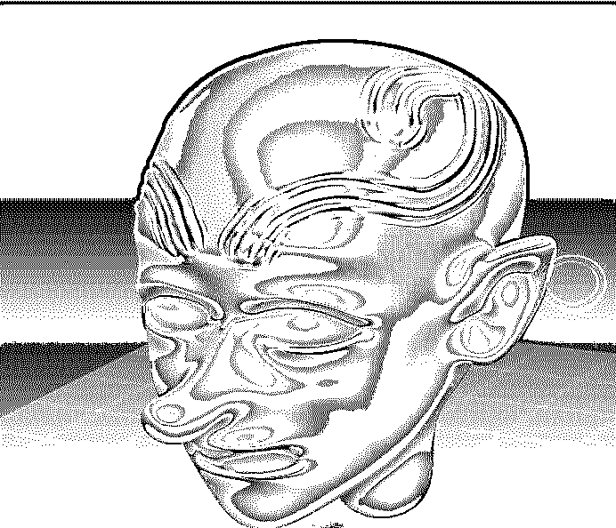

### 结论

在这篇文章中，我们学习了如何在 Zbrush 中使用画笔。首先，我们已经开始加载一个工具，然后我们开始在各种刷子上工作，并演示它们的一般用途和特定用例(如果有的话)。我们也看到了每个笔刷的热键，所以我们可以更快地访问那个笔刷。

### 推荐文章

这是一个 ZBrush 画笔指南。在这里，我们讨论了创建 ZBrush 画笔的介绍和步骤。您也可以看看以下文章，了解更多信息–

1.  [ZBrush 工具](https://www.educba.com/zbrush-tools/)
2.  [ZBrush 插件](https://www.educba.com/zbrush-plugins/)
3.  [ZBrush 替代品](https://www.educba.com/zbrush-alternatives/)
4.  [ZBrush 是什么？](https://www.educba.com/what-is-zbrush/)

