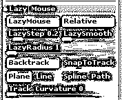
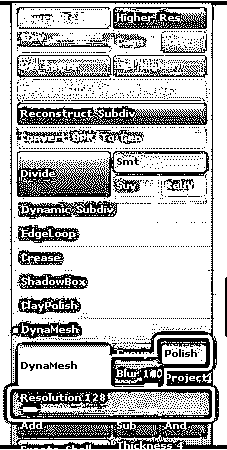
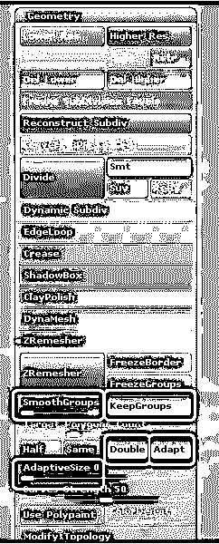
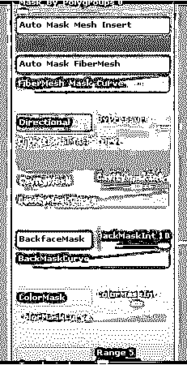
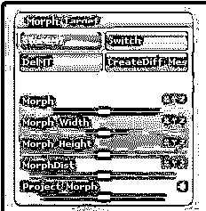
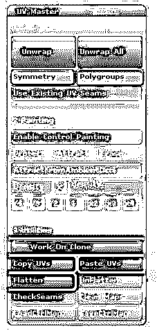
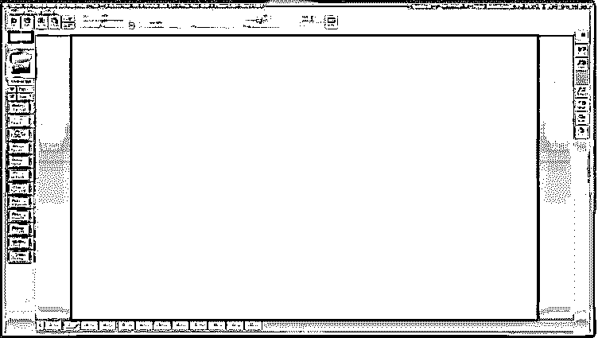

# 使用 ZBrush 时的 15 个专业技巧和省时方法(有用)

> 原文：<https://www.educba.com/15-professional-tips-for-zbrush/>

理解和习惯 3D 界面需要时间，尤其是当你刚接触三维软件的时候。要快速掌握软件，最好了解一些快速提示和方法，帮助您理解应用程序，并在工作流程中节省您的时间。

这篇文章关注的是基本的和中级的技术，这些技术被证明可以减少你在使用 [ZBrush](https://www.educba.com/design/courses/zbrush-course/) 时投入的体力劳动或者额外的时间和精力。这也是为了让你熟悉 3D 界面。

#### 1.表演

我们都知道 ZBrush 是雕刻软件，它需要相当大的网格来处理高细节的 3D 模型。尽管 ZBrush 很明显我们应该在低分辨率的模型上工作，以进行简单灵活的工作流程，但是，艺术家真的有可能一直在相同的低分辨率物体上工作吗？

<small>3D 动画、建模、仿真、游戏开发&其他</small>

我们经常想把极限推得更远，冒险用永无止境的多边形数处理真正复杂的高分辨率文件。ZBrush 可以很容易地运行到数百万个多边形中，继续运行会立即降低机器速度。除此之外，如果你有一台低配置的电脑或笔记本电脑，处理这项工作就更加令人生畏了。

ZBrush 会警告您当前内存的系统速度。如果你的活动内存在 2000 或 3000 以上，是时候转换到紧凑模式了。ZBrush 清除缓存并允许您处理复杂的操作，即使您的机器不够健壮。

首选项>内存>压缩内存

#### 2.懒惰的老鼠

一旦打开懒惰鼠标，绘图将把它的位置从光标下面移动到被鼠标拖动的画笔点下面。它通常在屏幕上显示为一条红线；它提供了对笔刷点的绝对控制，非常适合绘制平滑的曲线或任何类型的细节工作。

默认情况下，懒惰鼠标是打开的。如果您想打开和关闭它，请遵循以下步骤

笔画>懒惰鼠标

或者您也可以使用 L 键来打开和关闭

默认情况下，懒惰鼠标的压力太低，所以你可能不知道如何使用该工具。一旦你弄清楚了工具的用途，并学会调整它的偏好，你就会开始爱上这个工具。

首选项>平板电脑>惰性–将设置从 0.5 更改为 1 并查看更改

#### 3.数字一(1)键

所以，你喜欢懒惰的老鼠，现在你希望中风是两倍强？

为了满足要求，1 号钥匙随时为您服务。按下键盘上的数字 1 键，重复最后一个笔画。但是，你必须确定你想要的过程是你最后一次划水。数字键 1 也可以通过旋转预览变换对象。

#### 4.动态网格

如果你正在使用 Maya 等软件或其他 3D 程序来创建你的模型，但你的最终意图是完成一个高端雕刻模型。显然你应该[在某个时候使用 ZBrush 工具](https://www.educba.com/zbrush-tools/)。

将低分辨率 3D 模型导入 ZBrush，并应用 DynaMesh 为对象形成高分辨率网格，该网格将在表面上永久均匀填充多边形。从今以后，你可以用 ZBrush 中的模型玩任何东西，因为它准备好通过生产管道的每一级。模型可以雕刻和烘烤。

要激活 DynaMesh，您应该打开抛光并将模糊设置为 100。分辨率滑块应该从最小的一端开始，并随着您对图像的处理而继续升高。通常，对于每个子工具，128 是一个更好的开始值。

#### 5\. ZRemesher

在你的情况下，模型是由复杂的角度组成的，不能用 DynaMesh 来处理。还有另一种方法可以拯救你的一天。通过创建多边形来尝试 ZRemesher。

尝试应用带有 UV 的自动分组、带有适当角度的法线分组或另一个保持与模型相似形状的 UV 配置。

通过按“折痕 PG”将折痕应用于每个多边形组，该选项位于“几何体>折痕>折痕 PG”下

将平滑组和自适应调整为 0，使用 ZRemesh 并激活保持组、加倍和自适应按钮。ZRemesh 模型更多次细分网格，现在它准备多边形绘画。

#### 6.小丑

如果您使用任何纹理生成工具或软件，如 Quixel 或 substance painter，您可能在处理纹理生成管道时在某处创建了颜色 ID 遮罩。

ZBrush 可以方便地处理纹理贴图，并使它们变得有用。使用“首选项”下的“导入-导出”设置将小丑遮罩转换为多边形组，并节省将它们放入 ZBrush 的时间。

首选项>导入导出>导入>导入材料

该程序假设每一点颜色都是应用于从一些 3D 软件导出的网格的自己的材质。

#### 7.ZBrush 首选项

ZBrush 收集了大量的画笔，这对每个使用它的人来说都是一个好消息。但与此同时，使用如此多的笔刷很容易让人忘记每个笔刷都有自己的修改器。雕刻薄物体时，背面遮罩是必不可少的，建议一直打开。

笔刷>自动遮罩>背面遮罩

不要忘记打开每一个笔刷的背面遮罩。默认情况下，它处于禁用状态，除非您创建了笔刷并在启用背面遮罩的情况下保存它们。

#### 8.ZBrush 设置

在讨论笔刷时，笔刷修改器是另一个要讨论的重要部分。通过使用剪辑打开 BRadius，曲线画笔将有助于加快工作速度，尤其是在雕刻硬表面和遮挡时。几何体的嵌入深度由您在此处使用的笔刷的半径决定。

#### 9.变形目标建模

该方法用于在变形目标上雕刻，并编辑目标几何体以从中生成新的网格。有多种方法可以从目标几何体创建新的网格。

开始在 PM3D 网格上雕刻。您应该存储变形目标以继续在网格上雕刻。在你的雕刻阶段完成后，你对输出感到满意，进入变形目标调色板，点击创建差异。您将立即看到一个新的网格添加到工具选项板中。新的网格有时会反转法线。要解决此问题，请转到工具>显示属性>翻转。

#### 10.UV 母版

传统上，UV 贴图是每个 3D 艺术家如果有机会都想避免的一项艰巨任务。解开这张网需要几个小时的艰苦工作，这是一项单调乏味的工作。令人欣慰的是，可以将 ZBrush 的 UV master 插件共享给其他 3D 软件包。

在对对象进行 UV 贴图时，与 Maya 共享工作流变得更加容易。可以将 3D 图像从 Maya 导出到 ZBrush 中。使用。OBJ 格式，并运行 UV 主插件，以生成一个基础布局。通过在 [Maya 软件](https://www.educba.com/new-features-in-maya-2019/)中处理相同的网格模型，您可以继续处理在 ZBrush 内 UV Master 插件的帮助下生成的展平 UV 贴图。

利用颜色 ID 为 ZBrush 创建 UV 播放组，以获得舒适的工作流程。

选择“ZPlugin > UV Master >多边形组”并在“克隆”上工作。全部展开以创建新的 UV 布局。

#### 11.油漆店

如果你在 ZBrush 上工作的时候正在等着画一些速写。不需要像 Illustrator 或 CorelDraw 那样转换到 MSpaint 或任何完全开发的程序。ZBrush 内置了一个复杂的工具。是油漆店，帮你快速把想象力放到画布上。虽然这个工具不是作为一个高端绘图应用程序开发的，但对于拥有大量绘画工具的艺术家来说，它仍然非常有用。

您也可以在展平的画布上绘画，颜色信息可以传输到 3D 网格。

#### 12.工具亮度调整

当屏幕上同时打开大量工具时，很难找到选定的工具

在子工具和面板中。这要归功于能有效显示当前工具的更亮的颜色。

但是，您可以根据自己的需求控制工具的亮度，从而将这一功能提升到一个新的水平。

要控制未选中工具的亮度和阴影，请转到首选项>编辑>非活动子工具变暗。您可以使用更高或更低的滚动范围来使工具变暗或变亮。

#### 13.更快的工作流程

为了在 ZBrush 上更快地工作，使用键盘，尤其是一直使用空格键，可以为您提供访问各种类型工具的简单快捷的方法。它的一个有用功能是

画笔-改变大小，焦点转移

多重绘画选项

改变材料

颜色选择器

空格键中的另一个重要特性是当鼠标光标位于 ZBrush 的视口之外时，可以立即定位鼠标光标。

#### 14.TransposeMaster 插件

通常，艺术家会遇到这样的情况，他们要么变换要么旋转一个完整的模型。但是，他们不理解关于他们角色的子工具或属性的近问题。手套、武器等。，不会轻易随原始网格对象一起变换。

Transpose Master 插件在这种情况下可以派上用场。在插件的帮助下，所有的子工具都被选择到最低的细分，只需点击几下就可以轻松控制。

z 插件>移调母版> TPoseMesh

完成插件工作后，不要忘记清理弯曲区域的网格。一旦你转换原始网格，只需使用 Z 插件>转置主> TPose > SubT 和转换信息将被转移到原始网格对象的子工具。这有助于节省处理单个对象的大量时间和精力。

#### 15.背景颜色变化

虽然 ZBrush 的默认渐变颜色背景在雕刻你的对象时看起来不错，但许多设计师更喜欢纯色而不是渐变。如果你也属于这一类，这条建议是给你的。

您可以通过进入文档调色板并选择范围设置为 0(零)来更改默认渐变颜色。它删除了背景中的渐变，并给出了一个纯灰色。但是，您也可以将它更改为您选择的颜色，方法是按范围选项上方的背景颜色，并从屏幕上选择您选择的颜色。

列出 ZBrush 等大型软件的技巧和窍门是一个无止境的过程。因此，我们列出了最常见和中等水平的技巧，可以帮助寻求良好知识的初学者快速跟上工作流程。我们希望我们的 15 个技巧能帮助你尽快理解并习惯 ZBrush 雕刻软件。

### 推荐文章

这里有一些文章可以帮助你获得更多关于 ZBrush 的细节，所以只要浏览链接就可以了。

1.  [3D Coat vs ZBrush](https://www.educba.com/3d-coat-vs-zbrush/)
2.  [ZBrush 快捷键](https://www.educba.com/zbrush-shortcuts/)
3.  [ZBrush 插件](https://www.educba.com/zbrush-plugins/)
4.  [ZBrush 是什么？](https://www.educba.com/what-is-zbrush/)

