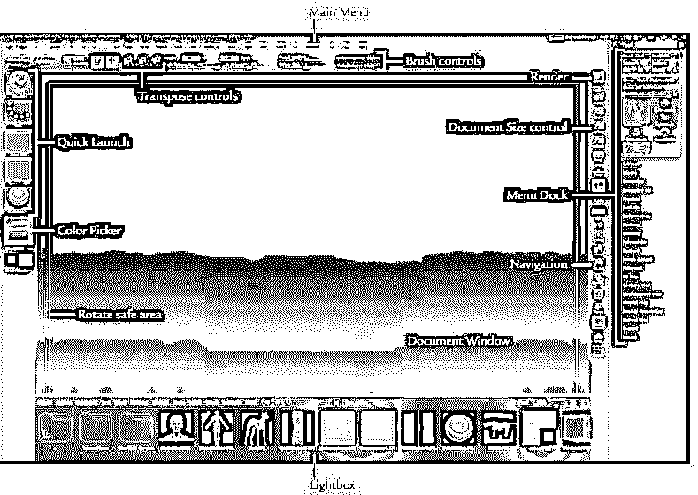
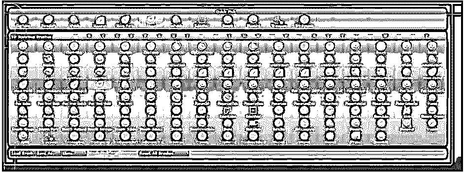
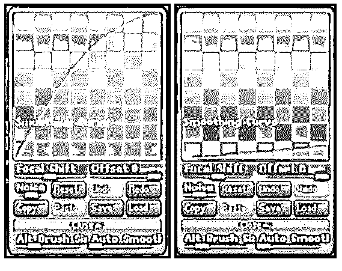
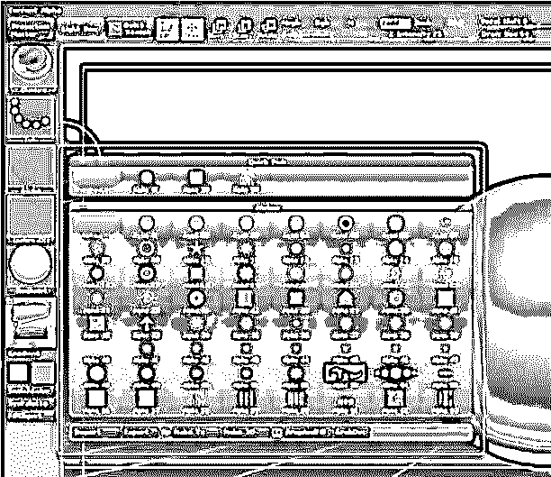

# Zbrush 数字雕刻是如何工作的(有有用的例子)

> 原文：<https://www.educba.com/zbrush-digital-sculpting/>

随着 ZBrush 数字雕刻软件的推出，相信一个全新的文艺复兴时代再次冲击了世界并不过分。但是，这一次，艺术革命采用了数字形式。

关于 ZBrush 数字雕塑界面，最值得一提的是它能够让艺术家相信他正在创作一个自发的有机粘土模型，无论他是在创作数字粘土球体。该软件将数字雕刻提升到了一个新的水平，帮助世界各地的艺术家实现雕刻效果，不亚于雕刻大师所做的任何事情。随着铁笔的敲击，雕刻和雕刻可以如此精确和自然地完成。难怪相信 [ZBrush 是最好的数字雕刻软件](https://www.educba.com/design/courses/zbrush-course/)。

无论你是在现实世界还是在数字平台上进行雕刻，都需要对解剖学进行详细观察，并了解你将使用的工具的正确用途。许多学生学习 ZBrush 数字雕刻软件中的众多工具，但他们不知道在哪里以及如何使用它们。同样，我们将要采用的方法的时间顺序对于减少工作时间是非常重要的，因为数字雕刻是一项单调乏味和费时的工作。这篇文章将向你介绍许多工具和特性，帮助你理解 ZBrush 中的数字雕刻。

<small>3D 动画、建模、仿真、游戏开发&其他</small>

然而，要达到 ZBrush 数字雕刻的水平，你至少应该有关于 ZBrush 数字雕刻软件的工具和工作流程的基本信息。在这些方面，我们可以理解下面的帖子是针对中级水平或已经完成学习 ZBrush 的学生的。本文旨在简要介绍 ZBrush 中用于数字雕刻的最常见和最基本的方法。

## ZBrush 数字雕刻界面

乍一看 ZBrush 界面，学习它看起来很有挑战性。然而，如果你知道任何其他 3D 软件，如 [Maya](https://www.educba.com/new-features-in-maya-2019/) 或 [3DS Max](https://www.educba.com/design/courses/3d-max-course/) ，你可能会觉得这相当容易。尽管如此，你能在外表上看到的工具数量可能会吓到你。关键的一点是，你不会用到很多可见的工具。只有几套工具可以帮助你雕刻。随着时间的推移，你将决定你最喜欢的软件部分，以及你将与哪些工具相处。

*   乍一看，您可能会注意到这两列几乎没有到其他菜单的快速链接。
*   左栏有链接到它的材质菜单，笔刷，纹理和笔划图标。你还会发现一个颜色选择器，它有助于在绘画时选择颜色。
*   右栏有与导航窗口、活动工具显示信息相关的图标。
*   顶部的菜单栏允许您更改雕刻工具的各个方面。它可以撕下并停靠在屏幕上，以访问更容易的工作流程。
*   在编辑模式下右击鼠标将显示一个弹出菜单，其中包含 z 强度、RGB 强度、焦点偏移设置和快速绘制尺寸。

**遮罩&可见性笔刷:**

使用遮罩和可见性画笔，您可以使用矩形、曲线、圆形和套索等笔画类型。打开“笔画”菜单时按住 shift 键可查看选项。

曲线笔划笔刷可以与遮罩曲线笔刷一起使用。在这个笔刷的帮助下，你可以定义曲线的一边作为选区的一部分。当你画曲线时，你会看到渐变形式，这是画笔的活跃的一面。您也可以通过在释放鼠标按钮或手写笔之前单击 Alt 来更改画笔的边。

**2.5D 插图:**

除了三维物体，ZBrush 还允许你处理 2D 文档。它们是绘画和渲染的混合体。许多不使用 ZBrush 进行插图或概念设计的艺术家都忽略了文档窗口。

但实际上，文档窗口提供了独特的方面，可以让艺术家方便地进行绘画。你可以照亮和渲染二维的物体，甚至在插图上雕刻。

### 画笔菜单

ZBrush digital sculpting 中的画笔菜单由您在文档窗口中工作时将使用的每个画笔和实时雕刻工具组成。你可能很容易混淆工具菜单下面列出的各种笔刷，其中也包括简单的笔刷。它不是用于雕刻目的的刷子；相反，它用于 2.5 维绘画，不要与 [3D](https://www.educba.com/course/character-modeling-in-maya/) 雕刻画笔混淆。

在这里，我们为您提供了 ZBrush 数字雕刻中雕刻画笔的完整列表。和他们每个人一起玩耍；对雕刻用的刷子有一个正确的概念是至关重要的。

标准笔刷，移动笔刷，弹性笔刷，置换笔刷，膨胀笔刷，标准笔刷，放大笔刷，斑点笔刷，挤压笔刷，压平笔刷，粘土笔刷，变形笔刷，图层笔刷，轻推笔刷，蛇钩笔刷，Z 投影笔刷，平滑笔刷，网格插入笔刷，剪辑笔刷，遮罩笔刷，修剪笔刷，平面笔刷，抛光笔刷，选择套索笔刷，移动部分，移动拓扑，移动弹性。

### 修饰语

ZBrush 修改器子菜单有各种笔刷笔划修改器。

*   **倾斜**–当笔刷接触到表面时，修改器产生空间倾斜的效果。
*   **自动平滑**–它会在你画完每一笔后自动平滑表面。
*   **轨迹**–轨迹选项的工作原理类似于 LazyMouse 效果。但是，不同之处在于修改器在您的笔划后立即产生效果。它会创建笔画的多个副本，并平均化和均匀化笔刷笔画。

你可以在 ZBrush 数字雕刻中找到很多笔刷修改器，所有的东西对于达到想要的效果都很重要。

### 保存自定义画笔

有时候，软件[在提供你想要使用的正确工具方面有多复杂。由于自定义笔刷，您可以创建自己的笔刷，这样您就可以无缝地工作，并在雕刻中达到您想要的效果。](https://www.educba.com/project-management-software-skills/)

在画笔管理器的帮助下，你可以非常简单地创建自己的自定义画笔。只需对平滑曲线和平滑笔刷设置稍加调整，您就可以创建超乎想象的笔刷。

**如何创建画笔**

*   **第一步:**从调色板中选择一个光滑的笔刷，将 BrushMod 设置为 0。要创建所选笔刷的副本，请单击克隆按钮。
*   **第二步:**在曲线子菜单中打开新建的笔刷。要改变笔刷曲线，请按 Shift 键。按住 shift 键的同时，可以看到笔刷曲线转化为平滑曲线，从而可以轻松地改变形状。

左侧点表示最外圈的强度，右侧点表示中心的强度。使用刷子在表面上检查平滑度和效果。

*   **第三步:**调整完成后，点击另存为，给笔刷起个新名字。ZBrush 将保存您的新画笔，并在您每次打开软件时提供给您。但是，请记住，您应该将它保存在 Zstartup 笔刷预设文件夹中以启用此功能。

### 粘土刷子

ZBrush 数字雕刻包括先进的画笔，让您快速刷你的雕刻要求。画笔在最高的分区级别上工作，可以达到数百万以上的计数！多边形细分越高，这些笔刷可以达到的质量越高。

属于这一类的刷子有粘土刷、粘土管刷、蛇钩刷和耙子刷。

与标准笔刷、层笔刷和膨胀笔刷不同，在高多边形对象上实时雕刻的能力使粘土笔刷与 ZBrush 中的其他笔刷不同。由于松散的有机笔画模型，画笔的设计方式让艺术家们感觉他们是在粘土上工作。

**抛光刷、平面刷和修剪刷**

ZBrush 数字雕刻附带了许多有效的工具来创建硬表面模型。它们在分析平面分析时也派上了用场。特别是抛光刷、平面刷和修整刷用于制作坚硬的金属材料，如盔甲、金属板、武器等。

### 雕刻 ZBrush

**导入网格**

您可以使用轻松地将角色或几何体从 Maya、3DS Max 等其他 3D 软件应用程序导入到 [ZBrush 中。OBJ 格式。但是，3D 网格一旦导入到软件中，将很快转换为 Ztools。](https://www.educba.com/15-professional-tips-for-zbrush/)

Ztools 是一个更加复杂的模型，它保存了更多的网格信息。传统上,. obj 格式可以在导出时保留多边形计数、形状和基于 UV 的信息。但是，Ztool 具有更高的能力来保存多余的信息，如多级细分、高分辨率雕刻细节、纹理和绘画信息、alpha 贴图、图层信息。除此之外，Ztools 是 ZBrush 软件中雕刻网格的默认文件格式。

要享受使用 Ztools 格式的高端雕刻，计算机的物理内存起着重要的作用。如果你想在一个高多边形网格上工作，显卡就不是问题了。当你工作时，你的处理器允许你在屏幕上移动你的对象。处理器越快，雕刻速度就越快。

**为 ZBrush 优化网格**

当你从其他软件导入一个网格到 ZBrush 时，你可能会遇到很多问题。这个问题的一个主要原因是不良分布的网格布局。如果您的原始网格具有更密集和更紧密的网格(这通常是间距不佳的多边形的一个示例)，当您开始在 ZBrush 上工作时，它会多次细分，加剧和恶化问题，从而导致糟糕的拓扑形状。

优化网格以在 ZBrush 拓扑工具上工作的最佳方法是在导入之前创建一个雕刻就绪对象。确保多边形空间是均匀的，并且有清晰分布的边。这有助于在导入网格时减少制作时间。因此，您可以使用拓扑工具直接开始在网格上工作。

### 阿尔法战士

最重要的工具之一，你不能忽视掌握的是阿尔法，以实现最好的雕刻人物。灰度图像在 ZBrush 中有三个重要的作用。

它们可以用作笔刷形状、纹理形状和模板。

可以通过顶部菜单栏上的 Alpha 菜单访问 Alpha 菜单。Alpha 还允许使用 Alpha 菜单中的 Make3D 按钮在 ZBrush 中创建 3D 对象。您可以通过 Alpha 菜单轻松地导入和导出图像，并通过单击将它们转换为 Alpha。一旦图像被加载，你就可以更好地控制它们，将它们转换成模板、纹理甚至几何图形。

想要成为雕塑艺术家的人应该掌握的几个 Alpha 菜单工具是模糊、噪声、最大值、中间值、RF、强度、对比度、Alpha 调整、翻转 H、翻转 V、旋转、反转、Mres、Mdep、Msm、Dbls、制作 3D、制作 Tx、制作 st、制作修改的 Alpha。

雕刻是一个多层次的过程，从开始到结束涉及各种程序。流水线在流程的每一个层面都有技术含量很高的员工参与。在整个雕刻过程中，要处理好每一个点和每一件工具几乎是不可能的。因此，我们讨论了在管道中起关键作用的一些最重要的工具。

我们希望这篇文章能帮助你找到要点，帮助你成为 ZBrush 雕刻专家。

### 推荐文章

这里有一些文章可以帮助你获得更多关于数字雕刻的细节，所以只要浏览一下链接就可以了。

1.  [ZBrush 插件](https://www.educba.com/zbrush-plugins/)
2.  [ZBrush 替代品](https://www.educba.com/zbrush-alternatives/)
3.  [ZBrush 是什么？](https://www.educba.com/what-is-zbrush/)
4.  [ZBrush For Students](https://www.educba.com/zbrush-for-students/)

