# Zbrush 聚漆

> 原文：<https://www.educba.com/zbrush-polypaint/>

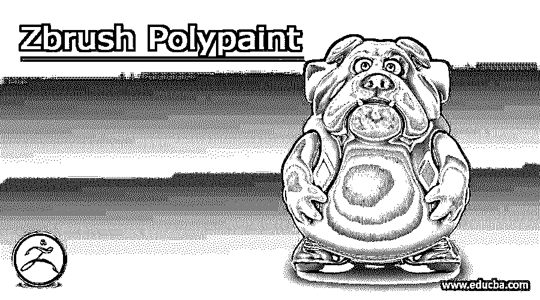

## 什么是 Zbrush Polypaint？

Zbrush Polypaint 可以理解为在将纹理贴图应用到模型之前在模型的表面上应用绘制，稍后您可以将 Polypaint 分配给纹理贴图。你会发现多边形绘制对你的模型有很多好处，你可以通过几个简单的步骤来做到这一点，例如，确保你的模型聚合物上有足够的多边形来平滑地应用多边形绘制，然后你需要用基色填充你的模型，之后，我们可以通过一些参数调整来得到我们想要的多边形绘制结果。所以让我告诉你如何在 Zbrush 做到这一点。

### Zbrush 型聚漆

为了在你想要的模型表面上绘画，你可以在做一些参数设置后给它的表面上色，这在 Zbrush 中被称为 Polypaint。Polypaint 代表绘制所有多边形以平滑表面着色。所以现在我要告诉你们我们需要做些什么。

<small>3D 动画、建模、仿真、游戏开发&其他</small>

为了给你解释这个话题，我将从这个软件的预置中选取一个模型。你可以在这个软件的灯箱面板中找到模型，或者用你自己的模型。

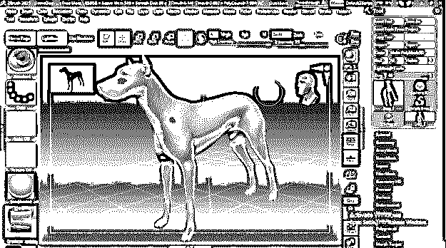

为了在你的模型表面有平滑的多边形绘制，你在你的模型的聚合体上有足够的多边形。

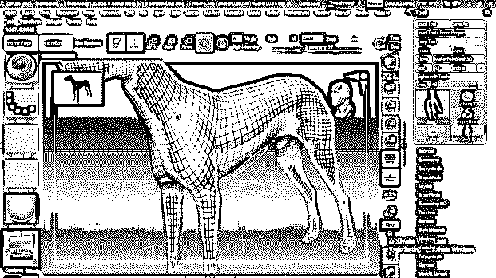

如果你没有足够的多边形，那么你可以修改它，然后转到工具栏的几何面板，这是在工作屏幕的右侧，然后转到动态网格选项，并从这里增加分辨率值。设定值后，点击它的 Dynamesh 按钮。

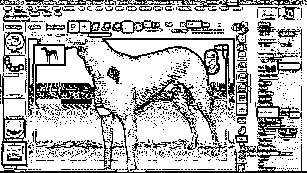

对于多边形绘制，我们将使用预设笔刷中的标准笔刷，通常用于雕刻目的。

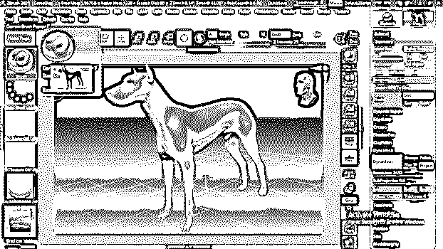

启动画图最重要的事情是启用用户屏幕顶部的 RGB 通道按钮。

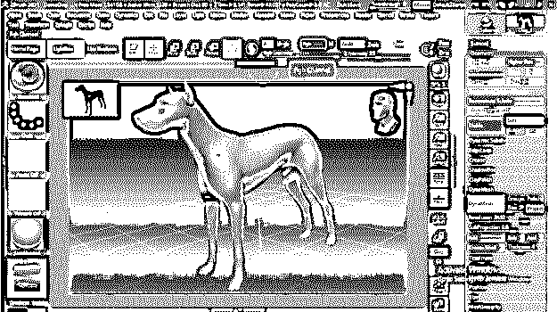

现在转到颜色面板，选择任何颜色。你可以看到，当我们选择颜色，它将适用于整个模型。

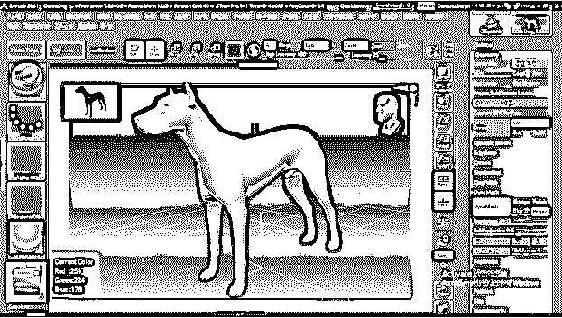

现在让我们从同一个调色板换成白色，为了应用你选择的颜色，你必须进入菜单栏的颜色菜单。点击这个菜单，然后点击 FillObject 按钮。它将用选择的颜色填充我们的模型。

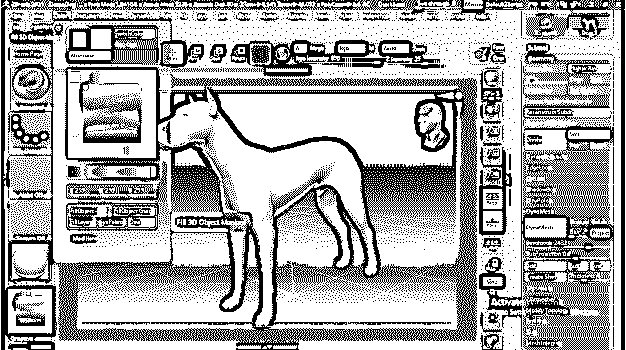

现在，当我们改变调色板上的颜色时，它会影响我们的整个模型，它就像一块空白的画布，我们可以在上面绘画。

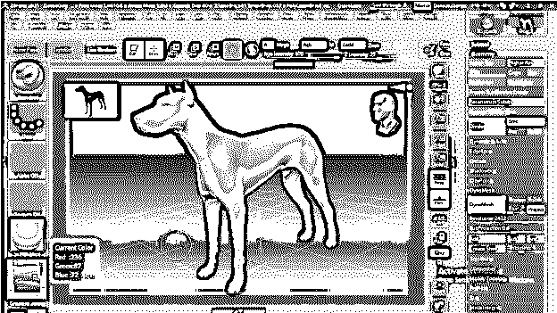

现在开始在模型的表面上绘画，但是你可以看到它会在模型表面上雕刻，同时用你选择的颜色绘画，这在某些情况下是非常好的功能。

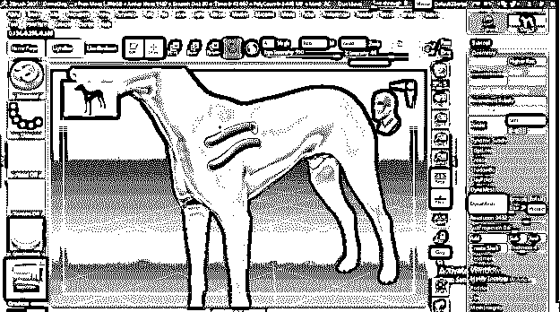

如果你不想在绘画过程中雕刻，那么去表面屏幕的顶栏，你会在这里找到 Zadd 按钮，你可以通过点击它禁用它。

而在这之后，它只会在表面涂上油漆。因此，根据您的要求，您可以在两种方法之间切换。

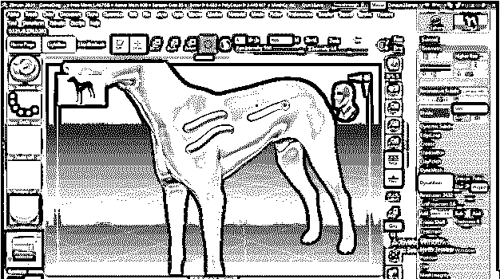

您可以调整 RGB 强度来改变颜色的强度。您可以按住键盘的 I 键作为 RGB 强度滑动条的快捷键。

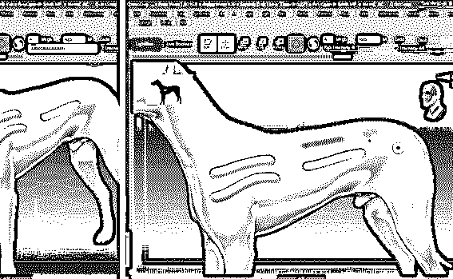

这样，您可以将多边形绘制应用到您的模型。如果模型中有许多独立的零件，那么您可以对每个零件执行相同的操作。

### Zbrush 角色创建

现在，在了解了 polypaint 之后，让我们讨论一下在这个软件中创建角色的基本步骤。为了开始创建任何角色，我们采用一个球体模型。所以你可以在这个软件的灯箱面板中找到它。

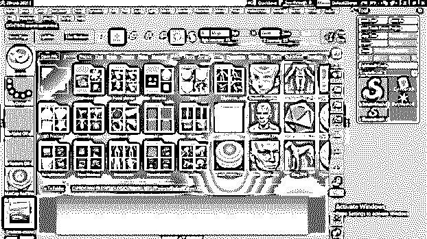

现在拿一个基础图像作为你想要创建的角色的参考。要导入图像，进入菜单栏的纹理菜单并点击它。在这里你会发现导入按钮，所以点击它。

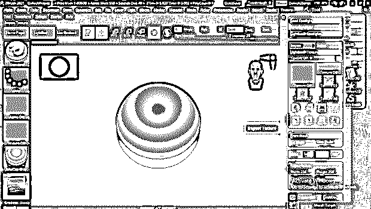

您可以从图像的保存位置选择 jpge 或 png 文件格式，然后单击打开按钮。

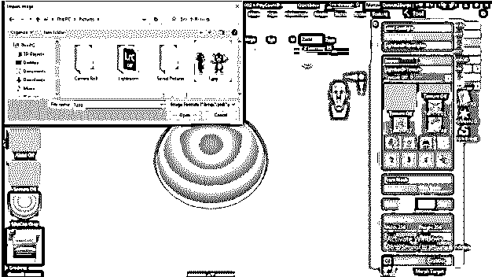

你将有这个图像到纹理面板，所以选择它，然后点击“添加到聚光灯”按钮。

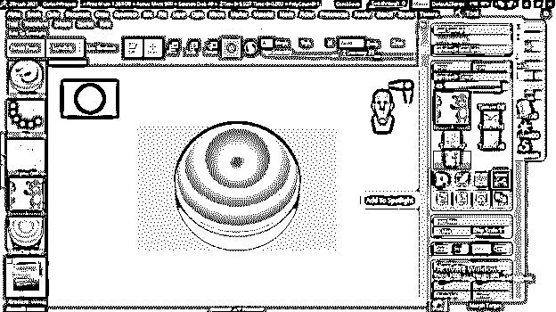

你会看到这样一个带有导航圈的图像。

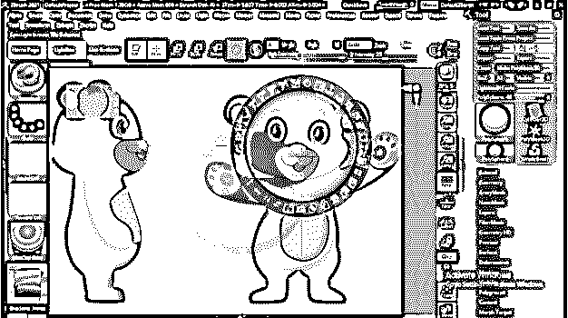

单击鼠标外部以移动图像，或单击并按住滚轮内部以移动该滚轮。按 Z 按钮隐藏或取消隐藏滚轮。

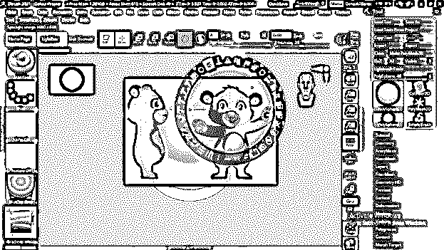

这个轮子上有缩放和不透明度按钮。所以按住缩放按钮并旋转滚轮来缩放此图像。

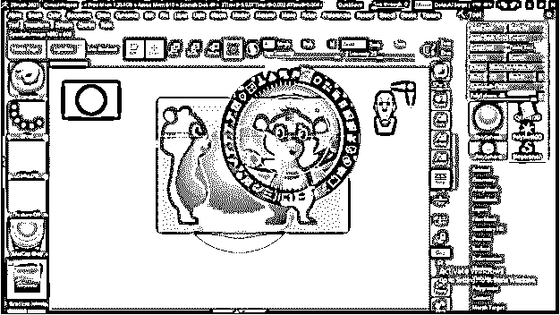

与通过不透明度按钮降低不透明度相同，这样我们可以看到模型。

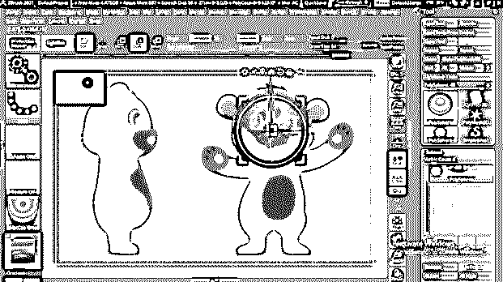

现在我将缩放这个球体，并将其移动到这个卡通人物的头部。

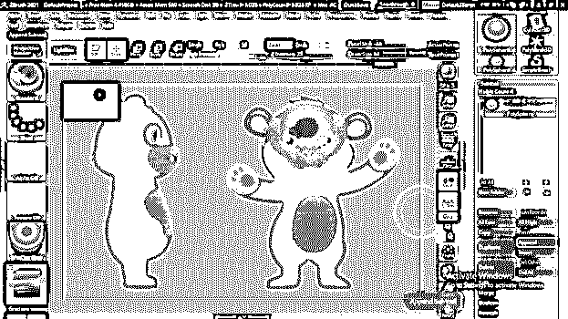

我将在这里添加一个球体，用于子工具面板“添加”按钮。

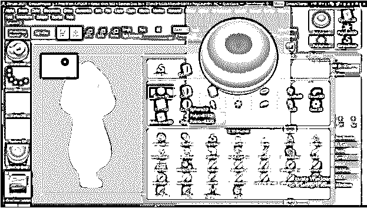

我将缩放它，并将其移动到这个模型的胃部区域的位置。

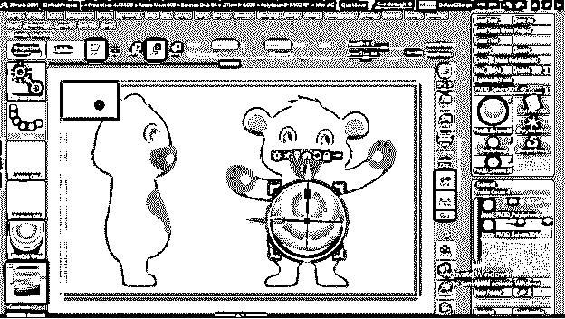

现在我将从同一个追加按钮中取出圆柱体。

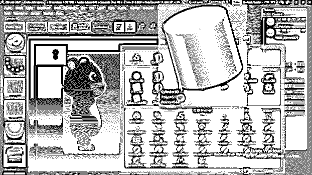

我会用它来做这个模型的腿。

你可以进入菜单栏的 Zplugin 菜单来选择镜像选项，在这个选项的帮助下，你可以镜像其他腿的圆柱形状。

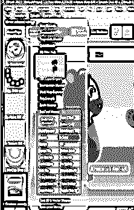

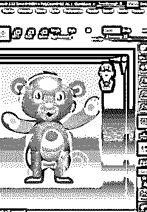

用同样的方法，你可以制作这个模型的其他身体部分。按键盘的 Shift + Z 键可以隐藏图像。

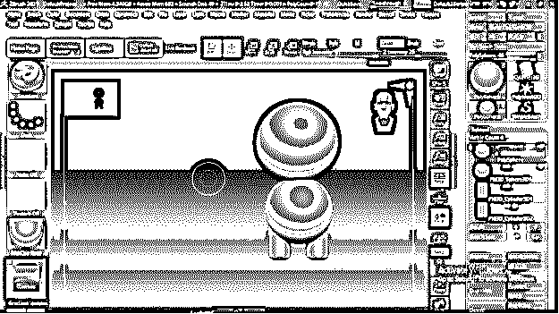

有了你想要的模型的基础模型后，你就可以开始雕刻你想要的模型结构了。我将去刷预设，并采取 Snakhook 刷向你展示你如何可以开始雕刻。

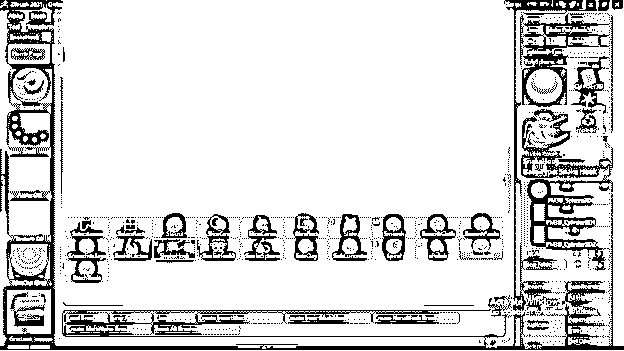

你可以像这样雕刻你的模型的任何表面。你会发现许多不同用途的笔刷。

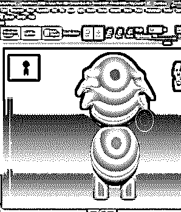

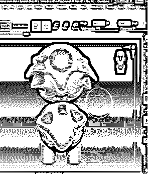

### 结论

在本文中，您已经了解了 Zbrush 软件的两个主要主题，在此之后，您可以轻松使用该软件的多边形绘制功能，并很好地掌握其参数。你也可以根据自己的想法创建模型。我建议你开始练习这两个特性，以便对它们有更多的了解。

### 推荐文章

这是 Zbrush Polypaint 的指南。这里我们分别讨论引言、模型绘制、角色创建。您也可以看看以下文章，了解更多信息–

1.  [ZBrush 工具](https://www.educba.com/zbrush-tools/)
2.  [ZBrush 雕刻](https://www.educba.com/zbrush-sculpting/)
3.  [ZBrush 热键](https://www.educba.com/zbrush-hotkeys/)
4.  [ZBrush 画笔](https://www.educba.com/zbrush-brushes/)

