# Zbrush UV 贴图

> 原文：<https://www.educba.com/zbrush-uv-mapping/>

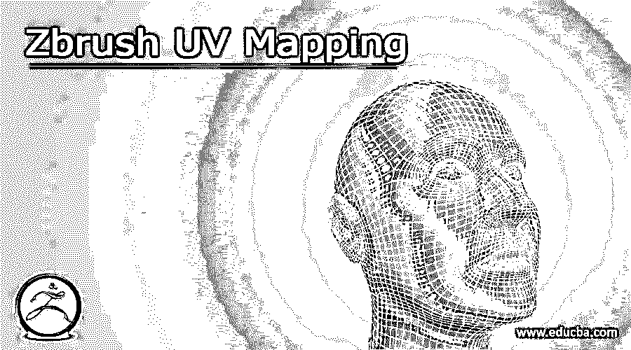

## Zbrush UV 贴图简介

Zbrush UV 贴图是一个过程，通过它可以将任何图像包裹到三维对象上。为了将图像包裹到我们的物体上，需要给模型分配 uv，为此我们在 Zbrush 中有一些方法。比如我们可以创建清晰的多边形组，然后通过几个 Zplugins 选项就可以做到。这里，我们在 Zbrush 插件中有一个 UV 主插件，如果我们已经为我们的模型创建了一个好的多边形组排列，只需单击一下就可以为我们选择的 Zbrush 模型生成 UV 坐标。所以今天我们将讨论 UV 贴图的每个重要方面，这样我们就可以很容易地为我们的模型创建它。

### 什么是 ZBrush UV 贴图？

在我们开始讨论如何为我们的模型使用 UV 贴图之前，我想告诉你什么是 UV 贴图。我们可以将它理解为一个过程的一个步骤，通过这个过程，我们通过展开纹理图像来为模型的一个或多个图像分配精确的坐标。当它打开模型的多边形组时，它会给我们一个小岛的形状，你可以称之为 UV 岛，这些 UV 岛的平滑度完全取决于你的多边形组或你的模型的平滑度。

<small>3D 动画、建模、仿真、游戏开发&其他</small>

### 如何使用 ZBrush UV 贴图？

现在让我们看看如何使用这个 UV 贴图过程来创建我们模型的 UV 贴图。如果你想创建模型的 UV 贴图，只需要创建不同的多边形组。为了向你解释这一点，我将从这个软件的灯箱中取出一个立方体子工具。为此，您可以使用任何其他子工具。

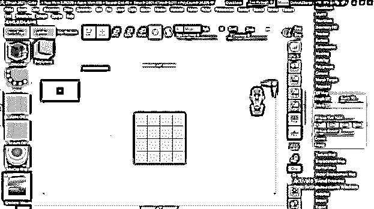

您可以使用“笔刷”面板中的 Zmodeler 笔刷在这个立方体子工具上创建不同的多边形组。

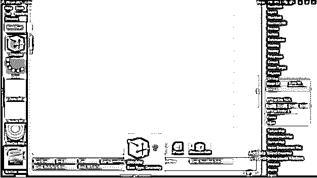

但是我将简单地使用蒙版过程来创建这个立方体的多边形组。因此，要将鼠标光标变为遮罩笔刷，请按住键盘的 Ctrl 键，然后拖动想要选择或遮罩的子工具区域。

我的对称模式是开着的，所以它掩盖了立方体的两边。现在，按下键盘上的 Ctrl + W 按钮，将多边形组分配给选定的区域。

现在转到工作屏幕顶部菜单栏的 Zplugin 菜单，点击它。在它的下拉列表中，我们有 UV Master 插件。点击它打开它的参数面板。这里有对称和多边形选项卡。如果你的模型是对称的，那么确保在展开模型的 UV 贴图时启用这个按钮，并且启用这个面板的多边形组标签，这样我就可以理解展开应该在分离的多边形组上工作。

现在你可以点击这个面板的“取消扭曲”按钮来创建所选模型的 UV 贴图。

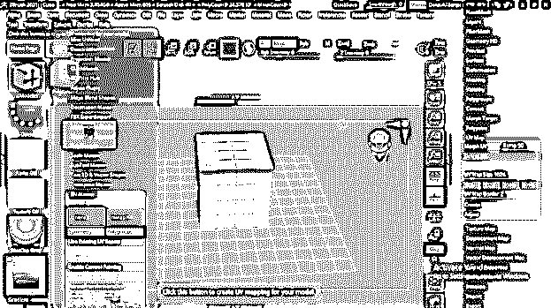

转到工作屏幕右侧的工具面板，点击 UV 贴图选项。在这里你可以点击这个选项的变形 UV 按钮来查看你选择的模型的展开视图。

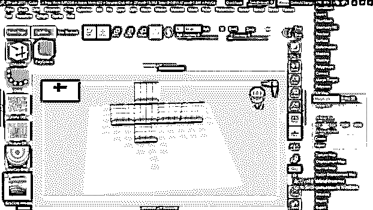

### 字符 Zbrush UV 贴图

现在让我告诉你如何为任何角色使用 UV 贴图。为了解释这一点，我将从 Zbrush 的 Lightbox 中选取一个角色模型。可以用自己的模型来做。

这是我们的模型，我将启用它的多边形框选项，这样我们就可以在上面看到多边形组。您可以通过按键盘上的 Shift + F 按钮来完成此操作，也可以在菜单栏的“变换”菜单的下拉列表中找到此选项。

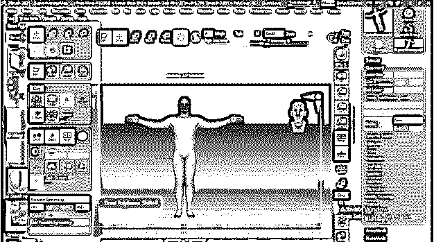

现在，下一步是创建单独的多边形组，为此，我将按住键盘上的 ctrl 键，并选择腿部区域，以在其周围创建遮罩。

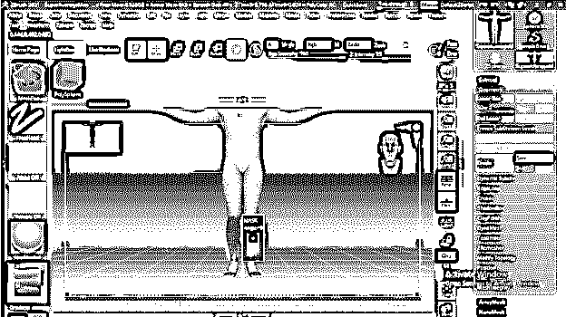

现在，通过按 Ctrl + W，我们可以将我们选择的区域转换成单独的多边形组。

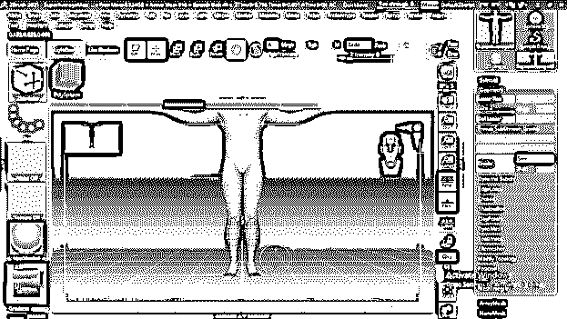

对模型的所有部分逐一执行此操作。我这样做是为了我的模特。

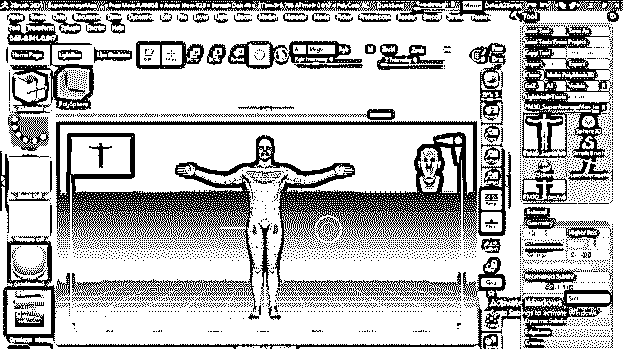

现在进入 Zplugin 菜单，在这里打开 UV master 标签。启用 UV 主选项的“对称和多边形组”按钮。

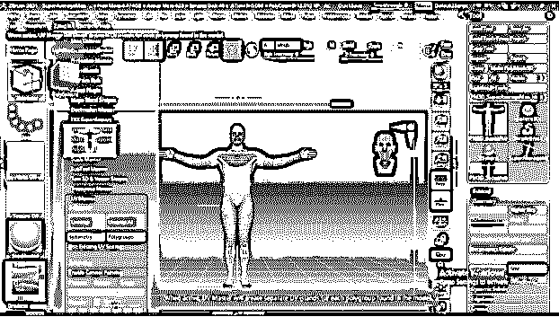

在我们点击展开按钮来制作 UV 贴图之前，向下滚动到这个面板并点击“工作在克隆”按钮，这样我们就有了一个模型的克隆，UV 贴图包裹在模型的非破坏性模式下工作。

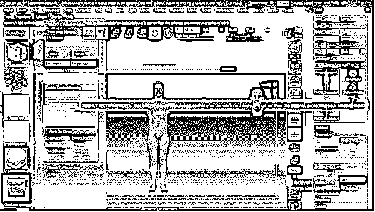

现在点击这个面板的 Unwarp 按钮。

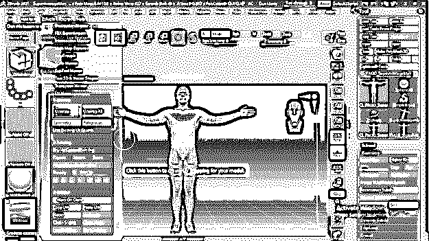

然后点击同一面板的展平按钮。

您可以看到模型中每个多边形组的 UV 贴图岛。

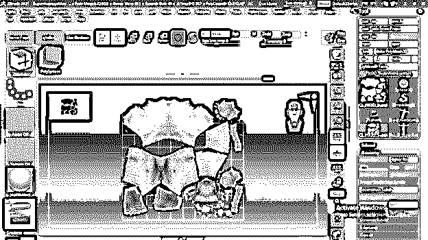

通过点击同一个面板上的“取消展平”按钮，你可以回到你的模型的正常模式。

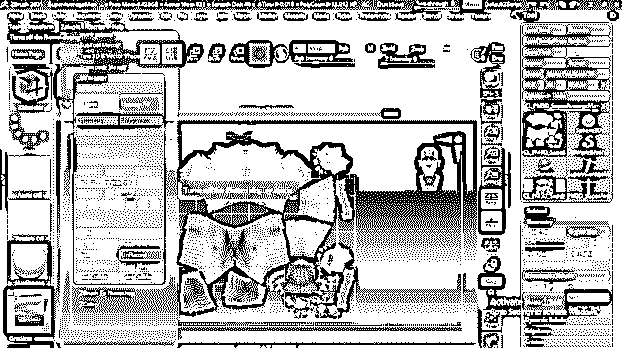

一旦我们点击展开按钮，我们有复制 UV 的选项启用，所以点击它。

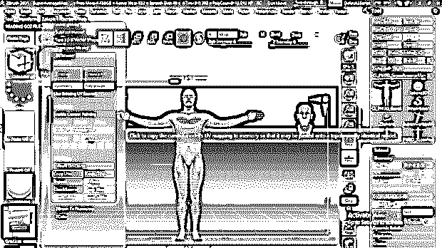

现在让我们从工具栏部分选择我们的原始子工具。

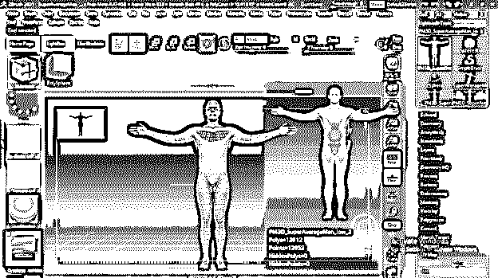

并通过单击该选项打开 UV 贴图面板。在这里你可以看到我们没有在 UV 贴图面板部分启用选项。

因此，要再次启用它，请进入 Zplugin，点击 UV 主面板的粘贴 UV 按钮。

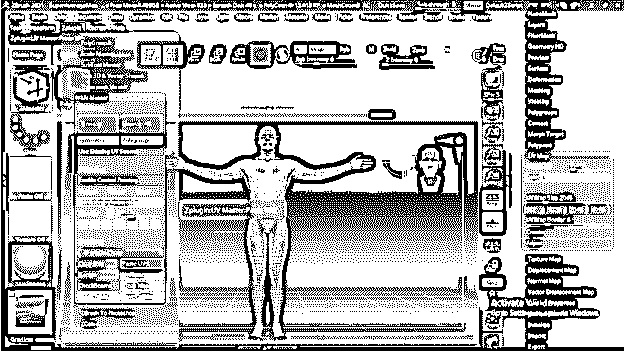

现在，您可以看到启用了 UV 贴图选项。点击它的变形 UV 按钮来创建这个模型的 UV 贴图。

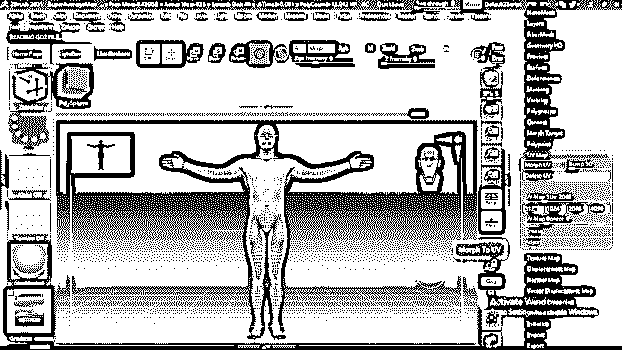

你可以看到这个模型的不同多边形组的 UV 图已经准备好了。

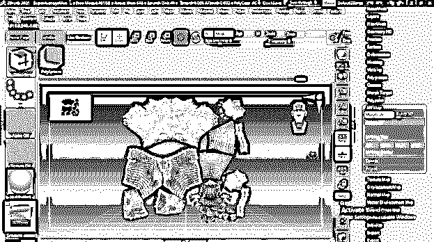

再次点击变形 UV 按钮，回到模型的正常模式。

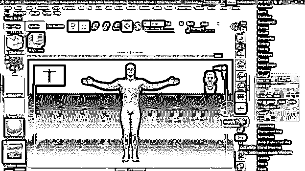

通过这种方式，您可以创建一个 UV 贴图，并将其用于任何类型的角色以及您为项目工作雕刻的模型。

### 结论

我想你会发现这篇文章非常有用，因为我已经向你解释了与 UV 映射你想要的模型相关的所有重要方面。你只需要为你想要的模型创建合适的多边形组，就可以得到模型的 UV 贴图的最佳效果。您可以保存 UV 贴图以备将来使用。

### 推荐文章

这是一个 ZBrush UV 贴图的指南。这里我们讨论一下入门，什么是 ZBrush UV 贴图，如何使用 ZBrush UV 贴图，有代码实现的例子。您也可以看看以下文章，了解更多信息–

1.  [Zbrush 纹理](https://www.educba.com/zbrush-texture/)
2.  [Zbrush Polypaint](https://www.educba.com/zbrush-polypaint/)
3.  [Zbrush Goz](https://www.educba.com/zbrush-goz/)
4.  [ZBrush 字符](https://www.educba.com/zbrush-character/)

