# ZBrush 模型

> 原文：<https://www.educba.com/zbrush-models/>

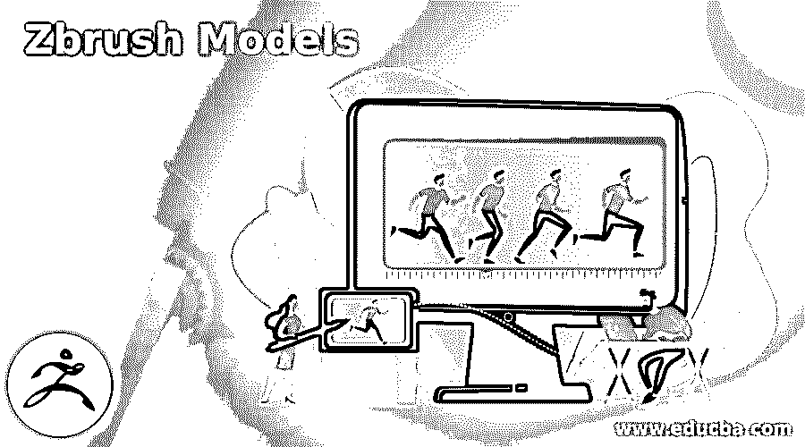

## ZBrush 模型介绍

ZBrush 在技术上代表了一种 3D 雕刻和建模软件，用于创建高质量的数字雕塑和模型。ZBrush 模型在电影、游戏、动画电影和高端 3D 图形设计中得到广泛应用。大多数情况下，ZBrush 模型用于每个动画和 VFX 行业。

ZBrush 软件归 PIXELOGIC 所有。该程序拥有无限的建模、绘画和纹理工具，这是创建电影数字雕塑和模型所必需的。在本文中，我们将学习更多关于在 ZBrush 程序上使用和创建真实而精确的模型。

<small>3D 动画、建模、仿真、游戏开发&其他</small>

### 如何创建 ZBrush 模型？

ZBrush 提供了一些工具和功能，通过快速简单的方法创建逼真的模型，为用户带来了好处。然而，当我们将 ZBrush 与其他建模工具进行比较时，该程序仍然以出色的用户友好界面和工作空间脱颖而出。

用户使用 ZBrush 的 3D 和 2.5D 技术创建详细的模型，这些模型既有魅力又非常直观。

使用 ZBrush，用户可以创建聚合物或多边形网格、多边形组、变形和纤维网格。此外，该软件还包括五十多种类型的笔刷，可用于移动、缩放、旋转、展平、收缩和放大网格周围的顶点和边。

用户还可以使用 ZBrush 材质面板向网格添加材质和颜色，甚至可以在需要时渲染最终产品。因此，ZBrush 是一个庞大的程序，可以帮助用户创建特定的功能和特性。

与 3D MAX & MAYA 程序不同，ZBrush 还使用精细的细节模型创建最小的多边形数。因此，我们可以在人体模型的脸上创建雀斑或皱纹，或者我们也可以使用 ZBrush 在大型车辆中创建凹痕或模具。

在 ZBrush 上创建模型的一些主要步骤如下

1.  发射 ZBrush

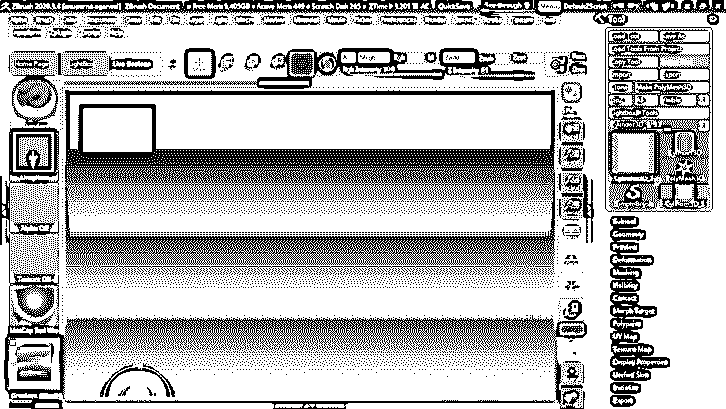

2.  转到文档并创建一个新文档。

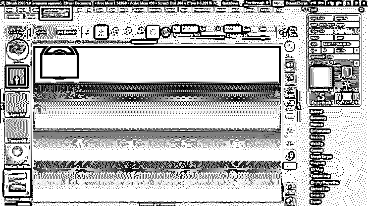

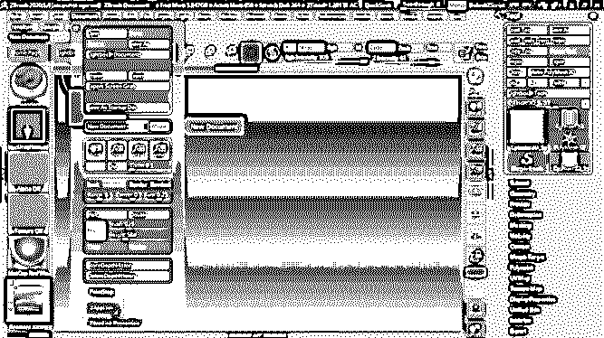

3.  转到绘图以创建模型

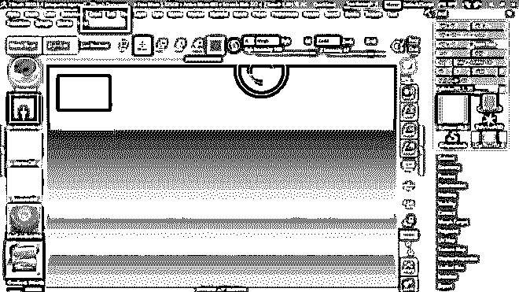

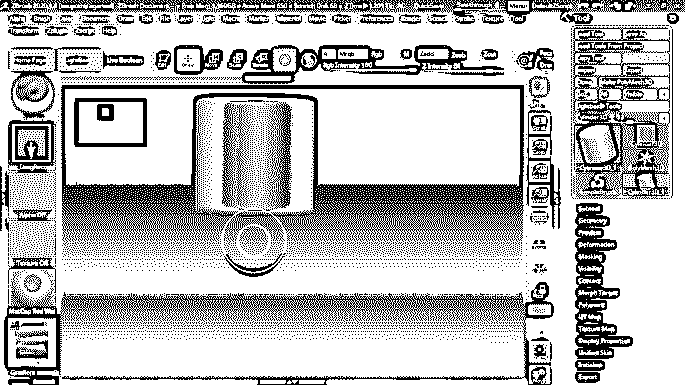

4.  转到工具，并选择灯箱工具

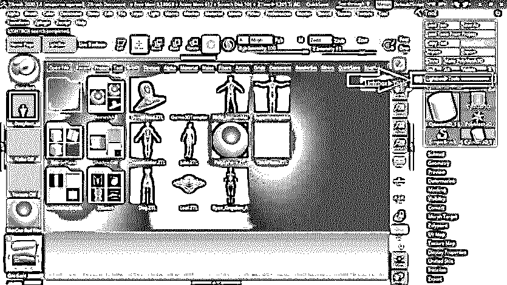

5.  你会得到一些预装的 3d 模型

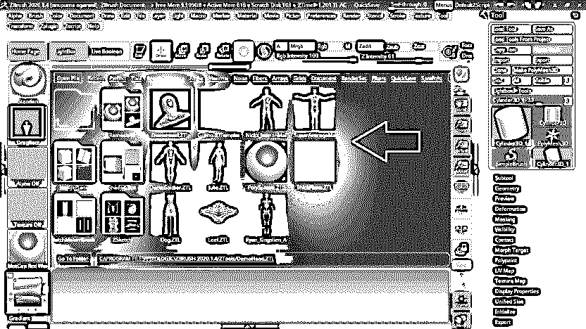

6.  拖放这些模型来编辑它们

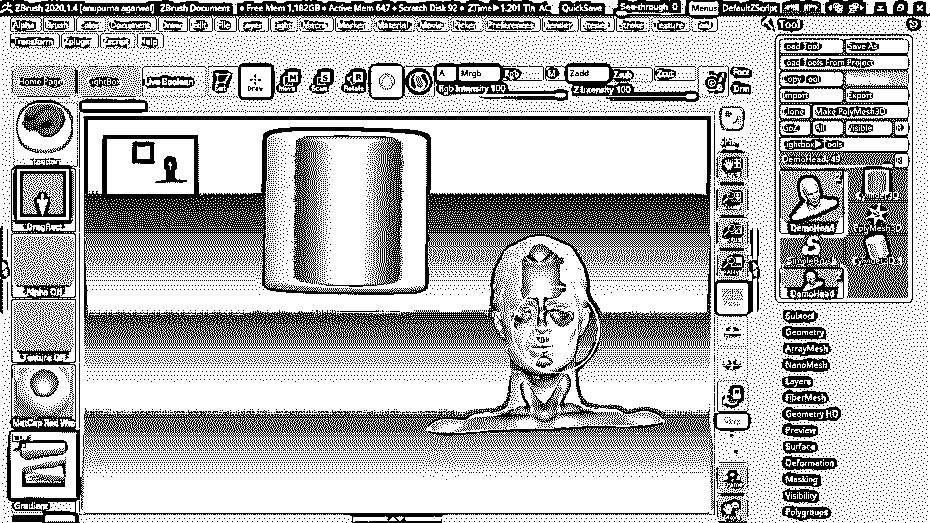

7.  我们可以使用程序中可用的不同工具来编辑结构。

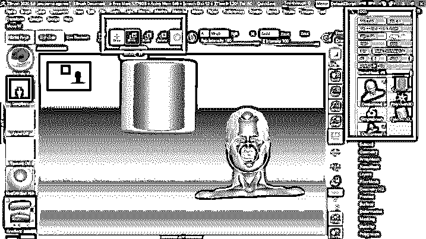

8.  我们也可以使用笔刷来修改我们的结构，如下所示。

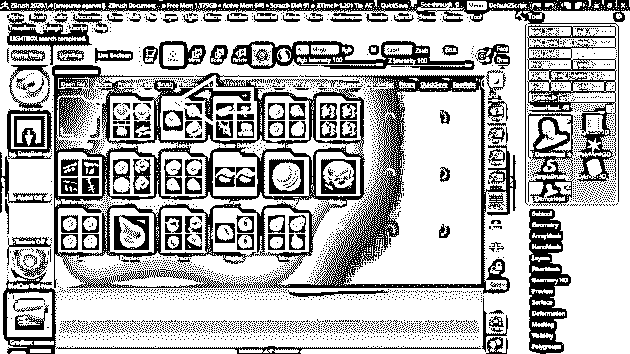

9.  转到工具对话框，单击另存为保存项目

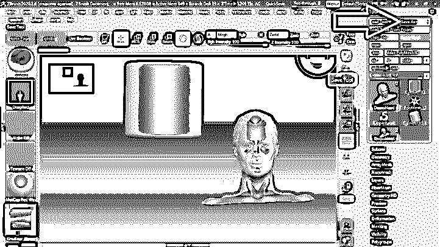

以上步骤是在 ZBrush 上创建模型的基本步骤。该计划中的大多数型号都预装了该软件。用户可以快速获得结构，然后根据他们的要求修改结构。

ZBrush 是一个广泛的程序，不局限于单个工具或功能。例如，我们可以用这个程序创造一个完整的游戏体验或者一个 3D 真人秀。

### 如何使用 ZBrush 模型？

ZBrush 是一个非线性程序，与其他 3D 建模程序相比，这是一个额外的优势。用户在电影制作、游戏、高分辨率 3D 电影和视频游戏中使用该软件。

动画师、雕塑师和建模师要求软件能够快速响应，并拥有所有工具来创建一个界面友好、细节清晰、逼真的模型。ZBrush 为创意设计师提供了一个平台，将他们的想象力和想法带到屏幕上。

尽管该节目拥有惊人的观众群，在业内广受欢迎。这个程序的价格仍然是预算友好的，可以很容易地被创业公司以及独立和自由设计师购买。

此外，ZBrush 程序从一开始就已经更新和增强了很多次，它提供了新时代的工具和功能，具有快速变化的技术和机制。

ZBrush 甚至可以将文件导出为最需要的格式 OBJ 和 FBX。这些格式主要由 MAYA 或 MAX 等 3D 软件使用。如果需要，用户可以将文件导出到其他程序。

网格细节、雕刻笔刷、表面噪波、UV Master、非照片真实渲染、Live Boolean、ZModeler 和 ZRemesher 等功能可用于创建所需的最佳输出。

设计师在 ZBrush 上完成的一些主要作品包括电影，如《兰戈》、《钢铁侠》、《星际迷航》和《环太平洋》。

### 结论

总结文章，说创意开发者为高端艺术家和设计师制作 ZBrush 要容易得多。ZBrush 模型可用于需要逼真地创建插图和内容的每个技术领域。

尽管 ZBrush 程序具有宇宙特征，但它仍然可以轻松快速地学习和掌握。此外，该计划有助于创建非凡的网格和模型的数字和准确。

### 推荐文章

这是 Zbrush 模型的指南。这里我们讨论如何在 ZBrush 程序上使用和创建真实精确的模型。您也可以看看以下文章，了解更多信息–

1.  [ZBrush 替代品](https://www.educba.com/zbrush-alternatives/)
2.  [Zbrush 免费](https://www.educba.com/is-zbrush-free/)
3.  [ZBrush For Students](https://www.educba.com/zbrush-for-students/)
4.  [ZBrush 工具](https://www.educba.com/zbrush-tools/)

