# ZBrush 3D 打印

> 原文：<https://www.educba.com/zbrush-3d-printing/>

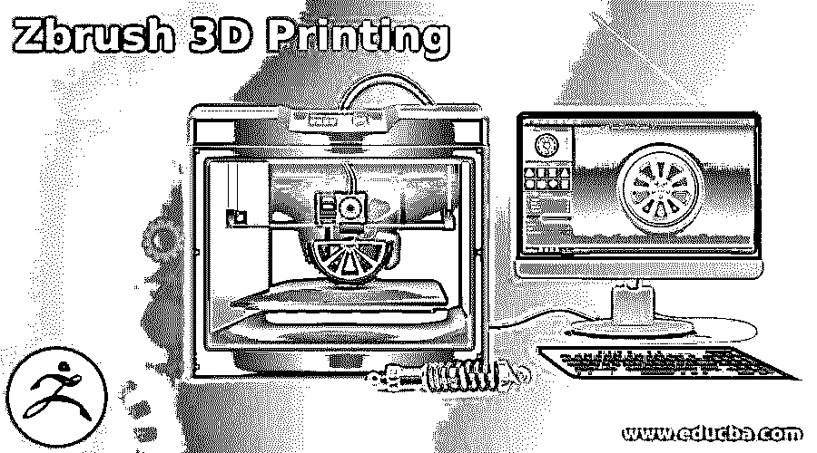

## ZBrush 3D 打印简介

ZBrush 3D 打印可以理解为经历打印我们的模型的过程，这意味着对我们在 ZBrush 中创建的 3D 模型进行必要的调整，并为打印软件做好准备。Zbrush 为我们提供了一个易于使用的 Decimation Master 版本，该版本优化了我们的 3D 打印模型，在这种优化中，它减少了我们模型的多边形数量，而不影响模型的原始质量。所以，让我来告诉你，为了对这个主题进行深入分析，我们必须一步一步地 3D 打印我们的模型。

### ZBrush 模型的 3D 打印

为了把你的模型拿到 3d 打印机上，你需要通过一些步骤来得到正确的打印结果，在这里我将告诉你这些步骤。

<small>3D 动画、建模、仿真、游戏开发&其他</small>

我先在这里打开一个 Zbrush 模型文件。你可以带着你自己的模型来这里。

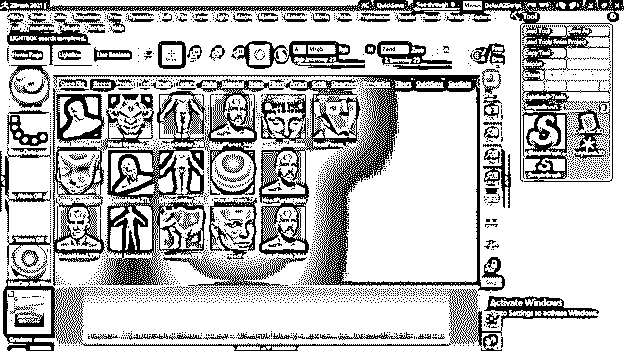

我从网上下载了这个模型，为你解释这个 3D 打印的话题。

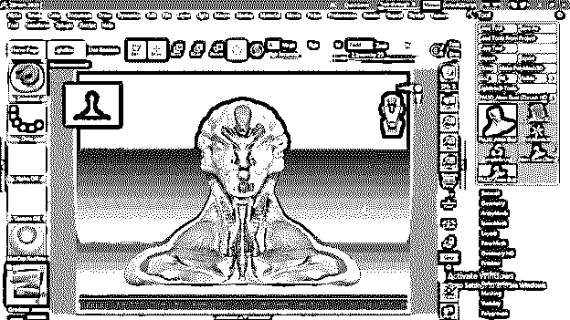

我将转到子工具面板，向您展示这个模型有一个固体子工具元素，这是非常必要的，您的模型应该是一个整体，因为在您的模型中不应该有整体，以便将其带入打印机。

让我告诉你几个主要步骤:

**第一步:**

避免任何整体或水流区从你的模型。如果您的模型中有许多网格，请转到几何面板，单击 Dynamesh 选项，增加分辨率值，然后单击同一选项的 Dynamesh 按钮。它会把你的模型变成一个整体。

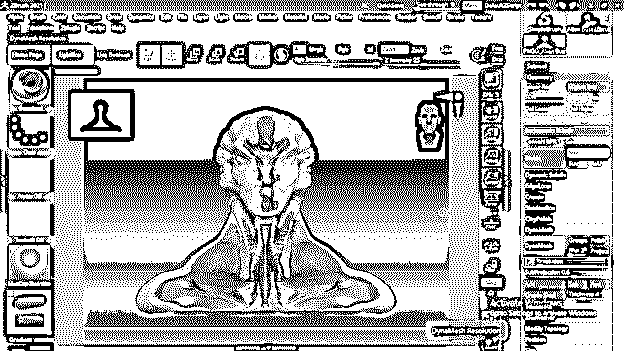

现在下一步是关于你的模型的方向。

**第二步:**

接下来就是模型的朝向了。在 Zbrush 中，我们模型的表面与 3D 打印机的表面有些不同。这是因为 3D 打印机在 Z 轴上工作。

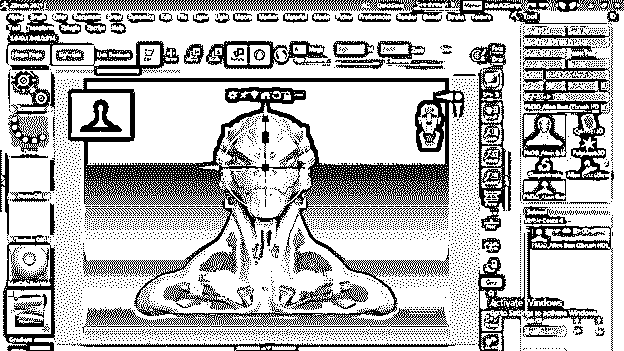

因此，为了改变你的模型的方向，你可以直接旋转它到 90 度，或者可以去变形面板，然后旋转它的选项。在“旋转”选项中，选择 X 轴。

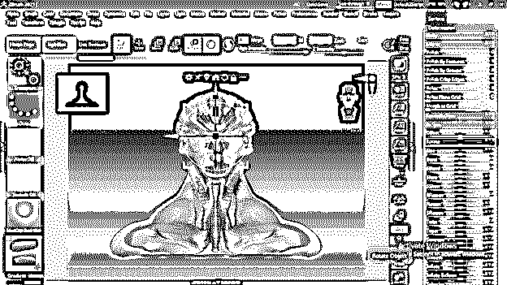

然后在这里，输入-90 作为将其旋转到 Z 轴的旋转值。

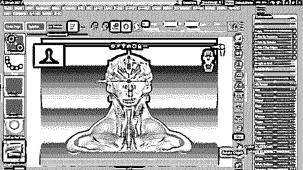

这是打印机的正面。

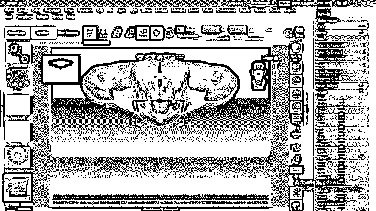

现在，您可以将其旋转到正面，但方向不会受到影响。

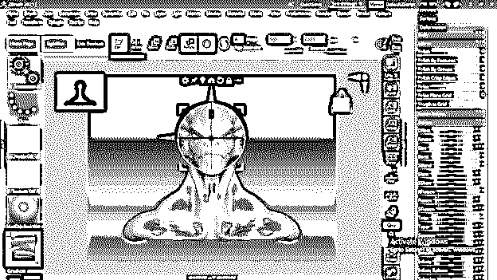

现在让我们进入下一步，也就是模型的底部应该是平的。

**第三步:**

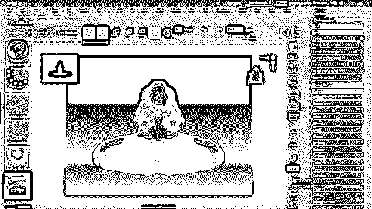

让我给你一个快速的观点，告诉你如何做一个平的底座。我将从 Zbrush 的工具栏部分获取这个 3D 圆柱体模型。

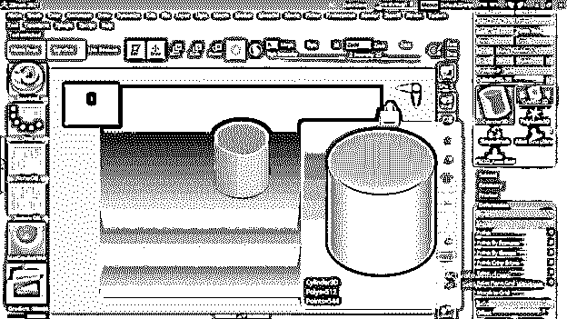

现在转到标准笔刷按钮并点击它。然后从列表中导航到 TrimCurve brush。你可以按下键盘上的字母 T 来拥有名字以字母 T 开头的刷子。

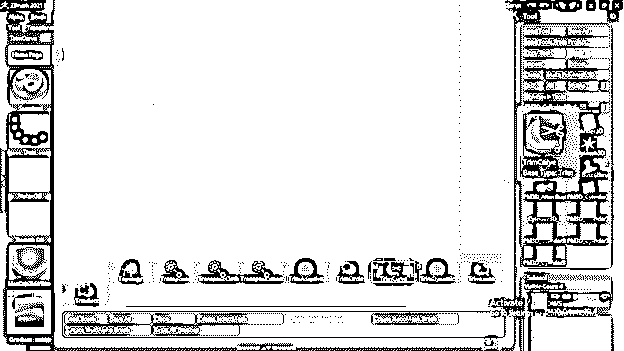

现在按住键盘上的 Ctrl + Shift 键，并在要进行切片的曲面上绘制一条切片线。

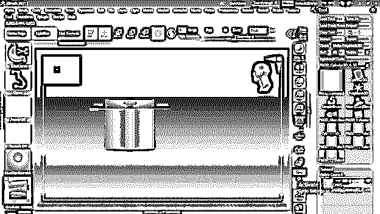

修剪后，它会给你一个像这样的平面。

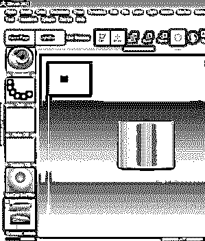

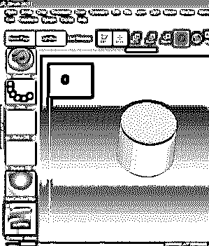

现在，我将对这个模型进行同样的操作，或者您可以为您的模型创建一个平底。

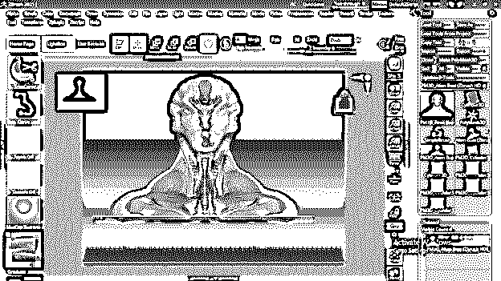

现在它有一个平坦的底部。

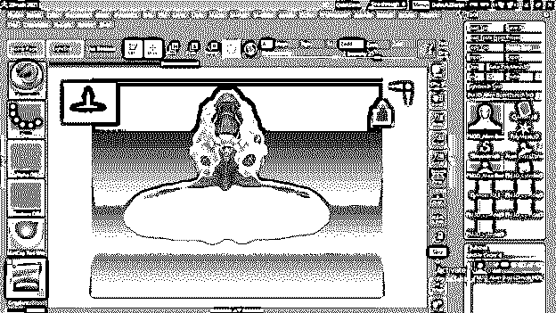

**第四步:**

下一个重要的步骤是抽取母版，它帮助我们减少模型的多边形数，使其完全适合打印目的。最棒的是这不会影响我们模型的质量。

你可以在 Zbrush 的插件下找到这个插件。

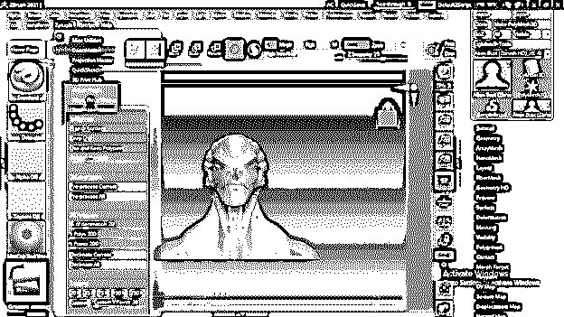

您可以更改抽取的百分比，这会更改模型的多边形和点数。

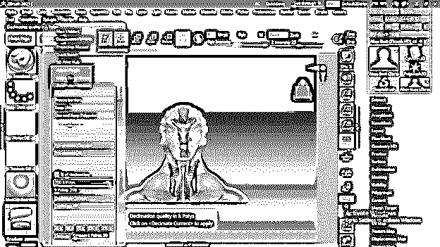

要更改它，请单击预处理电流，这将需要一些时间来预计算它。

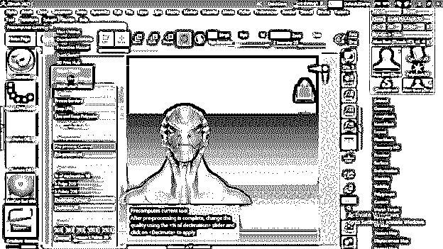

然后点击“抽取电流”,之后点击该面板的“全部抽取”按钮获得结果。

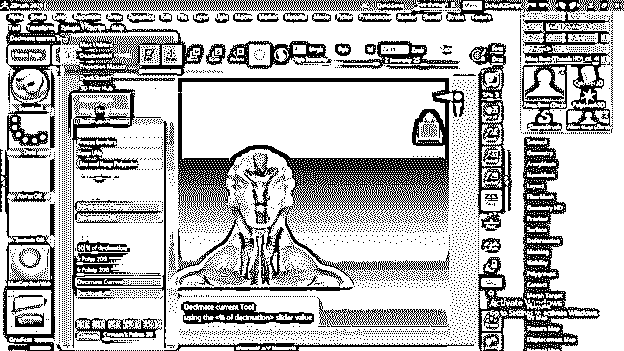

下一步是设置比例和 3D 打印中心参数。所以让我们也来看看吧。

**第五步:**

要让 Scale Master 进入 Zplugin 并点击此菜单，我们将在它的下拉列表中有不同的选项。我将点击刻度线。

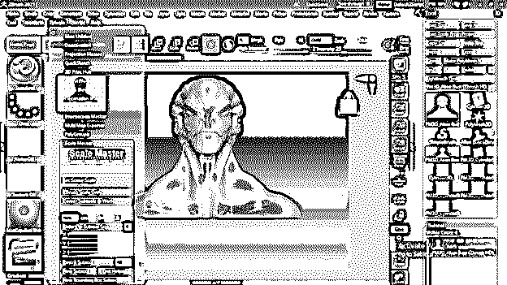

在这个缩放主面板中，我们有我们模式的 X、Y 和 Z 轴的缩放值，您可以根据您的要求进行更改，但要确保 R 按钮处于活动状态，这将保持所有三个轴的缩放比例。

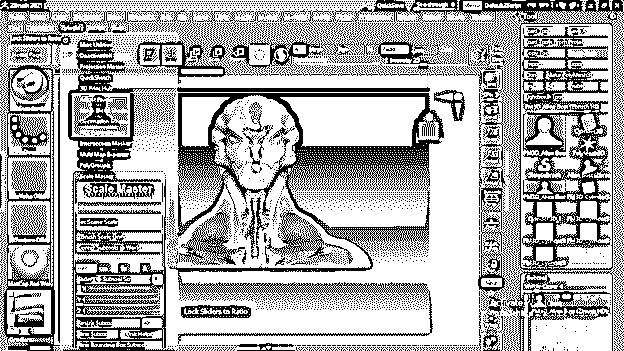

更改值后，只需点击调整子工具按钮。您也可以在此选择尺寸单位。

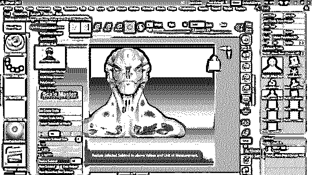

下一个选项是 3D 打印中枢，我们也在这里调整一些参数。您也可以在这里更改 X、Y 和 Z 轴的值，然后单击此面板的更新尺寸比例按钮。

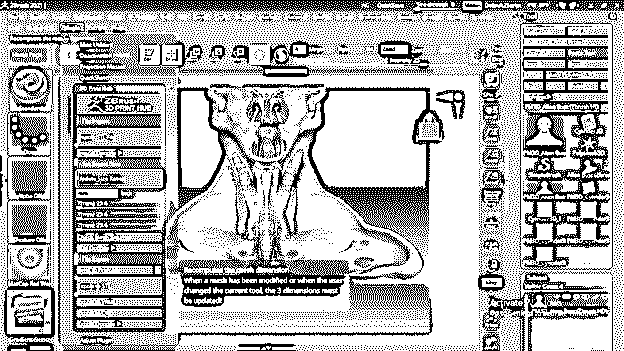

一旦你点击它，它会显示你选择的所有单位的价值。您可以在弹出对话框中选择任何显示的单位值。对于选择，只需点击您想要的单位的价值。

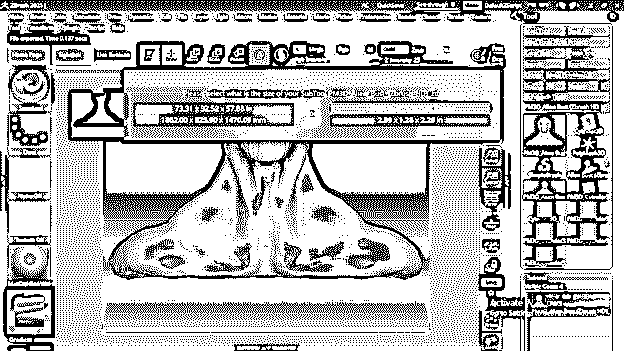

从同一个面板中，我们可以以不同的文件格式导出我们的模型，这些文件格式受不同的 3D 打印软件支持。3D 打印机公司提供这种软件，用于在通过 3D 打印机打印我们的模型之前进行一些调整。例如，如果你想以 STL 格式导出，点击这个面板的导出到 STL 按钮，并把它保存到你的计算机中你想要的位置。

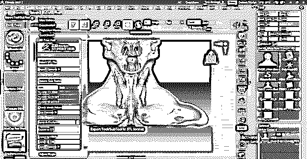

或者，如果你想把你的模型保存成 VRML 格式，那么你可以点击 Export to VRML 按钮，同样的方法，你可以用本软件的其他可用格式。

这些是你在 3D 打印过程之前必须经历的一些重要步骤。

### 结论

现在，您已经了解了正确准备模型并为 3D 打印做好准备的必要步骤。你可以过一遍上面讨论的步骤的参数，好好分析一下，对这个话题有一个深入的理解。

### 推荐文章

这是一个 ZBrush 3D 打印的指南。这里我们讨论一下参数，为深入理解 ZBrush 3D 打印做一个很好的分析。您也可以看看以下文章，了解更多信息–

1.  [ZBrush 插件](https://www.educba.com/zbrush-plugins/)
2.  [ZBrush 布刷](https://www.educba.com/zbrush-cloth-brushes/)
3.  [ZBrush 是什么？](https://www.educba.com/what-is-zbrush/)
4.  [ZBrush For Students](https://www.educba.com/zbrush-for-students/)

