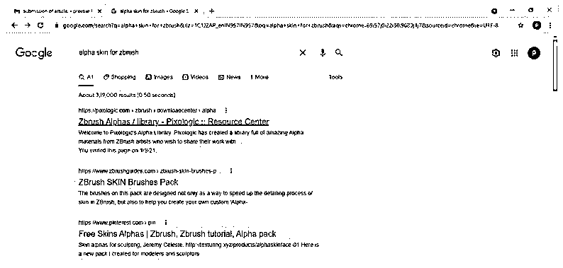
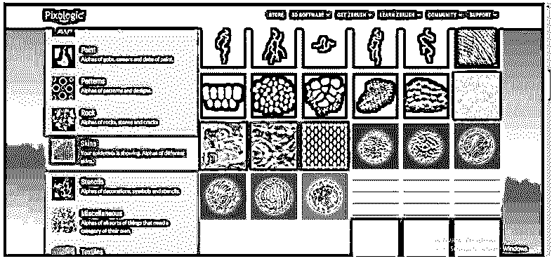
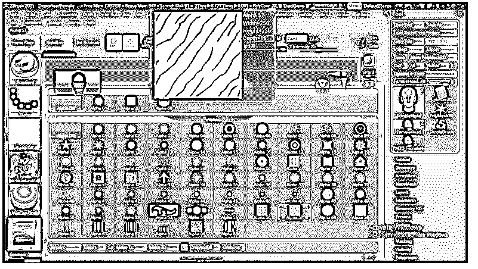
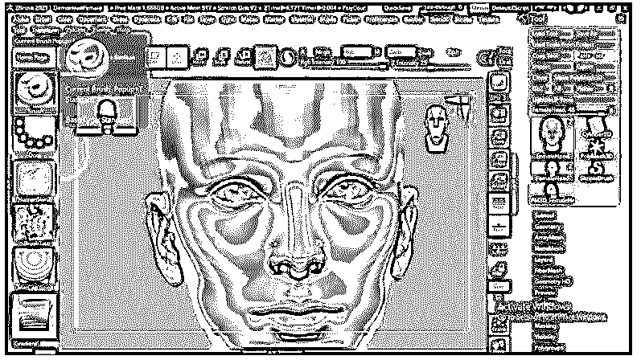
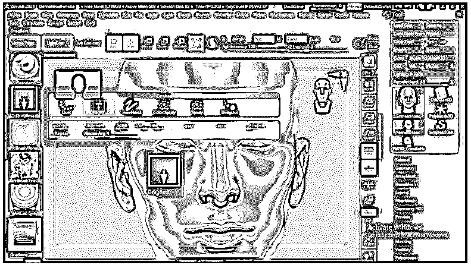
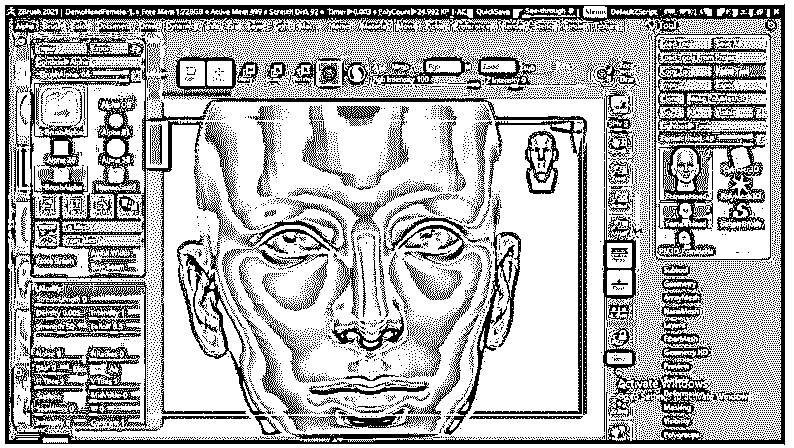
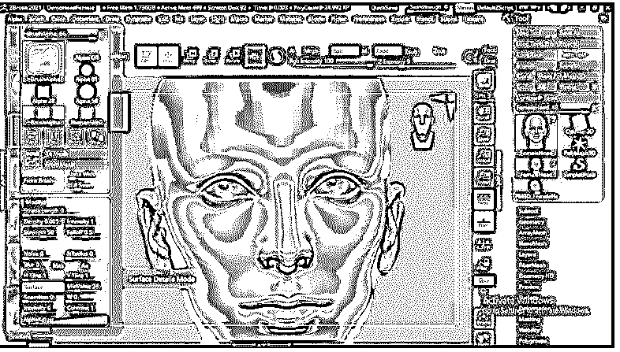
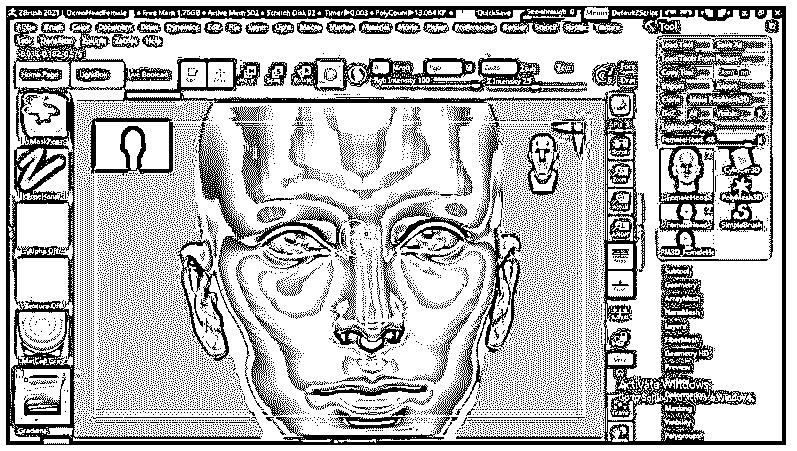
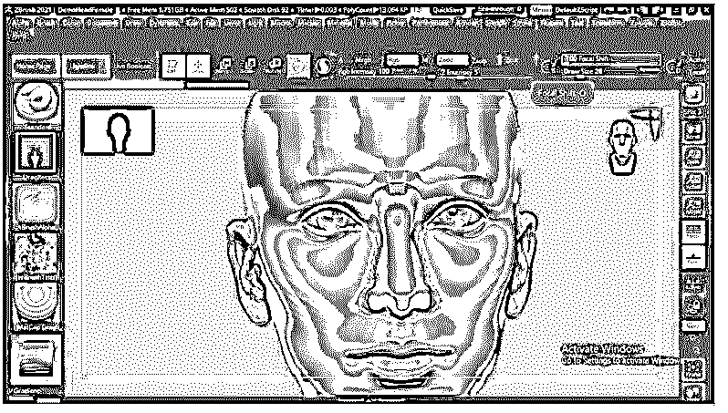
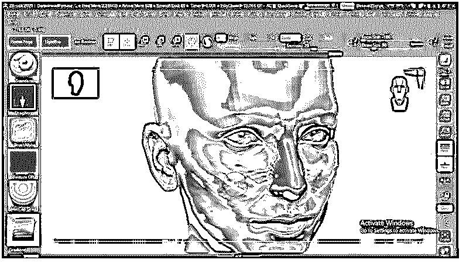

# ZBrush Alpha 皮肤

> 原文：<https://www.educba.com/zbrush-alpha-skin/>

## ZBrush Alpha 皮肤简介

ZBrush Alpha Skin 可以理解为应用于模型的细节，使其类似于真实世界的外观。Alpha 允许我们在模型上绘画，以在其上创建一个表面，该表面浮雕了所有需要的表面细节。阿尔法结构因模型的不同部分或你想在模型中添加的细节类型而异，例如对于生物，我们可以使用阿尔法来帮助我们增强其皮肤的细节，就像我们可以使用人类皮肤的结构一样，包括皮肤的纹理，身体的静脉和皱纹等等。

### 如何在 ZBrush 中使用阿尔法皮肤？

在这里，我们将看到如何使用 Zbrush 阿尔法皮肤，以及在哪里可以找到阿尔法皮肤纹理。对于浏览，它会转到任何浏览器并搜索 Zbrush 的 Alpha 皮肤，搜索后我们会有我们的结果。

<small>3D 动画、建模、仿真、游戏开发&其他</small>

你可以去 Zbrush 的官方网站，这是 Pixologic 或有它从其他网站也有。我们先从像素学开始。一旦你打开链接，你会在页面的不同标签部分看到一个 Alpha 标签，在这个标签下，我们有许多不同用途的 Alpha 文件。

在这里，我们将看到皮肤阿尔法，以便我们将在这一页导航皮肤。你可以在同一页上向下滚动找到它。

一旦我们点击它，它会向我们展示所有的皮肤阿尔法，根据生物和人类有不同的细节。外星人也有皮肤阿尔法。所以你可以根据你的需要下载任何一个。比如我们有龙皮阿尔法。

阿尔法代表指甲等等。

现在让我们进入 Zbrush 软件来理解如何将 alpha 皮肤应用到我们的模型中。在 Zbrush 中，我们将从 Light Box 中获取一个模型，它有模型的预设，并使用该模型。

所以我们会点击灯箱按钮，选择这个女头模型。然后，我们双击它，让它出现在我的工作空间里。

现在，在工作区的左侧，我们有一些选项卡，在这个选项卡的栏中，我们还有 Alpha 选项卡。这个选项卡中什么都没有，或者说它是空白的，因为目前，这个模型上没有应用 alpha，您可以理解为 Alpha 是关闭的。

要将 alpha 应用到您的模型，请转到 Alpha 选项卡并单击它。一旦你点击它，你会看到一个由 Zbrush 提供的阿尔法预设列表。您可以根据需要将此列表中的任何预设用于不同类型的目的。

但是我们已经从网上下载了今天主题的皮肤 Alpha。我们在下载的文件中有大象、人类和蛇的皮肤 alpha，但是我们将通过人类的皮肤看到它。

现在，让我将这个人类皮肤 alpha 导入到 Zbrush alpha 面板，为此，我们将单击 alpha 面板的 import 按钮，它位于该面板的底部。

一旦我们点击导入对话框，我们想要的 alpha 皮肤文件就会打开。我们将从列表中的保存位置选择第二个。你可以使用你收藏的任何其他阿尔法皮肤。

现在在同一个标签栏中，我们有一个笔刷标签，所以如果你没有在这里选择标准笔刷，请在列表中选择标准笔刷。

在下面要刷的选项卡中，该选项卡从它的列表中选择 DrawRect 选项。一旦你点击这个标签，这个列表就会出现。

现在进入菜单栏的 Alpha 菜单，它在这个软件的菜单栏部分。菜单栏位于工作屏幕的顶部。在此栏中，转到修改按钮并单击它。如果您没有看到该按钮，请在该面板中向下滚动。

现在在修改按钮，有一个表面按钮，所以点击它，以便我们可以应用阿尔法通道到我们的模型。

在将 alpha 皮肤应用到所选模型之前，遮罩不想应用该 alpha 皮肤的区域。因此，我们将按住键盘的 Ctrl 键，它会将鼠标变成一个遮罩笔。您可以通过鼠标光标的黄色来识别它。

我们将掩盖这个鼻子区域，因为我们不想在这里应用阿尔法皮肤。您可以根据需要遮蔽模型上的区域。稍后，您可以将其他 alpha 皮肤应用到蒙版区域。

现在转到工作区的顶部，根据你的要求调整笔刷的强度，这意味着你要在笔刷尖上使用多少压力，以便它以该强度绘制 alpha 皮肤。

从同一个栏，调整焦点移动，这样我们就可以正确地应用阿尔法皮肤。我们将在焦点偏移选项的滑块中输入该值，将其设置为-100。

现在，将鼠标光标拖动到要应用 alpha 皮肤的皮肤区域。您可以通过连续移动鼠标光标或一步一步地应用它。

这样，您可以将 alpha 皮肤应用到您的模型。不仅可以用在人类的皮肤上，还可以用在其他生物的皮肤上，以增强皮肤表面的细节。

### 结论

通读完这篇文章后，你一定会发现一些有用的信息，并可以对它们进行分析，以便更好地理解。如果你愿意，你可以按照同样的步骤将 alpha 皮肤应用到其他生物而不是人类皮肤上。您可以在此过程中操纵参数，以获得更多变化和更有效的结果。

### 推荐文章

这是一个指南 ZBrush 阿尔法皮肤。这里我们讨论一下入门以及如何在 ZBrush 中使用 alpha 皮肤？为了更好的理解。您也可以看看以下文章，了解更多信息–

1.  [ZBrush 雕刻](https://www.educba.com/zbrush-sculpting/)
2.  [ZBrush 热键](https://www.educba.com/zbrush-hotkeys/)
3.  [ZBrush 布刷](https://www.educba.com/zbrush-cloth-brushes/)
4.  [ZBrush 插件](https://www.educba.com/zbrush-plugins/)

