# ZBrush 布尔型

> 原文：<https://www.educba.com/zbrush-boolean/>

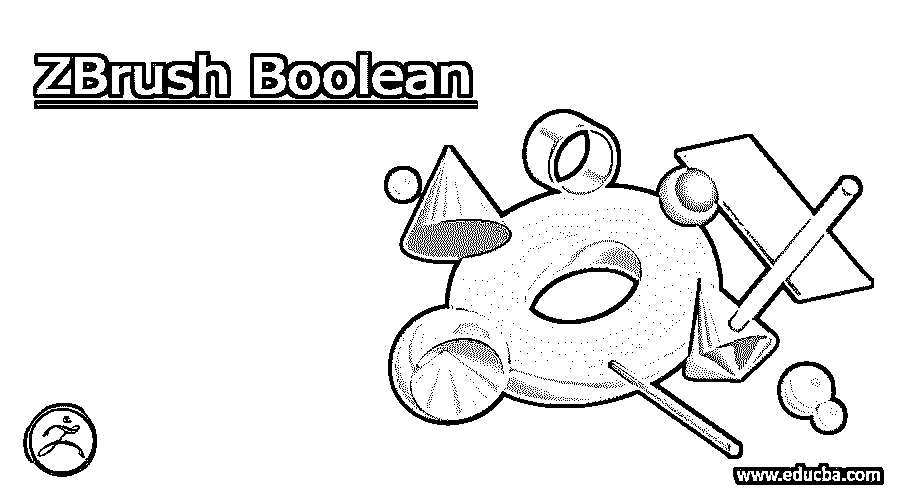

## ZBrush 布尔函数简介

ZBrush Boolean 可以理解为这个软件的一个工具，通过它我们可以通过看到它的实时预览来创建 3D 形状。这些形状包括不同的操作，如组合两个元素，减去它们，并使用布尔运算使它们成为一个元素。在 ZBrush 中，我们称这些元素为子工具，我们可以在这个软件的建模或雕刻过程中使用它们。因此，我们可以将布尔分为两个部分，一部分是实时布尔，它允许我们看到布尔运算的实时变化，另一部分是布尔运算，它给出我们想要的最终结果。

### ZBrush 布尔过程

*   通过这个过程，我们可以非常容易地使用布尔运算创建模型，它的工作方式与 DynaMesh 布尔运算非常相似。为了经历这个过程，我们只需要使用子工具面板的一些操作:元素的加、减或交；你可以在顶部的子工具面板上找到这些操作的小图标。
*   在使用任何操作之前，启用实时布尔按钮(您可以在 LightBox 栏部分的菜单栏下面找到它),以查看执行布尔操作的实时预览。
*   对结果满意后，转到“子工具”部分的“布尔”选项卡，并单击“布尔”选项卡的“生成布尔”按钮。

### 准备好你的模型

通过布尔运算得到你的模型，你必须经历一些步骤。实际上，你的模型的准备取决于你想对你的模型做什么类型的操作，以及你想要什么类型的最终结果。

<small>3D 动画、建模、仿真、游戏开发&其他</small>

这里，我们将使用一个简单的球体模型向您演示布尔运算，之后，您可以使用自己的模型完成同样的过程和步骤。为了获取一个球体模型，我们将转到 LightBox 选项卡，通过双击选择这个球体项目模型。

现在，我们将转到工具栏部分，该部分位于该软件用户界面的右侧，单击子工具面板，查看该面板的参数。在这里你可以看到工作项目的所有子工具元素。我们这里只有这个球体；这就是为什么在这个部分中只有一个 subtool 元素。

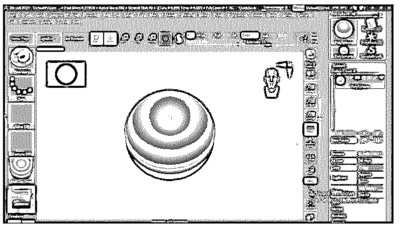

现在，因为这里还有一个子工具元素，我们将点击子工具面板的 Append 按钮。一旦我们点击它，我们有一些模型形状列表。

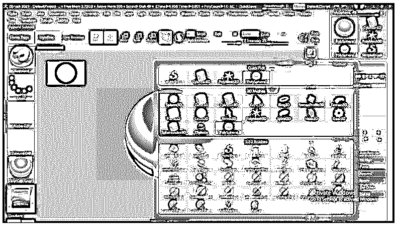

我们将选择这个圆柱形作为下一个子工具元素，我们将对它进行布尔运算。

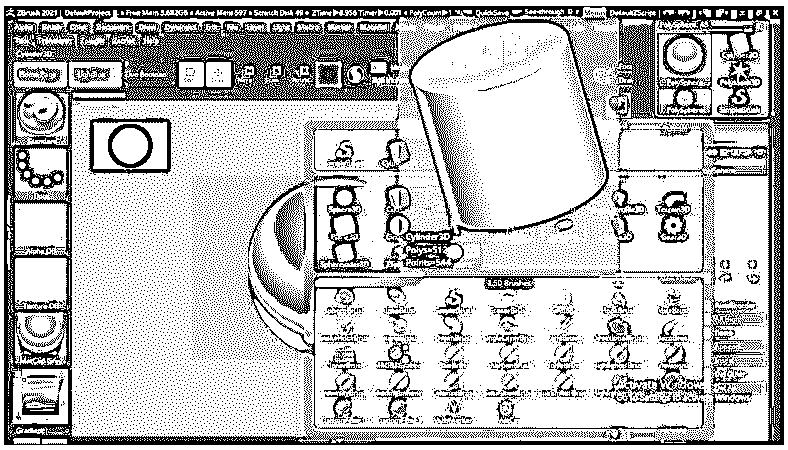

这是它的实际大小，因此根据您的要求更改模型元素的比例或进行其他所需的设置。

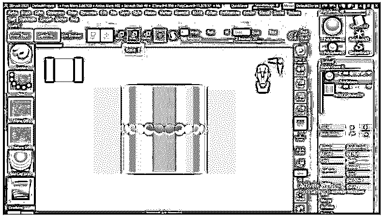

单击顶部栏的缩放工具按钮，激活缩放工具，我们将像这样缩放它。

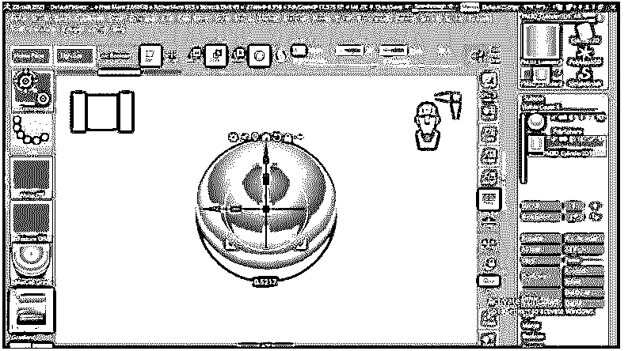

缩放后，我们将使用相同的缩放工具通过旋转手柄来旋转它。

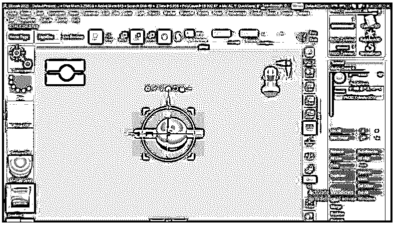

有一个名为 Start 的向下箭头，显示了该子工具层下面的所有子工具元素，它们将包含在布尔运算中并受其影响。因此，您可以通过单击此向下箭头按钮，使任何子工具层成为起始层。

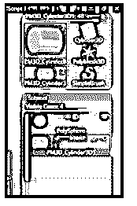

### ZBrush 中如何使用 Boolean？

现在准备好布尔运算的模型元素后，我们将了解如何使用布尔活动特征，以及如何将布尔运算应用于模型的选定元素。

现在转到工具面板上的几何栏并点击它。在此面板中，我们将找到 DynaMesh 选项卡，因此单击此选项卡的 DynaMesh 按钮，以便布尔运算正常工作。

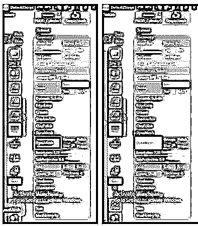

现在转到子工具面板，点击圆柱层的减图标按钮。

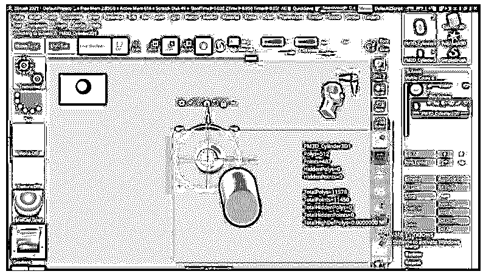

它会把这个圆柱形从球形中减去。只有当您启用了第二个顶部栏的编辑按钮旁边的实时布尔按钮时，您才能看到此预览。

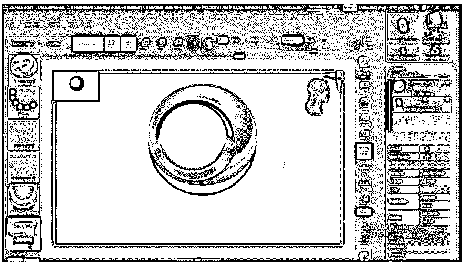

实时布尔运算为您提供了布尔运算过程中所做的任何更改的实时预览。例如，我们将获得启用缩放工具，并在右侧方向移动圆柱形子工具元素，您可以看到它正在向我们显示每一步的实时结果。因此，这是一个令人兴奋和有用的工具，可以很快得到我们想要的结果。

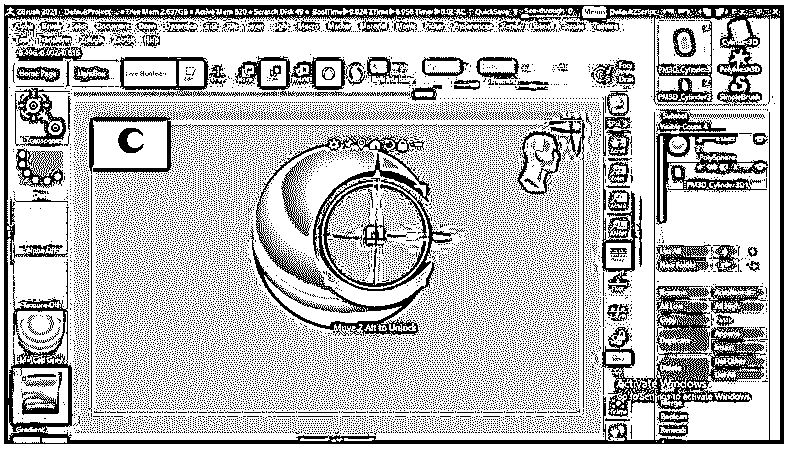

一旦你对你的模型感到满意，然后再次进入工具栏的子工具面板，在它的列表中，你会找到布尔标签，所以点击它。

在这个布尔选项卡中，我们制作了布尔网格选项，所以单击它来制作布尔操作模型的布尔网格。

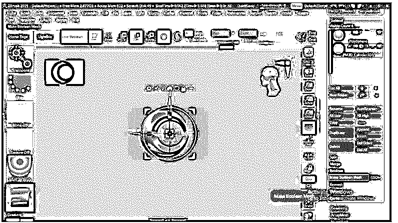

您将在 Append 选项卡列表下找到这个新的 Subtool 元素。单击 Append 选项卡，这里我们有了新的布尔操作子工具元素。

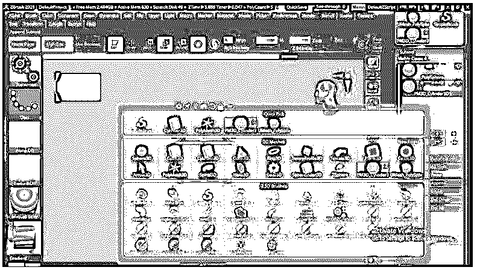

如果你想让它在子工具部分，然后点击它。

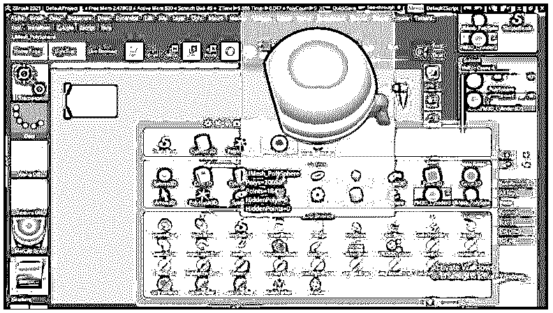

并且它会出现在 subtool 部分，你可以用它进行进一步的操作过程来制作模型的其他部分。

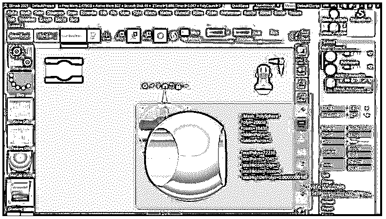

您可以在布尔运算子工具元素中进行其他设置，以获得其他变化。

### 结论

现在，您已经了解了该软件的布尔实时功能和布尔操作，以及如何以正确的方式执行它以获得您想要的结果。此外，您可以调整这些特征的设置，以便在模型结构中进行多种变化。因此，开始工作，这一行动，以提高您的工作技能，在这个软件。

### 推荐文章

这是一个 ZBrush 布尔的指南。在这里我们讨论介绍，过程，准备你的模型，以及如何在 ZBrush 中使用布尔？您也可以看看以下文章，了解更多信息–

1.  [ZBrush 雕刻](https://www.educba.com/zbrush-sculpting/)
2.  [ZBrush 热键](https://www.educba.com/zbrush-hotkeys/)
3.  [ZBrush 布刷](https://www.educba.com/zbrush-cloth-brushes/)
4.  [ZBrush 插件](https://www.educba.com/zbrush-plugins/)

