# Zbrush 渲染

> 原文：<https://www.educba.com/zbrush-render/>

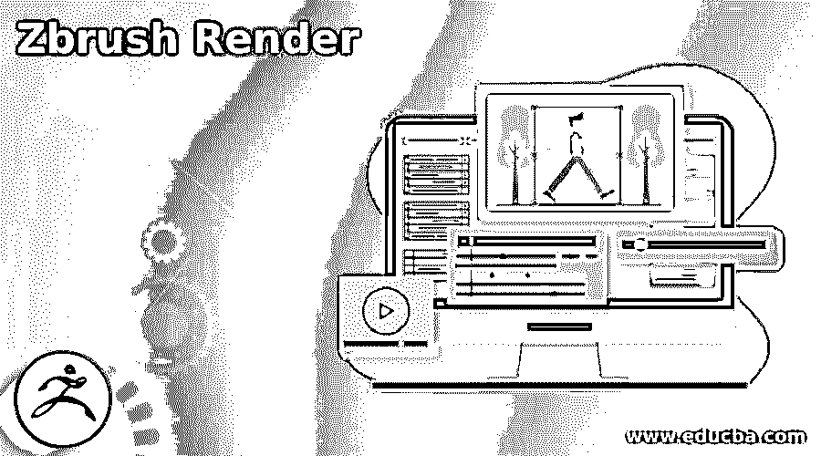

## ZBrush 渲染简介

ZBrush Render 可以理解为通过渲染(其设置)我们的 2D 以及在该软件中创建的 3D 模型的过程，以便我们可以了解我们的模型在我们将其用于最终目的时的样子。我们可以将渲染后的对象保存为图像，并将其放入其他合成软件中以供将来处理。在这篇文章中，我将告诉你在渲染过程中我们需要做的设置，光线在其中起着主要作用。我们用光和影来展示我们模型的更多细节，并创造假象。

### Zbrush 渲染怎么用？

要开始使用 Zbrush 的渲染功能，我们必须了解一些重要的设置，以获得我们的模型渲染的最佳结果。

<small>3D 动画、建模、仿真、游戏开发&其他</small>

为了给你解释这个话题，我先从这个软件的预置列表中取一个模型。因此，转到工作屏幕顶部的 LightBox 选项卡，然后单击它。

这里我们有一个模型和其他 3D 对象的列表，所以我将通过双击它从这个列表中选择这个 DemoHead 模型预设。

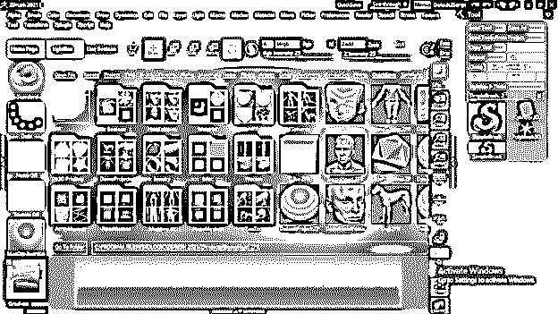

一旦我双击它，这个模型就会出现在我的工作区。

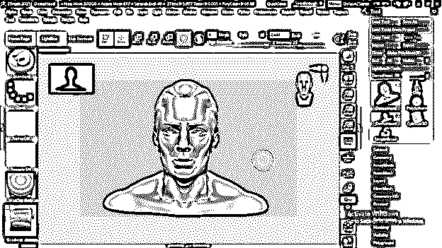

首先，我们将灯光设置为渲染效果，这样你就可以在菜单栏中找到灯光面板。

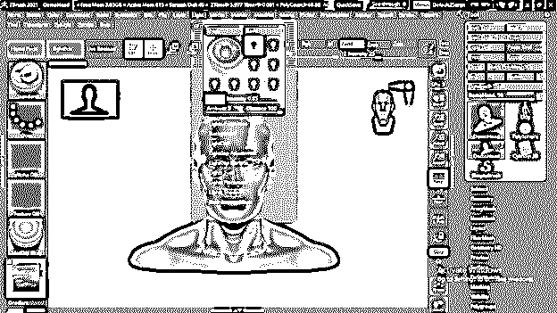

在同一个菜单栏中，我们还有一个渲染面板。

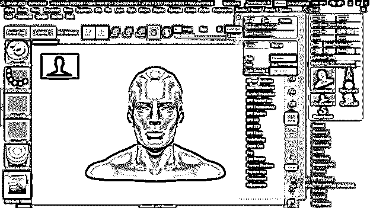

现在，我将通过双击该软件的双向箭头按钮打开左侧部分，将我想要的面板放在这里。

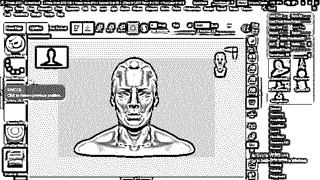

我将从菜单栏中选择材质面板。

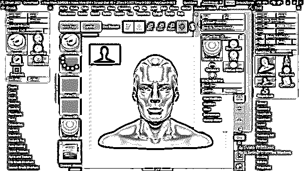

把它放在这里。

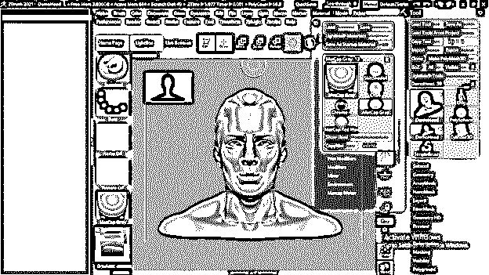

现在我将在我的模型上使用 MatCap 红蜡材料。你可以根据你的模型使用材料；我只是举个例子。

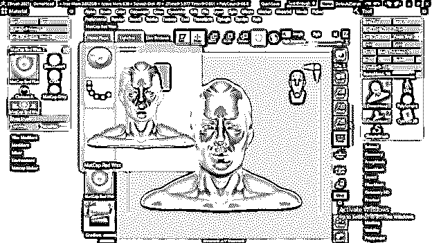

现在让我们在这个部分也有一个光面板。

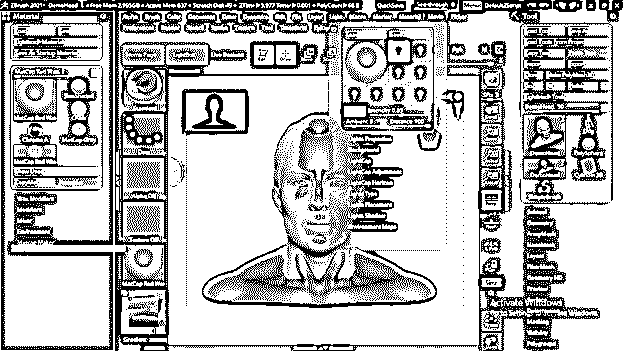

默认情况下，我们在模型的灯光面板中有一个灯光，它位于模型的顶部。

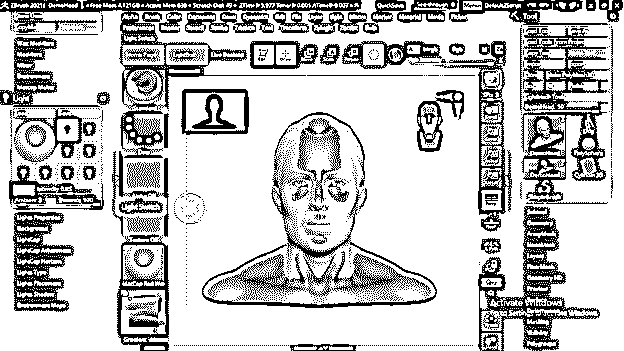

我们可以按照我们的要求移动它，这意味着我们想从哪一侧放下阴影和灯光效果。将灯光放置在您想要的位置后，您可以通过渲染来检查其效果，对于渲染，请单击 BPR 渲染按钮，您可以在此工作窗口的右侧找到它，或者您可以简单地按下键盘的 Shift + R 按钮作为快捷键。

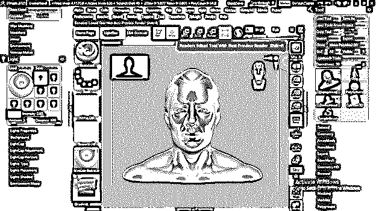

你可以看到它在光线下的样子，以及阴影会落在哪里。

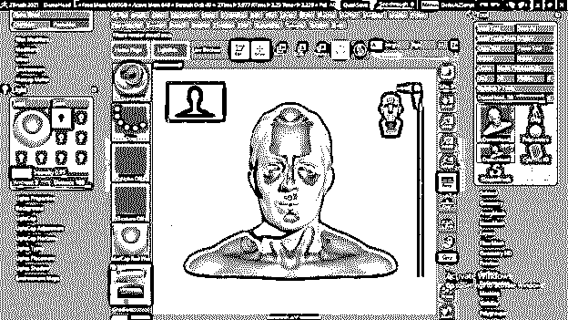

您可以根据自己的需要添加多个灯。要添加更多的灯光，只需双击灯光图标。

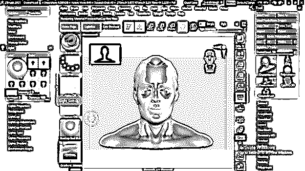

你可以在你想要的地方调整它。

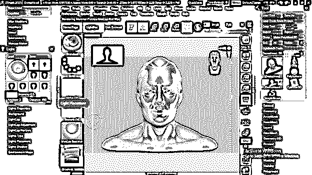

并能看到它的效果。

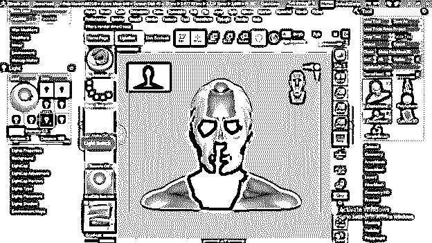

我们在这个灯光面板中也有一些参数，我们可以操纵它们来获得最佳的渲染效果。

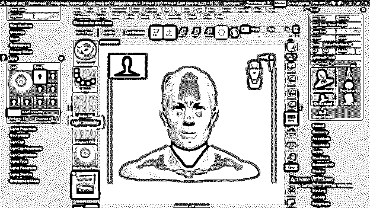

现在让我们在这部分打开渲染面板。

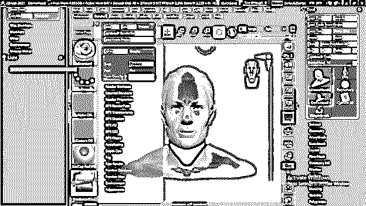

在这个面板中有许多参数和设置，但是我将告诉你其中的一些。要调整阴影，请转到渲染面板的 BPR 阴影选项卡。

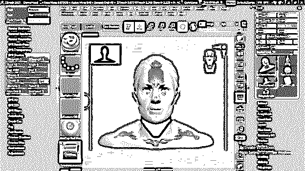

这里我们有一些参数，这样我们就可以通过改变这个选项卡的角度选项的值来改变投射光的角度。

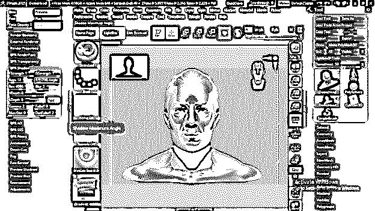

每次都可以通过按 BPR to render 按钮以相同的方式渲染来查看效果。

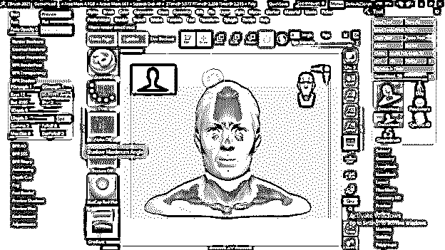

你也可以调整阴影的模糊效果，这意味着如果阴影非常强烈或不按照你的选择；然后，您可以增加或减少模糊值。

并通过渲染来检查。与此相同，您可以进行其他参数设置，以获得不同的变化。

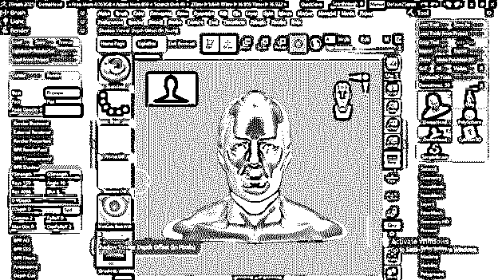

渲染面板中还有一个选项卡，即 BPR 渲染过程。

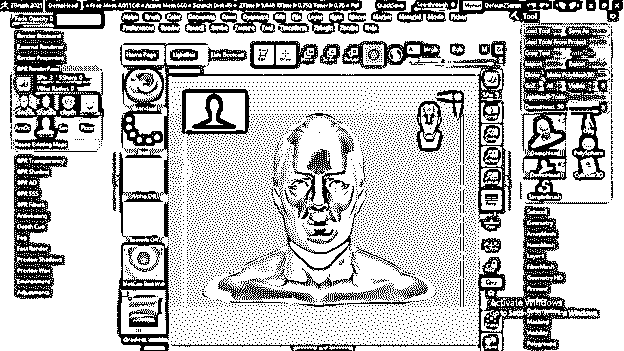

在其中，我们有我们选择的模型的不同的贴图，比如深度贴图，阴影，等等。

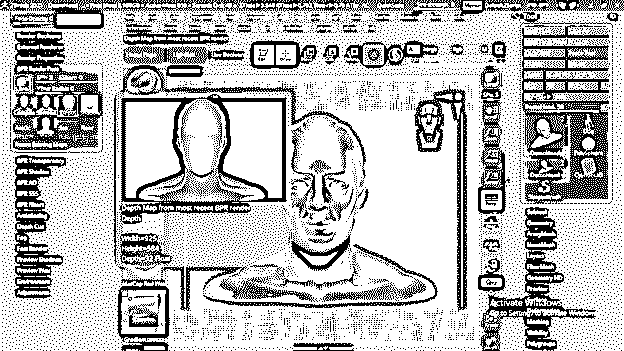

它还为我们提供了模型的遮罩，我们可以在其他合成软件中使用它来实现不同的目的和设置。

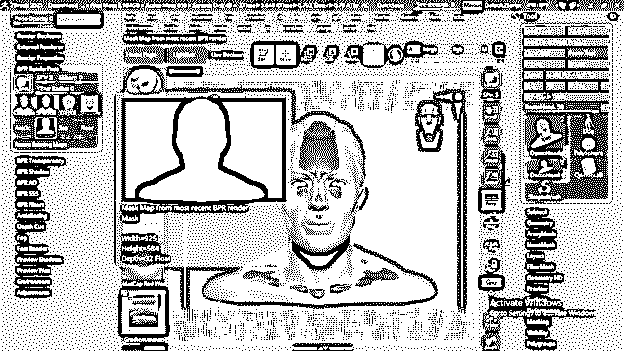

现在我将导出这个带有红色蜡材质的模型。psd 文件格式，这是 Adobe Photoshop 的原生文件格式。要导出它，请转到菜单栏的文档菜单，然后单击它。你会在这里找到导出按钮，所以点击它。

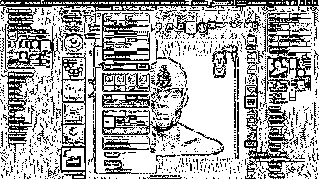

我会用我想要的名字把它保存在我电脑里我想要的位置。

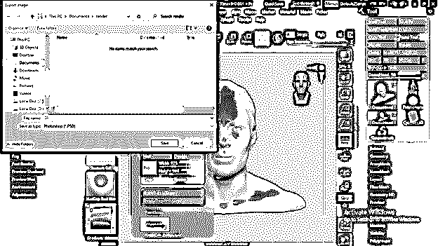

现在让我们将其他材料应用到我们的模型中。因此，对于申请，我将单击“材料”按钮，我们将在此列出所有材料。所以我会先选择 JellyBean 素材，在同一个位置用同样的方法再保存一次。

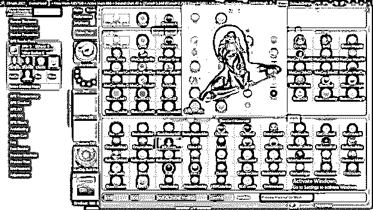

我用三种不同的材料保存了我的模型。

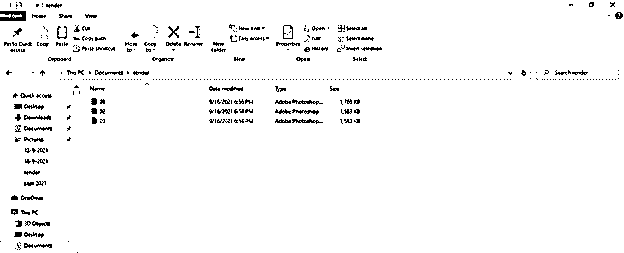

现在让我们进入 Photoshop 进行合成，并获得最佳的渲染输出。在这里，我用不同的材料打开了我的模型的三个文件。

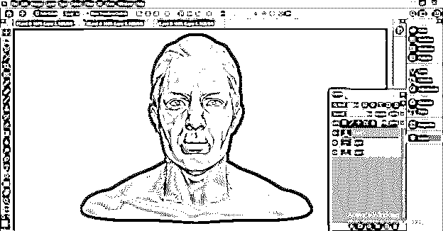

我已经去掉了上面两层的背景。我必须隐藏上层，因为首先，我们混合两个下层。

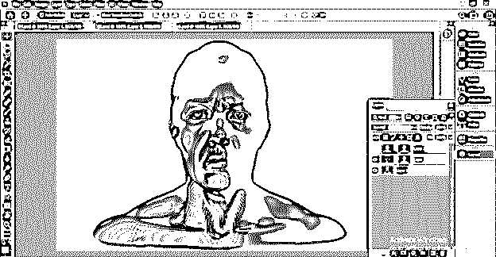

选择第二层后，我将进入 Photoshop 图层面板的模式选项，在这里你可以改变混合模式，以获得你的模型的最佳效果。我会从这个列表中选择柔光模式。

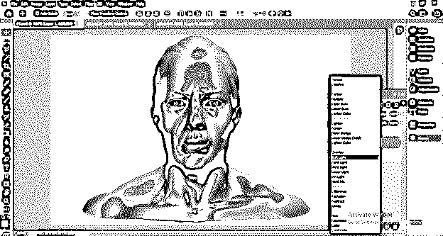

现在我将选择第一层，然后改变它的模式。这里我将使用叠加混合模式，因为我想给这个模型一个好的铜金属效果。

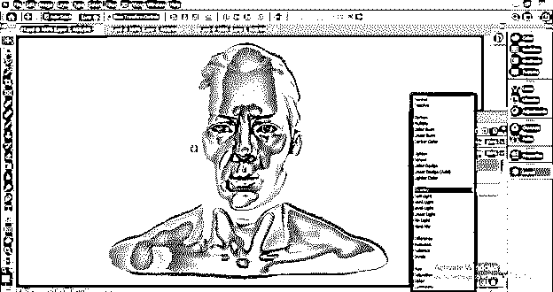

这些是你在 ZBrush 中完成模型渲染过程所必须了解的一些基本信息。

### 结论

我相信 Zbrush 中的渲染将不会有更多未知的特性，你可以调整不同的参数以获得良好的渲染效果。我们还在这里讨论了如何在其他合成软件中完成渲染模型的合成。所以你可以开始练习这个功能，以便对它有更多的了解。

### 推荐文章

这是一个 Zbrush 渲染指南。这里我们讨论如何在其他合成软件中完成渲染模型的合成。您也可以看看以下文章，了解更多信息–

1.  [ZBrush 热键](https://www.educba.com/zbrush-hotkeys/)
2.  [ZBrush 布刷](https://www.educba.com/zbrush-cloth-brushes/)
3.  [ZBrush 工具](https://www.educba.com/zbrush-tools/)
4.  [ZBrush 是什么？](https://www.educba.com/what-is-zbrush/)

