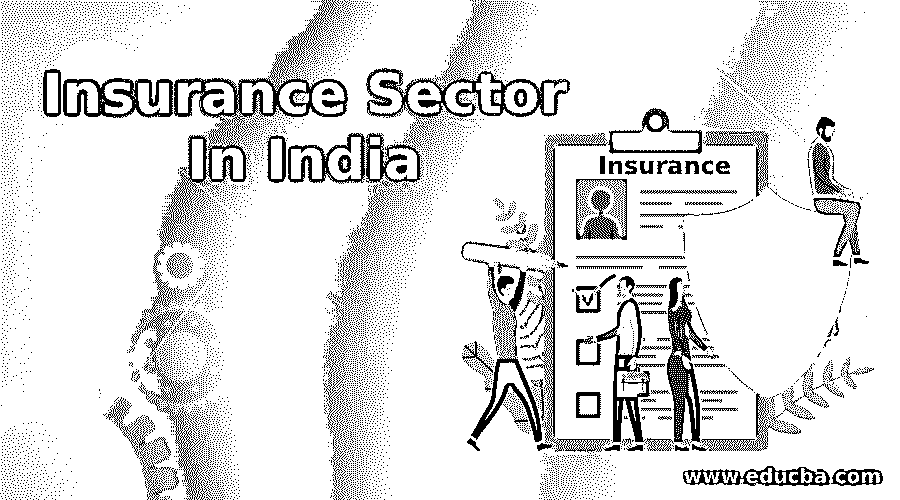
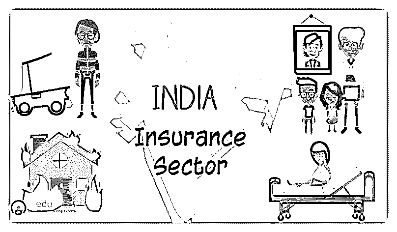
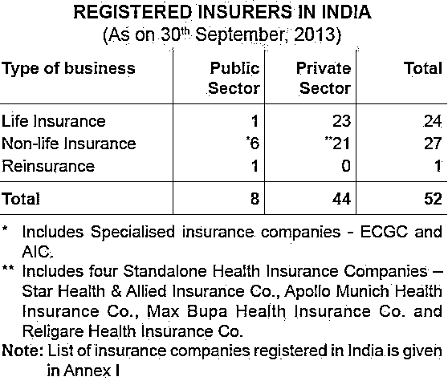
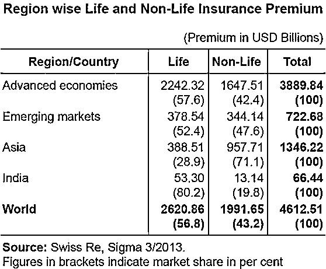
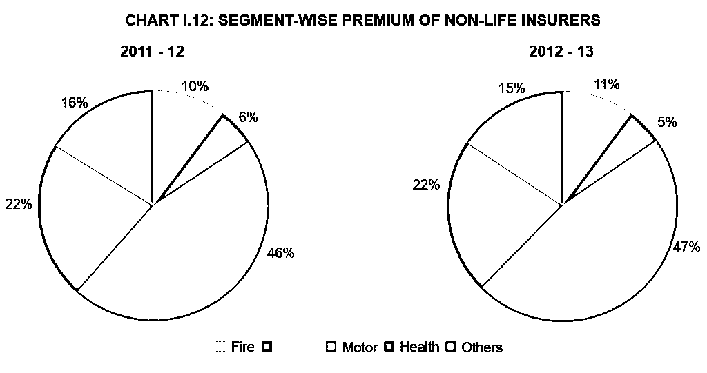

# 印度的保险业

> 原文：<https://www.educba.com/insurance-sector-in-india/>

## 印度的保险业

我们都知道这样一个事实:我们的生活本来就充满风险。想想这些情况，当养家糊口的人突然去世，或者一个家庭成员得了致命的疾病，需要立即就医，或者你一生的积蓄被盗。这难道不是一个创伤和压力的时期吗？不仅仅是对你，对你亲近的人也是如此。在这种情况下，如果你没有做好准备，你会怎么做？

让我问你，你能独自击退所有那些风险和意外的灾难吗？如果你这样认为，这是伟大的，否则保险是最好的选择。当你面临这种突发事件时，保险会来拯救你，为你提供安全感。简单地说，保险意味着你支付一笔总付的金额，以获得保护，对一个不可预见的大规模事故。

<small>下载企业估值、投行、会计、CFA 计算器&其他</small>

### 印度保险业的发展是如何进行的？

印度保险业的增长简单来说就是规模经济。当您加入保险时，您就加入了面临类似风险的其他人的行列。你的保险覆盖整个团体而不是个人，所以每个人都分担保险费用。根据保单，保险公司向客户收取保费，并用这笔钱来支付索赔。这有助于减少你的财务灾难，因为成本是由一大群人分担的。因此，这是一种传播和转移风险的伟大技术。

> 让我们举这个例子，哈里下班回家时遇到了一场严重的车祸。在这种情况下，如果没有保险，他必须承担的医疗费用将是巨大的，而且可能是毁灭性的。对他身体的伤害可能要花费 10 万卢比来治疗，同时还有至少几个月不能工作的问题。但幸运的是，哈里买了保险。还记得我们说过的那群人吗？费用将由每个人分摊。该计划中的人实际上是在帮助哈里抵消他的医疗费用。从这个意义上说，当其他人有这样的问题时，该集团中的其他人支付费用，知道当这样的问题发生在他们身上时，同样的帮助将可用于他们在印度保险业的发展。

### 必须了解保险条款

*   **被保险人:**被保险人所承保的个人或组织称为被保险人。
***   保险人:承诺支付保险风险赔偿的个人或公司，称为保险人*   **索赔:**被保险人向保险公司提出的正式请求，要求根据保险单的条款进行赔付。*   **可保风险:**相对容易获得保险的风险。***   **保险范围:**个人或实体通过保险服务部门承担的风险或责任金额。*   **保单:**保险公司与投保人之间的保险合同。***   **保费:**一定保额收取的金额称为保费。***   **再保险:**再保险人承担原由保险人承担的部分风险，称为原保险公司。********

 ****好的，这是关于印度保险业的发展。我相信你会有一个很好的要点。但是等等，我们在这里不仅要讨论什么是保险，还要讨论印度的保险行业。由于巨大的未开发潜力，印度是一个巨大的保险市场。据说，这一部门提高了一个经济体中人民的生活水平，因为它导致无风险的生活，促进创业精神，调动储蓄，并导致保护贸易和工业，这有助于人类进步。印度的经济增长见证了保险业在印度工业中不小的贡献，但主要投入。请继续阅读，了解这一切。

### 印度保险业发展的里程碑

谈到印度保险业的发展，印度有着深厚的历史渊源。它已经在摩奴(Manusmrithi)，雅格纳瓦克亚(Dharmasastra)和考底利耶(Arthasastra)的著作中被提及。这些著作谈到了在发生灾难的情况下将资源集中起来使用。这个概念是现代保险概念的先驱。此后，印度经历了巨大的改革，并随着时间的推移受到其他国家，特别是英国的深刻影响。19 世纪初，加尔各答的东方人寿保险公司开始涉足人寿保险业务。1912 年晚些时候，1912 年印度人寿保险公司法开始实施，这是第一个监管人寿保险业务的法定措施。在 20 世纪 50 年代，保险公司之间存在巨大的竞争，并且存在不公平贸易行为的指控，这迫使印度政府将人寿保险部门国有化。因此人寿保险公司于 1956 年成立。直到 90 年代末，LIC 一直享有垄断地位，此后，保险业对私营部门重新开放。

嗯，这特别是关于人寿保险部门，印度一般保险部门的历史可以追溯到 17 世纪工业革命时期，当时贸易和商业是通过海洋进行的。这个部门的第一个机构是 1850 年由英国人在加尔各答建立的 Triton 保险有限公司。印度的一般保险部门也于 1972 年国有化，这使得印度一般保险公司成为一家公司，并于 1 月开始营业。1973.

1999 年，根据马尔霍特拉委员会报告的建议，成立了保险监管和发展管理局(IRDA)(T1)，作为监管和发展保险业的自治机构。就在第二年，IRDA 向外国公司开放了该行业，允许外国公司拥有高达 26%的股权

### 印度保险业的发展

*   印度是一个经济不断增长的国家，工作人口不断增加；可支配收入也在增加。
*   人们觉得需要为自己和家人提供安全的生活，这鼓励他们购买保险。
*   随着收入的增加，在消费品、汽车、旅游等各种保险项目上的支出也在增加。
*   人们对保险的认识随着保险提供商的数量和价格有竞争力的产品范围的增加而增加。
*   此外，监管环境有利于保险业的发展。所有这些因素导致保险潜在购买者群体的增加，如个人、跨行业的公司。
*   超过三分之二的印度人口生活在农村地区，就保险产品而言，这些地区尚未开发。可以重点关注小额保险，确保在这些领域的覆盖。

### 印度的保险业——问题与挑战

*   #### public and private

着眼于对私人参与开放的行业，导致了公共部门的削弱，并使新来者更容易繁荣。印度保险业的情况并非如此，即使在开放保险业十年之后，公共部门仍占主导地位。这种情况确实给私营部门的公司带来了一些负担，他们需要进行创新并使自己与众不同，以便在市场上占有更大的份额。

*   #### Customer service

让潜在客户以简单而有意义的方式了解保险产品是摆在印度保险公司面前的一大挑战。有些手续需要办理，如果顾客不理解所使用的术语，这一切就会变得复杂。这会打击他们的积极性，因为他们害怕被欺骗。但是，如果以简单、透明的方式解释条款，并充分介绍优惠的好处，这是可以避免的。

*   #### Keep profit

不可忽视的事实是，盈利能力是这个行业的主要关注点之一。根据一项研究，寿险业务的盈亏平衡期已从预期的 9-10 年增加到现在的 13-15 年。保险行业已经承受着大规模扩张成本的压力，但随着保单失误逐年增加，还不得不面对业务量减少的问题。考虑到印度是一个价格敏感的市场，日益激烈的竞争降低了保险费率，使得公司很难管理费用率。

### 保险公司

根据 IRDA 保险行业报告，截至 2013 年 9 月底，共有 52 家保险公司在印度运营，其中 24 家从事人寿保险业务，另外 27 家从事非人寿保险[业务](https://www.educba.com/bundle/business-full-courses-bundle/ "Business Full")。

保险公司主要分为两部分；

*Source- IRDA Annual Report (2012-13)*

*   **人寿保险公司**只提供人寿保险的一种保险产品。公共部门的公司包括印度人寿保险公司(lic)，私营部门的公司包括 AEGON Religare Life Insurance、Edelweiss Tokio Life Insurance 有限公司、Aviva India、Shriram Life Insurance、Bajaj Allianz Life Insurance、HDFC 标准人寿保险有限公司、ICICI Prudential Life Insurance 有限公司、IDBI 联邦人寿保险公司等。
*   **一般保险公司**，经营各种保险产品，如[健康保险](https://www.educba.com/marketing/courses/healthcare-course/ "Health Economics and Basics of Health Insurance")，海上保险，汽车保险，财产保险等。但是人寿保险除外。举几个例子，公共部门包括像东方保险公司。联合印度保险公司。新印度保险公司。国家保险公司私营部门包括 Bharti AXA 财产保险公司、Future Generali India 保险公司、HDFC ERGO 财产保险公司、ICICI Lombard 等。

### 与全球形势相比，印度的保险行业

*资料来源——IRDA 年报(2012-13)*

*   从全球来看，寿险业务在总保费中的份额为 56.8%。然而，亚洲地区的寿险业务份额仅为 28.9%，这与全球趋势相悖。
*   对于印度来说，人寿保险业务在总保险业务中的份额高达 80.2%，而非人寿保险业务的份额仅为 19.8%。
*   在人寿保险业务方面，根据瑞士再保险公司公布的数据，印度在 88 个国家中排名第 10 位。2012 年，印度的寿险保费下降了 6.9%(经通胀调整)。在同一时期，全球寿险保费增长了 2.3%。
*   2012 年，印度在全球寿险市场的份额为 2.03%，而 2011 年为 2.30%。2012 年，非寿险行业实现了 10.25%的大幅增长(经通胀调整)。与全球非寿险保费相比，保险业的表现要好得多，同期全球非寿险保费仅增长了 2.6%。
*   然而，印度非寿险保费在全球非寿险保费中的份额很小，仅为 0.66%，在全球非寿险市场中排名第 19 位。

### 遥遥领先

印度保险行业的前景看起来充满希望和乐观。保险业强劲增长，2012 年达到 720 亿美元，到 2020 年可能增长到 2，800 亿美元。印度有一个有利的监管环境，这促进了外国玩家参与这一巨大的未开发领域。放开保险部门并允许私人参与的决定使其多年来持续增长。此外，消费者在产品和保险提供商方面有了许多选择，从而提高了服务质量的标准。将该行业的外国直接投资(FDI)限额从 26%提高到 49%被视为刺激印度保险业的关键因素。

### 快速统计和未来预测

* Source- IRDA Annual Report (2012-13)*

*   在 2012-2013 财年，财险和寿险行业收取的保费总额达 3.75 万亿卢比(590.7 亿美元)。
*   2013-2014 财年 4 月至 5 月期间，普通保险业增长了 19.6%。
*   今年头两个月，非人寿保险公司收取的保费价值为 13，552.46 亿卢比(21.3 亿美元)，而去年同期为 11，333.54 亿卢比(17.8 亿美元)。
*   据 IRDA 董事长 TS Vijayan 先生称，2013-2014 财年，印度的保险业务预计将达到 4 万亿卢比(630.1 亿美元)。
*   董事长认为，印度的保险渗透率有可能从目前的 3.86%上升至 5%至 6%。
*   该国寿险公司的行业机构人寿保险委员会预测，未来五年该细分市场的复合年增长率(CAGR)为 12-15%。
*   到 2020 年，印度的可保人口预计将增长至 7.5 亿，同期的预期寿命预计将达到 74 岁。该委员会认为，这种有利的印度人口统计将导致更多的人寻求人寿保险。
*   此外，该委员会预测，到 2020 年，人寿保险渗透率(保险费占 GDP 的百分比)将从目前的 3.2%达到 5%。
*   印度工业联合会(CII)预测印度保险业在 2013-2014 财年的增长率约为 5%。
*   它还阻止了 60%的非寿险公司创下超过 10%的平均增长率。

考虑到各种因素，我们可以肯定地说，在保险需求不断增长的框架下，监管机构、政府和参与者集中努力，印度保险业有足够的潜力实现积极增长。

### 印度保险业信息图

在短短一分钟内了解这篇文章的价值，[印度保险业信息图](https://www.educba.com/insurance/wp-content/uploads/2014/03/Insurance-Sector-in-India.jpg "Insurance Sector in India")。

### 推荐文章

这里有一些文章，将帮助您获得更多关于保险行业的细节，所以只需通过链接。

1.  [保险监管部门](https://www.educba.com/insurance-regulatory-and-development-authority/)
2.  [在商业和金融方面变得更好的技巧](https://www.educba.com/tips-to-get-better-in-business-and-finance/)
3.  [财务顾问](https://www.educba.com/financial-advisor/)****