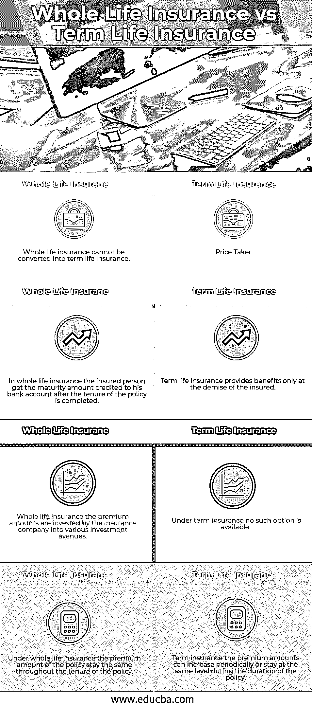

# 终身寿险与定期寿险

> 原文：<https://www.educba.com/whole-life-insurance-vs-term-life-insurance/>

## 终身寿险与定期寿险的区别

获得医疗保险是这些天的一个小时的需要，因为人们正在遭受各种各样的健康问题和疾病，由于我们的环境恶化，而且不健康的生活方式也增加了原因。由于这个原因，获得人寿保险或医疗保险的任何金额或任期成为这些天的首要要求。谈到保险，目前市场上出现并广泛销售的两种主要保单是终身寿险和定期寿险。在这篇终身寿险与定期寿险的文章中，我们将尝试了解这两种保险产品的主要区别，并了解它们的性质和条款。

### 终身寿险与定期寿险(信息图表)

以下是终身寿险与定期寿险的四大区别:

<small>下载企业估值、投行、会计、CFA 计算器&其他</small>

### 终身寿险与定期寿险的主要区别

这两种人寿保险都是市场上的热门选择:

*   定期保险是一种保险计划，由被保险人在固定的时间和固定的任期内支付保费。然而，另一方面，在人寿保险的情况下，被保险人需要在被保险人的整个一生中支付金钱，尽管在某些情况下，保险费是根据保险单支付到特定的时间段。
*   在定期保险下，保险公司通常不会支付任何款项，直到或除非保险人去世；此外，与终身寿险相比，它的选择更少，因为没有向被保险人提供到期或生存福利。另一方面，在终身寿险保单下，被保险人有能力以较低的利率从保险公司借款，获得一笔总付金额作为生存福利或获得到期福利。
*   在定期保险计划下，被保险人支付的保费金额通常低于终身寿险，终身寿险的每月保费较高。还有，定期保险的保费金额取决于被保险人的年龄；受保人越早签署保单，每月支付的保费越少。然而，在终身寿险下，保费金额很高，这也主要是因为保险公司对投保金额和保单认购额提供了附加福利。
*   在终身寿险的情况下，被保险人支付的保费投资于受保护的基金以及通常风险较低的其他投资选择，如果基金从投资中获得利润，他们就宣布从中获得红利，红利将给予签署保险单的人。而定期保险则不具备这一特点，保费金额不进行任何投资。

### 终身寿险与定期寿险对照表

以下是终身寿险和定期寿险之间的四个最重要的比较:

| **终身寿险** | **定期寿险** |
| 终身寿险不能转换为定期寿险。 | 定期寿险可以转换成终身寿险。 |
| 在终身寿险中，被保险人在保单有效期结束后，获得记入其银行账户的到期金额。 | 定期寿险仅在被保险人死亡时提供福利。 |
| 终身寿险，保费金额由保险公司投资于各种投资渠道。 | 在定期保险中，没有这样的选择。 |
| 在终身寿险下，保单的保费金额在整个保单有效期内保持不变。 | 定期保险，保费金额可以定期增加或在保单有效期内保持在同一水平。 |

### 结论

得到一份人寿保险和哪份保单适合你取决于许多因素，如保险人的年龄，家庭成员的数量，以及愿意投保的人的经济实力。如果投保人年龄在 40 岁以上，终身寿险最适合此人，而定期寿险则更适合处于人生早期并能在晚年受益的人。不要等到生命中失去你所爱的人，因为投保永远不会太晚，开始投保永远不会太晚。

### 推荐文章

这是终身寿险与定期寿险的指南。这里我们讨论信息图和比较表的主要区别。您也可以看看以下文章，了解更多信息–

1.  [股息与资本收益](https://www.educba.com/dividends-vs-capital-gains/)
2.  [融资租赁 vs 经营租赁](https://www.educba.com/financial-lease-vs-operating-lease/)
3.  [成本与费用](https://www.educba.com/costs-vs-expenses/)
4.  [会计与财务管理](https://www.educba.com/accounting-vs-financial-management/)