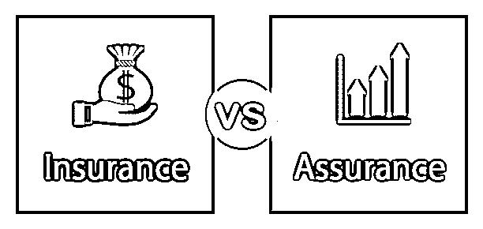
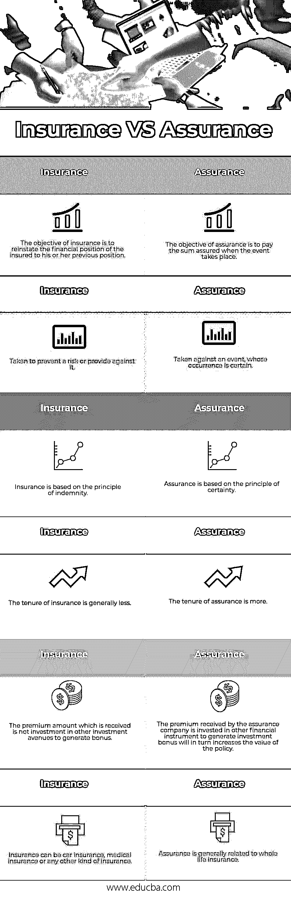

# 保险与保证

> 原文：<https://www.educba.com/insurance-vs-assurance/>

## 保险与保证的区别

保险和保证是市场上广泛销售的两种产品。但是保险和保证是两种不同的产品，提供或多或少相同的东西。这篇保险与保证的文章将试图理解两者之间的主要区别，以及这两者是如何相互分离的。

### 保险与保证之间的直接比较(信息图表)

以下是保险与保障之间的六大区别:

<small>下载企业估值、投行、会计、CFA 计算器&其他</small>

### 保险与保证的主要区别

保险和保证都是市场上的热门选择；让我们讨论一些主要的区别:

*   保险可以被定义为一种安排，其中保险人承诺或达成一项协议，以赔偿被保险人因任何自然灾害或任何个人意外事故而遭受的损失。在这种情况下，保险金额可以很小，或者是给被保险人造成的损失的某个百分比，或者也可以是被保险人认购的一次性金额。另一方面，保证是指保险人和被保险人之间的协议，即保险人将为受保人一生中迟早可能发生的事件提供保险。
*   保险与保证的另一个关键区别是，保险是为一个不确定的事件认购的，该事件发生的概率较少或不考虑。相反，保险是一种为发生概率高的事件提供保障的工具。在被保险人的一生中迟早会发生。
*   像这样的保险属于一般保险的范畴，保险可以映射到人寿保险。保险的目标是在事故发生时将保险人的经济损失降到最低。另一方面，保险是在生活中可能发生的事件发生时支付固定的款项。
*   与保险的保有权相比，保险的保有权通常较短，因为保险不是一项长期福利。相比之下，保证能给你带来长期的好处。
*   由于[投资与](https://www.educba.com/the-importance-of-investments/)投保金额相结合，因此投保不足政策将始终导致支付。保单的价值也随着保有权的增加而增加，因为投资红利被加入到保单中。另一方面，保险单有时可能容易混淆，因为被保险人所期望的付款并不总是到来，因为在保险单中有一些隐藏的标准和条款，在保险的最终付款发放之前需要满足这些标准和条款，而在大多数情况下并不满足这些标准和条款。

### 保险与保证对照表

以下是保险与保证之间的 6 个最重要的比较:

| **保险** | **保证** |
| 保险的目的是将被保险人的财务状况恢复到他或她以前的状况。 | 保险的目的是在事件发生时支付保险金额。 |
| 采取预防风险或提供预防的措施 | 针对一个事件，它的发生是确定的 |
| 保险是以赔偿为原则的。 | 保证是基于确定性的原则。 |
| 保险的保期一般比较少。 | 保有权更多。 |
| 收到的保费金额不是对其他投资渠道的投资以产生红利。 | 保险公司收到的保费投资于其他金融工具，以产生投资红利，从而增加保单的价值。 |
| 保险可以是汽车保险、医疗保险或任何其他种类的保险。 | 保证通常与终身寿险相关。 |

### 结论

保险公司既提供保险产品，也提供保证产品，这往往会使客户感到困惑。许多保险公司提供各种保险和投资政策，并有自己的销售代理来诱导客户购买这些政策。一个人在购买这样的保单时应该小心，这取决于长期计划以及客户的财务状况和福祉。一个人应该咨询财务规划师或保险顾问，为他和他的家人选择正确的保险政策，他们需要在他去世后很长一段时间内得到保护，并应保持良好的财务状况。

### 推荐文章

这是保险和保证之间最大区别的指南。在这里，我们还将通过信息图和比较表来讨论保险与保障的主要区别。你也可以看看下面的文章来了解更多。

1.  [宏观经济学 vs 微观经济学](https://www.educba.com/macroeconomics-vs-microeconomics/)
2.  [普通股对优先股](https://www.educba.com/common-stock-vs-preferred-stock/)
3.  [会计 vs 财务管理](https://www.educba.com/accounting-vs-financial-management/)
4.  [负债与债务](https://www.educba.com/liability-vs-debt/)