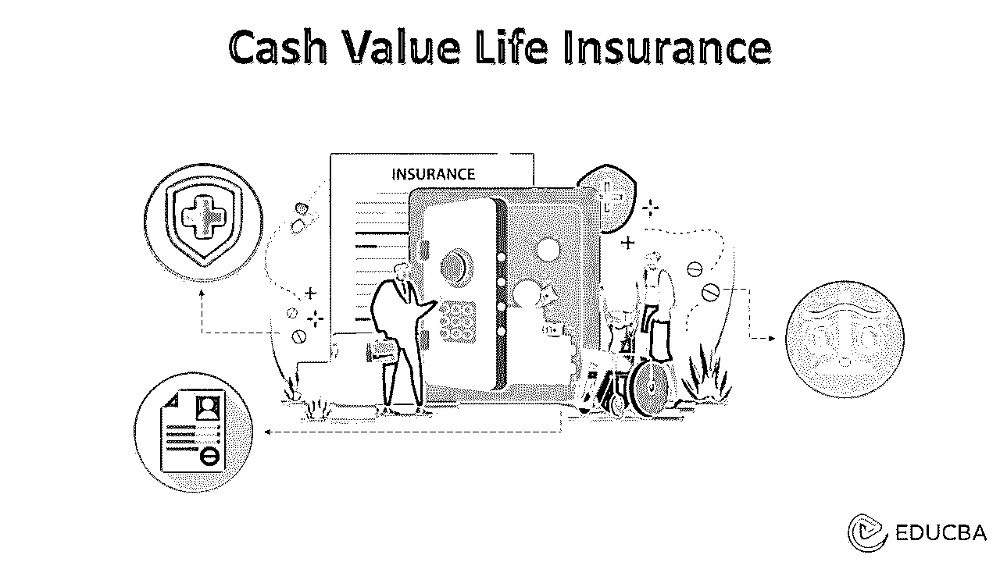
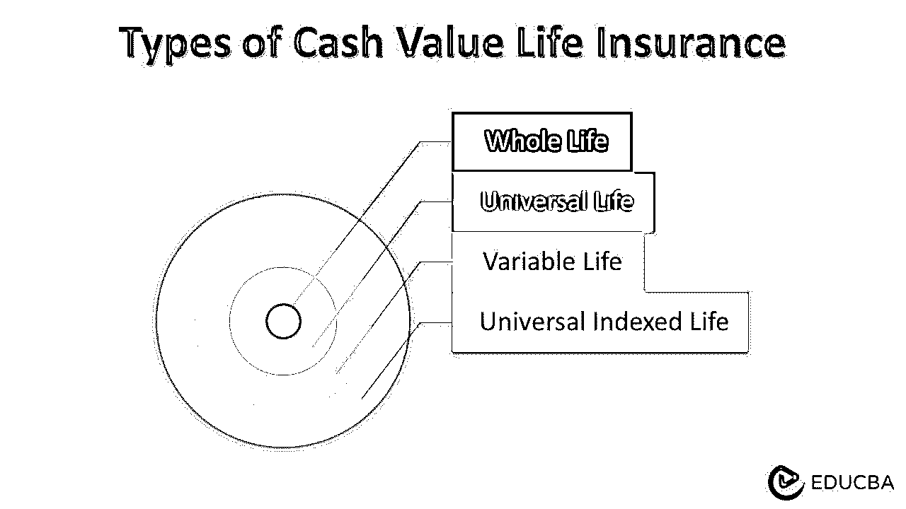

# 现金价值人寿保险

> 原文：<https://www.educba.com/cash-value-life-insurance/>

## 什么是现金价值人寿保险？

术语“现金价值人寿保险”是指具有现金价值储蓄成分的永久人寿保险。投保人可以将保单的现金价值部分用于各种目的，例如贷款、提取现金或支付保单保费。然而，人寿保险单的现金价值部分仅在投保人生存之前有效。如果投保人去世，受益人将获得死亡理赔金，而不是现金价值部分。

### 说明

在现金价值人寿保险中，保费的特定部分用于累积死亡理赔金和支付相关费用。相比之下，剩余的金额就变成了现金价值。基本上，在现金价值人寿保险中，保费支付可分为三个地方:

<small>下载企业估值、投行、会计、CFA 计算器&其他</small>

*   货币价值
*   保险福利成本
*   保单费用和收费

人寿保险的现金价值部分吸引了利息收入和其他投资收益，因为它增加了延税。

### 它是如何工作的？

现金价值寿险保单通常根据预先确定的费率设定保费。通常，现金价值部分在保单开始日期后的 2-5 年内不会累计。一旦开始累积，根据预定义的政策指南，保单持有人即可获得现金价值。但是，现金价值在投保人的一生中都是公开的。如果投保人去世，受益人将只享有死亡理赔金，而现金价值部分归保险公司所有。

### 例子

让我们举一个简单的例子来说明现金价值人寿保险的概念。让我们假设一份身故保险金为 50，000 美元的保单。程序中没有未偿还的贷款或现金提取，累计现金价值为 20，000 美元。确定投保人去世时保险公司的责任。

如果投保人去世，保险公司必须全额支付死亡理赔金，即 50，000 美元。在这种情况下，20，000 美元的现金价值将回到保险公司。因此，保险公司的实际赔偿责任为 30，000 美元(= $50，000-$ 20，000)。

### 现金价值人寿保险的类型

现在让我们看看一些最常见的政策:

*   终身寿险:顾名思义，这种类型的保单为投保人提供终身保障。保费最初根据投保人的年龄确定，在整个保期内保持不变。因此，在年轻时开始这样的政策是最好的，因为保费会更低。该政策的期限短至 15 年，最长可达 65 年。
*   **万能寿险:**该保单提供较低但有保证的回报率，并利用递延税方法。在这种保单中，保险公司只投资一小部分保费。应该注意的是，只要投保人定期支付保费，保单就一直有效。它也被称为可调整的灵活保费政策。
*   **可变人寿:**在这种类型的保单中，死亡理赔金和现金价值部分的价值会随着保险公司将保费投资于股票市场、债券市场等多个投资选项而变化。因此，这类保单的保险公司会发布一份说明书，说明所有投资的去向。投保人可以选择投资保费的账户。因此，在这种情况下，投资风险是首要风险。
*   **万能指数人寿:**这类保单与万能人寿非常相似，但唯一的区别是现金价值部分投资于类似指数基金或指数的各种渠道，如 S & P 500、穆迪等。因此，在这种情况下，现金价值取决于指数的表现，投资风险是主导风险。

### 如何提取现金价值人寿保险

提取现金寿险有几种方式。在万能寿险的情况下，投保人可以灵活地部分取出现金价值的特定部分。另一方面，在一生中，投保人只能通过保单贷款的方式获得现金价值。另一种提取现金价值保险的方式是通过保单退保，退保后保单失效。在所有情况下，取款都将收取费用，费用因政策指南和取款方法而异。

### 优势

一些重要的优势如下:

*   投保人去世后，受益人从死亡理赔金中获得经济支持。
*   现金价值部分和死亡理赔金都是在逆境中可以利用的资产。
*   一些保险公司对作为被动收入来源的现金价值部分支付股息。
*   这种政策有税收优惠，因为现金价值在延税的基础上增长。
*   保单的现金价值部分可用作贷款的抵押品。

### 不足之处

一些主要的缺点如下:

*   现金价值部分在最初的 2-5 年内不可提取。
*   这种保单比有类似死亡理赔金的定期寿险保单更贵。
*   投保人死后，受益人不会获得现金价值部分。
*   通常，与传统投资渠道相比，现金价值保单产生的回报较低。

### 结论

由此可见，除了为受益人提供可观的死亡理赔金外，它还提供了多种投资选择。鉴于这些好处和限制，投保人可以选择现金价值人寿保险或定期人寿保险。

### 推荐文章

这是一个指导现金价值人寿保险。在这里，我们还将讨论简介及其工作原理，以及它的优点和缺点。您也可以看看以下文章，了解更多信息–

1.  [实际现金价值与重置成本](https://www.educba.com/actual-cash-value-vs-replacement-cost/)
2.  [现金投资](https://www.educba.com/cash-investment/)
3.  [非现金费用](https://www.educba.com/non-cash-expenses/)
4.  [现金和现金等价物](https://www.educba.com/cash-and-cash-equivalents/)

