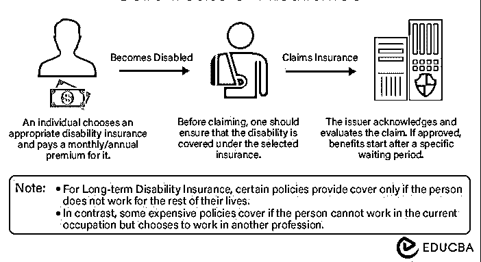

# 残疾保险

> 原文：<https://www.educba.com/disability-insurance/>

## 什么是伤残保险？

如果投保人因残疾而无法工作，残疾保险可以保护他们的收入。例如，一名平面设计师接受了 Lasik 手术，并在一段时间内失去了工作能力。保险可以支付他们的费用，直到他们可以回去工作。

然而，保险可以覆盖的残疾取决于具体的政策。它也被称为残疾收入保险或 DI。这些基金帮助人们保护他们的生活开支，例如他们的抵押贷款、食品、公用事业账单和儿童保育。

### 主要亮点

*   残疾保险为变成残疾人并且不能再工作的人提供经济保护。
*   它们有两种类型:短期和长期。短期通常涵盖三到六个月的时间，而长期涵盖更长的时间，通常直到退休。
*   保单的钱可以用于日常开销，如房租、食品杂货和水电费。
*   虽然法律上没有要求，但如果你想在受伤或生病时保护自己的收入，你可以考虑这样做。

### 伤残保险是如何运作的？

*   在选择了具有必要福利的保单后，投保人每月或每年向发行人支付一笔保费。
*   要获得保险资格，你必须符合保单中对“残疾”的定义。这一定义因政策而异。
*   对于保险，向你的保险公司提出索赔。发行人然后评估索赔，您将在批准后开始获得福利。
*   有时，人们可能会失去在当前工作岗位上工作的能力，但仍然可以在其他部门工作。因此，只要该人不在任何地方工作，保单就会提供保障。
*   一些政策包括如果一个人不能再从事目前的职业，而是选择了另一个职业。这些政策非常昂贵。

<small>下载企业估值、投行、会计、CFA 计算器&其他</small>

### 残疾保险的类型

| **短期残疾** | **长期残疾(有限)** |
| **受益期** |
| 津贴期通常为三个月到两年。这在很大程度上取决于政策。 | 它有一个延长的资助期，通常持续几年直到退休。 |
| **等待时间** |
| 在发行人开始发放福利之前，有大约两周的等待期。 | 等待期可能持续数月，通常为六个月或更长时间 |
| **费用** |
| 它通常更实惠 | 它通常是昂贵的 |
| **包括残疾** |
| 它涵盖怀孕、因事故造成的暂时伤害或长期疾病。 | 保单承保的索赔项目包括心脏病、精神障碍、癌症和其他严重残疾。 |
| **签发人** |
| 雇主向大多数员工提供这种服务 | 大多数雇主不提供这种服务 |
| **到期** |
| 当该人康复或受益期结束时，保单到期 | 如果此人停止支付保费或受益期结束，则此保单到期 |

### 伤残保险涵盖哪些内容？

*   虽然有些涵盖怀孕和分娩，但并不是所有的政策都提供这种好处。
*   长期保险确实涵盖了精神健康、心脏和其他严重疾病，而有些则提供有限的保障。
*   一般来说，这些计划支付 50%至 80%的费用，具体取决于计划和残疾情况。
*   大多数保单都不包括投保前的状况。它也不包括自残、酒精或药物使用导致的残疾。
*   每份保单都不一样，所以在购买保单前最好仔细阅读细则。

### 例子

*   父母残疾，无法照顾他们的孩子。父母可以使用他们的政策来帮助支付他们受伤康复期间的儿童保育费用。
*   一位企业主被诊断患有癌症。在他们接受治疗的同时，保险涵盖了商业成本。
*   一家大公司的员工怀孕并经历了分娩。她们的雇主在她们产假期间不能工作时按月支付工资。

### 残疾保险的福利

*   它可以在突然残疾的情况下让你安心。
*   经济保障可以支付生活费用，并在需要时帮助残疾人家庭。
*   有各种各样的政策，既适合高收入者，也适合那些靠薪水过活的人。
*   这些方案的补偿主要是[免税](https://www.educba.com/tax-exempt/)。

### 结论

残疾保险可以帮助每个人在突然残疾的情况下支持他们的家庭和自己。它可以帮助一个人度过难关，直到他们可以回到以前的生活方式。没有保险，一个人的选择可能会更少，也很难康复。总之，这是每个人都应该拥有的基本保险类型。

### 常见问题

#### 1.健康保险包括残疾保险吗？如果我没有保险怎么办？

**回答**:即使你有健康保险，它也不太可能覆盖你的残疾情况。只有少数昂贵的健康保险有助于这些情况。如果一个人没有保险，为了自己和家人的未来安全，他们应该考虑买一份。

#### 2.伤残保险的费用是多少？

**回答**:残疾保险的费用根据你的年龄、收入和职业而有所不同。你的收入水平有助于计算你的保费，因为高收入人群更有可能负担得起该政策的好处。通常，计划收取你收入的 1-3%。例如，如果你每年挣 30，000 美元，该计划可能每年收取 300 至 1000 美元。这也取决于政策的类型。例如，灾难险只承保重大残疾。相比之下，部分伤残保险会补偿你部分损失的收入。

#### 3.哪些残疾属于残疾保险的范围？

**回答**:该保险涵盖了大部分种类的残疾。它可能是视觉、听觉、语言或其他身体缺陷。它还包括癌症等重大疾病和可能持续一生的医疗状况。

#### 4.如何决定走哪种伤残保险？

**回答**:确保在你无法挣钱的情况下，保单覆盖你的家庭(父母、配偶、子女)。此外，确保政策支付出一笔钱给你的受益人，所以他们可以支付任何最终的费用或债务。如果你总是考虑你的需求来决定什么样的保险最适合你，那将是最好的。

#### 5.我需要伤残保险吗？

**回答**:即使法律没有规定每个人都应该有保险，但如果你想保障自己的收入，还是应该考虑一下。如果你是自由职业者，没有通过雇主获得保险，考虑这种类型的保险是必要的。此外，如果你是父母，查看包含儿童保育费用的保单。

### 推荐文章

本文解释了残疾保险的定义、类型、覆盖范围和重要性。请访问以下文章了解更多信息，

1.  [保险风险](https://www.educba.com/risk-in-insurance/)
2.  [现金价值人寿保险](https://www.educba.com/cash-value-life-insurance/)
3.  [团体保险](https://www.educba.com/group-insurance/)
4.  [医疗事故保险](https://www.educba.com/malpractice-insurance/)

