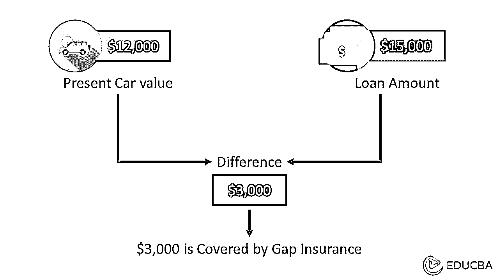

# 缺口保险

> 原文：<https://www.educba.com/gap-insurance/>

## **缺口**保险

缺口保险，也称为有保证的资产保护保险，在发生全损的情况下，覆盖您的汽车欠款与其实际现金价值之间的差额。

当你买车时，它的价值开始贬值。事实上，在最初的几年里，你的车辆损失了将近 20%的价值。在最坏的情况下，如果你的车被盗或被撞，保险金将只涵盖车辆的折旧价值。

<small>下载企业估值、投行、会计、CFA 计算器&其他</small>

然而，如果你的车是租借的，这可能是一个值得关注的原因；你欠贷款公司的金额和你得到的保险金之间会有很大的差别。

这就是差距保险可以帮助。它弥补了你从公司获得的金额和你欠贷款提供者的金额之间的差距。

### 主要亮点

*   只有当你的车被盗或被撞，无法找回或无法修复时，缺口保险才会出现。
*   只有当你的贷款金额大于事故发生时你的汽车价值时，贷款提供者才支付这笔费用。

### Gap 保险是如何运作的？

这里有一个例子。假设你用汽车贷款购买了一辆价值 20，000 美元的新车。三年后，你的车在一次事故中损坏，无法修复。然而，你还欠着 15，000 美元的汽车贷款。你的汽车保险会偿还你的贷款，但最多不超过事故发生时的价值，比如 12，000 美元。

如果您没有缺口保险，您必须结清剩余的贷款金额。这种情况下是 3，000 美元(15，000-12，000 美元)。然而，如果你有 Gap 保险，它会支付剩余的 3000 美元，所以你不必为你现在不拥有的东西支付费用。

因此，有保证的资产保护有助于弥补差额，保护你免受不必要的损失。

### Gap 保险涵盖哪些内容？

*   **盗窃:**如果您的汽车被盗且无法找回，GAP 可以保护您免遭盗窃。
*   **事故:**如果你的车被撞毁，你可以使用保证资产保护来弥补差额。

它主要涵盖了上面提到的两个场景。你的车辆的其他损坏由你的综合汽车保险单承保。

### 缺口险怎么算？

要算出来，你要知道你在被盗或发生事故时欠贷款公司的金额，以及你的车辆考虑[折旧](https://www.educba.com/depreciation/)后的现值。

假设你的汽车当前的市场价值是 18，000 美元。如果你欠贷款提供者 20，000 美元，你应该这样计算缺口保险。

你的汽车的实际价格(A):18，000 美元

你必须支付的汽车贷款(B):20，000 美元

缺口将覆盖(B-A)= 2，000 美元

然而，在购买汽车的最初几年后，停止这种差距是明智的。只有当你的汽车是全新的，并且你欠贷款提供者的债务超过汽车的实际价值时，才需要它。

记住，随着时间的推移，你的车会贬值，当你每月还贷时，差距会缩小。

### Gap 保险值得吗？

如果你的汽车没有贷款，那么就没有必要购买缺口保险。只有当你的汽车贷款比你汽车的实际价值多的时候，投保才有意义。

但是，这也取决于你购买的汽车。如果你买的车价值贬值快，贷款期限也比较显著，那么上这个保险是值得的。

当你开得越多，汽车的价值也会降低。你开得越多，你的车的价值就会贬值得越快。因此，与贷款金额相比，你的汽车价值会下降得更快。

### 差距保险的利弊

当考虑购买缺口保险时，有几个因素需要考虑。我们来看几个利弊。

#### 赞成的意见

*   拥有缺口保险可以让你免受重大损失。
*   可以少顾虑买豪车。
*   年成本低。

#### 骗局

*   这是常规保险之外的额外费用
*   如果你想买一辆经济实惠的车，那就不值得了
*   它可能只涵盖很短的任期
*   在某个时候，你的车的价值会贬值，你所欠的和你的车的价值不会有显著的差别。

### 结论

如果你的车被撞毁或被盗，欠贷款提供者的金额超过了车的价值，你就有负资产。这种情况下，GAP 会帮你补差价。

### 常见问题

#### Q1。我需要多长时间的缺口保险？

**回答:**如果车辆是新的，考虑买至少两年。到那时，你欠的钱将少于汽车的实际价值。

#### Q2。我应该从经销商那里购买缺口保险吗？

**回答:**这要看你的预算和要求。做你的市场调查，找到最适合你的[预算](https://www.educba.com/sales-budget/)的价格。

#### Q3。定期保险和缺口保险有什么区别？

**回答:**常规保险只覆盖您车辆的现金价值，因此，汽车的实际价值和欠贷款提供者的金额之间存在差距。

GAP 填补了这个空白，减轻了你的经济负担。只有当你的贷款余额超过车辆的价值时才需要支付。

### 推荐文章

这篇文章解释了关于缺口保险的一切。阅读以下文章了解更多信息，

1.  [残疾保险](https://www.educba.com/disability-insurance/)
2.  [预付保险](https://www.educba.com/prepaid-insurance/)
3.  [保险风险](https://www.educba.com/risk-in-insurance/)
4.  [信用保险](https://www.educba.com/credit-insurance/)

