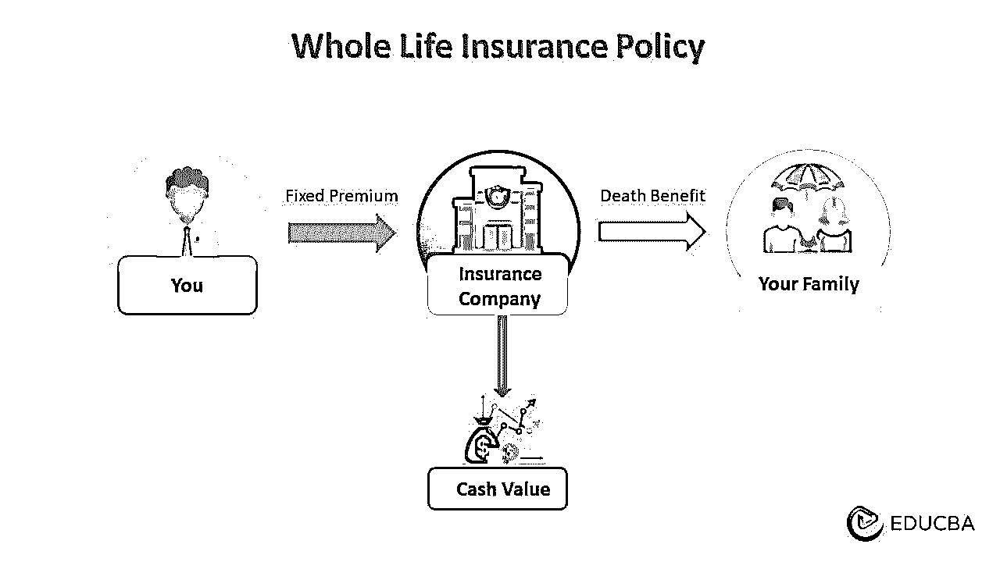
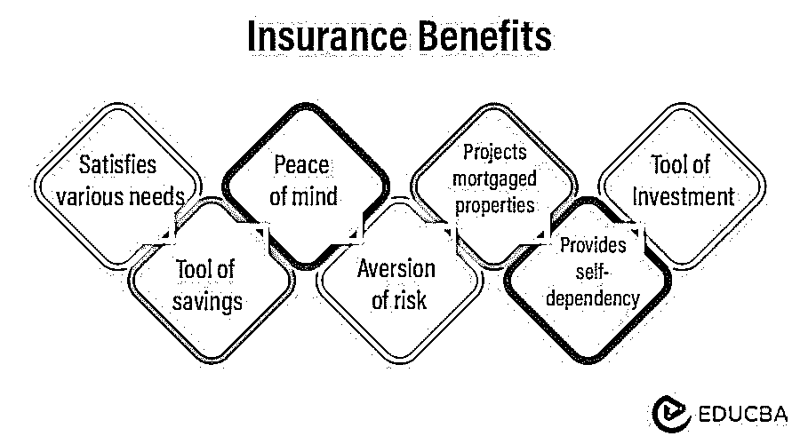

# 保险

> 原文：<https://www.educba.com/insurance/>

## 你说的保险是什么意思？

保险是一种财务保护的承诺，补偿个人/组织因不确定事件造成的任何损失。例如，飓风伊恩于 2022 年 9 月 28 日袭击了佛罗里达州。大多数居民都有可行的政策，所以他们向保险公司提出索赔。据说金额大约在[600 到 700](https://www.rms.com/newsroom/press-releases/press-detail/2022-10-07/rms-estimates-us67-billion-in-insured-losses-from-hurricane-ian)亿美元之间。

虽然要求保护的人是被保险人，但保险公司提供保护。投保人定期向保险公司支付保费。这一数额是根据保单中的保证价值确定的。由于有几家公司出售这些合同，因此它们的溢价是可以承受的。

### 主要亮点

*   保险通过保护被保险人免受伤害、损害等造成的损失来提供经济支持
*   得到保护的是被保险人，提供保护的是保险人
*   根据影响人类生活的不可预见的危险，有各种各样的政策可供选择。最常见的是人寿保险、车辆保险、健康保险、家庭保险、财产保险等等
*   保费、保单限额和免赔额是保单的主要组成部分。因此，保单购买者应该通读它们。

### 保险是如何运作的？

*   它基于面临类似风险的人们之间的风险分担原则。其基本功能是通过汇集客户为被保险人提供损害控制
*   一群人为形成一个[资金池](https://www.educba.com/income-funds/)做出贡献。因此，被保险人因不确定事件而遭受的任何损失都来自这个池。合并收藏有助于个人从损失中恢复
*   例如，50 个人购买一份人寿保险计划，将他们的保费集中起来。假设他们中的一个去世了。该人员的保险金额从支付池中取出
*   这些公司充当这一资金池的受托人，收取保费以保证被保险人免受损失。保险费通常取决于计划的类型
*   简单来说，它是一个风险管理工具，因为可以对各种数量的量化风险进行保险。

<small>下载企业估值、投行、会计、CFA 计算器&其他</small>

### 保险示例

#### 示例 1:

一个现实生活中的例子是克里斯蒂亚诺罗纳尔多为他的腿买了 9000 万到 1 亿美元的保险。由于他是他效力的球队的 T2 资产，皇马俱乐部为他买了保险。

#### 示例 2:

史蒂夫两年前买了一辆新车，并通过一项服务为它投保了 15 年。保费计算为每年 15000 美元，保额为 100 万美元。

在与家人一起旅行时，他们遇到了事故，导致汽车损坏。修理费在 50 万美元左右。根据合同，保险公司赔偿损失。

假设史蒂夫在保单有效期内不需要索赔，并且史蒂夫在到期时获得了 100 万美元。从 100 万美元中减去总保费(15，000 美元* 15 美元)后，应纳税额将为 775，000 美元。

#### 示例 3:

玛丽有一份每年保险费为 500 美元的医疗保险。它的保险额是 100 万美元。几年后，她被诊断出患有癌症。然而，她要求保单，公司为她支付完整的医疗费用。

### 保险类型

#### 生活:

*   人寿保险在家庭成员突然死亡的情况下，为其后代提供经济保障和福利
*   保险公司在被保险人死亡或保单到期时支付保证金额。

#### 车辆:

*   它包括汽车、发动机或任何其他车辆因事故、盗窃和其他原因而发生的损失
*   它还包括事故中受伤人员的医疗费用。

#### 健康:

*   本保单涵盖重大疾病和轻微疾病的医疗费用
*   此外，它还能防止事故和工伤造成的任何伤害。保险范围因保单而异。

#### 房产/住宅:

*   它通常保护一个人的不动产，如家、工厂、办公室等
*   如保单中所述，它保护人们免受盗窃、火灾以及地震、洪水等自然灾害的伤害。

#### 信用:

*   当一个人由于不可避免的死亡、失业或事故而无法偿还债务、贷款和抵押贷款时
*   这是一个基本计划，保险公司支付这些费用。

### 保险的好处

*   它在危机期间提供财政支持，并通过提供咨询服务支持有心理损失的个人
*   在脆弱时期，它提供了确定性，反过来也提供了内心的平静
*   资金池是一种广为人知的技术，可以减少客户之间的财务规则。它实现了风险分担，因为客户在资金池中支付象征性的费用，以照顾对另一个客户造成的损害。

### 保险原理

#### 最大诚信:

*   这意味着投保人和保险人之间必须有绝对的信任和信赖
*   合同双方应披露保险计划标的的所有相关事实。

#### 可保利益:

*   它规定投保人必须与被保险对象(人、财产等)有密切联系或利益关系。)
*   投保人必须因该物的不存在或损坏而遭受损失。

#### 赔偿:

*   保险的目的不应该是从索赔中获利，而是防范潜在的损害
*   这个原则不适用于人寿保险，因为人的生命价值不能用金钱来衡量。

#### 贡献:

*   被保险人可以只向一家保险公司索赔全部损失，也可以向多家保险公司索赔分摊额
*   它不适用于人寿保险，因为我们无法衡量人的生命价值。

#### 代位权:

*   该原则规定，当保险公司赔偿财产损失时，投保人不能再对财产提出索赔
*   然后所有权转移到保险公司。

#### 损失最小化:

*   根据这一原则，被保险人应对其保险财产负责
*   他们应该尽量减少在任何事故或损坏中的损失。

#### 临近原因(最近原因):

*   如果造成损害的原因不止一个，赔偿金额根据最接近的原因确定。

### 保险的组成

#### 策略限制:

*   这是保险公司根据该计划赔偿被保险人的最高金额
*   投保人可以索赔的总额取决于保费、损害程度和期限。

#### 免赔额:

*   在保险公司介入理赔之前，被保险人自掏腰包支付的百分比是 **[免赔额](https://www.educba.com/tax-credit-vs-tax-deduction/)**
*   只有当索赔超过可扣除限额后，公司才会发放索赔。

#### 保费:

*   保单购买者必须向保险提供商支付一笔金额，以换取被保险项目的安全性
*   这些保险费支付可以是定期的，即每月、每季度或甚至每年。

#### 税收优惠

*   税款适用于到期后获得的金额；减去一个人支付的保险费总额。例如，詹姆斯购买了一份到期支付 10 万美元的保单。保险费支付总额为 45，000 美元。因此，该税将适用于 55，000 美元(100，000 美元到 45，000 美元)
*   每项政策的税收规则都不同。例如，美国雇主提供的支付超过[5 万美元](https://www.irs.gov/pub/irs-pdf/p525.pdf)的人寿保险是要纳税的
*   《1961 年印度所得税法》第 80C 节允许从应税收入中扣除人寿保险计划的保费。这些扣除的上限为每年 **[1.5 万](https://incometaxindia.gov.in/Pages/tools/deduction-under-section-80c.aspx#:~:text=Tuition%20fee%20of%20two%20children,payment%20eligible%20for%20section%2080C)** 印度卢比。
*   此外， **[印度所得税法](https://incometaxindia.gov.in/Pages/tools/deduction-under-section-80d.aspx)** 第 80D 节允许您根据条件扣除健康保险费用。

### 结论

日常生活会带来经济损失的风险，如盗窃、自然灾害或突然死亡。因为它们会影响人们和他们亲爱的人的生活，保险有助于保护人们免受这些危险。它保证在损害、伤害或伤害方面提供经济援助。此外，根据保险计划，它还提供税收优惠。

### 常见问题

#### Q1。什么是保险？它有哪些类型？

**答:**它是一种保障被保险人免受因损害、伤害或伤害而产生的经济损失的机制。最常见的五种类型是人寿保险、家庭保险、信用保险、健康保险和车辆保险。

#### Q2。非营利组织的保险是什么？

**回答:**非营利保险保护个人/组织免受任何引发责任诉讼的情况。由于事故、疏忽或误解，非营利组织面临来自志愿者、捐赠者、员工和政府监管机构的诉讼。他们获得适当的法律费用或损害赔偿。

#### Q3。定义小型企业保险

**回答:**小型企业保险是一种风险融资机制，可以保护他们免受诉讼、潜在索赔、业务损失等风险。

#### Q4。列举一些保险公司。

**回答:**各个公司提供的保险种类繁多。因此，购买者可以根据自己的需要和喜好购买。有事故、健康、意外伤害保险公司和金融担保人。一些著名的保险公司有伯克希尔哈撒韦保险公司、进步保险集团、国营农场集团和护理保险私人有限公司。

### 推荐文章

这篇文章引导你了解保险。我们讨论它的定义，类型，好处，税法，等等。要了解更多，请阅读以下文章，

1.  [残疾保险](https://www.educba.com/disability-insurance/)
2.  [预付保险](https://www.educba.com/prepaid-insurance/)
3.  [保险费](https://www.educba.com/insurance-expense/)
4.  [现金价值人寿保险](https://www.educba.com/cash-value-life-insurance/)

