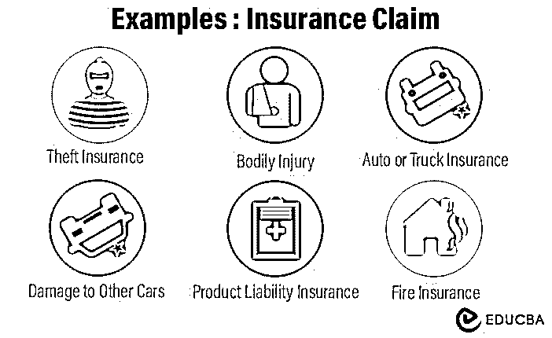
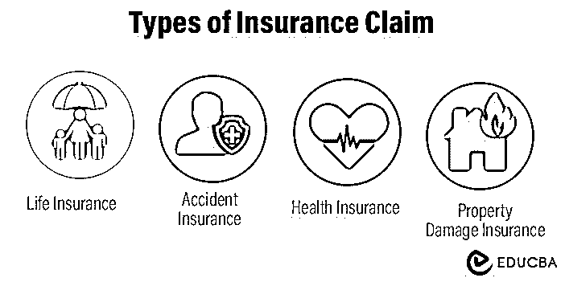

# 保险索赔

> 原文：<https://www.educba.com/insurance-claim/>

## 保险索赔含义

**保险索赔**是要求被保险人就保单项下保险标的的损坏/损失向保险公司获得支持。例如，2022 年 10 月 27 日[俄克拉荷马州的一场火灾损坏了大约 256，629 英亩土地。农业土地所有者随后向保险公司提出索赔，以弥补他们的损失。](https://www.nifc.gov/fire-information/nfn)

购买房屋、人寿、健康或汽车保险的人定期向保险公司支付保费。当事故造成经济损失时，如车祸、工作场所事故等。，被保险人提出索赔并从公司领取保险金。

### 主要亮点

*   保险索赔是指当投保人遭受损害或损失并需要赔偿时，对保险单的援引
*   提出索赔的过程取决于它是第三方、第一方还是人寿保险
*   这些保险单包括人寿、健康、财产和其他索赔
*   解决财务需求有助于人们在不幸的情况下重新站起来。然而，这个过程可能很复杂，有时保险公司并不遵守政策。

### 保险理赔是怎么操作的？

*   要索赔保险，在合理的时间内向保险公司挂失。
*   总是提及关键的细节，如时间、原因和其他；添加证据可能是有益的。例如，如果要求医疗护理，可以添加医生的报告
*   人们可以通过电话或电子邮件进行索赔，但详细的书面形式可以使事情顺利进行
*   收到索赔后，保险机构对情况进行评估，以决定是否批准索赔
*   由于各种原因，保险公司可能会拒绝一些保险索赔。比如，如果保险费没有支付，保单就不包括具体的损失等等
*   如果申请获得批准，被保险人将获得指定的[保单利益](https://www.educba.com/what-is-insurance/)。

### 保险索赔示例

<small>下载企业估值、投行、会计、CFA 计算器&其他</small>

#### 示例 1:

联邦快递的一名员工詹妮弗·哈里斯(Jennifer Harris)对联邦快递提出了种族歧视的不公平待遇指控。由于这是对她道德操守的非物质损失和损害，公司不得不支付她 3 . 66 亿美元。尽管联邦快递对这一指控提起上诉，但不太可能胜诉。

#### 示例 2:

一个居民买了房子，买了房主的保单。几年后，由于城市的洪水，他们面临着家园的破坏。他们有一个业主政策，所以他们向他们的机构提出索赔，并获得必要的援助。

### 保险索赔的类型

#### 个人保险:

*   人寿保险在被保险人死亡的情况下为受益人(家庭)提供经济保障
*   [残疾保险](https://www.educba.com/disability-insurance/)为因事故导致的受伤或残疾提供服务和援助
*   健康保险提供医疗保险以及资本福利或医疗费用报销
*   依赖保险覆盖身体或精神有缺陷、需要他人帮助的客户。

#### 财产或责任保险

*   汽车保险涵盖了驾驶时可能发生的风险，这是法律规定的必要条件。此外，它还包括盗窃、火灾和车辆损坏险
*   信用保险防范债务人破产造成的损失
*   运输保险承保货物在运输过程中的物质损失
*   火险在被保险对象着火时提供保护
*   当被保险人对造成的损害负有责任时，民事责任保险对第三方进行赔偿。

#### 提供服务的保险

*   旅行援助保险涵盖旅行中不可预见的事件
*   死亡保险支付被保险人的丧葬费以及死亡后的手续和程序
*   法律费用保险涵盖法律和非法律援助服务。

### 保险索赔过程

#### 向保险人披露:

*   索赔的第一步是尽快向你的保险公司披露事故
*   应该是在一个人遭遇到死亡、财产损失、车辆损坏等不幸事件后立即进行。

#### 询问:

*   联系保险公司后，必须提供事故信息，包括事故发生的地点、日期、发生的事情和受伤情况
*   如果适用，他们可能还会要求您提供收据或车辆照片。

#### 承保范围决策:

*   当保险公司收到索赔时，他们开始调查以决定保险范围
*   他们评估政策和诉讼，并分析他们可以提供多少覆盖面。

#### 分辨率:

*   最后，如果保险公司决定批准索赔，被保险人将获得利益
*   然而，该公司可以拒绝索赔，由于各种条件，如事故不在政策范围内，该人没有支付保费，等等。

### 保险索赔的重要性

*   拥有合适的保险有助于在不幸的时候减轻财务负担
*   它为患者及其家人提供精神上的解脱和内心的平静
*   他们允许受害者获得赔偿，以进行灾后重建
*   它作为公司需要遵守政策的证明。

### 结论

保险索赔很常见，因为每年都有人因地震、洪水等自然灾害而损失财产。、或像盗窃、事故和暴乱这样的非自然灾害。投保人在申请福利时必须有一份保单副本。然后，保险公司会出钱修理/更换损坏的物品或支付医疗费用。

### 常见问题

#### Q1。我如何提交我的保险索赔？

**回答:**保险公司提供一个电话号码，以便在索赔或在线索赔表格中拨打。当通过电话进行保险索赔时，请向他们提供所有要求的信息。但是，在线表格很详细，您可以添加所有要求的信息。

#### Q2。一个人可以索赔几次保险？

**答:**一个人可以索赔任意次数的保险。缺点是，随着索赔的增加，保费变得昂贵。此外，如果您的索赔超过您的保险价值，您的政策将到期。

#### Q3。为什么提出索赔会增加保险费？

**回答:**保险公司密切关注理赔记录。更高的索赔历史可能意味着你的保单风险更高，这对保险公司不利。因此，您提出索赔的次数越少，您的保费就越便宜。

#### Q4。最常见的保险理赔有哪些？

**回答:**小企业最常见的保险索赔是盗窃和火灾。盗窃几乎占索赔的 20%。另一方面，火灾是造成财产损失的最常见原因。

### **推荐文章**

这是一份保险索赔指南。阅读以下文章了解更多信息，

1.  [保险](https://www.educba.com/insurance/)
2.  [危险保险](https://www.educba.com/hazard-insurance/)
3.  [缺口保险](https://www.educba.com/gap-insurance/)
4.  [残疾保险](https://www.educba.com/disability-insurance/)

