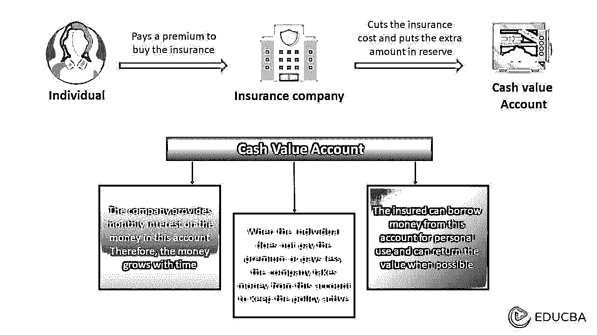

# 万能人寿保险

> 原文：<https://www.educba.com/universal-life-insurance/>

## 什么是万能寿险？

万能寿险(UL)是一份终身保障保单，承诺被保险人死亡时可获得死亡理赔金。这与定期人寿保险不同，后者只保证在特定时期(5 至 75 年)提供保护。UL 还为个人建立了一个现金价值账户，保费的盈余随着月利息的增长而增长。

例如，Patricia 夫人购买了一份价值 1，000，000 美元的 UL 保单，并存入每年 15，000 美元的保费。该公司从保费中减去$5，000(费用),并将$10，000 添加到现金价值账户。现金价值账户随着时间的推移而增长，在 5 年内积累 50，500 美元(假设年利率为 1%)。假设 Patricia 去世了，那么她的家人将获得福利(1，000，000 美元)，而不是 50，500 美元。但是，如果她在去世前关闭保单，他们将获得 50，500 美元。好处是，因为这是一个终身政策，她的家人将获得补偿，即使她去世后的年龄(如 101 岁)。

万能寿险提供了在固定范围内降低或提高保费的灵活性。然而，它也提供了比终身寿险更少的保障。被保险人死亡后，其继承人可以获得一次性免税付款，也可以选择定期(每月或每年)付款。

<small>下载企业估值、投行、会计、CFA 计算器&其他</small>

### 主要亮点

*   万能人寿保险是一种人寿保险，包括一项投资储蓄计划，需要小额保费
*   各种类型的 UL 有保证型、指数型、可变型和传统型
*   死亡理赔金和现金价值账户是其两个重要组成部分
*   其中一个重要的好处是，从其保单的[累计](https://www.educba.com/accrued-income/)现金价值中借款的投保人不会面临税务指控。

### 万能寿险是如何运作的？

*   一旦人们购买了保险并支付了保险费，保险公司就从中扣除管理费和保险费，并将剩余部分转入现金价值账户
*   现金价值账户是一个储蓄账户，多余的钱在这里积累，公司提供每月利息。因此，它随着时间而增长
*   如果该人无法支付保费，公司将从现金账户中提取金额以保持保单有效
*   如果保单在被保险人死亡期间有效，继承人只能获得人寿保险支出，因为现金账户中的剩余资金将归保险公司所有
*   但是，如果有人选择在他们还活着的时候终止保单，他们将从现金价值账户中获得大部分或全部应计现金。

### 万能寿险类型

#### 传统或非担保:

*   传统保单提供基本的 UL 方法，但是如果投保人对合同进行任何变更，保单可能失效
*   然而，如果你想节省保费，这份保单是个不错的选择。

#### 变量:

*   它将现金价值分配到指数、股票、货币市场或账户中
*   此外，他们分散投资，确保快速增长，尽管你获得的金额有上限。

#### 索引:

*   它创造了持续终生的现金价值
*   该政策允许通过股票指数账户实现现金价值增长
*   只有当一个人对股票市场有很好的理解或者与一个可靠的财务顾问一起工作时，他才能选择这个基金。

#### 保证:

*   该保单提供保费支付和死亡优势，不会随着时间的推移而改变
*   它是传统政策的延伸，因为它具有所有必要的好处，并保证政策不会失效。

### 万能寿险保单的组成部分

#### 死亡抚恤金:

*   被保险人去世后，保单受益人将获得死亡抚恤金
*   对于几份保单，保险公司保留[现金账户](https://www.educba.com/cash-accounting/)。然而，根据该计划，受益人可以要求现金账户的钱。

#### 现金价值账户:

*   当一个人支付保费时，这笔钱的一部分将作为死亡理赔金，而额外的部分将成为现金价值
*   在某些情况下，当被保险人无法支付保费时，公司会从现金价值中扣除一部分
*   持有人可以从这个账户中借款或者为他们的继承人保管资金。

### 万能寿险的好处

*   当期收入或利息无需缴税，因为现金价值是在延税的基础上增长的。然而，[税收](https://www.irs.gov/pub/irs-pdf/p525.pdf)可能取决于政策的各种因素
*   它允许变更和修改保费金额，除非它足以保留政策
*   该政策从第一天开始生效，直到被保险人死亡，确保受益人获得福利
*   它有一个内在的现金价值，随着时间的推移而积累，并产生利息。

### 万能寿险、定期寿险和终身寿险

| **万能寿险** | **定期寿险** | **终身寿险** |
| 这是一种人寿保险，为其持有人提供支付保费、死亡理赔金和现金价值账户的灵活性 | 这是一种死亡理赔金保单，在一定时期内支付给投保人的继承人 | 这是一种永久性人寿保险，有现金储蓄成分 |
| 保险费价格可能会随着利息和投保人年龄的增长而变化，但它基本上是不贵的 | 到期后，投保人可以将保单变更为永久保险，申请续保，或者让保单失效 | 这是相当昂贵的，因为它提供了被保险人一生的保证利益 |
| 它允许用储蓄中的现金借款，这种现金在一生中都是延税的。 | 这些政策不像其他两个政策那样有储蓄成分。它只保证了死亡抚恤金。 | 它不允许被保险人从现金账户中贷款。 |

### 万能人寿保险税

*   只要现金账户收到持续增加的现金，它就能维持免税发展
*   一旦持有人提取这些资金，将对其提取的金额征税
*   假设一个人从现金价值账户借款，并偿还全部金额。这笔钱是免税的。

### 优点和缺点

| **优势** | **缺点** |
| 它积累了可供投保人终身使用的现金价值 | 投保人必须承担各种成本和费用才能享受其利益 |
| 它在支付保费方面提供了灵活性，只要保费足以保持保单有效 | 如果一个人不能维持保费和现金价值，因此，政策将失效 |
| 投保人可以增加死亡理赔金，从而为继承人获得更多利益 | 有时较低的保费会导致死亡抚恤金的减少，从而留给继承人较少的金额 |

### 结论

万能寿险主要面向寻求终身保险的高收入人群，每月保费灵活，死亡抚恤金可变。然而，该政策是复杂的相比，其他保险政策，如定期保险。因此，在购买保单之前，必须充分评估保单。

### 常见问题

#### Q1。什么是万能寿险？

**答案:**万能寿险保单为被保险人提供终身保障，而非特定期限。它还确保了现金价值储蓄的好处。此外，它让投保人可以选择支付灵活的保费。

#### Q2。终身寿险和万能寿险哪个更好？

**回答:**万能寿险和终身寿险在很多方面都很相似，都是帮助保障家庭的绝佳选择。使 UL 保险略微受益的显著区别是它的保费灵活性。因此，它可以容纳低收入家庭。

#### Q3。我如何才能兑现我的万能寿险保单？

**回答:**您可以通过三种方式兑现您的保单。你可以全部或分期提取现金。此外，你可以提高贷款金额对你的现金帐户与名义利息信贷。另一种方法是退保。

#### Q4。万能寿险的缺点是什么？

**答:**UL 最大的缺点是，无论保单持有的现金价值多少，都必须按面值支付保费。由于灵活的保费，如果投保人支付较低的保费，他们可能会获得较少的死亡理赔金。

### 推荐文章

这篇文章解释了万能寿险的含义，类型，好处，组成部分，等等。这里有几篇文章可以深入了解它，

1.  [预付保险](https://www.educba.com/prepaid-insurance/)
2.  [保险费](https://www.educba.com/insurance-expense/)
3.  [保险索赔](https://www.educba.com/insurance-claim/)
4.  [危险保险](https://www.educba.com/hazard-insurance/)

