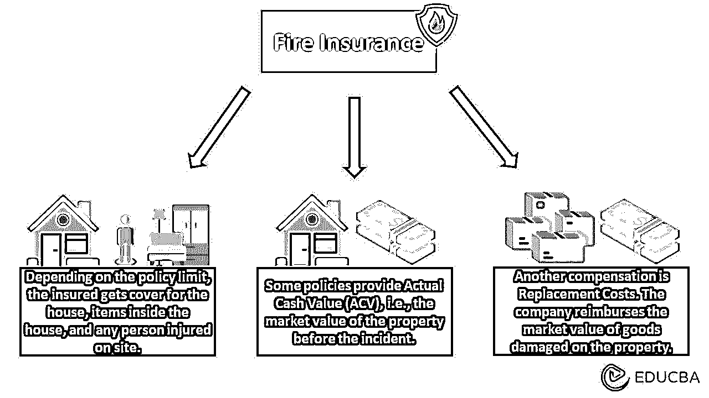
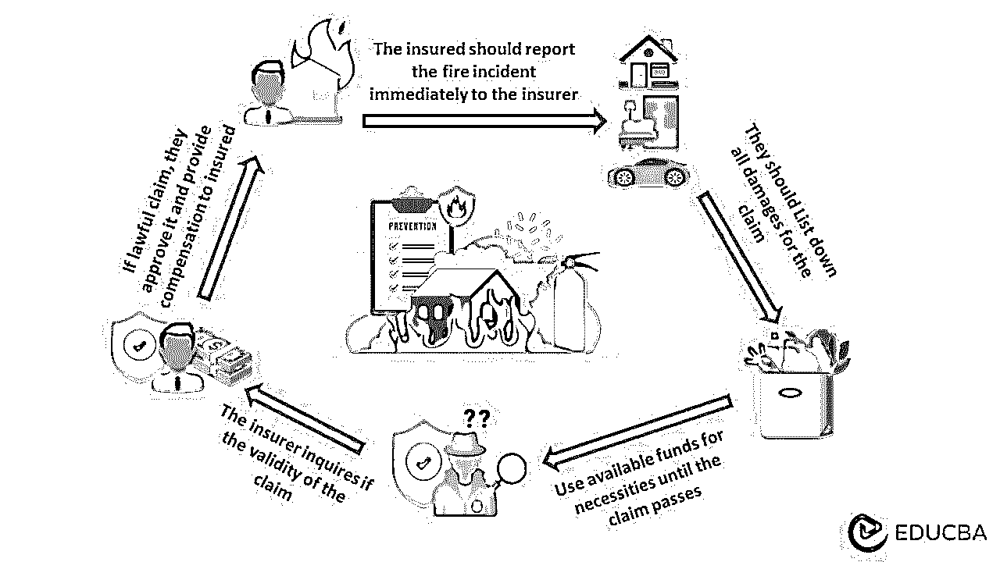
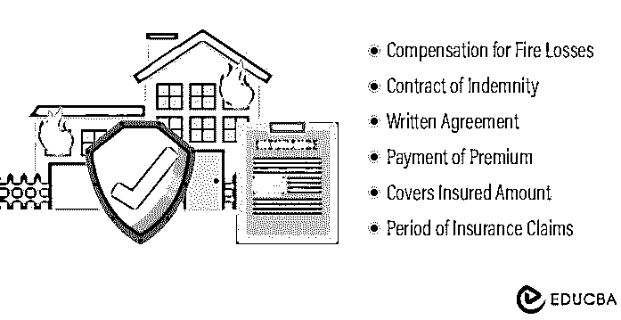

# 火灾保险

> 原文：<https://www.educba.com/fire-insurance/>

## 什么是火险？

火灾保险旨在保护房主免受火灾对其财产和资产造成的损失。例如，假设 Emily 为她的新房子购买了火灾保险。由于一些不幸的事件，一场火灾造成了她的财产损失。根据保险范围，她可以索赔 27 万美元，并获得赔偿。

它通常包括房屋、汽车、服装、家具等各种覆盖部分。它还包括赔偿责任、法律费用和生活费。

### 主要亮点

*   火灾保险是在由于火灾甚至闪电造成损害/损失的情况下向被保险人提供支持的一种保护
*   它有许多类型，像基本的、综合的、有价值的等等
*   它的主要特点是书面合同、保险金额、保险期间和被保险人支付保险费
*   本保单遵循诚信、赔偿、可保利益等原则。

### 火险是怎么运作的？

<small>下载企业估值、投行、会计、CFA 计算器&其他</small>

*   火灾保险单承保人的财产、财产和火灾时在场的任何人
*   大多数保单都涵盖了发生在房屋内外的火灾，并以实际的现金价值来补偿损失或重置成本
*   在全损的情况下，公司可能会补偿财产的当前市场价值，或者他们通常会支付损失货物的市场价值
*   例如，如果一个政策涵盖了一个 350，000 美元的家庭，内容通常是受保护的至少 50-70%的政策的价值。许多政策规定赔偿仅限于奢侈品，如油画、珠宝、黄金、毛皮大衣等
*   保险限额取决于引起火灾的原因。它主要涵盖由于电缆故障或闪电等自然原因引起的火灾。

### 火灾保险索赔流程

#### 第一步:联系保险提供商:

*   联系保险公司，并在当局灭火后报告事故
*   一旦发生事故，保险公司敦促投保人提交保险索赔。例如，在北达科他州提出索赔，可以在[保险部门填写表格。](https://www.nd.gov/eforms/Doc/sfn07832.pdf)

#### 步骤 2:列出损失/损害:

*   记录火灾事故后发生的所有损失，并评估损失
*   向保险公司提交“损失索赔证明”,详细说明损失或损坏的项目及其相关价值。

#### 步骤 3:使用当前可用的资金:

*   使用手头的资源，以利用任何必需品，直到保险公司通过索赔
*   如果你没有足够的钱来满足你的需要，你可以向保险公司索要保险金额中必要的部分。

#### 第 4 步:保险公司提出索赔的方法:

*   公司在收到索赔后会进行调查。如果火灾的原因在保险范围内，你会得到赔偿
*   但由于种种原因，公司也可以婉拒索赔。

#### 第五步:获取成本:

*   当机构批准索赔时，你就可以获得房屋和财产的赔偿
*   请保留原始收据和维修估价单，以便交给保险公司。

### 火灾保险的种类

*   **物业政策**涵盖建筑、其内容以及物业上的其他结构
*   住宅保单类似于财产保单，但它是针对持有人拥有但很少居住的房屋，如宾馆、农舍等
*   **专业承保范围**针对教堂、医院和学校等高风险物业
*   **额外生活费用**如果房屋因火灾而无法居住，则支付住宿费
*   房主保险覆盖一个人的家和里面的财产
*   **商业财产保险**针对的是不属于住宅的建筑
*   **营业中断保险**有助于弥补因长期停业而造成的收入损失
*   **公寓建筑保险**保护有四个或更多单元的建筑
*   租房保险为因火灾而损坏的个人财产提供保险。

### 火灾保险示例

#### 示例 1:

2022 年 11 月 5 日[曼哈顿的一栋公寓楼发生火灾，两人伤势严重，数十人受伤。起因是有缺陷的锂电池引发了 20 层公寓的火灾。](https://www.nytimes.com/2022/11/05/nyregion/manhattan-high-rise-fire.html)

考虑到这种情况，假设住在 20 楼的人有火灾保险。因此，他们可以轻松支付所有与损坏相关的费用。然而，如果没有这种[保险](https://www.educba.com/insurance/)到位，他们可能不得不遭受损失，并承担他人受伤的责任费用。

#### 示例 2:

某组织建造了一座新工厂，并购买了火灾保险，因为该设备存在火灾危险。在这种情况下，机器过热会导致工厂起火。由于该财产有营业中断保险，该组织在工厂因事故而无法使用期间获得赔偿。

### 火险特点

#### 协议:

*   它是保险人(公司)和投保人(个人)之间的一份合同，包含有关保单的所有必要信息
*   它意味着个人将支付一定的金额，以换取保险公司的承诺，防止火灾
*   如果保险公司拒绝支付或被保险人提出不正确的索赔，这可能是有帮助的。

#### 溢价:

*   保险费是投保人为确保保单有效而支付的固定金额
*   金额取决于保险的类型；覆盖面越全面，保费越高
*   基本级别包括保护建筑物及其内容免受一定程度的损坏。综合保险包括家具和电器等物品的更换费用。

#### 承保金额:

*   这是保险公司为你的家庭或财产损失支付的金额
*   第一种保险是[实际现金价值(ACV)](https://www.educba.com/actual-cash-value-vs-replacement-cost/) ，只根据房产的当前市场价值支付。在计算金额时，它考虑了火灾前的财产状况
*   重置成本保险是另一种按当前价格支付损坏物品重置费用的保险。这是比 ACV 更好的选择。

#### 保险期限:

*   这是保险的有效期。如果在此期间发生火灾事故，被保险人可以索赔
*   火险的一般期限是一年。持证人可以根据需要每年续保
*   然而，在某些情况下，如住宅保险，期限可以变化，因为它不是主要的住所，因此风险较低。

### 火灾保险类型

#### 基本保险:

*   在这种情况下，被保险方只有在火灾原因属于获得的政策范围内时才能获得赔偿
*   在向保险公司提出索赔之前，投保人通常必须自己支付损害赔偿金
*   人们将不得不购买其他保险来防范受伤、责任索赔等风险。

#### 价值保险:

*   公司通过调查市场和确定财产的当前价值来决定保险单的保险金额
*   这些比基本的贵，但比综合的便宜
*   例如，莉莉以 150 万美元购买了一所房子，并立即购买了火险。几年后，房子着火了，她向保险公司索赔。即使财产的当前价值是 100 万美元，如果她要求赔偿，公司也必须支付她 150 万美元。

#### 综合保险

*   它赔偿财产、财产和财产上任何人的伤害
*   这是最昂贵的政策之一，因为它提供了全面的保护保险财产
*   用大量贵重物品(油画、古董等)建造房屋的人。)应该选择这个政策。

#### 平均保险

*   如果被保险人以财产价值的一半购买保险，这主要是一项条款
*   在这份保单中，在索赔保额的同时，投保人将获得损失费用的一半，因为他们只投保了一半的价值
*   例如，财产价值为 2，000，000 美元，但被保险人购买了 1，000，000 美元的火险。因此，如果有 80 万美元的损失，被保险人只能获得 40 万美元。

#### 浮动保险

*   这主要是为了那些从世界各地交易货物的公司，因为他们需要在不同的地方储存存货，甚至沉迷于货物运输
*   这份保单为所有货物提供保险——从仓库到运输途中的货物——并承诺在出现损坏时给予赔偿
*   保额是这些货物的总价值，而保险费是所有货物的平均价值。

### 火灾保险原理

#### 赔偿原则:

*   它规定保险人必须确保被保险人按照合同获得全额赔偿
*   保险公司同意保护投保人免受火灾可能造成的任何损失或损害。

#### 火灾保险中的保证:

*   它们是保险公司向投保人强加的某些条件。如果这些条件符合，只有这样，持有人才能要求保险
*   主要条件包括年度维护和灭火设备。此外，财产应该是具体的，而不是一个无效的结构。

#### 完全信任:

*   被保险人和保险人应当相互保持诚实和信用
*   被保险人必须采取合理的谨慎措施保护财产，保险公司不应违反合同或有过失。

#### 可保利益:

*   [可保利益](https://www.educba.com/insurable-interest/)具体定义了保单购买者必须在保险对象中拥有财务或个人利益
*   它可以是直接的，也可以是间接的。例如，一个拥有公寓的人对它有直接的兴趣。假设是出租物业。住在里面的人有间接利益，因为这是他们的住所。

#### 补偿原则:

*   这意味着保险人有责任赔偿被保险人因火灾造成的财产损失
*   此外，公司只应支付与财产损失相关的直接和实际费用。被保险人不能索赔无关的费用。

### 结论

购买火险的人应该知道保险单上承保的和不承保的火灾。例如，它可能排除由地震引起的火灾。仔细阅读保单条款并寻求澄清非常重要。这在申请抵押贷款时也是必要的，因为贷款人喜欢有适当保险的房产。

### 常见问题

#### Q1。火灾保险包括疏忽吗？

**回答:**这取决于引起火灾的疏忽是故意的还是意外的。例如，该政策可能包括火灾由于意外留下燃烧的蜡烛。然而，如果有人故意放火烧财产来收钱，那就是故意疏忽，火灾保险不包括在内。

#### Q2。火灾保险单可以转让吗？

**回答:**是的，房主可以将他们的火灾保险单转让给另一个人。但是，被保险人必须有保险人的书面授权和财产受让人的保险利益；否则就是违法的。

#### Q3。火险是如何理赔的？

**答案:**流程从调查开始。该机构指派了一个小组去调查火灾的原因。假设原因是故意的或由于疏忽。可以否认这个说法。然而，如果来源合法并在火灾保险范围内，公司将通过索赔。因此，被保险人将获得所需的利益。

### 推荐文章

这是火灾保险指南。我们讨论它的定义、类型、覆盖范围等等。要了解更多信息，请阅读以下文章，

1.  [万能寿险](https://www.educba.com/universal-life-insurance/)
2.  [缺口保险](https://www.educba.com/gap-insurance/)
3.  [预付保险](https://www.educba.com/prepaid-insurance/)
4.  [保险风险](https://www.educba.com/risk-in-insurance/)

