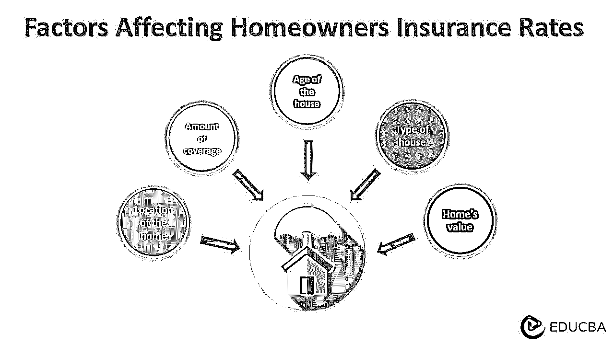

# 房主保险

> 原文：<https://www.educba.com/homeowners-insurance/>

## 什么是房屋保险？

房主保险保护被保险的财产，并对房屋及其财产的任何损坏/损失进行赔偿。例如，道森先生继承了他家的房子，并决定为房子购买保险。因此，他购买了 300 万美元的家庭保险。由于电路短路引起的突然火灾会对房屋及其财产造成重大损失。道森先生要求保险，并得到 2，000，000 美元(房子的当前市场价值)。

房主保险包括闪电、火灾、自然灾害等造成的损失。一般来说，它会赔偿房屋和房屋内的物品，如家具和电器，如果有人在房屋内受伤，它还会提供责任保险。

### 主要亮点

*   房主保险保护房屋免受损坏或损失，并在事故中有人受伤的情况下提供保险
*   虽然法律上没有要求，但大多数抵押贷款机构在发放贷款前会将此作为先决条件
*   个人财产保险保护家中的财产，如家具和电子产品。而责任险在他人财产受到伤害时保护房主
*   一般保险包括火灾损失、风灾损失、冰雹损失、盗窃和故意破坏。

### 房主保险是如何运作的？

*   房主购买保险，以防范因拥有和维护房屋而可能发生的损失
*   他们向保险公司支付一笔保险费，作为回报，保险公司同意在不幸事件发生时支付特别承保的损失
*   如果住所不适合居住，一些政策还包括临时生活费用。假设一所房屋在火灾中受损，那么保单可能会涵盖房屋维修期间住在酒店的费用
*   保险费用会因因素而异，包括房屋的价值和位置、所需的保险范围等等。

### 房主保险覆盖水平

#### 实际现金价值:

*   实际[现金价值](https://www.educba.com/cash-value-life-insurance/)说明了财产成本以及财产折旧后的价值
*   它在考虑了该地区的年龄和条件后，根据当前的市场价值确定房产的价格。

#### 更换费用:

*   重置价值计划支付房屋和贵重物品的实际现金价值，不考虑折旧
*   它根据商品的现值计算商品的总成本。

#### 保证重置成本或价值:

*   它支付修理或重建房屋的全部费用，直到保单的最大承保额
*   它提供了比总保费更多的保障，但有一个限度；通常是 20%到 25%。

### 房主保险的类型

| **类型** | **危险** | **覆盖率** |
| **HO-1:基础** | 这是最基本的保险单，承保有限的风险，如火灾、盗窃、故意破坏等 | 它以实际现金价值支付 |
| **HO-2: Broad** | 这是一个先进的 HO-1 政策，涵盖额外的危险，如水溢出，冻结，突然意外破裂，等等 | 它以重置成本补偿住所，以实际成本补偿财产 |
| **HO-3:特殊** | 这是最常见的保险，涵盖了大多数风险，不包括地震、天坑等 | 它支付住宅和财产的重置成本，但仍然可以在政策上有所不同 |
| **HO-4:内容广泛** | 在大多数危险情况下，承租人都有责任保护自己的财产；类似于 HO-3 | 它涵盖了租赁者损坏的财产的重置成本。此外，还能提供生活费 |
| **HO-5:综合** | 它涵盖了所有可能的危险下的单户家庭，从火灾到积雪堵塞等等 | 它涵盖了所有财产和房子的重置成本 |
| **HO-6:单位所有者** | 它是为住在公寓里的人准备的，计划中包含的风险各不相同。它可以是有限的，或所有的危险 | 保险范围主要是装修、责任、资产损失等 |
| **HO-7:活动房屋** | 它通常用于移动房屋，如拖车、模块化房屋等。取决于计划的危险 | 它只承保投保人在房屋不在运输途中的损失 |
| **HO-8:修改后的覆盖范围** | 这是一个 HO-1 政策，适用于不属于任何其他类别的房屋，如高风险的基于位置的房屋。 | 与 HO-1 类似，覆盖范围针对实际成本值。 |

### 房主保险示例

#### 示例#1

2022 年 8 月，由于 LED 灯泡出现故障，马克·奥明斯基(Mark Orminski)的房子发生了火灾。他向国家农场保险公司索赔房屋保险，公司必须支付 246，000 美元。然而，该公司随后起诉了马克购买灯泡的亚马逊，因为他们保证了灯泡的质量。

<small>下载企业估值、投行、会计、CFA 计算器&其他</small>

#### 实施例 2

哈珀在佛罗里达州拥有一座宾馆，但她很少使用。当这个地方空着的时候，一些窃贼破门而入，偷走了大部分贵重物品。

哈珀有房屋保险，所以她向她的代理人提出了保险索赔。在公司进行了必要的调查后，他们批准了这一请求，哈珀的损失得到了补偿。

### 房主保险涵盖哪些内容？

*   典型的保险包括火灾、闪电、风、冰雹和水管爆裂造成的水损害的损失
*   它还包括盗窃个人物品，如电子产品、家具等。尽管如此，大多数保单都将金额限制在特定的项目上，比如珠宝、艺术品和其他贵重物品
*   它包括住宅，如农舍、招待所等。，用于火灾、爆炸、水损坏等事件
*   在住宅的个人财产保险中，它还包括盗窃或故意破坏等事件
*   然而，它不包括由洪水、地震、白蚁或虫害控制造成的损失。因此，居住在容易发生这些事件的地区的房主可能需要额外的保险。

### 影响房主保险费率的因素

*   房子的价值:如果房子越值钱，保单的费用就越高
*   房子的年龄:因为旧房子不太值钱，所以保险也不贵
*   **房屋位置:**如果房产在自然灾害多发区，保险会很贵
*   房子的类型:砖房的保险费用比木结构的房子要高
*   **保额:**所需保额越大，保险费用越高。

### 房主保险与房屋保修和抵押贷款保险

| **房主保险** | **家庭保修** | **房贷险** |
| **目的** |
| 它保护房主的财产免受火灾，盗窃，其他自然灾害等 | 这是一份保护家中主要系统和设备免受磨损的服务合同 | 它保护贷方免受借方违约的影响 |
| **费用** |
| 费用在每年 1，250 美元和 1，900 美元之间。每月保费为 140 至 160 美元 | 价格在每年 200 美元到 600 美元之间，取决于所涵盖的设备 | 它占总保险价值的 0.5%到 5% |
| **覆盖率** |
| 它赔偿由于事件造成的房屋、财产和任何受伤人员的损失或损害。 | 它只包括系统和设备的损坏，如炉子、空调、热水器、烤箱等。 | 如果借款人不能偿还抵押贷款，它会向贷款人支付。 |

### 房主保险福利

*   它在灾难期间为房屋及其财产提供财务保护，并帮助您重建房屋或更换损坏的财产
*   它还可以在紧急和脆弱的情况下保护您和您的家人，让您安心
*   由于这些保险费是免税的，人们可以节省税款。

### 常见问题

#### Q1。房主保险要花多少钱？

**回答:**房主的保险费用会因许多因素而异，包括你住在哪里和你需要的保险范围。然而，保险费通常大约为每年[1800](https://www.forbes.com/advisor/homeowners-insurance/average-cost-homeowners-insurance/#:~:text=The%20national%20average%20cost%20of,at%20an%20average%20of%20%241%2C236.)美元。

#### Q2。什么时候需要房屋保险，什么时候房屋保修更合适？

**答案:**房主保险在自然灾害或其他不可预见的事件中保护你的家和财产。相比之下，家庭保修是一种合同服务，涵盖重要的家庭系统和电器的维修或更换。

#### Q3。一些房主保险公司是什么？

**答:**一些比较成熟、专业的保险公司有[伊利保险](https://www.erieinsurance.com/home-insurance)、[国营农场保险](https://www.statefarm.com/insurance/home-and-property/homeowners)、 [USAA](https://www.usaa.com/inet/wc/insurance_home_condo?wa_ref=pub_global_insurance_property_homeowners) 、[集宝](https://www.chubb.com/us-en/individuals-families/products/home.html)。然而，这些公司的保费可能也很贵。

#### Q4。房主保险可以扣税吗？

**回答:**是的，投保人为房主保险支付的保费是可以扣税的。此外，保险索赔的赔偿也是免税的。但是，当保单到期时没有任何索赔，并且持有人收到保险金额时，他们不能免税。

### 推荐文章

这篇文章引导你通过房屋保险。我们讨论它的含义、类型、覆盖范围等等。阅读以下文章了解更多信息，

1.  [保险](https://www.educba.com/insurance/)
2.  [万能寿险](https://www.educba.com/universal-life-insurance/)
3.  [缺口保险](https://www.educba.com/gap-insurance/)
4.  [残疾保险](https://www.educba.com/disability-insurance/)

