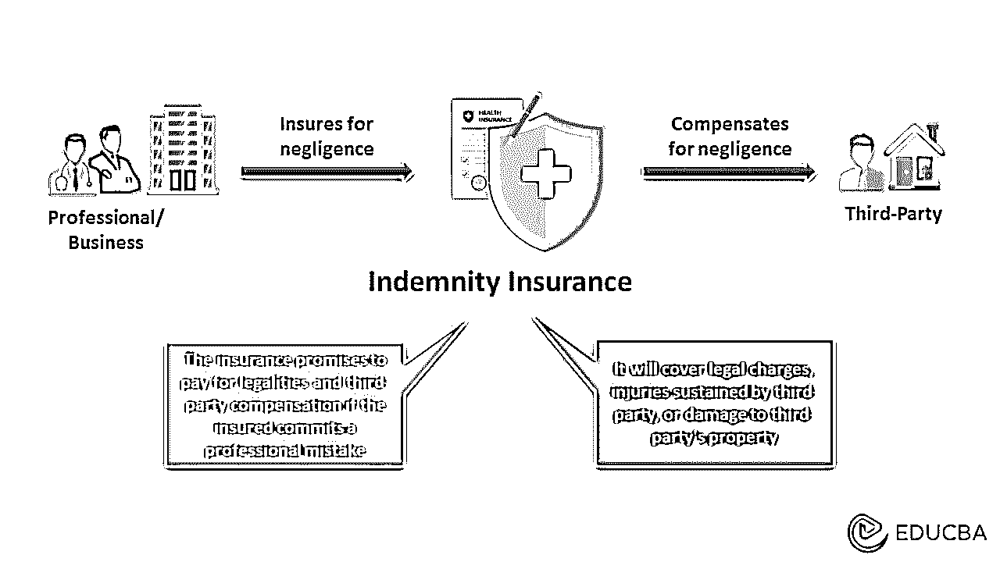

# 损失补偿保险

> 原文：<https://www.educba.com/indemnity-insurance/>

## 什么是赔偿保险？

赔偿保险单承保被保险人在其专业职责范围内对第三方造成的损害。

例如，理查德是一名心脏外科医生，由于他的职业使他对医疗失误负责，他购买了医疗事故赔偿保险。有一次，在一次关键的手术中，他犯了一个医疗错误，导致病人的家人起诉他。然后他提出[保险索赔](https://www.educba.com/insurance-claim/)，保险公司向患者家属支付法律费用和赔偿金。

赔偿保险保护被保险人免受针对他们的诉讼。它包括诉讼、和解和辩护费用。它还支付法院裁定的任何罚款或惩罚性赔偿。这在美国很常见，但在其他国家也有。

<small>下载企业估值、投行、会计、CFA 计算器&其他</small>

### 主要亮点

*   **赔偿保险**保护被保险人免受因其职业活动而产生的法律责任造成的损失
*   保险公司支付损害赔偿金、诉讼费和法律费用
*   这三种类型是渎职，错误和遗漏，以及董事和高级职员保险
*   人寿保险向被保险人的受益人提供死亡理赔金，而赔偿保险则在第三方损害的情况下帮助被保险人获得合法财务。

### 赔偿保险是如何运作的？

*   这是一个协议，保险公司将涵盖损害业务招致或损失造成的被保险人的疏忽
*   被保险人定期支付[保险费](https://www.educba.com/insurance-premium/)，反过来，保单承保第三方伤害或财产损失
*   当被保险人提出索赔时，保险公司会对情况和损失进行评估，然后做出相应的赔付
*   人身伤害保险对身体伤害进行赔偿，而财产损失保险则保障物品免受伤害。如果被保险人对他人的财产损失或人身伤害负有责任，它就会承保
*   然而，覆盖范围取决于计划。因此，如果他们需要额外的保障，可以购买超额赔偿政策。

### 真实世界的例子

2020 年 12 月前后，许多企业，如餐馆、汽车经销商、零售店等。，向伊利保险索赔。上诉是关于新冠肺炎造成的贸易损失。然而，伊利保险公司拒绝索赔，因为保单明确提到排除法律和病毒。这些企业随后对伊利保险提起诉讼，保险公司胜诉。

### 更多示例

#### 例子# 1–商业

黑客通过闯入使用第三方服务器进行数据存储的托管公司来获取机密信息。受影响的公司随后对托管公司提起诉讼，要求赔偿因安全性不足而造成的损失。因此，当公司索赔[保险](https://www.educba.com/insurance/)时，他们支付了针对集团公司的诉讼案件的法律费用。

#### 示例 2–服务

杰克是一名抵押贷款经纪人，他帮助联系抵押贷款人和买家。他把玛丽介绍给 XYZ 抵押贷款公司。虽然，在完成交易后，玛丽发现杰克有更好的交易，但他没有提供给她。当玛丽对杰克提起诉讼时，他要求赔偿他的过失和疏忽保险，该保险涵盖了所有的法律费用。

### 赔偿保险功能

*   保险范围包括医疗、金融和法律领域的服务提供商以及个体经营者的报销
*   它补偿任何法庭费用、法律和解、第三方赔偿等
*   为了获得保单利益，被保险人必须定期支付保费以保持保单有效
*   虽然这些都是低风险的损害，任何赔偿事件都可能是昂贵的。

### 赔偿保险的种类

#### 董事和高级职员保险:

*   当客户或员工因管理相关问题不力而起诉他们的业务主管时
*   顾名思义，它通常面向公司董事或高管。

#### 医疗事故保险:

*   这是医疗职业的重要组成部分。它保护医生在医疗事故中免于承担责任
*   它也保护医生免于失去他们的执照或法律指控。

#### 错误和遗漏保险:

*   它保护公司或个人在处理文件时免受过失索赔，如合同、法律记录和其他类似文件中的错误
*   它还可以弥补由于产品缺陷或公司错误建议造成的潜在损失。

### 赔偿保险与人寿保险

| **赔偿保险** | **人寿保险** |
| 这是一种在第三方遭受损害或损失的情况下赔偿被保险人的保单 | 人寿保险在被保险人死亡后为受益人提供经济支持 |
| 这是为了被保险人的利益，因为它通过支付企业对他人或财产造成的特定损失来保护企业 | 这是为被保险人的家人、密友和他们照顾的人准备的，因为如果养家糊口的人去世，这通常是为了保护一个家庭免受经济困难 |
| 保单持有人可在需要时要求该保单，直到他们结清总保额。 | 受益人在被保险人死亡或保单到期后领取死亡抚恤金。 |

### 结论

**赔偿保险**对被保险人的某些意外损害或损失进行赔偿，达到特定限额。这些通常保护那些犯有特定行为的专业人士和企业主，比如判断失误或[渎职](https://www.educba.com/malpractice-insurance/)。它们通常以补偿函的形式出现。

### 常见问题

**Q1。定义职业赔偿保险。**

**答:**专业赔偿保险保护企业/专业人士免受被保险人对另一方造成的损害的赔偿。保险公司支付这些损失，保障被保险人的财务健康。

**Q2。医院赔偿保险是什么意思？**

**回答:**是一种健康保险计划，提供比通常的赔偿保险额外的福利。它涵盖因您的职业或业务对他人造成伤害或伤害的医疗费用。

**Q3。什么是固定赔偿保险计划？**

**答:**固定赔偿保险计划提供预定金额的保障。保险公司给被保险人规定的保险金额，而不是解决要求的索赔。对于那些已有疾病的人和那些不想担心费用的人来说，这是理想的选择。

**Q4。赔偿政策持续多长时间？**

**回答:**赔偿保单可以持续数年或无限期。基本保单的设定时间通常在六个月到三年之间。在其他情况下，该计划可以持续更长时间，即，直到保险公司偿付全部保险或保费未付。然而，对于长期保单，保费可能会很贵。

**Q5。什么是赔偿成本？**

**回答:**与其他保险一样，费用取决于保单的类型和覆盖范围。然而，赔偿保险的平均月保费是 10 至 20 美元。

### 推荐文章

这是赔偿保险指南。我们讨论它的定义、类型、特征和例子。要了解更多信息，请访问以下文章，

1.  [房主保险](https://www.educba.com/homeowners-insurance/)
2.  [火灾保险](https://www.educba.com/fire-insurance/)
3.  [危险保险](https://www.educba.com/hazard-insurance/)
4.  [残疾保险](https://www.educba.com/disability-insurance/)

