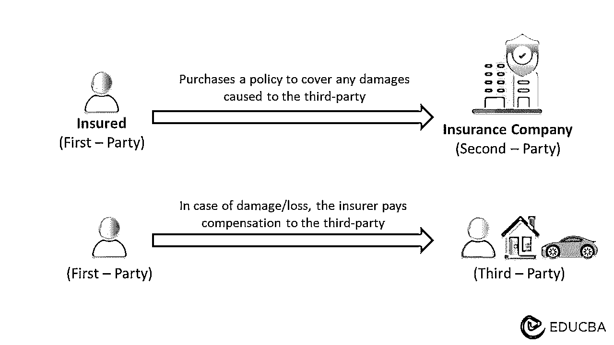

# 第三方保险

> 原文：<https://www.educba.com/third-party-insurance/>

## 第三方保险含义

**第三者保险承保被保险人以外的个人的伤害，包括其财产损失。**

 *例如，哈里在骑自行车时，不小心撞上了一辆停着的汽车，导致汽车损坏。根据他的保险，他的代理机构有责任向第三方支付赔偿金。所以，他要求保险索赔。然后，他的代理机构向车主(第三方)支付损害赔偿金。

它保护在事故中没有过错的人。最常见的应用是在赛车领域。所有在陆地上行驶并持有登记证的机动车辆都必须投保此项保险。因此，如果司机造成事故，损害了其他汽车或车上人员的健康，他们将得到公平的赔偿。此外，它仅在发生事故时为第三方提供保护。法律要求所有车主都必须购买该保险。

<small>下载企业估值、投行、会计、CFA 计算器&其他</small>

### 主要亮点

*   **第三方保险**是一种保单，承保投保人可能给第三方造成的物质、人身和经济损失
*   它分为责任保险或财产保险，其中财产可以是车辆、房地产等
*   该保单承保第三方的受伤治疗、损坏修复甚至死亡
*   第三方保险和综合保险的显著区别在于，综合保险提供额外的保障，如因灾害造成的损失、对被保险人的赔偿等。

### 第三方保险是如何运作的？

*   在本保单中，第一方是被保险人，第二方是保险人，第三方是任何其他人
*   根据保单，如果被保险人对第三者造成损害，他们可以向保险公司提出保险索赔
*   保险公司随后会询问事故情况，如果索赔有效，他们将支付任何第三方费用，如医疗护理、损坏修复等
*   但是，如果由于酒后驾驶、故意原因或缺少必要的文件而导致请求无效，那么公司可以拒绝支付赔偿
*   一般来说，被保险人发生事故后，保险公司必须赔偿损失。然而，如果被保险人是由于其他人而发生事故，其他人的保险将被要求支付费用。

### 第三方保险类型

#### 责任保险:

*   它涵盖个人或组织对他人造成伤害的法律责任
*   它支付第三方的身体伤害，并保护被保险人免受伤害他人的经济后果
*   这对企业至关重要，因为当有人在他们的机构或事件中受伤时，它可以保护他们免受诉讼。

#### 财产保险:

*   它为受保人/企业对他人财产造成的损害提供保险
*   最常见的保险是汽车、摩托车等交通工具
*   如果有人在财产上受伤，它也有个人责任保险。

### 第三方保险包括什么？

*   保险范围包括民事责任，即赔偿被保险人可能遭受的任何伤害。它甚至可以在他们死亡的情况下得到补偿
*   如果发生事故，被保险人有过错，保险公司将赔偿财产或车辆的所有物质损失
*   然而，对大多数保单来说，公司不会赔偿被保险人或其财产的损失
*   例如，被保险人发生事故，损坏了 A 人的自行车和 B 人的围栏，并伤害了 A 人和被保险人。该公司将支付围栏和自行车维修费用。他们还将支付个人 A 的医疗费用，但不支付被保险人的医疗费用
*   它还包括对被保险人提起诉讼的任何法律费用。

### 车辆第三方保险

*   这是司机可以购买的保险，以在与未投保的司机发生碰撞时保护自己。此外，家庭经常为他们的汽车、货车、卡车等购买它
*   它涵盖了其他司机，被保险汽车中的任何乘客，以及在事故中可能受伤的任何行人
*   在某些情况下，它还包括对财产的损害，如栅栏或建筑物。尽管如此，它不包括被保险车辆的损坏
*   价格取决于多种因素，如里程数、正常行驶距离、司机年龄、位置等
*   一般来说，第三方汽车保险每年大约为 1000 至 1600 美元，最高可达 30 万美元。

### 如何索赔第三方保险？

*   第一步是向警方提交第一份情况报告。因为是意外事故，保险公司会要求你准备一份费用清单
*   如果损害是你造成的，另一方会提交初步报告，反之亦然
*   联系保险公司，通知他们损失，并给他们所有必要的细节。如果他们没有过错，可能需要提供证据
*   随后，案件被提交到法院，由法官决定索赔是否有效。如果索赔通过，法官选择损害赔偿的保险金额
*   伤者也可以根据自己的要求，出示维修单据进行索赔。

### 第三方保险与综合保险

<colgroup><col width="309"> <col width="303"></colgroup>
| **第三方保险** | **综合保险** |
| 这是一种责任保险，承保被保险人可能对第三者造成的损害 | 这是一份既包括被保险人也包括第三者的损害赔偿的保险单 |
| 它不贵，因为它不为被保险人提供保险 | 这是最贵的，因为它提供额外的保险 |
| 它包括在受伤的情况下对他人的汽车、财产和他们自己的损害 | 它包括被保险人、他们的汽车、财产和第三方的损失。它也可能包括自然灾害和盗窃 |
| 这是对所有车主的必要法律要求。 | 这是一项可选政策，投保人可以从各种保险计划中进行选择。 |

### 利益

*   它为第三方及其财产的所有损害/损失提供了充分的保障
*   它比大多数保险计划都便宜
*   它是灵活的，保险公司不太可能拒绝它
*   它可以在与产品和服务相关的诉讼中保护企业。

### 结论

总之，它保护了被保险人，并涵盖了他们可能对他人财产造成的损害。当公司雇佣外部承包商时，这是很有帮助的。当个人将他们的财产出租给第三方时，这也是有用的。这种保险通常是法律要求的，在许多国家都很常见。

### 常见问题

#### Q1。第三方保险的缺点是什么？

**回答:**这种保险的首要缺点是不为被保险人的汽车提供赔偿。它也不赔偿事故期间车内任何财物的损坏。

#### Q2。保险中的第一方、第二方和第三方是什么？

**答案:**第三方保险单中，买方是第一方，而保险提供方是第二方。第三者是指除被保险人和保险人以外的任何其他人。当另一方因为被保险人而遭受损害/损失时，他们被称为第三者。

#### Q3。第三者保险和综合保险有什么区别？

**回答:**第三方保险是基本的汽车保险，承保您的车辆和任何其他涉及事故的车辆的损坏。综合保险则是一个详细的保障计划。除了第三方，它还包括对您的车辆的损坏和盗窃或故意破坏。

#### Q4。第三方保险的理赔金额是多少？

**答:**索赔金额可能因保单和损失而异。然而，平均而言，个人和财产责任的索赔可能在 10 万至 30 万美元之间。另外，25，000 美元用于医疗和司机。

### 推荐文章

这篇文章解释了第三方保险的一切。我们描述了它的定义、类型、覆盖范围、好处等。要了解更多信息，请访问以下链接，

1.  [赔偿保险](https://www.educba.com/indemnity-insurance/)
2.  [房主保险](https://www.educba.com/homeowners-insurance/)
3.  [火灾保险](https://www.educba.com/fire-insurance/)
4.  [缺口保险](https://www.educba.com/gap-insurance/)

*